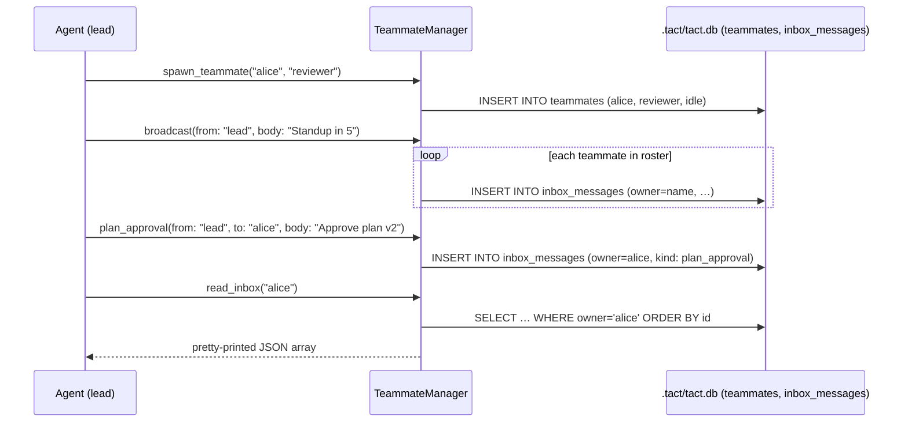

# 团队协调（Team Coordination）

> 语言：[中文](./14_chapter_team_zh.md) · [English](./14_chapter_team.md)

本章说明 Tact 的 **多 agent 团队原语**：具名 teammate 的持久 roster，以及支持点对点消息、广播与结构化协议请求（plan 审批、shutdown）的 SQLite backed inbox 系统。实现位于 `crates/tact/src/team.rs`，工具包装在 `crates/tact/src/tool/team.rs`。

重要前提：目前是 **协调数据层**，非编排引擎。「Spawn」teammate 仅创建 roster 记录 —— 不会启动第二个 agent 进程。见 [当前缺口](#8-当前缺口)。

---

## 1. 团队层提供什么

| 能力 | Tool | 底层调用 |
|------|------|----------|
| 注册 teammate | `spawn_teammate` | `TeammateManager::spawn_teammate` |
| 列出 roster | `list_teammates` | `list_teammates` |
| 点对点消息 | `send_message` | `send_message` |
| 群发 | `broadcast` | `broadcast` |
| 读 inbox | `read_inbox` | `read_inbox` |
| Plan 审批请求 | `plan_approval` | `protocol_request(kind = "plan_approval")` |
| Shutdown 握手 | `shutdown_request` / `shutdown_response` | `protocol_request(kind = "shutdown_request" / "shutdown_response")` |

八个工具均在主 agent `toolset()` 注册；`subagent_toolset()` 中均无。

---

## 2. 数据模型

### Roster

```rust
pub struct TeammateRecord {
    pub name: String,
    pub role: String,
    pub status: String,   // 目前始终 "idle"
}
```

### Inbox 消息

```rust
pub struct InboxMessage {
    pub from: String,
    pub to: String,
    pub body: String,
    pub kind: String,     // "message" | "plan_approval" | "shutdown_request" | "shutdown_response"
    pub created_at: DateTime<Utc>,
}
```

`kind` 区分普通聊天与协议流量；存储路径两者相同。

---

## 3. 存储布局

`TeammateManager` 由 [Store 与持久化](./01_chapter_store_zh.md) 中的 SQLite `TeamStore` 支撑：

```rust
store: Box<dyn TeamStore>,   // tact.db → teammates + inbox_messages 表
```

Schema（`crates/tact/src/store/team_store/sqlite.rs`）：

```text
teammates(name TEXT PRIMARY KEY, role TEXT NOT NULL, status TEXT NOT NULL DEFAULT 'idle')
inbox_messages(id INTEGER PRIMARY KEY AUTOINCREMENT,
               owner TEXT NOT NULL, from_name TEXT NOT NULL, to_name TEXT NOT NULL,
               body TEXT NOT NULL, kind TEXT NOT NULL, created_at INTEGER NOT NULL)
-- 索引：idx_inbox_messages_owner ON inbox_messages(owner)
```

消息 **追加**（插入顺序由自增 `id` 保持）—— inbox 只增；无 read-cursor、ack 或 delete。遗留 `team/config.json` + `team/inbox/*.json` 文件不再读取、留在磁盘。

---

## 4. 消息流


```mermaid
sequenceDiagram
    participant Lead as Agent (lead)
    participant TM as TeammateManager
    participant DB as .tact/tact.db (teammates, inbox_messages)

    Lead->>TM: spawn_teammate("alice", "reviewer")
    TM->>DB: INSERT INTO teammates (alice, reviewer, idle)

    Lead->>TM: broadcast(from: "lead", body: "Standup in 5")
    loop each teammate in roster
        TM->>DB: INSERT INTO inbox_messages (owner=name, …)
    end

    Lead->>TM: plan_approval(from: "lead", to: "alice", body: "Approve plan v2")
    TM->>DB: INSERT INTO inbox_messages (owner=alice, kind: plan_approval)

    Lead->>TM: read_inbox("alice")
    TM->>DB: SELECT … WHERE owner='alice' ORDER BY id
    TM-->>Lead: pretty-printed JSON array
```

语义说明：

- `spawn_teammate` 拒绝重名（`teammate {name} already exists`；UNIQUE `name` 键兜底）。
- `broadcast` 遍历 roster 并对每个 teammate 调用 `send_message` —— 发送者若在 roster 上也会收到自己的广播。
- `read_inbox` 返回 **完整** inbox 的 pretty-printed JSON，或 `"Inbox is empty."`。
- `protocol_request` 即带调用方选定 `kind` 的 `send_message` —— 无状态机验证 `shutdown_response` 是否跟随 `shutdown_request`。

---

## 5. 并发包装

`SharedTeammateManager` 与 task、background manager 同模式：

```rust
pub struct SharedTeammateManager {
    inner: Arc<TeammateManager>,
}
```

每个公开方法委托给 async 门面。共享句柄在 `ToolContext.teammate_manager`，在 `tui.rs` 启动时构造一次：

```rust
let teammate_manager = SharedTeammateManager::new(TeammateManager::new(&tact_path.session_db_path()).await?);
```

无需 mutex：SQLite 连接池串行化写入；连接池（含 `busy_timeout`）同时串行化同一 workdir 的跨进程访问。

---

## 6. 「Teammate」究竟是谁？

模型按设计自由：`from` 与 `to` 是 LLM 提供的 plain string。Nothing 验证：

- 发送者是否在 roster 上，
- 接收者是否存在（发给未知名会静默创建 inbox 行），
- teammate 是否 ever 读 inbox。

预期模式是协调 agent 将 roster 作共享状态、inbox 作 durable mailbox，供 eventual worker 抽象消费（[子 agent](./12_chapter_subagent_zh.md) 经 `spawn_subagent` 工具运行是最接近的现有类比，但未与 inbox 接线）。

---

## 7. 代码地图

| 文件 | 角色 |
|------|------|
| `crates/tact/src/team.rs` | `TeammateManager`、`SharedTeammateManager`、`InboxMessage` |
| `crates/tact/src/store/team_store/mod.rs` | `TeamStore` trait（async：create_teammate/list_teammates/append_message/read_inbox） |
| `crates/tact/src/store/team_store/sqlite.rs` | `SqliteTeamStore` — `teammates` + `inbox_messages` 表 |
| `crates/tact/src/tool/team.rs` | 八个 `#[tool]` 包装 |
| `crates/tact/src/tool/mod.rs` | `ToolContext.teammate_manager` |
| `crates/tact/src/tool/registry.rs` | `toolset()` 中的 team 工具 |
| `crates/tact-ui/src/headless.rs`、`interactive.rs` | 启动时从 `tact.db` 构造 manager |

---

## 8. 当前缺口

| 缺口 | 详情 |
|------|------|
| 无实际 agent 进程 | `spawn_teammate` 仅记录名字；不启动 runtime、LLM 循环或 inbox 轮询 |
| Status 从不变化 | 每个 teammate 永远 `"idle"`；无 API 修改 `status` |
| 无发送者/接收者校验 | 发给未知名的消息静默创建 orphan inbox 行 |
| Inbox 无界增长 | 仅追加行，无 read-cursor、ack 或修剪 |
| 协议 kind 仅为约定 | `plan_approval` / `shutdown_*` 无强制 request-response 配对 |
| 无 teammate 移除 | 无 `remove_teammate`；roster 只能增 |
| 无跨进程锁 | 并发 tact 进程可交错 roster 写入 |

---

## Related Docs

- [Store 与持久化](./01_chapter_store_zh.md) — `teammates` / `inbox_messages` SQLite 表
- [工具系统](./07_chapter_tool_zh.md) — `ToolContext`  plumbing 与子 agent 工具集
- [子 Agent](./12_chapter_subagent_zh.md) — `spawn_subagent` 运行真实嵌套 agent；teammate 不运行
- [Worktree Lanes](./15_chapter_worktree_zh.md) — 真实多 agent 团队会配对的隔离原语
- [ARCHITECTURE.md](../ARCHITECTURE.md) — §7 子 agent、team、tasks、worktrees
