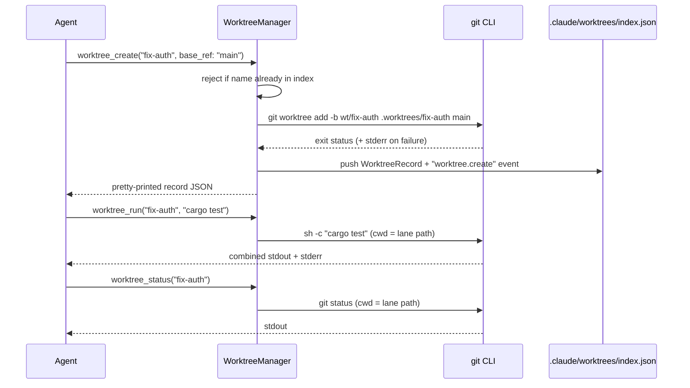

# Worktree Lanes
> Language: [English](./15_chapter_worktree.md) · [中文](./15_chapter_worktree_zh.md)

This chapter explains Tact's **git worktree lanes**: isolated working directories created with `git worktree add`, tracked in a JSON index, and driven through five agent tools. The implementation lives in `crates/tact/src/worktree/mod.rs` with tool wrappers in `crates/tact/src/tool/worktree.rs`.

A "lane" is Tact's term for one named worktree: its directory, its dedicated branch, an optional link to a persistent task, and a status string. Lanes let the agent run commands or experiments on a separate branch without disturbing the main checkout.

---

## 1. Tool Surface

| Tool | Backing call | Behavior |
|------|--------------|----------|
| `worktree_create` | `WorktreeManager::create` | `git worktree add -b wt/<name> .worktrees/<name> <base_ref>` |
| `worktree_list` | `list` | One `name branch path` line per lane |
| `worktree_status` | `status` | Runs `git status` inside the lane, returns stdout |
| `worktree_run` | `run` | Runs one `sh -c` command inside the lane, returns stdout+stderr |
| `worktree_events` | `events` | Last N lines of the audit log (default 20) |

`base_ref` defaults to `HEAD` when omitted; `task_id` optionally links the lane to a record from the task manager ([Tasks and Tool Scheduling](./11_chapter_task.md)).

---

## 2. Data Model

```rust
pub struct WorktreeRecord {
    pub name: String,
    pub path: String,          // <repo_root>/.worktrees/<name>
    pub branch: String,        // "wt/<name>"
    pub task_id: Option<u64>,
    pub status: String,        // always "active" today
}

pub struct WorktreeIndex {
    pub worktrees: Vec<WorktreeRecord>,
    pub events: Vec<String>,   // "2026-07-06T… worktree.create <name>"
}
```

The whole index — records **and** audit log — is one JSON document:

```rust
index: root.file("worktrees/index.json")?,   // Store<WorktreeIndex>
```

On disk there are two separate locations to keep straight:

```text
<repo_root>/
├── .worktrees/<name>/          # the actual git worktree (checkout)
└── .claude/
    └── worktrees/index.json    # Tact's metadata + events
```

---

## 3. Lane Lifecycle



Failure handling in `create`: if `git worktree add` exits non-zero, the trimmed stderr is surfaced (`git worktree add failed: <stderr>`), and **nothing is written to the index** — a failed create leaves no record.

Branch naming is fixed: every lane gets `wt/<name>`. Creating a lane whose branch already exists (e.g. re-creating after a manual `git worktree remove` that left the branch behind) fails at the git level.

---

## 4. The Events Audit Log

Every successful `create` appends a line to `index.events`:

```text
2026-07-06 21:14:03.512 UTC worktree.create fix-auth
```

`worktree_events` returns the most recent `limit` entries in chronological order. Today `create` is the **only** writer — `run`, `status`, and `list` do not log, so the "audit log" is really a creation log.

---

## 5. Concurrency and Wiring

`SharedWorktreeManager` is the usual `Arc<Mutex<WorktreeManager>>` wrapper with a `with_manager` accessor, mirroring the [team](./14_chapter_team.md) and task managers. Constructed at startup in `tui.rs`:

```rust
let worktree_manager =
    SharedWorktreeManager::new(WorktreeManager::new(&store_root, work_dir.clone())?);
```

Note that `repo_root` is simply the session's working directory — Tact does not verify it is actually a git repository until the first `git worktree add` fails.

All five tools are registered in the main `toolset()` only; sub-agents cannot manage lanes.

One behavioral wrinkle: `WorktreeManager::run` executes git and shell commands **synchronously** (`std::process::Command`) while holding the manager lock, inside an async tool. A long `worktree_run` blocks both the tokio worker thread and every other worktree tool call until it finishes.

---

## 6. Interaction with Permissions and Shell Safety

`worktree_run` executes arbitrary shell strings but does **not** go through `validate_shell_command` (unlike `bash` and `background_run`), and its permission classification is whatever the [Permission Model](./10_chapter_permission.md) assigns to the `worktree_run` tool name — the embedded command string is not inspected for high-risk patterns. Treat lanes as having the same blast radius as `bash`.

---

## 7. Code Map

| File | Role |
|------|------|
| `crates/tact/src/worktree/mod.rs` | `WorktreeManager`, `SharedWorktreeManager`, index + events |
| `crates/tact/src/tool/worktree.rs` | The five `#[tool]` wrappers |
| `crates/tact/src/tool/mod.rs` | `ToolContext.worktree_manager` |
| `crates/tact/src/tool/registry.rs` | Worktree tools in `toolset()` |
| `crates/tact-ui/src/headless.rs`, `interactive.rs` | Manager constructed with `StoreRoot` + workdir |
| `crates/tact/src/store/mod.rs` | `Store<WorktreeIndex>` primitive |

---

## 8. Current Gaps

| Gap | Detail |
|-----|--------|
| No remove/cleanup | There is no `worktree_remove`; lanes and `wt/*` branches accumulate until removed manually |
| Status never changes | Every lane is `"active"` forever; no done/merged/abandoned transitions |
| No merge-back story | Nothing helps integrate a lane's branch (diff, merge, PR) into the base branch |
| Index can drift from git | Manual `git worktree remove/prune` leaves stale records; the index is never reconciled |
| `worktree_run` bypasses shell validation | High-risk command substrings blocked in `bash` are allowed here |
| Blocking execution under lock | Long-running `run`/`status` serializes all worktree operations and blocks an async thread |
| Sparse audit log | Only `create` writes events; `run` invocations are not recorded |
| `task_id` is unenforced | The optional link is never validated against the task manager |

---

## Related Docs

- [Tasks and Tool Scheduling](./11_chapter_task.md) — the task records `task_id` refers to
- [Team Coordination](./14_chapter_team.md) — the coordination layer worktrees are designed to pair with
- [Permission Model](./10_chapter_permission.md) — how `worktree_run` is (and isn't) gated
- [Store and Persistence](./01_chapter_store.md) — `Store<WorktreeIndex>` under `.claude/worktrees/`
- [ARCHITECTURE.md](../ARCHITECTURE.md) — §7 sub-agents, team, tasks, worktrees
