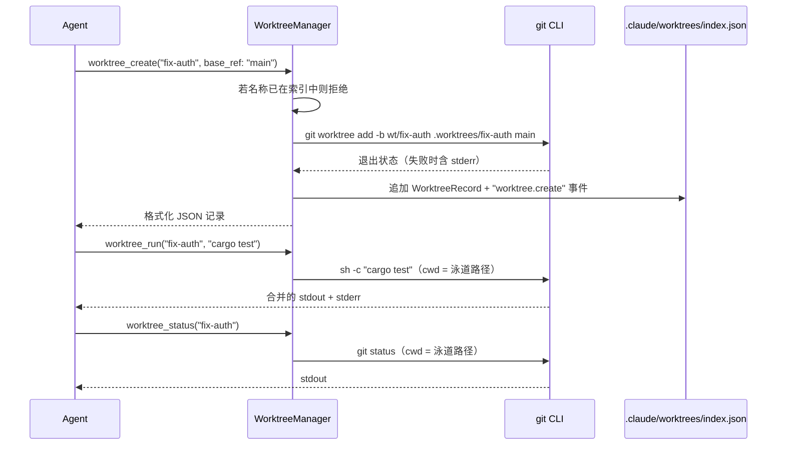

# Worktree 泳道（Lanes）

> 语言：[中文](./15_chapter_worktree_zh.md) · [English](./15_chapter_worktree.md)

本章说明 Tact 的 **git worktree 泳道**：用 `git worktree add` 创建的隔离工作目录，在 JSON 索引中跟踪，并通过五个 agent 工具驱动。实现位于 `crates/tact/src/worktree/mod.rs`，工具封装在 `crates/tact/src/tool/worktree.rs`。

「泳道」（lane）是 Tact 对一条命名 worktree 的称呼：其目录、专用分支、可选的持久化任务链接，以及状态字符串。泳道让 agent 在独立分支上运行命令或实验，而不干扰主 checkout。

---

## 1. 工具面

| 工具 | 底层调用 | 行为 |
|------|----------|------|
| `worktree_create` | `WorktreeManager::create` | `git worktree add -b wt/<name> .worktrees/<name> <base_ref>` |
| `worktree_list` | `list` | 每条泳道一行 `name branch path` |
| `worktree_status` | `status` | 在泳道内运行 `git status`，返回 stdout |
| `worktree_run` | `run` | 在泳道内运行一条 `sh -c` 命令，返回 stdout+stderr |
| `worktree_events` | `events` | 审计日志最后 N 行（默认 20） |

省略时 `base_ref` 默认为 `HEAD`；`task_id` 可选，将泳道链接到任务管理器中的记录（[任务与工具调度](./11_chapter_task.md)）。

---

## 2. 数据模型

```rust
pub struct WorktreeRecord {
    pub name: String,
    pub path: String,          // <repo_root>/.worktrees/<name>
    pub branch: String,        // "wt/<name>"
    pub task_id: Option<u64>,
    pub status: String,        // 目前始终为 "active"
}

pub struct WorktreeIndex {
    pub worktrees: Vec<WorktreeRecord>,
    pub events: Vec<String>,   // "2026-07-06T… worktree.create <name>"
}
```

整个索引——记录 **与** 审计日志——是一个 JSON 文档：

```rust
index: root.file("worktrees/index.json")?,   // Store<WorktreeIndex>
```

磁盘上有两个位置需要区分：

```text
<repo_root>/
├── .worktrees/<name>/          # 实际的 git worktree（checkout）
└── .claude/
    └── worktrees/index.json    # Tact 的元数据 + 事件
```

---

## 3. 泳道生命周期



`create` 中的失败处理：若 `git worktree add` 非零退出，会返回裁剪后的 stderr（`git worktree add failed: <stderr>`），且 **不会写入索引**——创建失败不会留下记录。

分支命名固定：每条泳道得到 `wt/<name>`。若分支已存在而创建泳道（例如手动 `git worktree remove` 后分支仍在），会在 git 层失败。

---

## 4. 事件审计日志

每次成功的 `create` 会向 `index.events` 追加一行：

```text
2026-07-06 21:14:03.512 UTC worktree.create fix-auth
```

`worktree_events` 按时间顺序返回最近 `limit` 条。目前 `create` 是 **唯一** 写入者——`run`、`status`、`list` 不记日志，因此「审计日志」实质上是创建日志。

---

## 5. 并发与接线

`SharedWorktreeManager` 是常见的 `Arc<Mutex<WorktreeManager>>` 包装，带 `with_manager` 访问器，与 [团队](./14_chapter_team.md) 和任务管理器模式一致。在 `tui.rs` 启动时构造：

```rust
let worktree_manager =
    SharedWorktreeManager::new(WorktreeManager::new(&store_root, work_dir.clone())?);
```

注意 `repo_root` 就是会话的工作目录——Tact 不会验证它是否真的是 git 仓库，直到第一次 `git worktree add` 失败。

五个工具都只在主 `toolset()` 中注册；子 agent 不能管理泳道。

一个行为细节：`WorktreeManager::run` 在持有 manager 锁的情况下 **同步** 执行 git 和 shell 命令（`std::process::Command`），位于 async 工具内部。长时间的 `worktree_run` 会阻塞 tokio worker 线程以及所有其他 worktree 工具调用，直到结束。

---

## 6. 与权限和 Shell 安全性的交互

`worktree_run` 执行任意 shell 字符串，但 **不** 经过 `validate_shell_command`（与 `bash`、`background_run` 不同），其权限分类由 [权限模型](./10_chapter_permission.md) 赋予 `worktree_run` 工具名——嵌入的命令字符串不会被检查高风险模式。将泳道视为与 `bash` 相同的爆炸半径。

---

## 7. 代码地图

| 文件 | 角色 |
|------|------|
| `crates/tact/src/worktree/mod.rs` | `WorktreeManager`、`SharedWorktreeManager`、索引与事件 |
| `crates/tact/src/tool/worktree.rs` | 五个 `#[tool]` 封装 |
| `crates/tact/src/tool/mod.rs` | `ToolContext.worktree_manager` |
| `crates/tact/src/tool/registry.rs` | `toolset()` 中的 worktree 工具 |
| `crates/tact-ui/src/headless.rs`、`interactive.rs` | 用 `StoreRoot` + workdir 构造 manager |
| `crates/tact/src/store/mod.rs` | `Store<WorktreeIndex>` 原语 |

---

## 8. 当前缺口

| 缺口 | 详情 |
|------|------|
| 无 remove/cleanup | 没有 `worktree_remove`；泳道和 `wt/*` 分支会累积，直到手动删除 |
| 状态永不变化 | 每条泳道永远是 `"active"`；无 done/merged/abandoned 转换 |
| 无合并回主分支流程 | 没有帮助将泳道分支（diff、merge、PR）集成到 base 分支 |
| 索引可能与 git 脱节 | 手动 `git worktree remove/prune` 会留下陈旧记录；索引从不 reconcile |
| `worktree_run` 绕过 shell 校验 | `bash` 中拦截的高风险命令子串在此允许 |
| 锁下阻塞执行 | 长时间 `run`/`status` 串行化所有 worktree 操作并阻塞 async 线程 |
| 稀疏审计日志 | 只有 `create` 写事件；`run` 调用不记录 |
| `task_id` 未强制 | 可选链接从不与任务管理器校验 |

---

## 相关文档

- [任务与工具调度](./11_chapter_task.md) — `task_id` 所指的 task 记录
- [团队协调](./14_chapter_team.md) — worktree 设计与之配对的协调层
- [权限模型](./10_chapter_permission.md) — `worktree_run` 如何（以及未如何）被门控
- [Store 与持久化](./01_chapter_store_zh.md) — `.claude/worktrees/` 下的 `Store<WorktreeIndex>`
- [ARCHITECTURE.md](../ARCHITECTURE.md) — §7 子 agent、团队、任务、worktree
