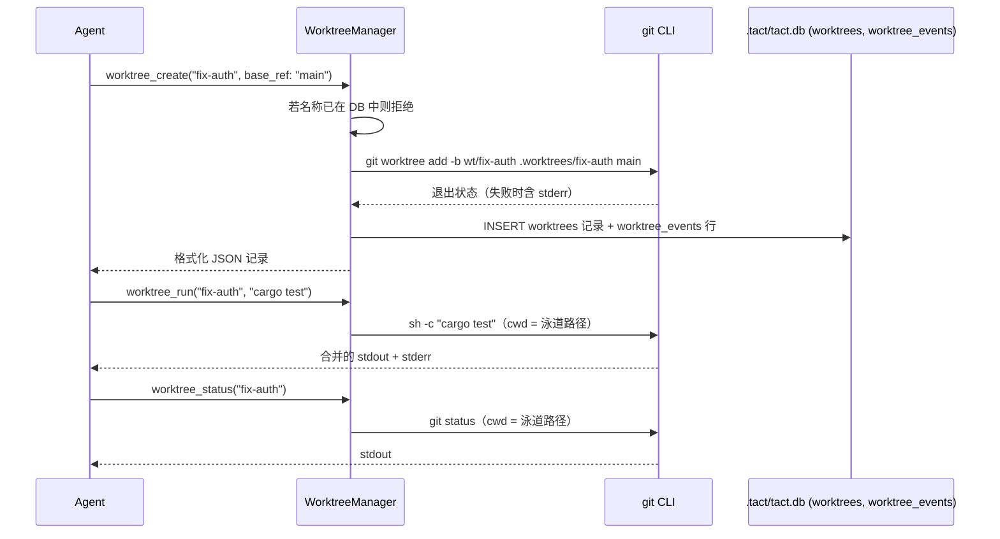

# Worktree 泳道（Lanes）

> 语言：[中文](./15_chapter_worktree_zh.md) · [English](./15_chapter_worktree.md)

本章说明 Tact 的 **git worktree 泳道**：用 `git worktree add` 创建的隔离工作目录，在 JSON 索引中跟踪，并通过六个 agent 工具驱动。实现位于 `crates/tact/src/worktree/mod.rs`，工具封装在 `crates/tact/src/tool/worktree.rs`。

「泳道」（lane）是 Tact 对一条命名 worktree 的称呼：其目录、专用分支、可选的持久化任务链接，以及状态字符串。泳道让 agent 在独立分支上运行命令或实验，而不干扰主 checkout。

---

## 1. 工具面

| 工具 | 底层调用 | 行为 |
|------|----------|------|
| `worktree_create` | `WorktreeManager::create` | `git worktree add -b wt/<name> .worktrees/<name> <base_ref>` |
| `worktree_list` | `list` | 每条泳道一行 `name branch path` |
| `worktree_status` | `status` | 在泳道内运行 `git status`，返回 stdout |
| `worktree_run` | `run` | 在泳道内运行一条 `sh -c` 命令，返回 stdout+stderr |
| `worktree_remove` | `remove` | `git worktree remove <path>`（脏工作树会失败）、删除跟踪记录、追加审计事件；拒绝运行中子 agent 的泳道 |
| `worktree_events` | `events` | 审计日志最后 N 行（默认 20） |

省略时 `base_ref` 默认为 `HEAD`；`task_id` 可选，将泳道链接到任务管理器中的记录（[任务与工具调度](./11_chapter_task.md)）。

---

## 2. 数据模型

```rust
pub struct WorktreeRecord {
    pub name: String,
    pub path: String,          // <repo_root>/.worktrees/<name>
    pub branch: String,        // "wt/<name>"
    pub task_id: Option<u64>,
    pub status: String,        // 目前始终为 "active"
}
```

记录 **与** 审计日志存放在 SQLite（`tact.db`），而非单个 JSON 文档：

```rust
store: Box<dyn WorktreeStore>,   // tact.db → worktrees + worktree_events 表
```

磁盘上有两个位置需要区分：

```text
<repo_root>/
├── .worktrees/<name>/          # 实际的 git worktree（checkout）
└── .tact/
    └── tact.db                 # worktrees + worktree_events 表
```

Schema（`crates/tact/src/store/worktree_store/sqlite.rs`）：

```text
worktrees(id INTEGER PRIMARY KEY AUTOINCREMENT, name TEXT UNIQUE, path TEXT,
          branch TEXT, task_id INTEGER, status TEXT DEFAULT 'active',
          session_id TEXT DEFAULT '', created_at INTEGER)
worktree_events(id INTEGER PRIMARY KEY AUTOINCREMENT, event TEXT, created_at INTEGER)
-- 索引：idx_worktrees_session_id ON worktrees(session_id)
```

自增 `id` 保持插入顺序（遗留 `index.json` 向量语义）；`worktrees.name` UNIQUE 作为并发兜底。

---

## 3. 泳道生命周期


```mermaid
sequenceDiagram
    participant Agent
    participant WM as WorktreeManager
    participant Git as git CLI
    participant DB as .tact/tact.db (worktrees, worktree_events)

    Agent->>WM: worktree_create("fix-auth", base_ref: "main")
    WM->>WM: 若名称已在 DB 中则拒绝
    WM->>Git: git worktree add -b wt/fix-auth .worktrees/fix-auth main
    Git-->>WM: 退出状态（失败时含 stderr）
    WM->>DB: INSERT worktrees 记录 + worktree_events 行
    WM-->>Agent: 格式化 JSON 记录

    Agent->>WM: worktree_run("fix-auth", "cargo test")
    WM->>Git: sh -c "cargo test"（cwd = 泳道路径）
    Git-->>Agent: 合并的 stdout + stderr

    Agent->>WM: worktree_status("fix-auth")
    WM->>Git: git status（cwd = 泳道路径）
    Git-->>Agent: stdout
```

`create` 中的失败处理：若 `git worktree add` 非零退出，会返回裁剪后的 stderr（`git worktree add failed: <stderr>`），且 **不会写入 DB**——创建失败不会留下记录。

分支命名固定：每条泳道得到 `wt/<name>`。若分支已存在而创建泳道（例如手动 `git worktree remove` 后分支仍在），会在 git 层失败。

---

## 4. 事件审计日志

每次成功的 `create` 会向 `worktree_events` 追加一行：

```text
2026-07-06 21:14:03.512 UTC worktree.create fix-auth
```

`worktree_events` 按时间顺序返回最近 `limit` 条。目前 `create` 与 `remove` 是 **唯一** 的写入者——`run`、`status`、`list` 不记日志。

---

## 5. 并发与接线

`SharedWorktreeManager` 包装 `Arc<WorktreeManager>`——无 mutex，SQLite 连接池串行化写入（与 task/background/team manager 一致）。在 `tui.rs` 启动时构造：

```rust
let worktree_manager =
    SharedWorktreeManager::new(WorktreeManager::new(&tact_path.session_db_path(), work_dir.clone()).await?);
```

注意 `repo_root` 就是会话的工作目录——Tact 不会验证它是否真的是 git 仓库，直到第一次 `git worktree add` 失败。

六个工具都只在主 `toolset()` 中注册；子 agent 不能管理泳道。

一个行为细节：`WorktreeManager::run` **同步** 执行 git 和 shell 命令（`std::process::Command`），位于 async 工具内部。长时间的 `worktree_run` 会阻塞 tokio worker 线程直到结束（不再持有 manager 锁，其他 worktree 工具调用保持响应）。

---

## 6. 与权限和 Shell 安全性的交互

`worktree_run` 执行任意 shell 字符串，但 **不** 经过 `validate_shell_command`（与 `bash`、`background_run` 不同），其权限分类由 [权限模型](./10_chapter_permission_zh.md) 赋予 `worktree_run` 工具名——嵌入的命令字符串不会被检查高风险模式。将泳道视为与 `bash` 相同的爆炸半径。

---

## 7. 代码地图

| 文件 | 角色 |
|------|------|
| `crates/tact/src/worktree/mod.rs` | `WorktreeManager`、`SharedWorktreeManager`、create/list/status/run/remove/events |
| `crates/tact/src/store/worktree_store/mod.rs` | `WorktreeStore` trait（async：create_worktree/find_worktree/list_worktrees/remove_worktree/append_event/recent_events） |
| `crates/tact/src/store/worktree_store/sqlite.rs` | `SqliteWorktreeStore` — `worktrees` + `worktree_events` 表 |
| `crates/tact/src/tool/worktree.rs` | 六个 `#[tool]` 封装 |
| `crates/tact/src/tool/mod.rs` | `ToolContext.worktree_manager` |
| `crates/tact/src/tool/registry.rs` | `toolset()` 中的 worktree 工具 |
| `crates/tact-ui/src/headless.rs`、`interactive.rs` | 从 `tact.db` + workdir 构造 manager |

---

## 8. 当前缺口

| 缺口 | 详情 |
|------|------|
| remove 后分支未清理 | `worktree_remove` 删除目录与跟踪记录，但保留 backing 分支 `wt/<name>` 以便未合并提交可恢复；分支需单独 merge 或 `git branch -D` |
| 状态永不变化 | 每条泳道永远是 `"active"`；无 done/merged/abandoned 转换 |
| 无合并回主分支流程 | 没有帮助将泳道分支（diff、merge、PR）集成到 base 分支 |
| 索引可能与 git 脱节 | 手动 `git worktree remove/prune` 会留下陈旧记录；表从不 reconcile |
| `worktree_run` 绕过 shell 校验 | `bash` 中拦截的高风险命令子串在此允许 |
| 阻塞执行 | 长时间 `run`/`status` 阻塞 async 线程（不再持有 manager 锁） |
| 稀疏审计日志 | 只有 `create` 与 `remove` 写事件；`run` 调用不记录 |
| `task_id` 未强制 | 可选链接从不与任务管理器校验 |

---

## 相关文档

- [任务与工具调度](./11_chapter_task.md) — `task_id` 所指的 task 记录
- [团队协调](./14_chapter_team.md) — worktree 设计与之配对的协调层
- [权限模型](./10_chapter_permission.md) — `worktree_run` 如何（以及未如何）被门控
- [Store 与持久化](./01_chapter_store_zh.md) — `worktrees` / `worktree_events` SQLite 表
- [ARCHITECTURE.md](../ARCHITECTURE.md) — §7 子 agent、团队、任务、worktree
