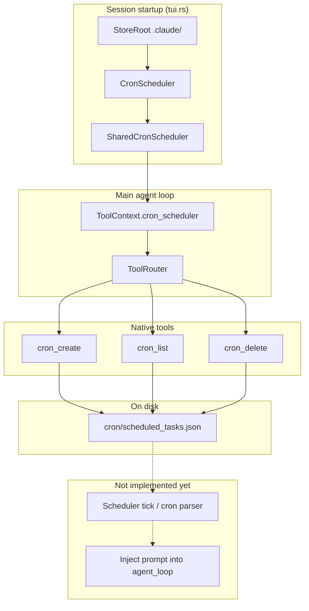
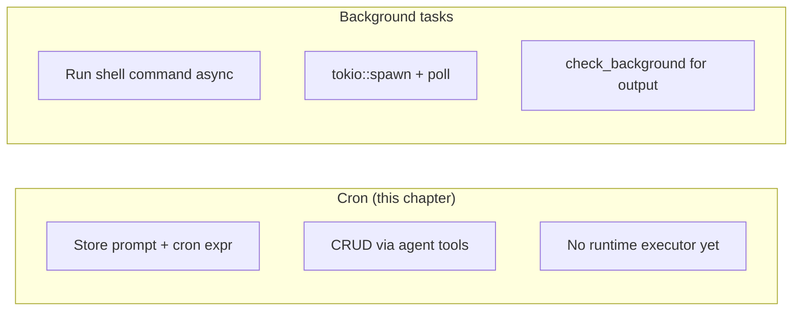

# Cron Scheduling

This chapter explains how Tact lets the agent **register scheduled prompts**: cron expressions, prompt text, and metadata persisted under `.claude/cron/`. The model can create, list, and delete these records through native tools; the storage layer is wired into every main-agent session via `ToolContext`.

**Important scope note:** as of this writing, Tact persists scheduled tasks but does **not** yet run a background tick loop that evaluates cron expressions and injects prompts into `agent_loop`. The `recurring` and `durable` flags are stored and shown in listings; they are reserved for future runtime behaviour. See [§8 Current Gaps](#8-current-gaps).

---

## 1. What Cron Scheduling Is For

Cron in Tact is **not** a shell job runner (that is [background tasks](../crates/tact/src/background.rs) via `background_run` / `check_background`). It is a registry of **prompts the agent should receive on a schedule**:

| Concept | Meaning in code |
|---------|-----------------|
| `cron` | Cron expression string (stored as-is; not validated or parsed today) |
| `prompt` | User message text to inject when the schedule fires |
| `recurring` | `true` → recurring schedule; `false` → one-shot (metadata only today) |
| `durable` | `true` → survive session restarts; `false` → session-scoped (metadata only today) |

The agent uses `cron_create` during a turn when the user asks for reminders, daily check-ins, or other time-based follow-ups. Until a runtime scheduler exists, those entries are durable **records** the agent (or a future daemon) can query with `cron_list`.

---

## 2. Architecture Overview



Sub-agents (`subagent_toolset`) do **not** receive cron tools — only the main agent's full `toolset()` includes them.

---

## 3. Data Model

Defined in `crates/tact/src/cron/mod.rs`:

```rust
pub struct ScheduledTaskRecord {
    pub id: String,
    pub cron: String,
    pub prompt: String,
    pub recurring: bool,
    pub durable: bool,
    pub created_at: i64,  // Unix timestamp (UTC)
}

pub struct ScheduledTaskIndex {
    pub tasks: Vec<ScheduledTaskRecord>,
    pub next_id: u64,
}
```

All tasks live in a single JSON index file. IDs are monotonic hex strings (`format!("{id_num:08x}")`) assigned from `next_id` on each create.

---

## 4. Persistence

| Item | Value |
|------|-------|
| Store root | `.claude/` (`StoreRoot::new(tact_path.claude_dir())`) |
| Index file | `cron/scheduled_tasks.json` |
| Backend | `Store<ScheduledTaskIndex>` — read/modify/write whole file |
| Init | If the file is missing on first open, an empty index is written |

The path helper `TactPath::cron_dir()` resolves `<workdir>/.claude/cron` in `crates/tact/src/consts.rs`; the scheduler uses the store layer's relative path `cron/scheduled_tasks.json` under the same root.

Example on-disk shape:

```json
{
  "tasks": [
    {
      "id": "00000000",
      "cron": "0 9 * * *",
      "prompt": "Daily standup summary",
      "recurring": true,
      "durable": false,
      "created_at": 1717654321
    }
  ],
  "next_id": 1
}
```

---

## 5. Scheduler Lifecycle

### Construction

Both headless and interactive entry points in `crates/tact/src/bin/tui.rs` build the scheduler once per process:

```text
store_root = StoreRoot::new(.claude/)
cron_scheduler = SharedCronScheduler::new(CronScheduler::new(&store_root)?)
tool_context = ToolContext { cron_scheduler, work_dir, … }
agent = Agent::new(client, tool_context, toolset(), …)
```

There is no separate cron daemon or tokio task spawned today. The scheduler exists for the lifetime of the agent process and is shared across all tool calls through `ToolContext` (cloneable via `Arc<Mutex<…>>` inside `SharedCronScheduler`).

### `CronScheduler` vs `SharedCronScheduler`

| Type | Role |
|------|------|
| `CronScheduler` | Single-threaded CRUD against `Store<ScheduledTaskIndex>` |
| `SharedCronScheduler` | `Arc<Mutex<CronScheduler>>`; tools and tests call through `with_scheduler` |

Lock poisoning surfaces as `"cron scheduler lock poisoned"`.

---

## 6. Agent Tools

Implemented in `crates/tact/src/tool/cron.rs` and registered in `toolset()` (`crates/tact/src/tool/mod.rs`).

### `cron_create`

**Input:**

| Field | Type | Default | Description |
|-------|------|---------|-------------|
| `cron` | string | required | Cron expression |
| `prompt` | string | required | Prompt to inject when the schedule fires |
| `recurring` | bool | `false` | Recurring vs one-shot |
| `durable` | bool | `false` | Durable vs session-scoped |

**Output:** Pretty-printed JSON of the new `ScheduledTaskRecord`.

### `cron_list`

**Input:** empty object.

**Output:** One line per task (sorted by id), or `"No scheduled tasks."`:

```text
00000000 0 9 * * * [recurring/session]: Daily standup summary
```

Tags in brackets: `recurring` or `one-shot`, plus `/durable` or `/session`.

### `cron_delete`

**Input:** `{ "id": "<task id>" }`.

**Output:** `"Deleted scheduled task {id}"`, or error if id not found.

These tools are **independent** barriers in the tool scheduler (no file-path conflicts). They do not touch `work_dir` directly — only the JSON store under `.claude/cron/`.

---

## 7. Cron vs Background Tasks

Both are workspace-scoped managers injected through `ToolContext`, but they solve different problems:



| | Cron | Background |
|---|------|------------|
| Module | `cron/mod.rs` | `background.rs` |
| Persists | Scheduled prompts | Shell commands + stdout/stderr |
| Executes today | No | Yes (`background_run`) |
| Sub-agent access | No | No |

---

## 8. Current Gaps

The following are **not** in the codebase yet; documenting them avoids confusion with README marketing copy:

1. **No cron evaluator** — expressions are opaque strings; nothing parses or validates them.
2. **No tick loop** — no task wakes up on a timer to call `agent_loop` with stored prompts.
3. **`recurring` / `durable` unused at runtime** — only persisted and displayed by `cron_list`.
4. **No integration with session store** — firing a prompt would need new wiring (TUI event, headless trigger, or sidecar process).
5. **No automatic cleanup** — one-shot tasks are not removed after a hypothetical fire.

When a runtime is added, likely touch points are: a tokio interval in `tui.rs` or a dedicated module reading `ScheduledTaskIndex`, plus a path to enqueue user messages into the active agent (similar to user input in interactive mode).

---

## 9. Code Map

| File | Role |
|------|------|
| `crates/tact/src/cron/mod.rs` | `ScheduledTaskRecord`, `CronScheduler`, `SharedCronScheduler` |
| `crates/tact/src/tool/cron.rs` | `cron_create`, `cron_list`, `cron_delete` tool handlers |
| `crates/tact/src/tool/mod.rs` | `ToolContext.cron_scheduler`, `toolset()` registration |
| `crates/tact/src/bin/tui.rs` | Constructs scheduler and passes it into `Agent` |
| `crates/tact/src/store/mod.rs` | `Store<T>` persistence layer |
| `crates/tact/src/consts.rs` | `TactPath::cron_dir()` |
| `crates/tact/src/tool/test_support.rs` | Test `ToolContext` with in-memory store root |

---

## Related Docs

- [ARCHITECTURE.md](../ARCHITECTURE.md) — Sub-agents, team, tasks, worktrees table (Cron row)
- [Tasks and Tool Scheduling](./11_chapter_task.md) — how tool calls run once the model acts (orthogonal to cron firing)
- [crates/tact/tact.md](../crates/tact/tact.md) — domain managers and `.claude/` layout
- [docs/state_machines.md](../docs/state_machines.md) — background task lifecycle (contrast with cron)
