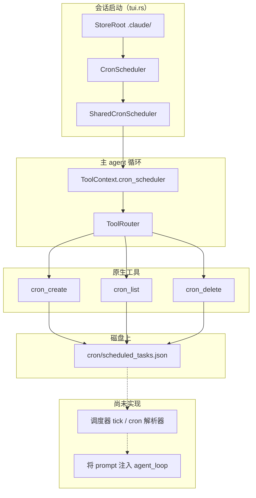
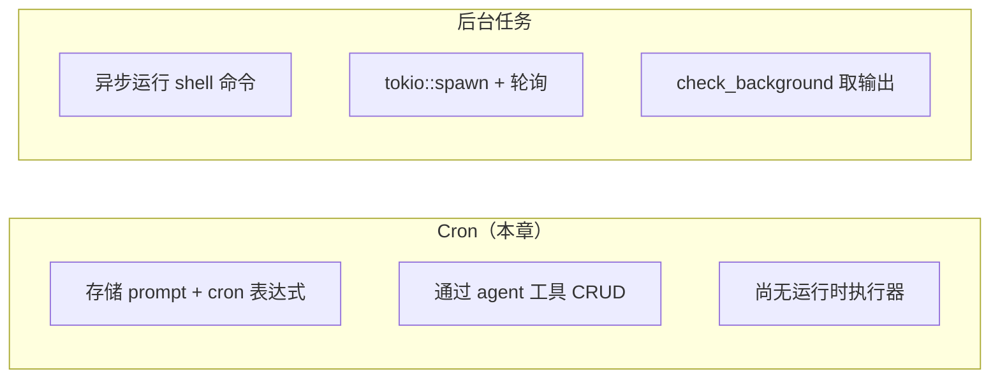

# Cron 调度

> 语言：[中文](./16_chapter_cron_zh.md) · [English](./16_chapter_cron.md)

本章说明 Tact 如何让 agent **注册定时 prompt**：cron 表达式、prompt 文本和元数据持久化在 `.claude/cron/` 下。模型可通过原生工具创建、列出和删除这些记录；存储层通过 `ToolContext` 接入每个主 agent 会话。

**重要范围说明：** 截至本文撰写时，Tact 会持久化定时任务，但 **尚未** 运行后台 tick 循环来求值 cron 表达式并将 prompt 注入 `agent_loop`。`recurring` 和 `durable` 标志会存储并在列表中展示；它们为未来的运行时行为预留。见 [§8 当前缺口](#8-当前缺口)。

---

## 1. Cron 调度的用途

Tact 中的 Cron **不是** shell 作业运行器（那是 [后台任务](../crates/tact/src/background.rs) 通过 `background_run` / `check_background`）。它是 **agent 应按计划接收的 prompt** 的注册表：

| 概念 | 代码中的含义 |
|------|--------------|
| `cron` | Cron 表达式字符串（原样存储；目前不校验也不解析） |
| `prompt` | 计划触发时要注入的用户消息文本 |
| `recurring` | `true` →  recurring 计划；`false` → 一次性（目前仅元数据） |
| `durable` | `true` → 跨会话重启存活；`false` → 会话范围（目前仅元数据） |

当用户要求提醒、每日 check-in 或其他基于时间的跟进时，agent 在一轮中使用 `cron_create`。在运行时调度器存在之前，这些条目是 durable **记录**，agent（或未来的 daemon）可用 `cron_list` 查询。

---

## 2. 架构概览



子 agent（`subagent_toolset`）**不** 接收 cron 工具——只有主 agent 的完整 `toolset()` 包含它们。

---

## 3. 数据模型

定义于 `crates/tact/src/cron/mod.rs`：

```rust
pub struct ScheduledTaskRecord {
    pub id: String,
    pub cron: String,
    pub prompt: String,
    pub recurring: bool,
    pub durable: bool,
    pub created_at: i64,  // Unix 时间戳（UTC）
}

pub struct ScheduledTaskIndex {
    pub tasks: Vec<ScheduledTaskRecord>,
    pub next_id: u64,
}
```

所有任务在一个 JSON 索引文件中。ID 是从 `next_id` 在每次 create 时分配的单调递增十六进制字符串（`format!("{id_num:08x}")`）。

---

## 4. 持久化

| 项 | 值 |
|----|-----|
| Store 根 | `.claude/`（`StoreRoot::new(tact_path.claude_dir())`） |
| 索引文件 | `cron/scheduled_tasks.json` |
| 后端 | `Store<ScheduledTaskIndex>` — 读/改/写整个文件 |
| 初始化 | 首次打开时若文件缺失，写入空索引 |

路径辅助 `TactPath::cron_dir()` 在 `crates/tact/src/consts.rs` 中解析 `<workdir>/.claude/cron`；调度器在同一根下使用 store 层的相对路径 `cron/scheduled_tasks.json`。

磁盘上示例形状：

```json
{
  "tasks": [
    {
      "id": "00000000",
      "cron": "0 9 * * *",
      "prompt": "Daily standup summary",
      "recurring": true,
      "durable": false,
      "created_at": 1717654321
    }
  ],
  "next_id": 1
}
```

---

## 5. 调度器生命周期

### 构造

`crates/tact-ui/src/headless.rs` 和 `interactive.rs` 每个进程构建一次调度器：

```text
store_root = StoreRoot::new(.claude/)
cron_scheduler = SharedCronScheduler::new(CronScheduler::new(&store_root)?)
tool_context = ToolContext { cron_scheduler, work_dir, … }
agent = Agent::new(client, tool_context, toolset(), …)
```

目前没有单独的 cron daemon 或 tokio 任务。调度器在 agent 进程生命周期内存在，通过 `ToolContext` 在所有工具调用间共享（`SharedCronScheduler` 内 `Arc<Mutex<…>>` 可克隆）。

### `CronScheduler` 与 `SharedCronScheduler`

| 类型 | 角色 |
|------|------|
| `CronScheduler` | 对 `Store<ScheduledTaskIndex>` 的单线程 CRUD |
| `SharedCronScheduler` | `Arc<Mutex<CronScheduler>>`；工具和测试通过 `with_scheduler` 调用 |

锁中毒表现为 `"cron scheduler lock poisoned"`。

---

## 6. Agent 工具

实现在 `crates/tact/src/tool/cron.rs`，注册于 `toolset()`（`crates/tact/src/tool/registry.rs`）。

### `cron_create`

**输入：**

| 字段 | 类型 | 默认 | 说明 |
|------|------|------|------|
| `cron` | string | 必填 | Cron 表达式 |
| `prompt` | string | 必填 | 计划触发时要注入的 prompt |
| `recurring` | bool | `false` | Recurring 与一次性 |
| `durable` | bool | `false` | Durable 与会话范围 |

**输出：** 新 `ScheduledTaskRecord` 的格式化 JSON。

### `cron_list`

**输入：** 空对象。

**输出：** 每个任务一行（按 id 排序），或 `"No scheduled tasks."`：

```text
00000000 0 9 * * * [recurring/session]: Daily standup summary
```

方括号标签：`recurring` 或 `one-shot`，加上 `/durable` 或 `/session`。

### `cron_delete`

**输入：** `{ "id": "<task id>" }`。

**输出：** `"Deleted scheduled task {id}"`，或 id 未找到时错误。

这些工具在工具调度器中是 **独立** barrier（无文件路径冲突）。它们不直接触碰 `work_dir`——只触碰 `.claude/cron/` 下的 JSON store。

---

## 7. Cron 与后台任务

两者都是通过 `ToolContext` 注入的工作区范围 manager，但解决不同问题：



| | Cron | 后台 |
|---|------|------|
| 模块 | `cron/mod.rs` | `background.rs` |
| 持久化 | 定时 prompt | Shell 命令 + stdout/stderr |
| 今日是否执行 | 否 | 是（`background_run`） |
| 子 agent 访问 | 否 | 否 |

---

## 8. 当前缺口

以下 **尚未** 进入代码库；记录它们可避免与 README 营销文案混淆：

1. **无 cron 求值器** — 表达式是不透明字符串；没有解析或校验。
2. **无 tick 循环** — 没有任务在定时器上唤醒并调用 `agent_loop` 注入存储的 prompt。
3. **`recurring` / `durable` 运行时未用** — 仅持久化并由 `cron_list` 展示。
4. **与会话 store 无集成** — 触发 prompt 需要新接线（TUI 事件、headless 触发或 sidecar 进程）。
5. **无自动清理** — 一次性任务在假设的触发后不会移除。

添加运行时时，可能的触点：`tui.rs` 中的 tokio interval 或读取 `ScheduledTaskIndex` 的专用模块，以及将用户消息入队到活跃 agent 的路径（类似交互模式下的用户输入）。

---

## 9. 代码地图

| 文件 | 角色 |
|------|------|
| `crates/tact/src/cron/mod.rs` | `ScheduledTaskRecord`、`CronScheduler`、`SharedCronScheduler` |
| `crates/tact/src/tool/cron.rs` | `cron_create`、`cron_list`、`cron_delete` 工具处理器 |
| `crates/tact/src/tool/mod.rs` | `ToolContext.cron_scheduler` |
| `crates/tact/src/tool/registry.rs` | `toolset()` 中的 cron 工具 |
| `crates/tact-ui/src/headless.rs`、`interactive.rs` | 构造调度器并传入 `Agent` |
| `crates/tact/src/store/mod.rs` | `Store<T>` 持久化层 |
| `crates/tact/src/consts.rs` | `TactPath::cron_dir()` |
| `crates/tact/src/tool/test_support.rs` | 带内存 store root 的测试 `ToolContext` |

---

## 相关文档

- [ARCHITECTURE.md](../ARCHITECTURE.md) — 子 agent、团队、任务、worktree 表（Cron 行）
- [任务与工具调度](./11_chapter_task.md) — 模型行动后工具调用如何运行（与 cron 触发正交）
- [crates/tact/tact.md](../crates/tact/tact.md) — 领域 manager 与 `.claude/` 布局
- [docs/state_machines.md](../docs/state_machines.md) — 后台任务生命周期（与 cron 对比）
