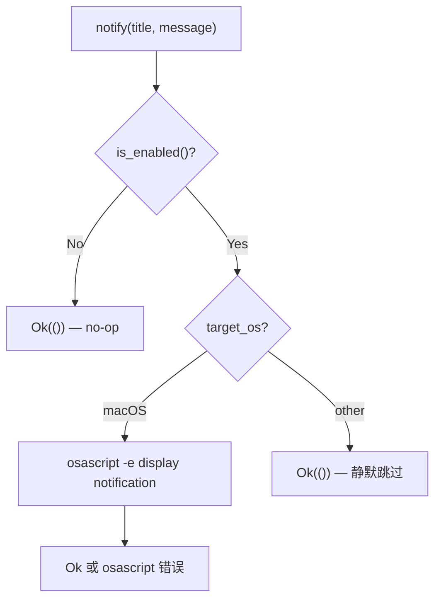
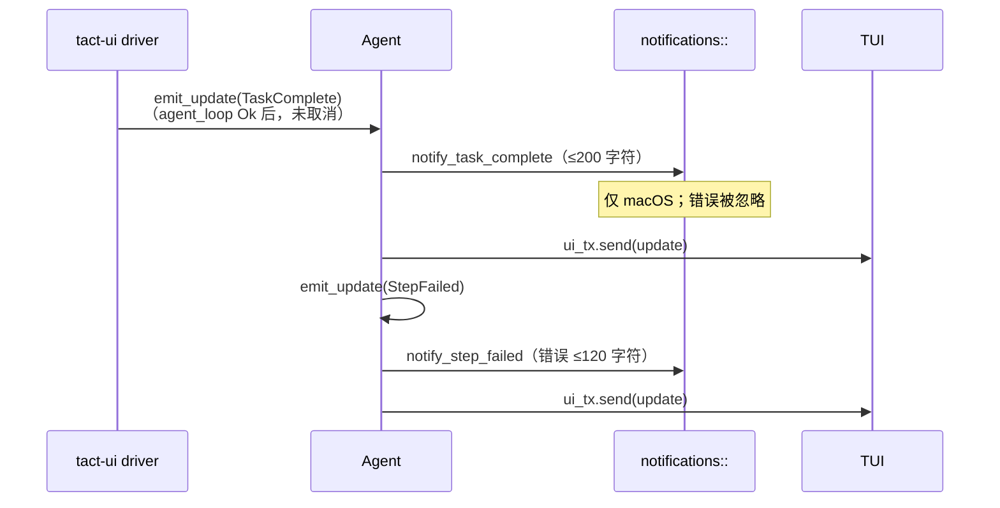

# 桌面通知

> 语言：[中文](./17_chapter_notify_zh.md) · [English](./17_chapter_notify.md)

本章说明 Tact 如何在关键 agent 生命周期事件发生时发送 **原生桌面通知**——主要是任务完成和工具步骤失败。该模块小而平台相关：在 macOS 上完整实现，其他平台为 no-op。

通知与 TUI 日志面板正交。即使终端未聚焦也会触发，因此长时间 headless 或后台会话可在 macOS 上提醒用户。

---

## 1. 通知做什么

`crates/tact/src/notifications/mod.rs` 封装单一原语：

```rust
pub fn notify(title: &str, message: &str) -> Result<()>;
```

更高级别的辅助函数格式化常见事件：

| 函数 | 标题 | 使用时机 |
|------|------|----------|
| `notify_task_complete(summary)` | `Tact — Task Complete` | Agent 成功结束 |
| `notify_step_failed(step_idx, error)` | `Tact — Step Failed` | 工具步骤失败 |
| `notify_info(summary)` | `Tact — Info` | **已定义但今日代码中无调用点** |

所有路径在干活前都会检查全局启用标志。

---

## 2. 平台行为



### macOS

通过 `osascript` 使用 AppleScript：

```applescript
display notification "{message}" with title "{title}"
```

标题和消息中的双引号会转义。spawn `osascript` 失败返回 `Err`。

### 非 macOS

函数立即返回 `Ok(())`。无回退（无 `notify-send`、无 Windows toast API）。

---

## 3. 配置

通知 **默认启用**。

| 来源 | 设置 |
|------|------|
| TOML | `[agent] notifications_enabled = false` |
| CLI | `--no-notifications` |

在 `config/resolve.rs` 中解析，运行时通过以下方式读取：

```rust
pub fn is_enabled() -> bool {
    crate::config::settings().agent.notifications_enabled
}
```

禁用时，每个公开函数在不 spawn 子进程的情况下返回 `Ok(())`。

---

## 4. 在 Agent 中的集成

通知从 `Agent::emit_update`（`crates/tact/src/agent/mod.rs`）触发，**在** 更新转发到 TUI 通道 **之前**：

```rust
match &update {
    AgentUpdate::TaskComplete(text) => {
        let summary = text.chars().take(200).collect::<String>();
        let _ = crate::notifications::notify_task_complete(&summary);
    }
    AgentUpdate::StepFailed(idx, _, msg) => {
        let _ = crate::notifications::notify_step_failed(*idx, msg);
    }
    _ => {}
}
```



### Headless 路径

Headless 运行设置 `ui_tx: None`，因此 `agent_loop` 从不向 TUI 发送 `AgentUpdate::TaskComplete`。完成 **只通知一次**：`run_headless` 在将最终文本打印到 stdout 后直接调用 `notify_task_complete`（`tui.rs`）。循环期间 `emit_update` 不会产生重复通知。

交互运行不同：`interactive.rs` 在成功、未取消的 `agent_loop` 返回后发出 `TaskComplete`，`emit_update` 从该更新触发 `notify_task_complete`。

通知调用的错误在各处被丢弃（`let _ = …`）——失败的 `osascript` 不会导致 agent 失败。

---

## 5. 什么 *不* 触发通知

这些 `AgentUpdate` 变体 **不** 通知：

- `StepStarted`、`StepFinished`、`StepAdded`
- `Info`、`ModelInfo`、流式 token
- 权限 prompt（`RequestSelect`）
- Thinking 块

会话开始、压缩或 MCP 连接事件没有通知。

---

## 6. 代码地图

| 文件 | 角色 |
|------|------|
| `crates/tact/src/notifications/mod.rs` | `notify`、辅助函数、`is_enabled`、平台 cfg |
| `crates/tact/src/agent/mod.rs` | `emit_update` — TaskComplete 与 StepFailed 钩子 |
| `crates/tact-ui/src/headless.rs` | Headless 在 stdout 后的完成通知 |
| `crates/tact/src/config/types.rs` | `AgentTomlConfig.notifications_enabled` |
| `crates/tact/src/config/resolve.rs` | CLI `--no-notifications` 覆盖 |

---

## 7. 当前缺口

| 缺口 | 详情 |
|------|------|
| 仅 macOS | Linux 和 Windows 用户无桌面提醒 |
| `notify_info` 未使用 | 代码库中无调用点 |
| 错误被吞 | `osascript` 失败被忽略；无 TUI 回退消息 |
| 仅交互式 `TaskComplete` 通知 | Headless 跳过 `emit_update(TaskComplete)`；只有直接 `notify_task_complete` |
| 无限流 | 快速连续步骤失败可能刷屏通知 |
| 无每会话自定义标题 | 所有通知使用固定 "Tact — …" 前缀 |

---

## 相关文档

- [任务与工具调度](./11_chapter_task.md) — `StepFailed` 何时发出
- [ARCHITECTURE.md](../ARCHITECTURE.md) — agent 更新流概览
