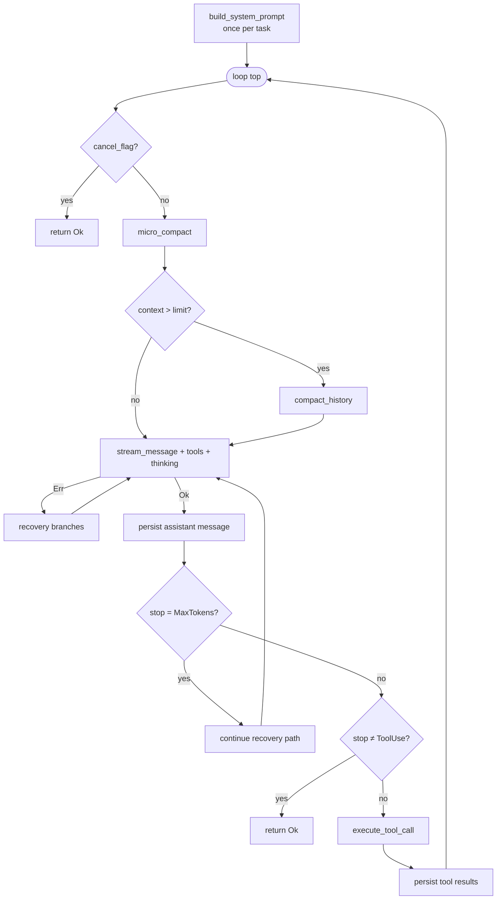

# Agent Main Loop
> Language: [English](./18_chapter_agent_loop.md) · [中文](./18_chapter_agent_loop_zh.md)

This chapter is the **capstone** for chapters 1–11: it describes `Agent::agent_loop` — the streaming conversation loop that ties session storage, prompt assembly, compaction, LLM calls, recovery, and tool dispatch into one turn cycle.

Implementation: `crates/tact/src/agent/mod.rs` (`Agent`, `AgentRuntime`, `agent_loop`, `stream_message`, `build_system_prompt`). Tool execution details live in [Ch 11 Tool Scheduling](./11_chapter_task.md).

---

## 1. What `agent_loop` Owns

| Concern | Where in the loop | Dedicated chapter |
|---------|-------------------|-------------------|
| Session restore / persist | `ensure_session`, `push_message`, `persist_message` | [Ch 1 Store](./01_chapter_store.md) |
| System prompt | `build_system_prompt()` once per task, before the turn loop | [Ch 4 Prompt](./04_chapter_prompt.md) |
| Context size | `micro_compact`, optional `compact_history` | [Ch 5 Compact](./05_chapter_compact.md) |
| LLM streaming | `stream_message` | this chapter |
| Failure recovery | compact / backoff / continue branches | [Ch 6 Recovery](./06_chapter_recovery.md) |
| Tool execution | `execute_tool_call` | [Ch 9–11 Hooks / Permission / Scheduling](./09_chapter_hook.md) |
| UI events | `emit_update(AgentUpdate::…)` | this chapter |

The loop does **not** emit `TaskComplete` itself — `tact-ui` sends that after `agent_loop` returns successfully (see [§7 TUI integration](#7-tui-integration)).

---

## 2. Entry and Setup

```rust
pub async fn agent_loop(&mut self, initial_user_message: Option<Message>) -> Result<()>
```

On entry:

1. **`RecoveryState` reset** — counters start fresh for this task invocation.
2. **`ensure_session()`** — create or restore SQLite history when `session_store` is wired ([Ch 1](./01_chapter_store.md)).
3. **`client.set_user_id(session_id)`** — provider-specific cache isolation (DeepSeek KV).
4. **Initial user message** — pushed when provided and persisted via `push_message`.

Subagents call `agent_loop(None)` with context pre-seeded; see [Ch 12 Subagents](./12_chapter_subagent.md).

---

## 3. One Iteration (LLM Turn)



### Pre-LLM steps

- **`micro_compact`** — stub old tool results in memory ([Ch 5](./05_chapter_compact.md)).
- **Auto compact** — when `should_auto_compact` fires (`last_token_total >= model_context_window`, or cold-start `estimate_context_size` vs the same window), runs `compact_history` and emits `[auto compact]` via `AgentUpdate::Info` ([Ch 5](./05_chapter_compact.md)).
- **`build_system_prompt`** — dynamic Tera render or static string for subagents; runs once per task before the turn loop, and the rendered string is reused for every turn ([Ch 4](./04_chapter_prompt.md)).
- **Request assembly** — `CreateMessageParams` with `all_tool_specs()` (native + MCP), streaming, and thinking budget from config.

### Streaming

`stream_message` forwards chunks to the TUI:

| Stream event | `AgentUpdate` |
|--------------|---------------|
| Text delta | `StreamChunk` |
| Thinking lifecycle | `ThinkingChunk::{Started, Delta, Finished}` |
| Model metadata | `ModelInfo` |
| Token counts | `TokenUsage` |

Stats (`SessionStats`) accumulate prompt/response/thinking sizes and LLM call durations. Before `persist_llm_call`, the agent snapshots `llm_call_last_message_id = last_message_db_id` (the last message **sent** to the model). Token usage and later `record_tool_schedule` both key off that id.

---

## 4. Stop Reasons and Loop Exit

After a successful stream, the assistant message is appended to `runtime.context` and persisted.

| `StopReason` | Behavior |
|--------------|----------|
| **`ToolUse`** | Run `execute_tool_call`, append tool results, **loop again** |
| **`EndTurn`** / **`StopSequence`** / **`PauseTurn`** | **`return Ok(())`** — task finished (`PauseTurn` is Anthropic server-tool pause; Tact does not use those tools yet) |
| **`MaxTokens`** | Recovery: optionally run pending tool calls first, append `CONTINUATION_MESSAGE`, retry (up to 3) — [Ch 6](./06_chapter_recovery.md). Exhausted attempts still finish with `Ok` |
| **`Refusal`** | Emit an Info update and **`return Err`** so the TUI shows a clear refusal instead of a false `TaskComplete`. Rephrase the request or switch models; no automatic multi-model fallback yet ([Anthropic docs](https://platform.claude.com/docs/en/build-with-claude/handling-stop-reasons)) |
| **`Unknown`** | Emit Info with the raw provider string, then finish with `Ok` |

`StopReason` is owned by `tact_llm` ([`stop_reason.rs`](../crates/tact_llm/src/stop_reason.rs)), not the Anthropic SDK. Adapters map provider-native strings (`end_turn`, `finish_reason=length`, …) into this enum; `model_context_window_exceeded` maps to `MaxTokens`.

**Cancellation:** `cancel_flag` is checked at the top of each iteration and again before tool execution. When set, the loop returns `Ok(())` after emitting `AgentUpdate::Info("Cancelled by user")`. A new `SubmitTask` clears `cancel_flag` before calling `agent_loop` again.

---

## 5. `AgentUpdate` and Notifications

`emit_update` sends events on the optional `ui_tx` channel and triggers desktop notifications for:

- `TaskComplete` → `notify_task_complete` ([Ch 17](./17_chapter_notify.md))
- `StepFailed` → `notify_step_failed`

Most lifecycle events (`StepAdded`, `StepStarted`, `StepFinished`, `RequestSelect`, etc.) originate from `execute_tool_call` in `tool_dispatch.rs`.

---

## 6. Key Structs

```rust
pub struct Agent {
    pub runtime: AgentRuntime,
    pub tool_context: ToolContext,
    pub tools: ToolRouter,
    pub mcp_router: MCPToolRouter,
    pub hooks: Vec<Hook>,
    pub system_prompt: AgentSystemPrompt,
    pub tool_use_counter: usize,  // StepAdded index for TUI
    cached_tool_specs: Vec<ToolSpec>,
}

pub struct AgentRuntime {
    pub client: LlmProvider,
    pub context: Vec<Message>,
    pub compact_state: CompactState,
    pub recovery_state: RecoveryState,
    pub permission_manager: PermissionManager,
    pub stats: SessionStats,
    pub ui_tx: Option<UnboundedSender<AgentUpdate>>,
    pub cancel_flag: Arc<AtomicBool>,
    pub session_store: Option<DynSessionStore>,
    pub session_id: Option<String>,
    pub first_message_db_id: i64,
    pub last_message_db_id: i64,
    /// `last_message_db_id` captured when `persist_llm_call` runs (before assistant row).
    pub llm_call_last_message_id: i64,
    // … cached_dir_snapshot, cached_claude_md, cached_agents_md
}
```

Construction helpers: `Agent::new`, `with_ui_channel`, `with_session`. Hook registration: `pre_tool_use`, `post_tool_use`, `session_start` — but see gaps below.

---

## 7. TUI Integration

In `crates/tact-ui/src/interactive.rs` (`UserCommand::SubmitTask` handler):

```rust
UserCommand::SubmitTask(task) => {
    agent.tool_use_counter = 0;
    agent.runtime.cancel_flag.store(false, Ordering::Relaxed);

    match agent.agent_loop(Some(task_message)).await {
        Ok(()) if !agent.runtime.cancel_flag.load(Ordering::Relaxed) => {
            if let Some(last) = agent.runtime.context.last() {
                agent.emit_update(AgentUpdate::TaskComplete(extract_text(&last.content)));
            }
        }
        Ok(()) => {}  // cancelled — no TaskComplete
        Err(e) => agent.emit_update(AgentUpdate::Error(...)),
    }
}
UserCommand::Cancel => {
    agent.runtime.cancel_flag.store(true, ...);
}
```

**`TaskComplete`** is emitted only when `agent_loop` returns `Ok(())` **and** the user did not cancel. The summary text comes from the **last context message** (often a tool result, not strictly the last assistant turn). Errors surface as `AgentUpdate::Error` instead.

---

## 8. Code Map

| File | Role |
|------|------|
| `crates/tact/src/agent/mod.rs` | `agent_loop`, `stream_message`, `build_system_prompt`, session helpers |
| `crates/tact/src/agent/tool_dispatch.rs` | `execute_tool_call`, three-phase pipeline |
| `crates/tact-ui/src/interactive.rs` | Spawns loop on `SubmitTask`, sets `TaskComplete` |
| `crates/tact/src/recovery.rs` | Error classification and continuation message |
| `crates/tact/src/compact.rs` | Pre-turn compaction hooks |
| `tact_protocol` | `AgentUpdate`, `UserCommand` wire types |

---

## 9. Current Gaps

| Gap | Detail |
|-----|--------|
| **`SessionStart` not invoked** | Hooks can be registered via `session_start()` but `agent_loop` never runs them ([Ch 9](./09_chapter_hook.md)) |
| **`TaskComplete` heuristic** | TUI uses last message in context when not cancelled; not explicitly last assistant text |
| **Headless path** | No `ui_tx`; no `TaskComplete` emit — single direct `notify_task_complete` after stdout ([Ch 17](./17_chapter_notify.md)) |
| **No dedicated cancel API on Agent** | Only atomic flag; subagents have separate flags |
| **`PlanGenerated` deprecated** | `#[deprecated(since = "0.19.0")]`; TUI handler retained — plan panel driven by `StepAdded` |

---

## Related Docs

- [Store and Persistence](./01_chapter_store.md) — session at loop start
- [Context Compaction](./05_chapter_compact.md) — pre-LLM compaction
- [Error Recovery](./06_chapter_recovery.md) — stream failure handling
- [Tasks and Tool Scheduling](./11_chapter_task.md) — tool branch of the loop
- [Subagents](./12_chapter_subagent.md) — nested `agent_loop`
- [ARCHITECTURE.md](../ARCHITECTURE.md) — §2 Agent Task Execution Flow
- [Configuration](./21_chapter_config.md) — `max_tokens`, `model_context_window`, `thinking_budget`
- [LLM Providers](./22_chapter_llm.md) — `stream_message` adapters
- [Terminal UI](./23_chapter_tui.md) — `TaskComplete` and channel wiring
