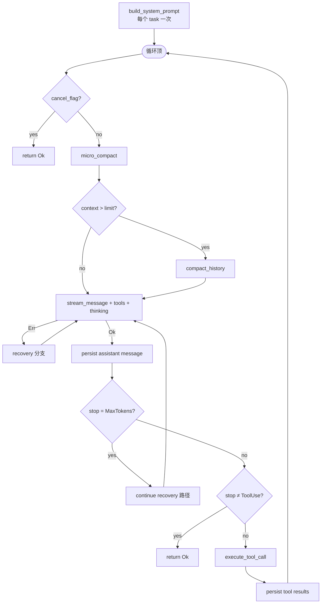

# Agent 主循环

> 语言：[中文](./18_chapter_agent_loop_zh.md) · [English](./18_chapter_agent_loop.md)

本章是第 1–11 章的 **收官篇**：描述 `Agent::agent_loop`——将 session 存储、prompt 组装、压缩、LLM 调用、恢复和工具 dispatch 绑成一轮循环的流式对话循环。

实现：`crates/tact/src/agent/mod.rs`（`Agent`、`AgentRuntime`、`agent_loop`、`stream_message`、`build_system_prompt`）。工具执行细节见 [第 11 章 工具调度](./11_chapter_task.md)。

---

## 1. `agent_loop` 负责什么

| 关注点 | 循环中的位置 | 专章 |
|--------|--------------|------|
| Session 恢复 / 持久化 | `ensure_session`、`push_message`、`persist_message` | [第 1 章 Store](./01_chapter_store_zh.md) |
| 系统 prompt | 每个 task 一次，在 turn 循环前 `build_system_prompt()` | [第 4 章 Prompt](./04_chapter_prompt.md) |
| 上下文大小 | `micro_compact`、可选 `compact_history` | [第 5 章 Compact](./05_chapter_compact_zh.md) |
| LLM 流式 | `stream_message` | 本章 |
| 失败恢复 | compact / backoff / continue 分支 | [第 6 章 Recovery](./06_chapter_recovery_zh.md) |
| 工具执行 | `execute_tool_call` | [第 9–11 章 Hooks / Permission / Scheduling](./09_chapter_hook.md) |
| UI 事件 | `emit_update(AgentUpdate::…)` | 本章 |

循环 **本身不** 发出 `TaskComplete`——`tact-ui` 在 `agent_loop` 成功返回后发送（见 [§7 TUI 集成](#7-tui-集成)）。

---

## 2. 入口与设置

```rust
pub async fn agent_loop(&mut self, initial_user_message: Option<Message>) -> Result<()>
```

进入时：

1. **`RecoveryState` 重置** — 计数器为本 task 调用重新开始。
2. **`ensure_session()`** — 当 `session_store` 已接线时创建或恢复 SQLite 历史（[第 1 章](./01_chapter_store_zh.md)）。
3. **`client.set_user_id(session_id)`** — provider 特定的 cache 隔离（DeepSeek KV）。
4. **初始用户消息** — 提供时 push 并通过 `push_message` 持久化。

子 agent 调用 `agent_loop(None)`，上下文已预填；见 [第 12 章 Subagents](./12_chapter_subagent.md)。

---

## 3. 一次迭代（LLM Turn）



### LLM 前步骤

- **`micro_compact`** — 在内存中 stub 旧 tool 结果（[第 5 章](./05_chapter_compact_zh.md)）。
- **自动 compact** — 当 `should_auto_compact` 触发（`last_token_total >= model_context_window`，或冷启动时用 `estimate_context_size` 对比同一窗口）时，运行 `compact_history` 并通过 `AgentUpdate::Info` 发出 `[auto compact]`（[第 5 章](./05_chapter_compact_zh.md)）。
- **`build_system_prompt`** — 子 agent 用动态 Tera 渲染或静态字符串；每个 task 在 turn 循环前运行一次，渲染字符串在每轮复用（[第 4 章](./04_chapter_prompt.md)）。
- **请求组装** — `CreateMessageParams` 含 `all_tool_specs()`（原生 + MCP）、流式，以及 config 中的 thinking budget。

### 流式

`stream_message` 将 chunk 转发到 TUI：

| 流事件 | `AgentUpdate` |
|--------|---------------|
| 文本 delta | `StreamChunk` |
| Thinking 生命周期 | `ThinkingChunk::{Started, Delta, Finished}` |
| 模型元数据 | `ModelInfo` |
| Token 计数 | `TokenUsage` |

Stats（`SessionStats`）累积 prompt/response/thinking 大小和 LLM 调用时长。在 `persist_llm_call` 之前，agent 快照 `llm_call_last_message_id = last_message_db_id`（**发送** 给模型的最后一条消息）。Token 用量与之后的 `record_tool_schedule` 都 keyed 于该 id。

---

## 4. 停止原因与循环退出

成功流式后，assistant 消息追加到 `runtime.context` 并持久化。

| `StopReason` | 行为 |
|--------------|------|
| **`ToolUse`** | 运行 `execute_tool_call`，追加 tool 结果，**再次循环** |
| **`EndTurn`** / **`StopSequence`** / **`PauseTurn`** | **`return Ok(())`** — task 结束（`PauseTurn` 是 Anthropic 服务端工具暂停；Tact 尚未使用那些工具） |
| **`MaxTokens`** | 恢复：可选先运行 pending tool calls，追加 `CONTINUATION_MESSAGE`，重试（最多 3 次）— [第 6 章](./06_chapter_recovery_zh.md)。用尽尝试仍以 `Ok` 结束 |
| **`Refusal`** | 发出 Info 更新并 **`return Err`**，让 TUI 显示明确拒答而非虚假 `TaskComplete`。改写请求或换模型；尚无自动多模型回退（[Anthropic 文档](https://platform.claude.com/docs/en/build-with-claude/handling-stop-reasons)） |
| **`Unknown`** | 发出带原始 provider 字符串的 Info，然后以 `Ok` 结束 |

`StopReason` 由 `tact_llm` 拥有（[`stop_reason.rs`](../crates/tact_llm/src/stop_reason.rs)），不是 Anthropic SDK。适配器将 provider 原生字符串（`end_turn`、`finish_reason=length` 等）映射到此 enum；`model_context_window_exceeded` 映射到 `MaxTokens`。

**取消：** 每次迭代顶部以及工具执行前检查 `cancel_flag`。设置时，循环在发出 `AgentUpdate::Info("Cancelled by user")` 后返回 `Ok(())`。新的 `SubmitTask` 在再次调用 `agent_loop` 前清除 `cancel_flag`。

---

## 5. `AgentUpdate` 与通知

`emit_update` 在可选 `ui_tx` 通道上发送事件，并为以下触发桌面通知：

- `TaskComplete` → `notify_task_complete`（[第 17 章](./17_chapter_notify_zh.md)）
- `StepFailed` → `notify_step_failed`

大多数生命周期事件（`StepAdded`、`StepStarted`、`StepFinished`、`RequestSelect` 等）来自 `tool_dispatch.rs` 中的 `execute_tool_call`。

---

## 6. 关键结构体

```rust
pub struct Agent {
    pub runtime: AgentRuntime,
    pub tool_context: ToolContext,
    pub tools: ToolRouter,
    pub mcp_router: MCPToolRouter,
    pub hooks: Vec<Hook>,
    pub system_prompt: AgentSystemPrompt,
    pub tool_use_counter: usize,  // TUI 的 StepAdded 索引
    cached_tool_specs: Vec<ToolSpec>,
}

pub struct AgentRuntime {
    pub client: LlmProvider,
    pub context: Vec<Message>,
    pub compact_state: CompactState,
    pub recovery_state: RecoveryState,
    pub permission_manager: PermissionManager,
    pub stats: SessionStats,
    pub ui_tx: Option<UnboundedSender<AgentUpdate>>,
    pub cancel_flag: Arc<AtomicBool>,
    pub session_store: Option<DynSessionStore>,
    pub session_id: Option<String>,
    pub first_message_db_id: i64,
    pub last_message_db_id: i64,
    /// `persist_llm_call` 运行时的 `last_message_db_id`（assistant 行之前）。
    pub llm_call_last_message_id: i64,
    // … cached_dir_snapshot, cached_claude_md, cached_agents_md
}
```

构造辅助：`Agent::new`、`with_ui_channel`、`with_session`。Hook 注册：`pre_tool_use`、`post_tool_use`、`session_start`——但见下方缺口。

---

## 7. TUI 集成

在 `crates/tact-ui/src/interactive.rs`（`UserCommand::SubmitTask` 处理器）：

```rust
UserCommand::SubmitTask(task) => {
    agent.tool_use_counter = 0;
    agent.runtime.cancel_flag.store(false, Ordering::Relaxed);

    match agent.agent_loop(Some(task_message)).await {
        Ok(()) if !agent.runtime.cancel_flag.load(Ordering::Relaxed) => {
            if let Some(last) = agent.runtime.context.last() {
                agent.emit_update(AgentUpdate::TaskComplete(extract_text(&last.content)));
            }
        }
        Ok(()) => {}  // 已取消 — 无 TaskComplete
        Err(e) => agent.emit_update(AgentUpdate::Error(...)),
    }
}
UserCommand::Cancel => {
    agent.runtime.cancel_flag.store(true, ...);
}
```

**`TaskComplete`** 仅在 `agent_loop` 返回 `Ok(())` **且** 用户未取消时发出。摘要文本来自 **最后一条 context 消息**（常为 tool 结果，不一定是最后 assistant turn）。错误以 `AgentUpdate::Error` 呈现。

---

## 8. 代码地图

| 文件 | 角色 |
|------|------|
| `crates/tact/src/agent/mod.rs` | `agent_loop`、`stream_message`、`build_system_prompt`、session 辅助 |
| `crates/tact/src/agent/tool_dispatch.rs` | `execute_tool_call`、三阶段流水线 |
| `crates/tact-ui/src/interactive.rs` | 在 `SubmitTask` 上 spawn 循环，设置 `TaskComplete` |
| `crates/tact/src/recovery.rs` | 错误分类与 continuation 消息 |
| `crates/tact/src/compact.rs` | Turn 前 compact 钩子 |
| `tact_protocol` | `AgentUpdate`、`UserCommand` 线型类型 |

---

## 9. 当前缺口

| 缺口 | 详情 |
|------|------|
| **`SessionStart` 未调用** | 可通过 `session_start()` 注册 hook，但 `agent_loop` 从不运行它们（[第 9 章](./09_chapter_hook.md)） |
| **`TaskComplete` 启发式** | TUI 在未取消时用 context 中最后一条消息；非显式最后 assistant 文本 |
| **Headless 路径** | 无 `ui_tx`；无 `TaskComplete` emit — stdout 后单次直接 `notify_task_complete`（[第 17 章](./17_chapter_notify_zh.md)） |
| **Agent 上无专用 cancel API** | 只有 atomic flag；子 agent 有独立 flag |
| **`PlanGenerated` 已弃用** | `#[deprecated(since = "0.19.0")]`；TUI 处理器保留 — plan 面板由 `StepAdded` 驱动 |

---

## 相关文档

- [Store 与持久化](./01_chapter_store_zh.md) — 循环开始时的 session
- [上下文压缩](./05_chapter_compact_zh.md) — LLM 前 compact
- [错误恢复](./06_chapter_recovery_zh.md) — 流失败处理
- [任务与工具调度](./11_chapter_task.md) — 循环的工具分支
- [Subagents](./12_chapter_subagent.md) — 嵌套 `agent_loop`
- [ARCHITECTURE.md](../ARCHITECTURE.md) — §2 Agent Task Execution Flow
- [Configuration](./21_chapter_config.md) — `max_tokens`、`model_context_window`、`thinking_budget`
- [LLM Providers](./22_chapter_llm.md) — `stream_message` 适配器
- [Terminal UI](./23_chapter_tui.md) — `TaskComplete` 与通道接线
