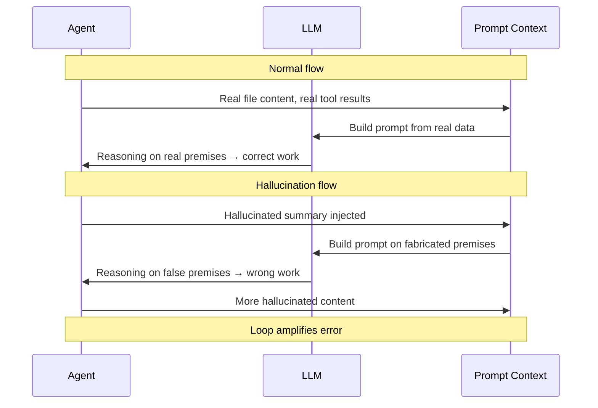
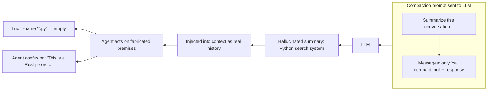

# Hallucination in Agent Loops

> Language: [English](./20_chapter_hallucination.md) · [中文](./20_chapter_hallucination_zh.md)

This chapter catalogs **LLM hallucination patterns** that occur inside a coding-agent loop — where the model fabricates files, function signatures, conversation history, or tool outputs that never existed. Understanding these patterns is critical for building robust agent systems, because a hallucination in the prompt (not just the response) can **poison subsequent turns** and derail the entire task.

The primitives shown here correlate to `crates/tact/src/compact/mod.rs`, `crates/tact/src/agent/mod.rs` (specifically the prompt builder and compaction logic), and the `tact_llm` provider adapters.

---

## 0. Why Hallucination Matters Inside the Loop

A coding agent is an LLM **prompted by code**. Every turn the agent constructs a prompt from real data — file contents, tool results, conversation history. When the LLM hallucinates **into the prompt** (not just its output), the error becomes part of the next turn's input, creating a self-reinforcing feedback loop:



Unlike output hallucinations (which the user can visually reject), **prompt hallucinations** are invisible to the user — the model sees a fabricated world and acts within it, producing work that looks correct but operates on nonexistent entities.

---

## 1. Scenario: Compaction Summary Fabrication

This is the most impactful hallucination pattern in Tact, because the compacted summary replaces the bulk of the conversation history and directly feeds the next LLM turn.

### 1.1 Trigger Condition

| Condition | Value |
|-----------|-------|
| **Action** | LLM is asked to summarize a conversation for compaction |
| **Prompt** | `"Summarize this coding-agent conversation so work can continue. Preserve: 1. The current goal and what has been accomplished ..."` |
| **Context given** | Only the most recent messages (within token budget) |
| **Model** | DeepSeek v4 Flash (observed), potentially any model with strong completion bias |

### 1.2 The Specific Case

In the observed incident (session `479d01ce`, 2026-07-23), the conversation sent to the summarizer contained **only three messages**:

```
[user]   call compact tool
[assistant]  thinking + tool_use compact
[user]   tool_result: "Compacting conversation..."
```

There was no prior coding task, no files read, no goals — the entire "conversation to summarize" was the act of calling `compact` itself. The LLM was asked to produce a summary with concrete details about goals, files, and next steps, but the input contained none.

**The LLM hallucinated an entire Python search system:**

```
Goal: Implement a scalable search system over LLM conversation datasets...
Key Files:
- search/__init__.py — SearchResult(doc_id, doc_path, query_snippet)...
- search/search.py — MiniSearch(MiniSearchClient)...
- index/ module — PositionalPostingList, IndexWriter, WildcardQuery...
Remaining Work:
1. Query Engine (DAAT)
2. Result Ranking/Snippet Generation
3. Integration/Testing
```

None of these files existed. None of these classes existed. The project is pure Rust.

### 1.3 Downstream Damage

1. The hallucinated summary was injected as message ordinal 2 in the rebuilt context
2. The agent read the summary and believed it was working on a Python search system
3. It ran `find . -name "*.py"` — found nothing
4. It searched for Python files — found nothing in this Rust project
5. It became confused, repeatedly confirming the project language and trying to reconcile the summary with reality
6. User had to explain the compaction hallucination to reset the context



### 1.4 Root Cause

| Factor | Why it contributed |
|--------|-------------------|
| **No minimum content check** | Compaction ran on a session with only 3 trivial messages, none containing meaningful work |
| **LLM completion bias** | DeepSeek/OpenAI models strongly prefer to produce a detailed answer rather than admit "there is nothing to summarize" |
| **Prompt demands concrete detail** | The instruction explicitly asks for goal, files, signatures — pressuring the model to fabricate when absent |
| **No factual consistency check** | The summary is accepted as-is; no validation that mentioned files/paths actually exist |
| **New session boundary** | The new session started clean, so the only context was the compact tool invocation itself — no prior work carried over |

---

## 2. Scenario: Stub-Induced Content Fabrication

### 2.1 Trigger Condition

After `micro_compact` truncates old tool results, a stub replaces the original content:

```
[Earlier tool result compacted. Re-run the tool (e.g., read_file) for full content.]
```

### 2.2 Behavior

When the LLM encounters this stub and later needs the content (e.g., to construct an `apply_patch` call), it has two choices:

1. **Re-read the file** (correct, costs tokens)
2. **Fabricate the content from memory** (incorrect, but common)

Many models, especially under time pressure or token budgets, choose option 2. They produce diffs or patches based on recalled (and often inaccurate) content, leading to:

| Symptom | Why it fails |
|---------|--------------|
| `apply_patch` context mismatch | The fabricated line numbers or context strings don't match the real file |
| Silent wrong edits | The model produces plausible-looking but incorrect code |
| Cascading errors | Each wrong edit produces more tool results that may get truncated, compounding the error |

### 2.3 Mitigation Gap

The stub itself says "re-run the tool" but the system prompt guidance is insufficient to enforce re-reading. Models with strong autoregressive completion bias may ignore the instruction and proceed with fabricated content.

---

## 3. Scenario: Tool Result Hallucination

### 3.1 Trigger Condition

The agent calls a tool (e.g., `bash`, `read_file`) and the tool returns an error or is interrupted. In the next turn, the LLM may fabricate a successful result.

### 3.2 Example

```
[user]    tool_use: bash("cat /etc/os-release")
[assistant]  thinks about what to do
[user]    tool_result: [Tool execution error: command timed out after 30s]

Next turn:
[assistant]  "I found the OS is Ubuntu 22.04 from /etc/os-release"
```

The LLM "remembers" what the command *should* output and substitutes it for the failed result. This is particularly dangerous because:

- The error may indicate a real problem (network, permission, missing tool)
- The fabricated output may be plausible but wrong
- Subsequent work built on this output compounds the error

---

## 4. Scenario: Identity Confusion

### 4.1 Trigger Condition

When context is compacted or restructured, the model may confuse **whose voice** a message belongs to. A tool result attributed to the `user` role (as Tact does for the Messages API) may be mistaken for a user instruction.

### 4.2 Example

After compaction, the rebuilt context has:

```
[user]    This conversation was compacted so the agent can continue working.
          [summary text ...]

[user]    tool_result: { "some previous output" }
```

The model may interpret the tool result content as a new user directive, especially if the summary is vague. This leads to:

- Repeating work that was already done
- Acting on old command output as if it were current
- Confusing system-generated stubs with user requests

---

## 5. Mitigation Strategies

| Strategy | Description | Where to implement |
|----------|-------------|-------------------|
| **Minimum content threshold** | Skip LLM-based compaction if fewer than N meaningful messages exist; use a hardcoded fallback summary | `compact_history_with_mode` in `agent/mod.rs` |
| **Factual consistency check** | After compaction, scan the summary for file/function references and verify they exist in the codebase; reject if too many references are fabricated | Post-compaction validation step |
| **Summary fallback for empty content** | When the conversation has nothing substantive, return a minimal factual stub like "(no significant work to summarize)" instead of calling the LLM | `compact_history_with_mode` |
| **Force re-read on stub** | Improve system prompt to explicitly require `read_file` before any `apply_patch` or edit when stubs are present | System prompt template |
| **Improve stub message** | Make the stub more salient (e.g., `[⚠ CONTENT TRUNCATED — re-read the file before editing]`) to reduce the chance the model ignores it | `COMPACTED_TOOL_RESULT` in `compact/mod.rs` |
| **Model-specific tuning** | Some models hallucinate less with lower temperature; use a lower temperature for compaction calls | `CreateMessageParams` for summarizer |
| **Verification step** | After major edits, verify the change was applied correctly by re-reading the file; if it doesn't match the intended edit, flag hallucination | Tool post-hook |
| **Session continuity flag** | Detect when compaction runs on a nearly-empty session (no prior work) and skip the LLM call entirely | `compact_history_with_mode` |
| **User-facing warning** | When compaction occurs, inform the user that the conversation was compressed; provide the transcript path for manual review | `AgentUpdate::Info` in compact flow |

### 5.1 Priority Order

| Priority | Strategy | Effort | Impact |
|----------|----------|--------|--------|
| P0 | Minimum content threshold | Low (add a counter check) | High (prevents the exact bug observed) |
| P0 | Summary fallback for empty content | Low (branch before LLM call) | High (eliminates empty-context fabrication) |
| P1 | Force re-read on stub | Medium (system prompt change) | High (reduces stub-induced fabrication) |
| P2 | Factual consistency check | High (requires file-system scan) | Medium (catches fabrication, but expensive) |
| P3 | Verification step | Medium (post-tool hook) | Medium (catches downstream errors) |

---

## Related Docs

- [Context Compaction](./05_chapter_compact.md) — the mechanism that triggers scenario 1 and 2
- [Error Recovery](./06_chapter_recovery.md) — compaction as the prompt-too-long recovery
- [Agent Main Loop](./18_chapter_agent_loop.md) — where the context is rebuilt after compaction
- [System Prompt](./04_chapter_prompt.md) — where stub guidance lives
- [Tool System](./07_chapter_tool.md) — tool post-hooks for verification
- `crates/tact/src/agent/mod.rs` — `compact_history_with_mode` implementation
- `crates/tact/src/compact/mod.rs` — `COMPACTED_TOOL_RESULT` and `micro_compact`
