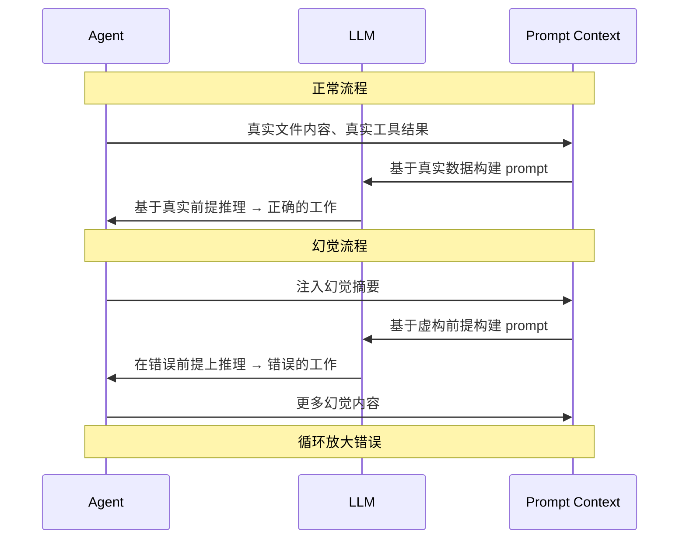
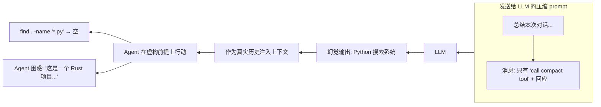

# Agent 循环中的幻觉问题

> 语言：[English](./20_chapter_hallucination.md) · [中文](./20_chapter_hallucination_zh.md)

本章系统梳理编码 Agent 循环中的 **LLM 幻觉模式**——模型凭空编造不存在的文件、函数签名、对话历史或工具输出。理解这些模式对于构建健壮的 Agent 系统至关重要，因为 prompt 中的幻觉（不仅是输出）会**毒化后续回合**，使整个任务偏离轨道。

相关代码位于 `crates/tact/src/compact/mod.rs`、`crates/tact/src/agent/mod.rs`（特别是 prompt 构建和压缩逻辑）以及 `tact_llm` provider 适配层。

---

## 0. 为什么循环内的幻觉至关重要

编码 Agent 的本质是 **LLM 被代码驱动**。每回合 Agent 基于真实数据（文件内容、工具结果、对话历史）构建 prompt。当 LLM 在 **prompt 中**（而非仅输出）产生幻觉时，该错误会成为下一回合的输入，形成自我增强的反馈循环：



与输出幻觉（用户肉眼可见）不同，**prompt 幻觉对用户不可见**——模型看到一个虚构的世界并在其中行动，产出的工作看起来正确，但操作的对象根本不存在。

---

## 1. 场景：压缩摘要编造

这是 Tact 中影响最大的幻觉模式，因为压缩摘要替换了大段对话历史，直接喂入下一回合 LLM。

### 1.1 触发条件

| 条件 | 值 |
|-------|--------|
| **动作** | LLM 被要求总结对话以进行压缩 |
| **Prompt** | `"总结本次编码 Agent 对话以便继续工作。保留：1. 当前目标和已完成工作 ..."` |
| **提供的上下文** | 仅有最近的消息（在 token 预算内） |
| **模型** | DeepSeek v4 Flash（已观测到），可能任何有强补全偏好的模型 |

### 1.2 具体案例

在观测到的事故中（session `479d01ce`，2026-07-23），发送给摘要 LLM 的对话**只有三条消息**：

```
[user]   call compact tool
[assistant]  thinking + tool_use compact
[user]   tool_result: "Compacting conversation..."
```

没有任何先前的编码任务、没有读过的文件、没有目标——整个"需要总结的对话"就是调用 `compact` 本身。LLM 被要求生成包含目标、文件和下一步具体步骤的摘要，但输入中什么都没有。

**LLM 编造了一个完整的 Python 搜索系统：**

```
目标：实现一个可扩展的 LLM 对话数据集搜索系统...
关键文件：
- search/__init__.py — SearchResult(doc_id, doc_path, query_snippet)...
- search/search.py — MiniSearch(MiniSearchClient)...
- index/ 模块 — PositionalPostingList, IndexWriter, WildcardQuery...
剩余工作：
1. 查询引擎（DAAT）
2. 结果排序/片段生成
3. 集成/测试
```

这些文件没有一个存在。这些类没有一个存在。该项目是纯 Rust。

### 1.3 下游危害

1. 幻觉摘要作为用户消息 ordinal 2 注入重建后的上下文
2. Agent 读到摘要，相信自己正在处理一个 Python 搜索系统
3. 运行 `find . -name "*.py"` — 什么都没找到
4. 搜索更多 Python 文件 — 在这个 Rust 项目中什么都没找到
5. 陷入困惑，反复确认项目语言，试图调和摘要与现实
6. 用户不得不解释压缩的幻觉来重置上下文



### 1.4 根因

| 因素 | 为何导致 |
|--------|-------------------|
| **无最小内容检查** | 压缩在只有 3 条无关紧要消息的会话中运行，其中没有任何有意义的工作 |
| **LLM 补全偏见** | DeepSeek/OpenAI 模型强烈倾向于输出详细答案，而非承认"无内容可总结" |
| **Prompt 要求具体细节** | 指令明确要求目标、文件、签名——迫使模型在缺失时编造 |
| **无事实一致性检查** | 摘要照单全收；不验证提及的文件/路径是否真实存在 |
| **新会话边界** | 新会话从零开始，唯一的上下文就是 compact 工具调用本身——没有继承任何先前工作 |

---

## 2. 场景：截断占位符引发的内容编造

### 2.1 触发条件

`micro_compact` 截断旧的工具结果后，原始内容被占位符替换：

```
[Earlier tool result compacted. Re-run the tool (e.g., read_file) for full content.]
```

### 2.2 行为

当 LLM 遇到此占位符，之后又需要该内容（例如构建 `apply_patch` 调用）时，有两个选择：

1. **重新读取文件**（正确，消耗 token）
2. **凭记忆编造内容**（错误，但常见）

许多模型，特别在时间压力或 token 预算下，会选择方案 2。它们基于记忆中的（通常不准确的）内容生成 diff 或 patch，导致：

| 症状 | 失败原因 |
|---------|---------|
| `apply_patch` 上下文不匹配 | 编造的行号或上下文字符串与真实文件不一致 |
| 无声的错误编辑 | 模型产出的代码看似合理但实际错误 |
| 级联错误 | 每个错误编辑产生更多工具结果，可能又被截断，放大错误 |

### 2.3 缓解缺口

占位符本身写了"re-run the tool"，但系统 prompt 的引导不足以强制执行重新读取。具有强自回归补全偏好的模型可能忽略指令，直接用编造内容继续。

---

## 3. 场景：工具结果幻觉

### 3.1 触发条件

Agent 调用工具（如 `bash`、`read_file`、`batch_read`），工具返回错误或被中断。下一回合 LLM 可能编造一个成功的结果。

### 3.2 示例

```
[user]    tool_use: bash("cat /etc/os-release")
[assistant]  思考该做什么
[user]    tool_result: [Tool execution error: command timed out after 30s]

下一回合：
[assistant]  "我通过 /etc/os-release 找到 OS 是 Ubuntu 22.04"
```

LLM "记住"了命令*应该*输出什么，并用它替换了失败结果。这特别危险因为：

- 错误可能指示真实问题（网络、权限、缺工具）
- 编造的输出可能看似合理但有误
- 后续工作建立在这个输错上会放大错误

---

## 4. 场景：身份混淆

### 4.1 触发条件

当上下文被压缩或重组后，模型可能混淆一条消息的**归属者**。Tact 将工具结果归入 `user` 角色（符合 Messages API），模型可能误以为是用户指令。

### 4.2 示例

压缩后重建的上下文：

```
[user]    This conversation was compacted so the agent can continue working.
          [摘要文本...]

[user]    tool_result: { "某次先前的输出" }
```

模型可能将工具结果内容误解为新的用户指令，特别是当摘要是模糊的。这会导致：

- 重复已经完成的工作
- 将旧的命令输出当作当前状态
- 把系统生成的占位符混淆为用户请求

---

## 5. 缓解策略

| 策略 | 描述 | 实现位置 |
|----------|-------------|-------------------|
| **最小内容阈值** | 如果有意义的消息少于 N 条，跳过 LLM 压缩，使用硬编码回退摘要 | `compact_history_with_mode` in `agent/mod.rs` |
| **事实一致性检查** | 压缩后扫描摘要中的文件/函数引用，验证它们是否在代码库中真实存在；过多引用不存在的则拒绝 | 压缩后验证步骤 |
| **空内容回退摘要** | 当对话无实质内容时，返回极简事实性占位符，如"(无重要工作可总结)"，不必调用 LLM | `compact_history_with_mode` |
| **遇占位符强制重新读取** | 改进系统 prompt，明确要求在存在截断占位符时，任何 `apply_patch` 或编辑前必须先 `read_file` | 系统 prompt 模板 |
| **改进占位符消息** | 让占位符更醒目（如 `[⚠ 内容已截断 — 编辑前请重新读取文件]`），降低模型忽略的概率 | `COMPACTED_TOOL_RESULT` in `compact/mod.rs` |
| **模型特定调参** | 部分模型在更低 temperature 下幻觉更少；对压缩调用使用更低 temperature | 摘要器的 `CreateMessageParams` |
| **验证步骤** | 重要编辑后，重新读取文件验证修改是否准确执行；如果不匹配预期编辑，标记幻觉 | 工具后钩子 |
| **会话连续性标记** | 检测压缩在近乎空的会话上运行（无先前工作）时，完全跳过 LLM 调用 | `compact_history_with_mode` |
| **用户可见警告** | 压缩发生时通知用户对话被压缩了；提供 transcript 路径供人工审查 | 压缩流程中的 `AgentUpdate::Info` |

### 5.1 优先级排序

| 优先级 | 策略 | 工作量 | 影响 |
|----------|----------|--------|------|
| P0 | 最小内容阈值 | 低（加一个计数器检查） | 高（直接阻止观察到的 bug） |
| P0 | 空内容回退摘要 | 低（LLM 调用前加分支） | 高（彻底消除空内容编造） |
| P1 | 遇占位符强制重新读取 | 中（修改系统 prompt） | 高（减少占位符触发的编造） |
| P2 | 事实一致性检查 | 高（需文件系统扫描） | 中（能捕捉编造，但代价高） |
| P3 | 验证步骤 | 中（工具后钩子） | 中（捕捉下游错误） |

---

## 相关文档

- [上下文压缩](./05_chapter_compact_zh.md) — 触发场景 1 和 2 的机制
- [错误恢复](./06_chapter_recovery_zh.md) — 压缩作为 prompt-too-long 的恢复策略
- [Agent 主循环](./18_chapter_agent_loop_zh.md) — 压缩后上下文重建的位置
- [系统提示](./04_chapter_prompt_zh.md) — 截断占位符引导所在
- [工具系统](./07_chapter_tool_zh.md) — 验证用的工具后钩子
- `crates/tact/src/agent/mod.rs` — `compact_history_with_mode` 实现
- `crates/tact/src/compact/mod.rs` — `COMPACTED_TOOL_RESULT` 和 `micro_compact`
