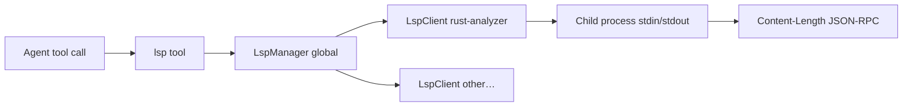

# LSP Code Intelligence

This chapter explains Tact's **Language Server Protocol client**: spawning configured language servers, JSON-RPC over stdin/stdout, and the native `lsp` tool for hover, definition, references, symbols, and diagnostics.

Implementation: `crates/tact/src/lsp/` module, tool wrapper `crates/tact/src/tool/lsp_tool.rs` (exported as **`lsp`**, not `query_lsp`).

---

## 1. Architecture Overview



| Component | Role |
|-----------|------|
| `LspServerConfig` | Binary path, args, file globs, language id map |
| `LspClient` | One running server process + request/response loop |
| `LspManager` | Map server name → client; route files to servers |
| `global_lsp_manager()` | Process-wide `Arc<Mutex<LspManager>>` lazy singleton |
| `lsp` tool | Agent-facing API with `action` + `file` + position |

Servers are **not** started at TUI boot — they spin up on first use for a matching file type.

---

## 2. Configuration

Configs load from **`~/.tact/lsp_servers.json`** (JSON array):

```json
[
  {
    "name": "rust-analyzer",
    "command": "rust-analyzer",
    "args": [],
    "file_patterns": ["*.rs"],
    "extension_to_language": { ".rs": "rust" },
    "initialization_options": null,
    "env": {}
  }
]
```

`LspManager::load_from_default_config()` reads this file on each tool call (via `seed_from_config`). Parse errors log a warning and yield an empty config.

There is **no** project-local LSP config in `.claude/` today.

---

## 3. Protocol Framing

LSP messages use HTTP-style headers on the server's stdin/stdout:

```text
Content-Length: <N>\r\n
\r\n
<N bytes of UTF-8 JSON>
```

`LspClient` manages async read/write loops, request ids (`AtomicU64`), and notification dispatch (e.g. `textDocument/publishDiagnostics`).

---

## 4. The `lsp` Tool

```rust
#[tool(name = "lsp", description = "Query a language server…")]
pub async fn query_lsp(ctx: ToolContext, input: LspInput) -> Result<String>
```

| Field | Purpose |
|-------|---------|
| `action` | `hover`, `definition`, `references`, `symbols`, `diagnostics` |
| `file` | Path relative to `work_dir` (via `safe_path`) |
| `line`, `column` | 1-based position (default 1) |

Flow:

1. Resolve path inside workspace
2. `global_lsp_manager()` + `seed_from_config`
3. If no server matches file extension → friendly message with example JSON
4. `open_file` on the manager (didOpen + sync if needed)
5. Dispatch action

### Actions

| Action | LSP methods (conceptually) | Notes |
|--------|---------------------------|-------|
| `hover` | `textDocument/hover` | Returns markdown/plain text or "No hover…" |
| `definition` | `textDocument/definition` | One location per line |
| `references` | `textDocument/references` | Count + joined locations |
| `symbols` | `textDocument/documentSymbol` | Outline list |
| `diagnostics` | Cached from publish notifications | **200 ms sleep** before read; may be empty on cold start |

Scheduling: **`independent`** in `crates/tact/src/agent/tool_schedule.rs` — can run in parallel with other non-conflicting tools.

Permission: classified as a normal write-capable native tool under name `lsp` ([Ch 10](./10_chapter_permission.md)).

---

## 5. Diagnostics Cache

`LspDiagnostic` records severity, message, line/column, optional code/source. The manager stores the latest set per file URI from server push notifications.

`diagnostics` action does not pull-on-demand from the server — it reads the **cache** after a short sleep, so first query after open may show nothing until the server publishes.

---

## 6. Code Map

| File | Role |
|------|------|
| `crates/tact/src/lsp/mod.rs` | Re-exports, global singleton |
| `crates/tact/src/lsp/config.rs` | `LspServerConfig` |
| `crates/tact/src/lsp/client.rs` | `LspClient` JSON-RPC loop |
| `crates/tact/src/lsp/manager.rs` | `LspManager` multi-server routing |
| `crates/tact/src/lsp/diagnostic.rs` | `LspDiagnostic`, formatting helpers |
| `crates/tact/src/tool/lsp_tool.rs` | `lsp` tool handler |
| `crates/tact/src/tool/registry.rs` | `QueryLspTool` in `toolset()` |
| `crates/tact/src/consts.rs` | `TactPath::home_tact_dir()` for config path |

---

## 7. Current Gaps

| Gap | Detail |
|-----|--------|
| **Global singleton** | All sessions share one manager; no per-workspace server isolation |
| **Config re-read every call** | `seed_from_config` on each invocation; no hot reload notification |
| **Diagnostics timing** | Fixed 200 ms wait; flaky on slow servers |
| **No shutdown on exit** | Server child processes may outlive agent until process exit |
| **Single-file open model** | No workspace-wide `didChangeWatchedFiles` integration |
| **Tool name vs module** | Rust fn `query_lsp`; LLM sees tool name `lsp` |
| **Not in subagent toolset** | Subagents cannot call LSP |

---

## Related Docs

- [Tool System](./07_chapter_tool.md) — `ToolContext`, path safety, `toolset()`
- [Tasks and Tool Scheduling](./11_chapter_task.md) — `lsp` marked independent
- [Permission Model](./10_chapter_permission.md) — tool gating
- [ARCHITECTURE.md](../ARCHITECTURE.md) — tools table row for LSP
