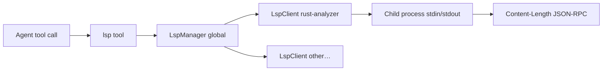

# LSP 代码智能

> 语言：[中文](./20_chapter_lsp_zh.md) · [English](./20_chapter_lsp.md)

本章说明 Tact 的 **Language Server Protocol 客户端**：启动配置的语言服务器、经 stdin/stdout 的 JSON-RPC，以及用于 hover、definition、references、symbols 和 diagnostics 的原生 `lsp` 工具。

实现：`crates/tact/src/lsp/` 模块，工具封装 `crates/tact/src/tool/lsp_tool.rs`（导出为 **`lsp`**，不是 `query_lsp`）。

---

## 1. 架构概览



| 组件 | 角色 |
|------|------|
| `LspServerConfig` | 二进制路径、参数、文件 glob、language id 映射 |
| `LspClient` | 一个运行中的 server 进程 + 请求/响应循环 |
| `LspManager` | server 名 → client 映射；将文件路由到 server |
| `global_lsp_manager()` | 进程级 `Arc<Mutex<LspManager>>` 懒单例 |
| `lsp` tool | 面向 agent 的 API，含 `action` + `file` + 位置 |

Server **不在** TUI 启动时启动——在首次使用匹配文件类型时 spin up。

---

## 2. 配置

配置从 **`~/.tact/lsp_servers.json`** 加载（JSON 数组）：

```json
[
  {
    "name": "rust-analyzer",
    "command": "rust-analyzer",
    "args": [],
    "file_patterns": ["*.rs"],
    "extension_to_language": { ".rs": "rust" },
    "initialization_options": null,
    "env": {}
  }
]
```

`LspManager::load_from_default_config()` 在每次 tool 调用时读取此文件（通过 `seed_from_config`）。解析错误记录 warning 并 yield 空配置。

**没有** 项目本地 LSP 配置在 `.claude/` 中。

---

## 3. 协议帧

LSP 消息在 server 的 stdin/stdout 上使用 HTTP 风格头：

```text
Content-Length: <N>\r\n
\r\n
<N bytes of UTF-8 JSON>
```

`LspClient` 管理 async 读/写循环、请求 id（`AtomicU64`）和通知 dispatch（如 `textDocument/publishDiagnostics`）。

---

## 4. `lsp` 工具

```rust
#[tool(name = "lsp", description = "Query a language server…")]
pub async fn query_lsp(ctx: ToolContext, input: LspInput) -> Result<String>
```

| 字段 | 用途 |
|------|------|
| `action` | `hover`、`definition`、`references`、`symbols`、`diagnostics` |
| `file` | 相对 `work_dir` 的路径（经 `safe_path`） |
| `line`、`column` | 1-based 位置（默认 1） |

流程：

1. 解析工作区内路径
2. `global_lsp_manager()` + `seed_from_config`
3. 若无 server 匹配文件扩展名 → 带示例 JSON 的友好消息
4. 在 manager 上 `open_file`（didOpen + 必要时 sync）
5. Dispatch action

### Actions

| Action | LSP 方法（概念上） | 备注 |
|--------|-------------------|------|
| `hover` | `textDocument/hover` | 返回 markdown/纯文本或 "No hover…" |
| `definition` | `textDocument/definition` | 每行一个 location |
| `references` | `textDocument/references` | 计数 + 拼接 locations |
| `symbols` | `textDocument/documentSymbol` | 大纲列表 |
| `diagnostics` | 来自 publish 通知的缓存 | 读取前 **200 ms sleep**；冷启动可能为空 |

调度：在 `crates/tact/src/agent/tool_schedule.rs` 中为 **`independent`** — 可与其他无冲突工具并行。

权限：在名称 `lsp` 下分类为普通可写原生工具（[第 10 章](./10_chapter_permission.md)）。

---

## 5. Diagnostics 缓存

`LspDiagnostic` 记录 severity、message、line/column、可选 code/source。Manager 从 server push 通知存储每个文件 URI 的最新集合。

`diagnostics` action 不从 server 按需拉取——它在短暂 sleep 后读取 **缓存**，因此 open 后首次查询在 server publish 前可能为空。

---

## 6. 代码地图

| 文件 | 角色 |
|------|------|
| `crates/tact/src/lsp/mod.rs` | Re-export、全局单例 |
| `crates/tact/src/lsp/config.rs` | `LspServerConfig` |
| `crates/tact/src/lsp/client.rs` | `LspClient` JSON-RPC 循环 |
| `crates/tact/src/lsp/manager.rs` | `LspManager` 多 server 路由 |
| `crates/tact/src/lsp/diagnostic.rs` | `LspDiagnostic`、格式化辅助 |
| `crates/tact/src/tool/lsp_tool.rs` | `lsp` 工具处理器 |
| `crates/tact/src/tool/registry.rs` | `toolset()` 中的 `QueryLspTool` |
| `crates/tact/src/consts.rs` | 配置路径的 `TactPath::home_tact_dir()` |

---

## 7. 当前缺口

| 缺口 | 详情 |
|------|------|
| **全局单例** | 所有会话共享一个 manager；无 per-workspace server 隔离 |
| **每次调用重读配置** | 每次调用 `seed_from_config`；无热重载通知 |
| **Diagnostics 时序** | 固定 200 ms 等待；慢 server 上不稳定 |
| **退出时无 shutdown** | Server 子进程可能存活到进程退出 |
| **单文件 open 模型** | 无 workspace 级 `didChangeWatchedFiles` 集成 |
| **工具名 vs 模块** | Rust fn `query_lsp`；LLM 看到工具名 `lsp` |
| **不在子 agent toolset** | 子 agent 不能调用 LSP |

---

## 相关文档

- [工具系统](./07_chapter_tool.md) — `ToolContext`、路径安全、`toolset()`
- [任务与工具调度](./11_chapter_task.md) — `lsp` 标记为 independent
- [权限模型](./10_chapter_permission.md) — 工具门控
- [ARCHITECTURE.md](../ARCHITECTURE.md) — LSP 工具表行
