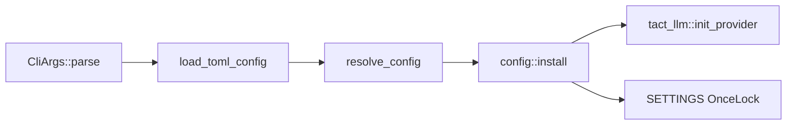

# Configuration
> Language: [English](./21_chapter_config.md) · [中文](./21_chapter_config_zh.md)

This chapter describes how Tact loads, merges, and installs runtime settings before any agent work begins. Configuration is the **bootstrap layer** that wires LLM credentials, agent limits, UI theme, tool keys, and permission mode into a process-global `ResolvedConfig`.

Implementation: `crates/tact/src/config/` (`mod.rs`, `cli.rs`, `load.rs`, `resolve.rs`, `types.rs`).

---

## 1. What Configuration Owns

| Concern | Resolved field | Primary consumers |
|---------|----------------|-------------------|
| LLM credentials | `ResolvedConfig::llm` → `tact_llm::init_provider` | [Ch 22 LLM](./22_chapter_llm.md), `Agent::stream_message` |
| Agent limits | `agent.*` | [Ch 5 Compact](./05_chapter_compact.md), [Ch 4 Prompt](./04_chapter_prompt.md), [Ch 17 Notify](./17_chapter_notify.md) |
| Permission mode string | `permission_mode: Option<String>` | Headless only — see [§6 Gaps](#6-current-gaps) |
| UI theme | `ui.theme` | [Ch 23 TUI](./23_chapter_tui.md) |
| Tool keys | `tools.brave_search_api_key` | `web_search` tool |
| Debug | `tokio_console` | `tact-ui` `main()` |

Every binary entry point should call `tact::config::init()` (or `init_config()`) **once** at startup.

---

## 2. Startup Flow



```rust
pub fn init() -> anyhow::Result<CliArgs> {
    init_config()
}

pub fn init_config() -> anyhow::Result<CliArgs> {
    let args = CliArgs::parse();
    let toml_cfg = load::load_toml_config(args.config.as_ref())?;

    if args.list_sessions {
        install_without_llm(resolve::resolve_non_llm_settings(&args, &toml_cfg));
        return Ok(args);
    }

    let resolved = resolve::resolve_config(&args, &toml_cfg)?;
    install(resolved);
    Ok(args)
}
```

`install()` does two things:

1. **`tact_llm::init_provider(config.llm.provider_info())`** — stores `ProviderInfo` for `get_llm_client()` ([Ch 22](./22_chapter_llm.md)).
2. **`SETTINGS.set(config)`** — makes `config::settings()` available for the rest of the process.

`install_without_llm()` skips provider init for commands like `--list-sessions` that never call the model.

---

## 3. Config Sources and Priority

### TOML search order

When `--config` is **not** passed, `load_toml_config` scans in order and uses the **first file that exists**:

| Order | Path |
|-------|------|
| 1 | `./.tact/config.toml` |
| 2 | `./tact.toml` |
| 3 | `~/.tact/config.toml` |

If none exist, an empty `TactTomlConfig::default()` is used.

Explicit `--config /path/to/file.toml` bypasses the search list.

### Merge rule: CLI > TOML entry > TOML global > defaults

`llm.provider` (or `--provider`) selects the active `ProviderKind` and looks up
`llm.providers.<name>`. For that entry:

| Field | Priority |
|-------|----------|
| `api_key` / `model` | CLI → entry (required) |
| `base_url` | CLI → entry → `ProviderKind::default_base_url()` |
| `max_tokens` / `thinking_budget` | CLI → entry → `[llm]` global → code defaults |

Required: **`llm.provider`**, plus **`api_key`** and **`model`** on the active
entry. `anthropic` has no default `base_url` and must set one explicitly.
Unknown map keys or missing active entries error at resolve time.

---

## 4. TOML Schema

Top-level sections in `TactTomlConfig`:

```toml
[llm]
provider = "kimi"          # active ProviderKind: anthropic | openai | deepseek | kimi
max_tokens = 32000         # optional global default
thinking_budget = 32000

[llm.providers.kimi]
api_key = "sk-..."
model = "kimi-k2.5"
models = ["kimi-k2.5", "kimi-for-coding"]   # optional; used by TUI /model picker
# base_url defaults to https://api.moonshot.cn/v1
# max_tokens = 64000       # optional per-provider override

[llm.providers.anthropic]
api_key = "sk-ant-..."
model = "claude-sonnet-4-20250514"
base_url = "https://api.anthropic.com"   # required for anthropic

[permission]
mode = "default"           # default | plan | auto

[agent]
model_context_window = 200000
notifications_enabled = true
snapshot_max_items = 80
micro_compact_enabled = true

[ui]
theme = "retro"
# Attached images (`@file.png`, ``); compress only reduces tokens —
# the model/endpoint must still support vision (see Ch 22 / Ch 23).
# vision_image.compress = true
# vision_image.max_edge = 1280
# vision_image.jpeg_quality = 80

[tools]
brave_search_api_key = "bsk-..."
```

Optional `models` is the candidate list for the TUI `/model` slash command (same
provider only). Empty/absent → `/model` prints a hint instead of opening the
picker. Choosing a model applies immediately; you can optionally write it back
to this provider’s `model` field in the loaded config file.

Resolved runtime still exposes a flat `LlmSettings { provider: ProviderKind, … }`
for the hot path. See `types.rs` for serde structs and unit tests.

---

## 5. Resolved Defaults

After merge, `resolve_config` applies these defaults when neither CLI nor TOML set a value:

| Setting | Default | Kimi K2.x override |
|---------|---------|-------------------|
| `max_tokens` | 8_000 | 32_000 |
| `thinking_budget` | 32_000 | — |
| `model_context_window` | 200_000 | — (tokens; global, not per-model) |
| `notifications_enabled` | `true` | — |
| `snapshot_max_items` | 80 | — |
| `micro_compact_enabled` | `true` | — |
| `ui.theme` | `"retro"` | — |
| `ui.vision_image.compress` | `true` | — (token size only; does not enable vision) |
| `ui.vision_image.max_edge` | `1280` (clamped 256–4096) | — |
| `ui.vision_image.jpeg_quality` | `80` (clamped 1–100) | — |

Kimi K2.x detection uses `provider_info.is_kimi_k2x()` at resolve time ([Ch 22](./22_chapter_llm.md)).

After merging CLI and TOML values, configuration fails fast when a nonzero
`model_context_window` is less than or equal to `max_tokens`: the output
reservation must leave room for input. A zero window keeps the existing
"disabled/unknown window" behavior and skips this validation. `thinking_budget`
is not added separately because providers map it differently (a thinking
configuration or reasoning-effort band), rather than exposing one portable
extra-output reservation.

CLI-only overrides:

- `--no-notifications` forces notifications off.
- `--no-micro-compact` forces micro-compaction off.
- `--tokio-console` enables the tokio-console subscriber in `tact-ui`.

---

## 6. CLI Surface

`CliArgs` (clap) mirrors most TOML fields:

| Flag | Maps to |
|------|---------|
| `--provider` | selects active `llm.providers.*` entry (`ProviderKind`) |
| `--model`, `--api-key`, `--base-url` | override that entry’s fields |
| `--max-tokens`, `--thinking-budget` | CLI → entry → `[llm]` global → defaults |
| `-m` / `--permission-mode` | `[permission].mode` |
| `--model-context-window`, `--snapshot-max-items` | `[agent]` |
| `--notifications` / `--no-notifications` | `[agent].notifications_enabled` |
| `--theme` | `[ui].theme` |
| `--brave-search-api-key` | `[tools]` |
| `--session`, `--resume-last`, `--list-sessions` | session store (not in TOML). `--resume-last` and `--list-sessions` pass `list_sessions(Some(root_dir))` so only sessions for the current workdir appear. |
| `--config` | explicit TOML path |

Subcommand:

```bash
tact-ui headless "Summarize this repo"
```

Both entry points read `permission_mode` via `permission_mode_from_config()` in `crates/tact-ui/src/permission.rs`.

---

## 7. Accessing Settings at Runtime

```rust
use tact::config;

config::init()?;                          // once in main
let max = config::settings().agent.max_tokens;
let theme = config::settings().ui.theme.clone();
```

`settings()` panics if `init()` was not called — intentional fail-fast for miswired binaries.

Agent loop reads `model_context_window`, `max_tokens`, and `thinking_budget` from `settings()` when building each LLM request ([Ch 18](./18_chapter_agent_loop.md)).

**Breaking rename:** `agent.context_limit_chars` / `--context-limit-chars` → `agent.model_context_window` / `--model-context-window` (tokens, default 200_000). There is **no silent alias** for the old TOML key — update existing configs.

---

## 8. Code Map

| File | Role |
|------|------|
| `config/mod.rs` | `init`, `install`, `settings`, public re-exports |
| `config/cli.rs` | `CliArgs`, `CliCommand::Headless` |
| `config/load.rs` | TOML discovery and parse |
| `config/resolve.rs` | CLI + TOML merge, Kimi-aware defaults |
| `config/types.rs` | `TactTomlConfig`, `ResolvedConfig`, section structs |
| `crates/tact-ui/src/main.rs` | Calls `config::init()` in `main()` |
| `crates/tact-ui/src/permission.rs` | Reads resolved `permission_mode` for both entry points |

---

## 9. Current Gaps

| Gap | Detail |
|-----|--------|
| **No env-var layer** | Only CLI and TOML; no `TACT_*` or provider env fallbacks in `resolve.rs` |
| **`anthropic` requires explicit `base_url`** | Unlike OpenAI-compatible providers, no default Anthropic URL in `default_base_url()` |
| **Secrets in plain TOML** | `api_key` stored as text; no keychain integration |
| **`list-sessions` stub LLM block** | `resolve_non_llm_settings` fills empty LLM fields — callers must not invoke `get_llm_client()` |

---

## Related Docs

- [LLM Providers](./22_chapter_llm.md) — what `install()` initializes
- [Agent Main Loop](./18_chapter_agent_loop.md) — runtime consumer of agent settings
- [Permission Model](./10_chapter_permission.md) — mode string vs TUI wiring
- [TUI](./23_chapter_tui.md) — theme and channel bootstrap
