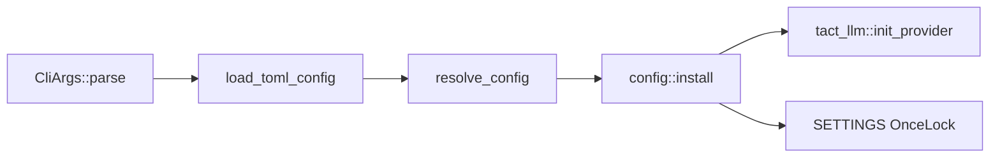

# 配置（Configuration）

> 语言：[中文](./21_chapter_config_zh.md) · [English](./21_chapter_config.md)

本章说明 Tact 在 agent 工作开始前如何加载、合并并安装运行时设置。配置是**引导层**，负责把 LLM 凭证、agent 限制、UI 主题、工具密钥和权限模式接入进程全局的 `ResolvedConfig`。

实现：`crates/tact/src/config/`（`mod.rs`、`cli.rs`、`load.rs`、`resolve.rs`、`types.rs`）。

---

## 1. 配置负责什么

| 关注点 | Resolved 字段 | 主要消费者 |
|--------|---------------|------------|
| LLM 凭证 | `ResolvedConfig::llm` → `tact_llm::init_provider` | [Ch 22 LLM](./22_chapter_llm_zh.md)、`Agent::stream_message` |
| Agent 限制 | `agent.*` | [Ch 5 压缩](./05_chapter_compact_zh.md)、[Ch 4 Prompt](./04_chapter_prompt.md)、[Ch 17 通知](./17_chapter_notify.md) |
| 权限模式字符串 | `permission_mode: Option<String>` | 仅 headless — 见 [§6 缺口](#6-当前缺口) |
| UI 主题 | `ui.theme` | [Ch 23 TUI](./23_chapter_tui_zh.md) |
| 工具密钥 | `tools.brave_search_api_key` | `web_search` 工具 |
| 调试 | `tokio_console` | `tact-ui` 的 `main()` |

每个二进制入口在启动时应**调用一次** `tact::config::init()`（或 `init_config()`）。

---

## 2. 启动流程



```rust
pub fn init() -> anyhow::Result<CliArgs> {
    init_config()
}

pub fn init_config() -> anyhow::Result<CliArgs> {
    let args = CliArgs::parse();
    let toml_cfg = load::load_toml_config(args.config.as_ref())?;

    if args.list_sessions {
        install_without_llm(resolve::resolve_non_llm_settings(&args, &toml_cfg));
        return Ok(args);
    }

    let resolved = resolve::resolve_config(&args, &toml_cfg)?;
    install(resolved);
    Ok(args)
}
```

`install()` 做两件事：

1. **`tact_llm::init_provider(config.llm.provider_info())`** — 存储 `ProviderInfo` 供 `get_llm_client()` 使用（[Ch 22](./22_chapter_llm_zh.md)）。
2. **`SETTINGS.set(config)`** — 使进程其余部分可通过 `config::settings()` 访问配置。

`install_without_llm()` 跳过 provider 初始化，用于 `--list-sessions` 等从不调用模型的命令。

---

## 3. 配置来源与优先级

### TOML 搜索顺序

未传 `--config` 时，`load_toml_config` 按顺序扫描，使用**第一个存在的文件**：

| 顺序 | 路径 |
|------|------|
| 1 | `./.tact/config.toml` |
| 2 | `./tact.toml` |
| 3 | `~/.tact/config.toml` |

若均不存在，使用空的 `TactTomlConfig::default()`。

显式 `--config /path/to/file.toml` 会跳过上述搜索列表。

### 合并规则：CLI > TOML 条目 > TOML 全局 > 默认值

`llm.provider`（或 `--provider`）选择活跃的 `ProviderKind`，并查找 `llm.providers.<name>`。对该条目：

| 字段 | 优先级 |
|------|--------|
| `api_key` / `model` | CLI → 条目（必填） |
| `base_url` | CLI → 条目 → `ProviderKind::default_base_url()` |
| `max_tokens` / `thinking_budget` | CLI → 条目 → `[llm]` 全局 → 代码默认值 |

必填：**`llm.provider`**，以及活跃条目上的 **`api_key`** 和 **`model`**。`anthropic` 没有默认 `base_url`，必须显式设置。未知 map 键或缺失活跃条目会在 resolve 时报错。

---

## 4. TOML 模式

`TactTomlConfig` 顶层节：

```toml
[llm]
provider = "kimi"          # 活跃 ProviderKind：anthropic | openai | deepseek | kimi
max_tokens = 32000         # 可选全局默认
thinking_budget = 32000

[llm.providers.kimi]
api_key = "sk-..."
model = "kimi-k2.5"
models = ["kimi-k2.5", "kimi-for-coding"]   # 可选；TUI /model 选择器使用
# base_url 默认为 https://api.moonshot.cn/v1
# max_tokens = 64000       # 可选 per-provider 覆盖

[llm.providers.anthropic]
api_key = "sk-ant-..."
model = "claude-sonnet-4-20250514"
base_url = "https://api.anthropic.com"   # anthropic 必填

[permission]
mode = "default"           # default | plan | auto

[agent]
model_context_window = 200000
notifications_enabled = true
snapshot_max_items = 80
micro_compact_enabled = true

[ui]
theme = "retro"
# 附加图片（`@file.png`、``）；compress 仅减少 token —
# 模型/端点仍须支持 vision（见 Ch 22 / Ch 23）。
# vision_image.compress = true
# vision_image.max_edge = 1280
# vision_image.jpeg_quality = 80

[tools]
brave_search_api_key = "bsk-..."
```

可选 `models` 是 TUI `/model` slash 命令的候选列表（仅限同一 provider）。为空/缺失 → `/model` 打印提示而非打开选择器。选择模型立即生效；可选写回已加载配置文件中该 provider 的 `model` 字段。

Resolved 运行时仍暴露扁平的 `LlmSettings { provider: ProviderKind, … }` 供热路径使用。serde 结构与单元测试见 `types.rs`。

---

## 5. Resolved 默认值

合并后，若 CLI 与 TOML 均未设置，`resolve_config` 应用以下默认值：

| 设置 | 默认 | Kimi K2.x 覆盖 |
|------|------|----------------|
| `max_tokens` | 8_000 | 32_000 |
| `thinking_budget` | 32_000 | — |
| `model_context_window` | 200_000 | —（tokens；全局，非 per-model） |
| `notifications_enabled` | `true` | — |
| `snapshot_max_items` | 80 | — |
| `micro_compact_enabled` | `true` | — |
| `ui.theme` | `"retro"` | — |
| `ui.vision_image.compress` | `true` | —（仅 token 体积；不启用 vision） |
| `ui.vision_image.max_edge` | `1280`（钳制 256–4096） | — |
| `ui.vision_image.jpeg_quality` | `80`（钳制 1–100） | — |

Kimi K2.x 检测在 resolve 时通过 `provider_info.is_kimi_k2x()`（[Ch 22](./22_chapter_llm_zh.md)）。

仅 CLI 覆盖：

- `--no-notifications` 强制关闭通知。
- `--no-micro-compact` 强制关闭 micro-compaction。
- `--tokio-console` 在 `tact-ui` 中启用 tokio-console subscriber。

---

## 6. CLI 表面

`CliArgs`（clap）映射大部分 TOML 字段：

| 标志 | 映射到 |
|------|--------|
| `--provider` | 选择活跃 `llm.providers.*` 条目（`ProviderKind`） |
| `--model`、`--api-key`、`--base-url` | 覆盖该条目字段 |
| `--max-tokens`、`--thinking-budget` | CLI → 条目 → `[llm]` 全局 → 默认值 |
| `-m` / `--permission-mode` | `[permission].mode` |
| `--model-context-window`、`--snapshot-max-items` | `[agent]` |
| `--notifications` / `--no-notifications` | `[agent].notifications_enabled` |
| `--theme` | `[ui].theme` |
| `--brave-search-api-key` | `[tools]` |
| `--session`、`--resume-last`、`--list-sessions` | session store（不在 TOML 中）。`--resume-last` 与 `--list-sessions` 传 `list_sessions(Some(root_dir))`，仅显示当前工作目录的 session。 |
| `--config` | 显式 TOML 路径 |

子命令：

```bash
tact-ui headless "Summarize this repo"
```

两个入口点均通过 `crates/tact-ui/src/permission.rs` 中的 `permission_mode_from_config()` 读取 `permission_mode`。

---

## 7. 运行时访问设置

```rust
use tact::config;

config::init()?;                          // main 中调用一次
let max = config::settings().agent.max_tokens;
let theme = config::settings().ui.theme.clone();
```

若未调用 `init()`，`settings()` 会 panic — 对错误接线的二进制有意 fail-fast。

Agent 循环在构建每次 LLM 请求时从 `settings()` 读取 `model_context_window`、`max_tokens` 和 `thinking_budget`（[Ch 18](./18_chapter_agent_loop.md)）。

**破坏性重命名：** `agent.context_limit_chars` / `--context-limit-chars` → `agent.model_context_window` / `--model-context-window`（tokens，默认 200_000）。旧 TOML 键**无静默别名** — 请更新现有配置。

---

## 8. 代码地图

| 文件 | 角色 |
|------|------|
| `config/mod.rs` | `init`、`install`、`settings`、公开 re-export |
| `config/cli.rs` | `CliArgs`、`CliCommand::Headless` |
| `config/load.rs` | TOML 发现与解析 |
| `config/resolve.rs` | CLI + TOML 合并、Kimi 感知默认值 |
| `config/types.rs` | `TactTomlConfig`、`ResolvedConfig`、各节结构体 |
| `crates/tact-ui/src/main.rs` | 在 `main()` 中调用 `config::init()` |
| `crates/tact-ui/src/permission.rs` | 两个入口点读取 resolved `permission_mode` |

---

## 9. 当前缺口

| 缺口 | 详情 |
|------|------|
| **无环境变量层** | 仅 CLI 与 TOML；`resolve.rs` 中无 `TACT_*` 或 provider 环境回退 |
| **`anthropic` 需显式 `base_url`** | 与 OpenAI 兼容 provider 不同，`default_base_url()` 无默认 Anthropic URL |
| **明文 TOML 存密钥** | `api_key` 以文本存储；无 keychain 集成 |
| **`list-sessions` 桩 LLM 块** | `resolve_non_llm_settings` 填充空 LLM 字段 — 调用方不得 invoke `get_llm_client()` |

---

## 相关文档

- [LLM Providers](./22_chapter_llm_zh.md) — `install()` 初始化内容
- [Agent Main Loop](./18_chapter_agent_loop.md) — agent 设置的运行时消费者
- [Permission Model](./10_chapter_permission.md) — 模式字符串 vs TUI 接线
- [TUI](./23_chapter_tui_zh.md) — 主题与 channel 引导
