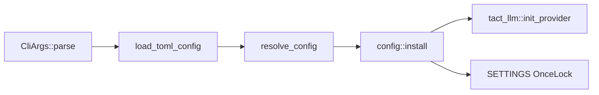

# 配置（Configuration）

> 语言：[中文](./21_chapter_config_zh.md) · [English](./21_chapter_config.md)

本章说明 Tact 在 agent 工作开始前如何加载、合并并安装运行时设置。配置是**引导层**，负责把 LLM 凭证、agent 限制、UI 主题、工具密钥和权限模式接入进程全局的 `ResolvedConfig`。

实现：`crates/tact/src/config/`（`mod.rs`、`cli.rs`、`load.rs`、`resolve.rs`、`types.rs`）。

---

## 1. 配置负责什么

| 关注点 | Resolved 字段 | 主要消费者 |
|--------|---------------|------------|
| LLM 凭证 | `ResolvedConfig::llm` → `tact_llm::init_provider` | [Ch 22 LLM](./22_chapter_llm_zh.md)、`Agent::stream_message` |
| Agent 限制 | `agent.*` | [Ch 5 压缩](./05_chapter_compact_zh.md)、[Ch 4 Prompt](./04_chapter_prompt.md)、[Ch 17 通知](./17_chapter_notify.md) |
| 权限模式字符串 | `permission_mode: Option<String>` | 仅 headless — 见 [§6 缺口](#6-当前缺口) |
| UI 主题 | `ui.theme` | [Ch 23 TUI](./23_chapter_tui_zh.md) |
| 调试 | `tokio_console` | `tact-ui` 的 `main()` |

每个二进制入口在启动时应**调用一次** `tact::config::init()`（或 `init_config()`）。

---

## 2. 启动流程


```mermaid
flowchart LR
    CLI[CliArgs::parse] --> Load[load_toml_config]
    Load --> Merge[resolve_config]
    Merge --> Install[config::install]
    Install --> LLM[tact_llm::init_provider]
    Install --> Global[SETTINGS OnceLock]
```

```rust
pub fn init() -> anyhow::Result<CliArgs> {
    init_config()
}

pub fn init_config() -> anyhow::Result<CliArgs> {
    let args = CliArgs::parse();
    let toml_cfg = load::load_toml_config(args.config.as_ref())?;

    if args.list_sessions {
        install_without_llm(resolve::resolve_non_llm_settings(&args, &toml_cfg));
        return Ok(args);
    }

    let resolved = resolve::resolve_config(&args, &toml_cfg)?;
    install(resolved);
    Ok(args)
}
```

`install()` 做两件事：

1. **`tact_llm::init_provider(config.llm.provider_info())`** — 存储 `ProviderInfo` 供 `get_llm_client()` 使用（[Ch 22](./22_chapter_llm_zh.md)）。
2. **`SETTINGS.set(config)`** — 使进程其余部分可通过 `config::settings()` 访问配置。

`install_without_llm()` 跳过 provider 初始化，用于 `--list-sessions`、`tact upgrade`、插件 CLI 等从不调用模型的命令。

---

## 3. 配置来源与优先级

### TOML 搜索顺序

未传 `--config` 时，`load_toml_config` 按顺序扫描，使用**第一个存在的文件**：

| 顺序 | 路径 |
|------|------|
| 1 | `./.tact/config.toml` |
| 2 | `./config.toml` |
| 3 | `~/.tact/config.toml` |

若均不存在，tact-ui 首次运行会在 `~/.tact/config.toml` 自动写入一份
`config.example.toml` 的副本（编译期嵌入模板，与仓库内的 example 保持同步），
并提示用户编辑填入 API key。只有用户全局位置会被自动创建——不会污染项目目录。
若模板写入失败（HOME 未知或不可写），则使用空的 `TactTomlConfig::default()`，
由常规的 "not configured" resolve 错误引导用户。

显式 `--config /path/to/file.toml` 会跳过上述搜索列表；显式路径不存在时报错
（不会自动创建）。

### 合并规则：CLI > TOML 条目 > TOML 全局 > 默认值

`llm.provider`（或 `--provider`）选择活跃的 `ProviderKind`，并查找 `llm.providers.<name>`。对该条目：

| 字段 | 优先级 |
|------|--------|
| `api_key` / `model` | CLI → 条目（必填） |
| `base_url` | CLI → 条目 → `ProviderKind::default_base_url()` |
| `max_tokens` / `thinking_budget` | CLI → 条目 → `[llm]` 全局 → 代码默认值 |
| `protocol` | 条目 → 默认 `chat_completions` |
| `reasoning_effort` | entry（openai / deepseek / kimi / 自定义）→ provider 默认（模型相关） |

必填：**`llm.provider`**，以及活跃条目上的 **`api_key`** 和 **`model`**。`anthropic` 没有默认 `base_url`，必须显式设置。缺失活跃条目会在 resolve 时报错。

不在内建列表（`anthropic | openai | deepseek | kimi`）中的任意 provider 名称会被接受为**自定义 OpenAI 兼容 provider**：复用 OpenAI 协议（默认 `chat_completions`，可选 `responses`），没有默认 `base_url`（必须在其条目上显式设置），并支持 `reasoning_effort`。示例：

```toml
[llm]
provider = "moonshot"   # 任意名称均可

[llm.providers.moonshot]
api_key = "sk-..."
base_url = "https://api.moonshot.cn/v1"   # 自定义 provider 必填
model = "kimi-k2.5"
```

**OpenCode Go 端点**（`https://opencode.ai/zen/go/v1` 及 `opencode.ai` 子域）：Tact 自动为每个请求附加 `x-opencode-session` 头，并发送 `tact/<version>` 作为 `User-Agent` 让端点识别工具。头值即 **Tact session id** —— OpenCode 以它作为区分各会话缓存的键：同一会话（含 resume）复用同一值，不同会话得到不同值。无会话的请求（如 `/v1/models` 选择器拉取）不发送该头（仍发送标识用的 User-Agent）。

---

## 4. TOML 模式

`TactTomlConfig` 顶层节：

```toml
[llm]
provider = "kimi"          # 活跃 ProviderKind：anthropic | openai | deepseek | kimi | 任意自定义名称
max_tokens = 32000         # 可选全局默认
thinking_budget = 32000

# 可选：按模型的思考参数选项（模型 id → 可选档位）。
# /model 第二步只显示该模型映射的档位；无映射的模型回落 provider 默认档位。
# [llm.model_profiles."gpt-5.6"]
# reasoning_efforts = ["low", "medium", "high"]
# [llm.model_profiles."claude-sonnet-4-20250514"]
# thinking_budgets = [0, 8000, 32000]

[llm.providers.kimi]
api_key = "sk-..."
model = "kimi-k2.5"
models = ["kimi-k2.5", "kimi-for-coding"]   # 可选；TUI /model 选择器使用
# base_url 默认为 https://api.moonshot.cn/v1
# max_tokens = 64000       # 可选 per-provider 覆盖

[llm.providers.openai]
api_key = "sk-..."
model = "gpt-4o"
protocol = "responses"    # chat_completions（默认）| responses
reasoning_effort = "high" # none | minimal | low | medium | high | xhigh | max

[llm.providers.anthropic]
api_key = "sk-ant-..."
model = "claude-sonnet-4-20250514"
base_url = "https://api.anthropic.com"   # anthropic 必填

[permission]
mode = "default"           # default | plan | auto

[agent]
model_context_window = 200000
notifications_enabled = true
snapshot_max_items = 80
micro_compact_enabled = true
# 额外 skill 根目录（可选）。每个目录下应包含 */SKILL.md。
# 相对路径按 workdir 解析；~ 展开为 $HOME。
# 在内建根之后加载；同名冲突时靠后的条目胜出。
# skill_dirs = ["~/shared-skills", "./vendor/skills"]
# 注入系统提示的项目指令文件（默认 ["agents_md"]）。
# instruction_sources = ["agents_md"]
# 每轮都把 skill 全文注入系统提示（默认 false）。
# skill_body_auto_inject = false

[ui]
theme = "ink"
# 附加图片（`@file.png`、``）；compress 仅减少 token —
# 模型/端点仍须支持 vision（见 Ch 22 / Ch 23）。
# vision_image.compress = true
# vision_image.max_edge = 1280
# vision_image.jpeg_quality = 80

[voice]
# 独立于 [llm.providers.*]；默认关闭。
# enabled = false
# provider = "openai"
# api_key = ""
# base_url = "https://api.openai.com/v1"
# model = "gpt-4o-mini-transcribe"
# language = "zh"
# max_duration_secs = 300
# 可选键盘切换："ctrl+<char>"（如 "ctrl+g"）；未设置时仅鼠标。
# voice_keybind = "ctrl+g"

[tools]
# Bash 墙钟超时秒数（默认 1800；0 表示禁用）
bash_timeout_secs = 1800
```

可选 `models` 是 TUI `/model` slash 命令的**主要**候选列表（仅限同一 provider）。在会话中首次使用 `/model` 时，兼容 OpenAI 的 provider（`openai` / `deepseek` / `kimi`）也会调用 `GET {base_url}/models`，并将不在 config 列表中的 id 附加到末尾（config 的顺序和重复 id 优先）。API 结果按 `(base_url, api_key)` 在进程内缓存。如果 config 和 API 均未提供任何候选，`/model` 打印提示而非打开选择器。选择模型立即生效；可选写回已加载配置文件中该 provider 的 `model` 字段。

可选 `protocol` 默认为 `chat_completions`。`responses` 对 `openai` 与 `deepseek` provider 有效；配置 resolve 会拒绝 Anthropic 或 Kimi 使用该值。DeepSeek 配 `responses` 时复用与 OpenAI 相同的 Responses 适配器，指向其配置的 `base_url`（含自动 `context_management` 压缩与 reasoning effort；显式 `/responses/compact` 取决于端点支持——DeepSeek 目前未实现，显式压缩会回落本地摘要流水线）。此字段没有 CLI override。

可选 `reasoning_effort` 对 `openai`、`deepseek` 与 `kimi` provider 有效，接受
`none`、`minimal`、`low`、`medium`、`high`、`xhigh` 或 `max`；具体可用值取决于
模型。显式值按请求原样发送；省略时使用 provider 默认（如 OpenAI medium、
DeepSeek 思考开启 + effort high、Kimi K3 high）。此字段没有 CLI override。
Anthropic 拒绝该字段（native thinking budget，无 effort 字段）。

可选 `[llm.model_profiles."<model>"]` 条目列出该模型在 `/model` 第二步的
可选档位：`reasoning_efforts` 对应 effort 语义模型（openai / deepseek /
kimi k3、k3-256k），`thinking_budgets` 对应 budget 语义模型（anthropic /
kimi coding 系）。两个字段均为可选数组；某模型无条目时回落 provider 默认
档位。TOML 条目按模型/按字段覆盖内置默认（见 `tact::config::builtin_model_profiles`）。
跨维度条目（如 effort 语义模型写 `thinking_budgets`）会被忽略，不报错。

Resolved 运行时仍暴露扁平的 `LlmSettings { provider: ProviderKind, protocol: OpenAiProtocol, reasoning_effort: Option<OpenAiReasoningEffort>, model_profiles, … }` 供热路径使用。serde 结构与单元测试见 `types.rs`。

---

## 5. Resolved 默认值

合并后，若 CLI 与 TOML 均未设置，`resolve_config` 应用以下默认值：

| 设置 | 默认 | Kimi K2.x 覆盖 |
|------|------|----------------|
| `max_tokens` | 8_000 | 32_000 |
| `thinking_budget` | 32_000 | — |
| `model_context_window` | 200_000 | —（tokens；全局；模型→窗口映射会覆盖文件配置，见下文） |
| `notifications_enabled` | `true` | — |
| `snapshot_max_items` | 80 | — |
| `micro_compact_enabled` | `true` | — |
| `instruction_sources` | `["agents_md"]` | — |
| `skill_dirs` | 空（无额外根） | — |
| `skill_body_auto_inject` | `false` | — |
| `tools.bash_timeout_secs` | `1_800`（`0` 禁用） | — |
| `ui.theme` | `"ink"` | — |
| `ui.vision_image.compress` | `true` | —（仅 token 体积；不启用 vision） |
| `ui.vision_image.max_edge` | `1280`（钳制 256–4096） | — |
| `ui.vision_image.jpeg_quality` | `80`（钳制 1–100） | — |
| `voice.enabled` | `false` | — |
| `voice.provider` | `openai` | `openai` / `google` / `whisper_cpp` |
| `voice.base_url` | `https://api.openai.com/v1`（openai）/ `https://speech.googleapis.com/v1`（google）/ `http://127.0.0.1:8080`（whisper_cpp） | — |
| `voice.model` | `gpt-4o-mini-transcribe`（openai）/ `latest_short`（google）/ 空（whisper_cpp） | — |
| `voice.language` | `zh` | Google 示例：`zh-CN`、`en-US` |
| `voice.max_duration_secs` | `300`（openai/whisper_cpp，有效 `1..=600`）/ `60`（google，有效 `1..=60`） | — |
| `voice.voice_keybind` | 未设置（仅鼠标） | `ctrl+<char>`（如 `ctrl+g`） |

### `[agent]` — skill 根目录、指令文件、全文注入

三个 `[agent]` 字段决定除内建根与默认值之外还有什么进入提示。

`skill_dirs` 追加额外 skill 根目录。每个条目必须是一个包含 `*/SKILL.md` 的目录；相对路径按 **workdir** 解析，`~` 展开为 `$HOME`，空白条目被跳过。这些根按列出顺序追加在三个内建根（`~/.agents/skills`、`~/.tact/skills`、`<workdir>/.tact/skills`）之后，因此同名冲突时配置根胜过所有内建根；解析后与已有路径重复的条目会被丢弃。扫描方式与内建根完全一致，均为递归。`/skill-reload` 可重新读取，无需重启。见 [Ch 2](./02_chapter_skill_zh.md)。

`instruction_sources` 选择注入系统提示的项目指令文件。`agents_md` 是唯一可接受的值（默认 `["agents_md"]`）；空列表，或 `claude_md` 等任何其他值，都会导致配置 resolve 失败。见 [Ch 4](./04_chapter_prompt_zh.md)。

`skill_body_auto_inject` 在「描述」与「全文」之间二选一。`false`（默认）时每轮只带 `describe_available()` 产出的 skill 名称与描述，全文按需经 `load_skill` 工具取得。`true` 时每个 skill 全文都会注入每一轮系统提示——精确，但每次调用都要付出代价，除非某个 skill 必须无条件在上下文中，否则建议保持默认。CLI 等价开关为 `--skill-body-auto-inject`。

### `[voice]` — 语音转文字输入（macOS 优先）

API 密钥与端点独立于 `[llm.providers.*]`。`provider = "openai"`（默认）将音频发往
`{base_url}/audio/transcriptions`，需要 `api_key`。`provider = "google"` 将短 WAV 音频发往 Google
Cloud 的同步 `{base_url}/speech:recognize` 端点，并使用 `voice.api_key` 作为 query API key；默认模型为
`latest_short`，语言示例为 `zh-CN`、`en-US`，且 `max_duration_secs` 必须为 `1..=60`。请在 Google
Cloud 项目中启用 Speech-to-Text API。Google API key 模式不支持 Service Account、OAuth、长任务识别、
流式识别或自动分段。`provider = "whisper_cpp"` 将音频发往 `{base_url}/inference`，无需认证与
`model` 字段，适用于本地 [whisper.cpp](https://github.com/ggerganov/whisper.cpp) 服务器。转写结果插入输入框供审阅（不会自动提交）。
`enabled = false` 隐藏标题栏居中按钮。`enabled = true` 但未配置 `api_key`（仅 openai）时仍显示按钮，
点击会提示 `[voice].api_key`。可选 `voice_keybind = "ctrl+<char>"` 可在任意输入模式下切换录制；
仅精确匹配时消费按键（其它键仍进入 Insert/Normal）。未设置则仅鼠标控制。配置的快捷键会显示在
帮助面板（`Ctrl+?`）。空字符串、多字符键、非 `ctrl` 修饰符会在配置解析阶段失败。凭证不会写入
日志或会话历史。

Kimi K2.x 检测在 resolve 时通过 `provider_info.is_kimi_k2x()`（[Ch 22](./22_chapter_llm_zh.md)）。

`model_context_window` 按三级优先级解析（从高到低）：

1. **模型→窗口映射** — 以解析后的模型 id 为键的内置查找表，数值依据官方模型文档（2026-08）：
   - OpenAI：`gpt-5.6` / `gpt-5.6-luna` / `gpt-5.6-terra` / `gpt-5.6-sol` /
     `gpt-5.5` → `1_050_000`；`gpt-5.4` → `1_000_000`；`gpt-5` / `gpt-5.1` /
     `gpt-5.2` / `gpt-5.3` / `gpt-5.3-codex` / `gpt-5.4-mini` → `400_000`；
     `gpt-4o` / `gpt-4o-mini` → `128_000`。
   - Anthropic（API 与 Claude Code 同 ID）：`claude-sonnet-5` / `claude-fable-5` /
     `claude-opus-5` / `claude-opus-4-8` / `claude-opus-4-7` / `claude-opus-4-6` /
     `claude-sonnet-4-6` → `1_000_000`；`claude-opus-4-20250514` /
     `claude-sonnet-4-20250514` / `claude-haiku-4-5` / `claude-haiku-4-20250514`
     → `200_000`。
   - DeepSeek：任意 `deepseek-v4-*` id（前缀匹配，因此实验 / 视觉后缀如
     `deepseek-v4-flash-version-exp`、`deepseek-v4-flash-vision-exp` 均被覆盖）、
     无版本号的网关别名 `deepseek-flash`，以及 `deepseek-reasoner` →
     `1_000_000`；Kimi：`k3-256k` → `256_000`。
   命中时同时覆盖 CLI 标志与 TOML 文件，因此过时的
   手工窗口不会低估已知模型（否则会触发过早自动压缩）。
2. **CLI `--model-context-window` / TOML `[agent].model_context_window`**。
3. **默认 `200_000`**。

合并 CLI 与 TOML 值后，若非零 `model_context_window` 小于或等于
`max_tokens`，配置会立即报错：输出预留必须给输入留下空间。窗口为零时保留现有的
“禁用/未知窗口”语义，并跳过该校验。`thinking_budget` 不单独累加，因为各 provider
会将其映射为 thinking 配置或 reasoning-effort 档位，而不是统一、可移植的额外输出预留。

仅 CLI 覆盖：

- `--no-notifications` 强制关闭通知。
- `--no-micro-compact` 强制关闭 micro-compaction。
- `--tokio-console` 在 `tact-ui` 中启用 tokio-console subscriber。

---

## 6. CLI 表面

`CliArgs`（clap）映射大部分 TOML 字段：

| 标志 | 映射到 |
|------|--------|
| `--provider` | 选择活跃 `llm.providers.*` 条目（`ProviderKind`） |
| `--model`、`--api-key`、`--base-url` | 覆盖该条目字段 |
| `--max-tokens`、`--thinking-budget` | CLI → 条目 → `[llm]` 全局 → 默认值 |
| `-m` / `--permission-mode` | `[permission].mode` |
| `--model-context-window`、`--snapshot-max-items` | `[agent]` |
| `--notifications` / `--no-notifications` | `[agent].notifications_enabled` |
| `--skill-body-auto-inject` | `[agent].skill_body_auto_inject`（仅开启，无 `--no-` 形式） |
| `--no-micro-compact` | `[agent].micro_compact_enabled`（仅关闭） |
| `--tokio-console` | 启用 tokio-console 调试 subscriber（无对应 TOML 字段） |
| `--theme` | `[ui].theme` |
| `--brave-search-api-key` | `[tools]` |
| `--session`、`--resume-last`、`--list-sessions` | session store（不在 TOML 中）。`--resume-last` 与 `--list-sessions` 传 `list_sessions(Some(root_dir))`，仅显示当前工作目录的 session。 |
| `--config` | 显式 TOML 路径 |

子命令：

```bash
tact-ui headless "Summarize this repo"
```

插件管理在 `tact plugin` / `/plugin` 下：`list` 打印每个已安装插件的功能摘要（`skills=N commands=M hooks mcp`），`install` / `uninstall` / `update` / `reload` 管理 `~/.tact/plugins` 下的修订锁定缓存。插件**状态**（`installed.json`、`marketplaces.json`）单独放在 `~/.tact/plugins/state/`；插件根下的旧副本仍会被读取并在首次使用时迁移，因此共享同一 home 的旧版二进制仍可用。Marketplace 命令（`tact plugin marketplace add|list|update|remove`）管理 Git/catalog 源，并会发现 `~/.agents/plugins/marketplace.json` 与 最近的仓库 `.agents/plugins/marketplace.json` 下的 Codex 本地 marketplace。始终注册两个内置 Git marketplace：`claude-plugins-official` 与 OpenAI Codex 目录 `openai-curated`（`github.com/openai/plugins`）。不带 `@marketplace` 的 `plugin install <name>` 优先匹配已发现的 Codex marketplace，找不到才回退到 `claude-plugins-official`。已安装插件内容贡献 skills（`plugin:<name>`）、`commands/*.md` 斜杠命令、MCP 服务器与生命周期 hook——见 Ch 2、8、9、12。MCP 服务器声明在 `~/.tact/mcp.json`（用户级）或 `<workdir>/.tact/mcp.json`（项目级）——每个作用域只有一个文件名；不读取 cwd 级 manifest 与 `.mcp.json`；已安装插件仍会提供 server。条目可以是本地（`command`，通过 stdio 启动）或远程（`url`，Streamable HTTP），可选静态 `headers` 或 `auth: { "type": "oauth", ... }`；OAuth token 按 server 存放在 `~/.tact/mcp/oauth/` 下，用 `/mcp auth <server>`（交互式）或 `tact-ui mcp login <server>`（CLI）授权。CLI 覆盖完整生命周期——`tact-ui mcp list`（每个 server 的传输方式与状态）、`get <name>`（单个 server 及其工具）、`add`/`remove`（`--user` 写入 home 文件，`--force` 覆盖）、`login`/`logout`（已存凭据）——见 Ch 8。

两个入口点均通过 `crates/tact-ui/src/permission.rs` 中的 `permission_mode_from_config()` 读取 `permission_mode`。

`tools.bash_timeout_secs` 在 v1 仅可由 TOML 设置。Resolve 保留 `0` 的“禁用”
语义，否则经 `ToolSettings` 将该值传到每个 `ToolContext`；没有对应 CLI flag。

---

## 7. 运行时访问设置

```rust
use tact::config;

config::init()?;                          // main 中调用一次
let max = config::settings().agent.max_tokens;
let theme = config::settings().ui.theme.clone();
```

若未调用 `init()`，`settings()` 会 panic — 对错误接线的二进制有意 fail-fast。

Agent 循环在构建每次 LLM 请求时从 `settings()` 读取 `model_context_window`、`max_tokens` 和 `thinking_budget`（[Ch 18](./18_chapter_agent_loop.md)）。

**破坏性重命名：** `agent.context_limit_chars` / `--context-limit-chars` → `agent.model_context_window` / `--model-context-window`（tokens，默认 200_000）。旧 TOML 键**无静默别名** — 请更新现有配置。

---

## 8. 代码地图

| 文件 | 角色 |
|------|------|
| `config/mod.rs` | `init`、`install`、`settings`、公开 re-export |
| `config/cli.rs` | `CliArgs`、`CliCommand::Headless` |
| `config/load.rs` | TOML 发现与解析 |
| `config/resolve.rs` | CLI + TOML 合并、Kimi 感知默认值 |
| `config/types.rs` | `TactTomlConfig`、`ResolvedConfig`、各节结构体 |
| `crates/tact-ui/src/main.rs` | 在 `main()` 中调用 `config::init()` |
| `crates/tact-ui/src/permission.rs` | 两个入口点读取 resolved `permission_mode` |

---

## 9. 当前缺口

| 缺口 | 详情 |
|------|------|
| **无环境变量层** | 仅 CLI 与 TOML；`resolve.rs` 中无 `TACT_*` 或 provider 环境回退 |
| **`anthropic` 需显式 `base_url`** | 与 OpenAI 兼容 provider 不同，`default_base_url()` 无默认 Anthropic URL |
| **明文 TOML 存密钥** | `api_key` 以文本存储；无 keychain 集成 |
| **`list-sessions` 桩 LLM 块** | `resolve_non_llm_settings` 填充空 LLM 字段 — 调用方不得 invoke `get_llm_client()` |

---

## 相关文档

- [LLM Providers](./22_chapter_llm_zh.md) — `install()` 初始化内容
- [Agent Main Loop](./18_chapter_agent_loop.md) — agent 设置的运行时消费者
- [Permission Model](./10_chapter_permission.md) — 模式字符串 vs TUI 接线
- [TUI](./23_chapter_tui_zh.md) — 主题与 channel 引导
