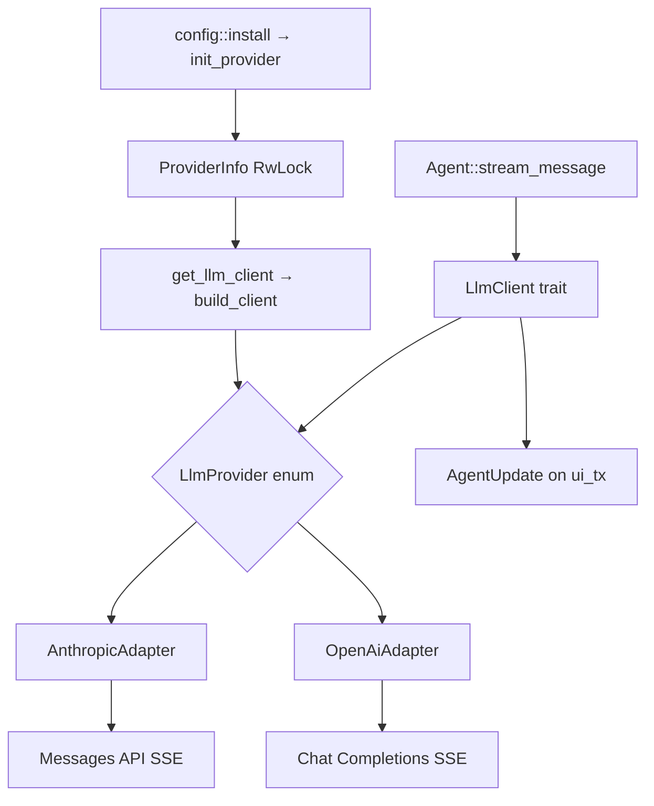
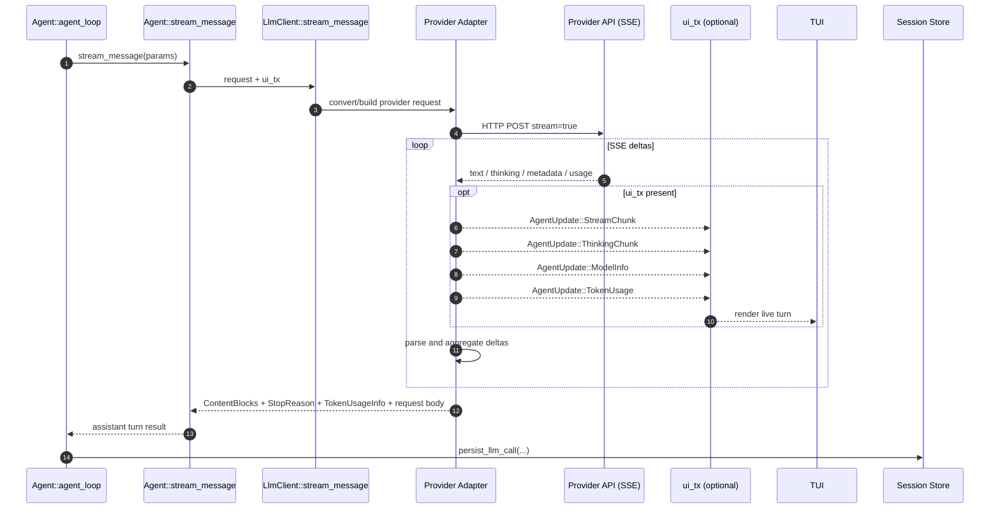
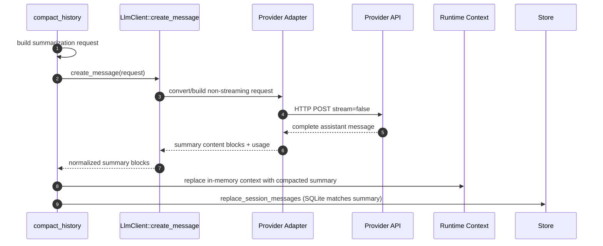
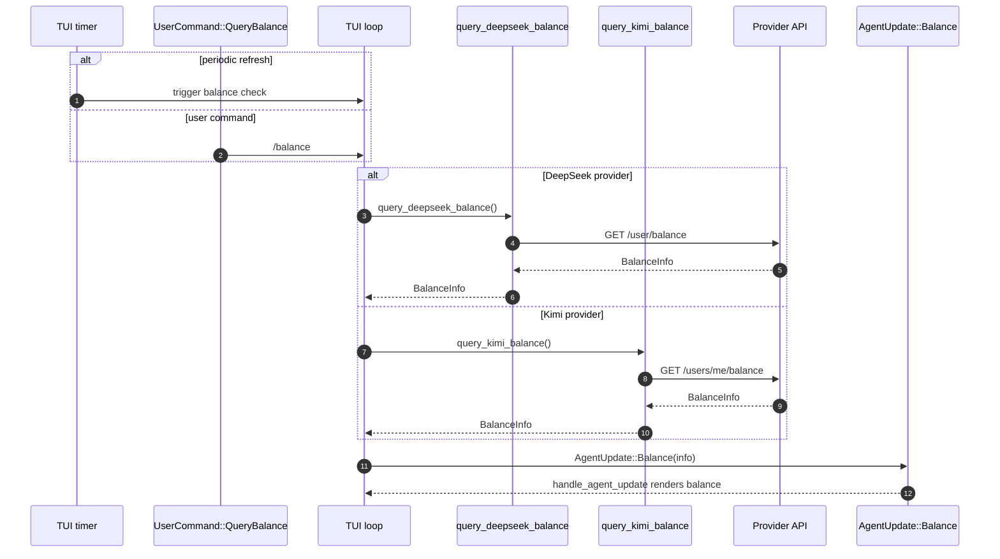

# LLM Providers

This chapter covers the `tact_llm` crate: provider selection, adapter construction, streaming and non-streaming calls, token usage, session-scoped cache keys, and balance queries for DeepSeek and Kimi.

Configuration that feeds this layer is resolved in [Ch 21 Configuration](./21_chapter_config.md). The agent loop consumes the client via `Agent::stream_message` ([Ch 18 Agent Main Loop](./18_chapter_agent_loop.md)).

Implementation: `crates/tact_llm/src/` (`lib.rs`, `content.rs`, `request.rs`, `stop_reason.rs`, `anthropic.rs`, `openai.rs`, `convert.rs`).

---

## 1. Architecture Overview



Two adapter families share one trait:

| Adapter | Providers | HTTP API |
|---------|-----------|----------|
| `AnthropicAdapter` | `anthropic` | Anthropic Messages (`/messages`) |
| `OpenAiAdapter` | `openai`, `deepseek`, `kimi` | OpenAI-compatible Chat Completions |

DeepSeek and Kimi reuse `OpenAiAdapter` with different default base URLs from config resolution.

---

## 2. ProviderInfo and Initialization

```rust
pub enum ProviderKind {
    Anthropic,
    OpenAi,
    DeepSeek,
    Kimi,
}

pub struct ProviderInfo {
    pub api_key: String,
    pub base_url: String,
    pub model: String,
    pub provider: ProviderKind,
}
```

`ProviderKind` is the single identity type for config, CLI (`FromStr`), and
`build_client` (exhaustive match). TOML names are lowercase:
`anthropic` | `openai` | `deepseek` | `kimi`.

Installed at startup (and re-init under test overrides). The active provider is
kept in an `RwLock` so the TUI `/model` command can change only the `model`
string mid-session via `tact_llm::set_model` (in-flight streams keep the old id;
`max_tokens` / thinking heuristics from process start are not recomputed).

```rust
// crates/tact/src/config/mod.rs
pub fn install(config: ResolvedConfig) {
    tact_llm::init_provider(config.llm.provider_info());
    SETTINGS.set(config).expect("...");
}
```

Runtime access:

```rust
let mut client = tact_llm::get_llm_client()?;
client.set_user_id(&session_id);   // per-session KV cache isolation
```

`build_client()` validates non-empty `api_key` and matches on `ProviderKind`:
Anthropic → `LlmProvider::Anthropic`; OpenAi / DeepSeek / Kimi →
`LlmProvider::OpenAi` (OpenAI-compatible adapters).

```mermaid
sequenceDiagram
    autonumber
    participant Init as config::init
    participant Resolve as resolve_config
    participant Install as config::install
    participant Once as SETTINGS / PROVIDER OnceLock
    participant LlmInit as tact_llm::init_provider
    participant Get as get_llm_client
    participant Build as build_client
    participant Provider as LlmProvider

    Init->>Resolve: merge TOML and CLI (no env layer)
    Resolve-->>Init: ResolvedConfig
    Init->>Install: install(config)
    Install->>LlmInit: provider_info()
    LlmInit->>Once: set ProviderInfo
    Install->>Once: set ResolvedConfig
    Note over Once: RwLock; `/model` may update model only
    Get->>Once: clone ProviderInfo snapshot
    Get->>Build: build_client(info)
    Build-->>Provider: Anthropic or OpenAi adapter
```

Provider initialization flows from Ch 21's resolved configuration into `tact_llm`.
The active `ProviderInfo` is mutable for mid-session model switches (`set_model`).

---

## 3. Kimi / DeepSeek Detection Helpers

Heuristic helpers on `ProviderInfo` (also exported at crate root):

| Function | Purpose |
|----------|---------|
| `is_kimi()` | `provider == Kimi`, **or** base URL / model contains moonshot/kimi |
| `is_kimi_k2x()` | K2.x family — drives **32k max_tokens** and **900k context** defaults in config |
| `is_kimi_k27()` | K2.7-code / `kimi-for-coding` / `api.kimi.com/coding` |
| `is_deepseek()` | `provider == DeepSeek`, **or** URL/model contains deepseek |

So `provider = openai` + a Moonshot-compatible `base_url` still behaves as Kimi
for thinking injection and balance polling; prefer a dedicated
`[llm.providers.kimi]` entry. Used by config resolution, TUI balance polling,
and request shaping in `convert.rs`.

---

## 4. LlmClient Trait

```rust
#[async_trait]
pub trait LlmClient: Send + Sync {
    async fn stream_message(
        &self,
        request: &CreateMessageParams,
        ui_tx: Option<UnboundedSender<AgentUpdate>>,
    ) -> Result<(Vec<ContentBlock>, Option<StopReason>, Option<TokenUsageInfo>, Option<LlmRequestBody>), LlmError>;

    async fn create_message(
        &self,
        request: &CreateMessageParams,
    ) -> Result<(...), LlmError>;
}
```

| Method | Used by |
|--------|---------|
| **`stream_message`** | `Agent::agent_loop` — emits `StreamChunk`, `ThinkingChunk`, `ModelInfo`, `TokenUsage` |
| **`create_message`** | `compact_history` — non-streaming summarization ([Ch 5](./05_chapter_compact.md)) |

Both return the serialized request body (`LlmRequestBody`) for session-store debugging.

Errors unify as `LlmError::Anthropic`, `LlmError::OpenAi`, or `LlmError::Other`.

### StopReason (provider-agnostic)

`StopReason` is owned by `tact_llm` (`stop_reason.rs`) — **not** re-exported from the Anthropic SDK. Adapters normalize provider-native strings at the boundary, so the agent loop never matches on raw API values:

```rust
pub enum StopReason {
    EndTurn,          // anthropic end_turn / openai stop
    MaxTokens,        // max_tokens, model_context_window_exceeded / length
    StopSequence,     // stop_sequence / content_filter
    ToolUse,          // tool_use / tool_calls, function_call (legacy)
    Refusal,          // anthropic refusal (safety classifier, HTTP 200)
    PauseTurn,        // anthropic pause_turn (server-tool loop paused)
    Unknown(String),  // unrecognized value — raw string kept for diagnostics
}
```

| Constructor | Input | Notes |
|-------------|-------|-------|
| `StopReason::from_anthropic` | Messages API `stop_reason` string | `model_context_window_exceeded` → `MaxTokens` (treat as truncation) |
| `StopReason::from_openai` | Chat Completions `finish_reason` string | legacy `function_call` → `ToolUse`; `content_filter` → `StopSequence` |

Unknown values become `Unknown(raw)` instead of parse failures, so new provider values degrade gracefully. How each variant drives the loop (continue / tools / error) is defined in [Ch 18 §4](./18_chapter_agent_loop.md#4-stop-reasons-and-loop-exit).



The streaming turn is the hot path from [Ch 18](./18_chapter_agent_loop.md): adapters translate the shared request, stream provider-specific SSE, optionally emit UI updates, and return normalized assistant content to the loop.



Compaction uses the same provider adapters without SSE; conceptually this is the Ch 5 summarization path running beside the streaming loop.

---

## 5. Anthropic Adapter

`anthropic.rs` uses direct HTTP + SSE (`reqwest-eventsource`) instead of the SDK streaming client so new `stop_reason` values can be mapped into Tact’s own [`StopReason`](../crates/tact_llm/src/stop_reason.rs) without waiting on the Anthropic SDK enum.

Streaming path:

1. POST JSON to `{base_url}/messages` with `stream: true`.
2. Parse SSE events into `ContentBlockDelta` variants.
3. Forward text/thinking to `ui_tx` as `AgentUpdate::StreamChunk` / `ThinkingChunk::{Started,Delta,Finished}`.
4. Emit `AgentUpdate::ModelInfo` with model name and generation limits.
5. Aggregate final blocks, `StopReason`, and `TokenUsageInfo`.

`set_user_id` injects `metadata.user_id` into the request body — used by DeepSeek's Anthropic-compatible endpoint for KV cache scoping.

---

## 6. OpenAI-Compatible Adapter

`openai.rs` targets Chat Completions with custom deserializers because `async-openai` (0.40.x) does not expose `reasoning_content` on streaming deltas.

Notable behaviors:

- **SSE parsing** via `reqwest-eventsource` (handles `\n\n` / `\r\n\r\n` correctly).
- **`reasoning_content` field** mapped to `ThinkingChunk::{Started, Delta, Finished}` (synthesized lifecycle) for DeepSeek/Kimi reasoning models.
- **Tool call deltas** reassembled by `index` across stream events.
- **`StreamUsage`** captures prompt/completion tokens, cache hit/miss (DeepSeek), and `reasoning_tokens`.
- **`set_user_id`** adds `"user_id"` to the JSON body for OpenAI-compatible cache isolation.

`convert.rs` builds provider-specific request JSON from shared `CreateMessageParams` (Anthropic message shape used internally throughout Tact).

**Tools, not legacy functions:** requests use the current `tools` / `tool_choice` API (parallel `tool_calls`, `role: "tool"` results). The deprecated 2023-era `functions` / `function_call` fields are always sent as `None` (struct literal requires them); only the *response* value `finish_reason=function_call` is still accepted and mapped to `StopReason::ToolUse` for older OpenAI-compatible services.

**User image attachments:** TUI/headless turn `@file.png` / `` into `ContentBlock::Image` ([Ch 23](./23_chapter_tui.md)). For OpenAI-compatible requests, `anthropic_messages_to_openai` maps those blocks to `{ type: "image_url", image_url: { url: "data:<media_type>;base64,..." } }`. Anthropic keeps the native Messages `image` + base64 `source` shape. There is no per-model vision capability gate: text-only Chat Completions APIs (or proxies whose content-part enum only allows `text`) reject `image_url` with HTTP 400.

**Kimi reasoning replay:** `anthropic_messages_to_openai` returns a `reasoning` vector aligned **one-to-one** with emitted OpenAI messages (not Anthropic source messages). When a user turn splits into multiple tool-result messages, each gets `None`; assistant thinking is attached only to the matching assistant row. `inject_reasoning_content` uses that parallel vector for Kimi/Moonshot.

**Incomplete tool calls:** stream and non-stream parsers skip tool-call slots with empty `id` or `name` so truncated SSE does not insert phantom `ToolUse` blocks.

**Empty assistant sanitization:** because thinking blocks are dropped when targeting non-Kimi OpenAI-compatible APIs, an assistant turn that contains only thinking (or only orphaned tool calls after truncation) would serialize as `{ "role": "assistant", "content": null, "tool_calls": null }` and be rejected with 400. `sanitize_assistant_messages` in `convert.rs` stubs such messages and strips orphaned `tool_calls` on every request. See [Error Recovery](./06_chapter_recovery.md) for the full context.

**Thinking / reasoning injection (`inject_thinking_param`):** the internal request always carries Anthropic-shaped `Thinking { budget_tokens }`. Adapters rewrite that into each wire protocol:

| Provider | When thinking is set | Wire field |
|----------|----------------------|------------|
| Anthropic | always (native Messages type) | `thinking: { type, budget_tokens }` |
| Kimi K2.5 | model heuristics | `thinking: { type: "enabled" }` |
| Kimi K2.6 | model heuristics | `thinking: { type: "enabled", keep: "all" }` |
| Kimi K2.7 / coding | skipped | *(thinking always on server-side)* |
| DeepSeek | if `request.thinking` set | `thinking: { type: "enabled", budget_tokens }` |
| OpenAI (native) | if `request.thinking` and budget > 0 | `reasoning_effort` via `reasoning_effort_from_budget` (`low` / `medium` / `high`) — **not** DeepSeek `thinking` |

`ModelCallParams.reasoning_effort` mirrors that budget→effort mapping for the TUI. Config still exposes `thinking_budget` only; there is no separate `reasoning_effort` TOML key yet.

---

## 7. Streaming → TUI Events

During `stream_message`, adapters push to the optional `ui_tx`:

| Event | `AgentUpdate` |
|-------|---------------|
| Text token | `StreamChunk(String)` |
| Reasoning / thinking | `ThinkingChunk::{Started, Delta, Finished}` |
| Request metadata | `ModelInfo(ModelCallParams)` |
| Usage at end of stream | `TokenUsage { ... }` |

The agent persists token usage via `persist_llm_call` after each successful stream ([Ch 1 Store](./01_chapter_store.md)).

Recovery around transport failures is handled in the agent loop, not inside adapters ([Ch 6 Recovery](./06_chapter_recovery.md)).

---

## 8. Session `user_id`

At the start of `agent_loop`:

```rust
self.client.set_user_id(session_id);
```

| Adapter | Injection site |
|---------|----------------|
| OpenAI-compatible | Top-level `"user_id"` in request JSON |
| Anthropic | `metadata.user_id` |

Intent: per-session KV cache isolation on DeepSeek (and compatible proxies), reducing cross-session cache pollution.

---

## 9. Balance Queries

| Function | Endpoint | When used |
|----------|----------|-----------|
| `query_deepseek_balance()` | `GET .../user/balance` | TUI startup + periodic timer + `/balance` command |
| `query_kimi_balance()` | `GET .../v1/users/me/balance` on `api.moonshot.cn` or `api.moonshot.ai` | Same |
| `query_kimi_code_usage()` | `GET .../v1/usages` on `api.kimi.com/coding` | Kimi Code subscription quota |

`query_*_balance()` returns `tact_protocol::BalanceInfo` as `AgentUpdate::Balance`. Kimi Code usage returns `UsageQuotaInfo` as `AgentUpdate::UsageQuota`.

**Kimi Code endpoint:** `api.kimi.com/coding` has no balance REST API. Use `query_kimi_code_usage()` instead; surfaced as `AgentUpdate::UsageQuota` on the bottom bar (`week` + `5h` windows).

**TUI timer:** `run_tui` accepts `balance_polling_enabled` (set from `is_deepseek()` / `is_kimi_balance_supported()` / `is_kimi_usage_supported()` in `interactive.rs`).

Only invoked when one of those helpers is true (`crates/tact-ui/src/interactive.rs`).



Balance checks stay outside `Agent::agent_loop`; the TUI owns the timer and command path, then renders the provider-specific result through the normal update handler.

---

## 10. Code Map

| File | Role |
|------|------|
| `tact_llm/src/provider_kind.rs` | `ProviderKind` enum (`FromStr` / `Display` / defaults) |
| `tact_llm/src/stop_reason.rs` | Provider-agnostic `StopReason` + `from_anthropic` / `from_openai` |
| `tact_llm/src/content.rs` | Owned `ContentBlock`, `Message`, `ContentBlockDelta`, `StreamUsage`, … |
| `tact_llm/src/request.rs` | Owned `CreateMessageParams`, `Thinking`, `Tool`, `ToolChoice`, … |
| `tact_llm/src/lib.rs` | `ProviderInfo`, `LlmClient`, `LlmProvider`, init/get helpers, balance APIs |
| `tact_llm/src/anthropic.rs` | Messages API streaming + non-streaming |
| `tact_llm/src/openai.rs` | Chat Completions SSE, `reasoning_effort` / thinking inject, tool deltas |
| `tact_llm/src/convert.rs` | Request translation, Image → `image_url`, Kimi thinking blocks |
| `crates/tact/src/agent/mod.rs` | `stream_message` wrapper, `set_user_id` at loop start |
| `crates/tact/src/compact.rs` | `create_message` for summarization |

---

## 11. Current Gaps

| Gap | Detail |
|-----|--------|
| **Four named providers only** | `ProviderKind` / `FromStr` reject unknown names; generic OpenAI proxies must use `provider = "openai"` |
| **No retry in adapters** | Transport retry/backoff lives in agent recovery, not `tact_llm` |
| **No Anthropic SDK dependency** | Conversation, request, stop, stream-delta, and error types are all owned by `tact_llm`; Anthropic is spoken via custom HTTP + SSE only |
| **Adapter rebuilt per `get_llm_client()` call** | New adapter instance each call; `set_user_id` mutates the copy held on `Agent` |
| **No vision capability gate** | Attached images are always sent as multimodal parts; text-only models/proxies may return 400 on `image_url` |

### Protocol compatibility gaps (internal Anthropic shape → wire)

`tact_llm` owns [`CreateMessageParams`](../crates/tact_llm/src/request.rs) (same Anthropic *wire shape* for serde, but no longer the SDK type). Each adapter must translate fields; several OpenAI-native differences are **not** handled yet:

| Internal / intent | Anthropic | DeepSeek / Kimi (OpenAI-compat) | Native OpenAI Chat Completions | Status |
|-------------------|-----------|----------------------------------|--------------------------------|--------|
| Enable extended thinking | `thinking.budget_tokens` | `thinking: { type, budget_tokens? }` / Kimi variants | `reasoning_effort` (`low`/`medium`/`high`) | OK — `inject_thinking_param` branches by provider |
| Thinking budget knob | `thinking_budget` config | mapped to `budget_tokens` | `reasoning_effort_from_budget` bands | OK (bands in `openai.rs`; no dedicated TOML key) |
| Max output | `max_tokens` | `max_tokens` | o-series often want `max_completion_tokens`; some reject `max_tokens` | not remapped |
| System prompt | top-level `system` | first `role: system` message | same; some reasoning models prefer `developer` | always `system` |
| Tool definitions | `tools` (Anthropic schema) | `tools` + `type: function` | same modern tools API | OK (`convert.rs`) |
| Stop / finish reason | `stop_reason` string | `finish_reason` string | `finish_reason` (+ legacy `function_call`) | OK (`StopReason::from_*`) |
| Refusal detail | `stop_details` | n/a | n/a | not parsed |
| Cache / user scoping | `metadata.user_id` | top-level `user_id` | ignored or different meaning | OK for DeepSeek; harmless elsewhere |
| Stream usage | event usage | `stream_options.include_usage` | same | OK |
| Vision parts | `image` + base64 source | `image_url` data URL | `image_url` | OK for vision models; no capability gate |
| Temperature / top_p | optional | optional | many reasoning models reject non-default sampling | passed through blindly |

Remaining OpenAI-native gaps above (`max_completion_tokens`, `developer` role, sampling restrictions) are still open; the former `reasoning_effort` gap is fixed.

---

## Related Docs

- [Configuration](./21_chapter_config.md) — credentials and defaults
- [Agent Main Loop](./18_chapter_agent_loop.md) — streaming integration
- [Context Compaction](./05_chapter_compact.md) — non-streaming `create_message`
- [Error Recovery](./06_chapter_recovery.md) — LLM failure handling
- [TUI](./23_chapter_tui.md) — balance display and stream rendering
