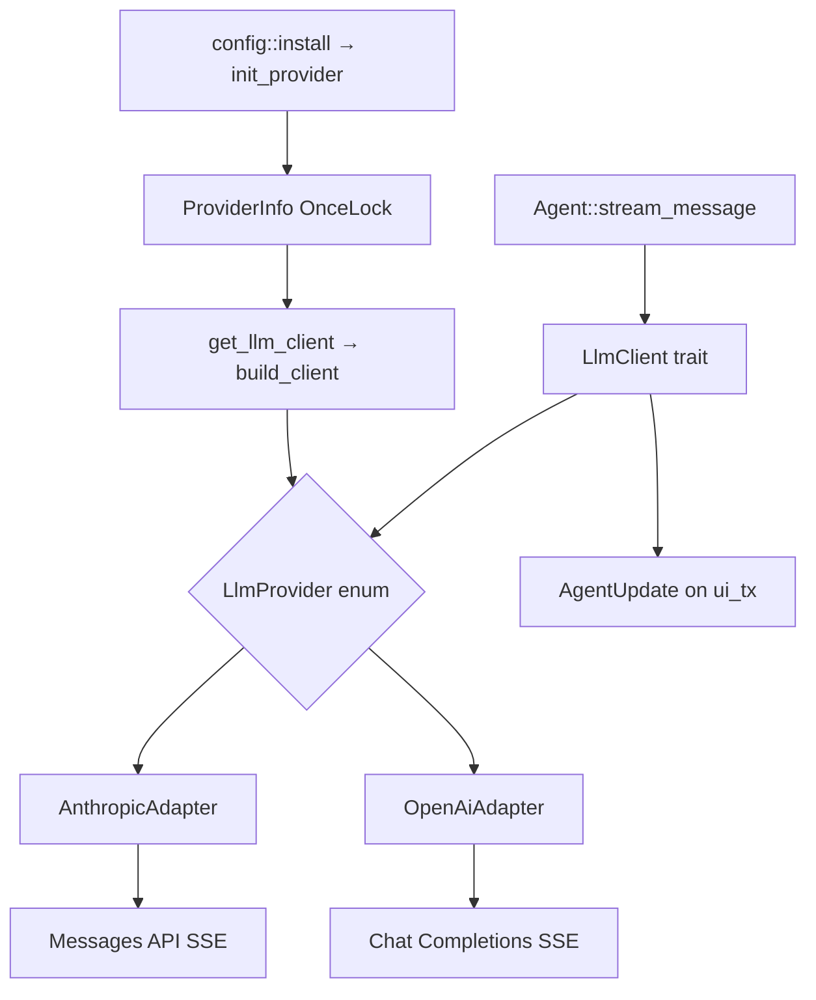
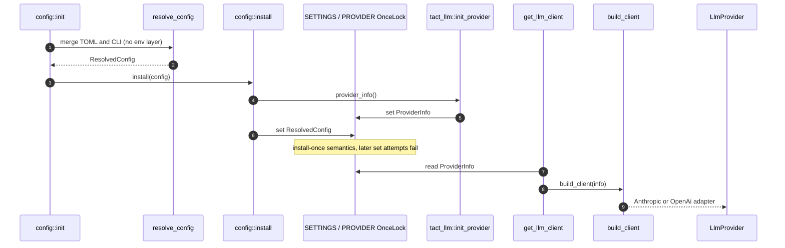
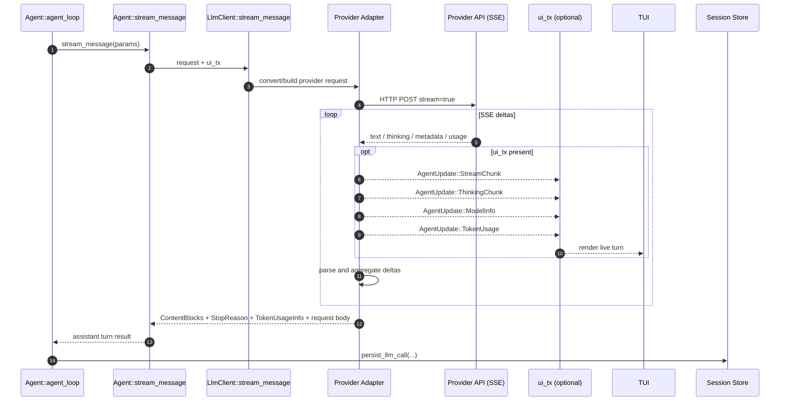
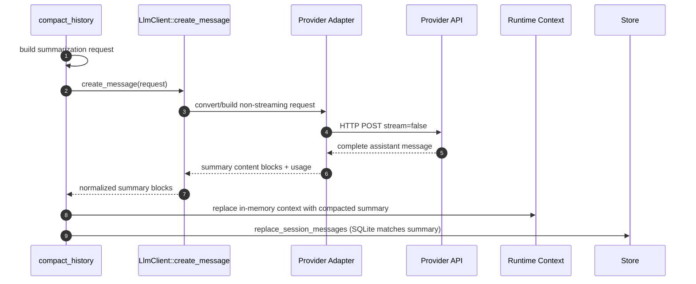
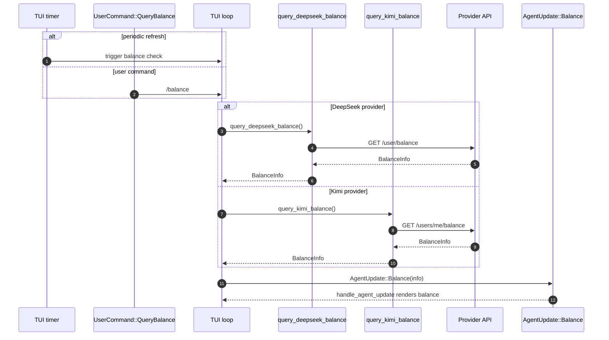

# LLM Providers

This chapter covers the `tact_llm` crate: provider selection, adapter construction, streaming and non-streaming calls, token usage, session-scoped cache keys, and balance queries for DeepSeek and Kimi.

Configuration that feeds this layer is resolved in [Ch 21 Configuration](./21_chapter_config.md). The agent loop consumes the client via `Agent::stream_message` ([Ch 18 Agent Main Loop](./18_chapter_agent_loop.md)).

Implementation: `crates/tact_llm/src/` (`lib.rs`, `anthropic.rs`, `openai.rs`, `convert.rs`).

---

## 1. Architecture Overview



Two adapter families share one trait:

| Adapter | Providers | HTTP API |
|---------|-----------|----------|
| `AnthropicAdapter` | `anthropic` | Anthropic Messages (`/messages`) |
| `OpenAiAdapter` | `openai`, `deepseek`, `kimi` | OpenAI-compatible Chat Completions |

DeepSeek and Kimi reuse `OpenAiAdapter` with different default base URLs from config resolution.

---

## 2. ProviderInfo and Initialization

```rust
pub struct ProviderInfo {
    pub api_key: String,
    pub base_url: String,
    pub model: String,
    pub provider: String,   // anthropic | openai | deepseek | kimi
}
```

Installed once at startup:

```rust
// crates/tact/src/config/mod.rs
pub fn install(config: ResolvedConfig) {
    tact_llm::init_provider(config.llm.provider_info());
    SETTINGS.set(config).expect("...");
}
```

Runtime access:

```rust
let mut client = tact_llm::get_llm_client()?;
client.set_user_id(&session_id);   // per-session KV cache isolation
```

`build_client()` validates non-empty `api_key` and maps the provider string to `LlmProvider::Anthropic` or `LlmProvider::OpenAi`.



Provider initialization flows from Ch 21's resolved configuration into `tact_llm`, where `OnceLock` makes both app settings and provider metadata immutable after startup.

---

## 3. Kimi / DeepSeek Detection Helpers

Heuristic helpers on `ProviderInfo` (also exported at crate root):

| Function | Purpose |
|----------|---------|
| `is_kimi()` | Provider name, base URL, or model contains moonshot/kimi |
| `is_kimi_k2x()` | K2.x family — drives **32k max_tokens** and **900k context** defaults in config |
| `is_kimi_k27()` | K2.7-code / `kimi-for-coding` / `api.kimi.com/coding` |
| `is_deepseek()` | Provider or URL/model contains deepseek |

These are used by config resolution, TUI balance polling, and request shaping in `convert.rs`.

---

## 4. LlmClient Trait

```rust
#[async_trait]
pub trait LlmClient: Send + Sync {
    async fn stream_message(
        &self,
        request: &CreateMessageParams,
        ui_tx: Option<UnboundedSender<AgentUpdate>>,
    ) -> Result<(Vec<ContentBlock>, Option<StopReason>, Option<TokenUsageInfo>, Option<LlmRequestBody>), LlmError>;

    async fn create_message(
        &self,
        request: &CreateMessageParams,
    ) -> Result<(...), LlmError>;
}
```

| Method | Used by |
|--------|---------|
| **`stream_message`** | `Agent::agent_loop` — emits `StreamChunk`, `ThinkingChunk`, `ModelInfo`, `TokenUsage` |
| **`create_message`** | `compact_history` — non-streaming summarization ([Ch 5](./05_chapter_compact.md)) |

Both return the serialized request body (`LlmRequestBody`) for session-store debugging.

Errors unify as `LlmError::Anthropic`, `LlmError::OpenAi`, or `LlmError::Other`.



The streaming turn is the hot path from [Ch 18](./18_chapter_agent_loop.md): adapters translate the shared request, stream provider-specific SSE, optionally emit UI updates, and return normalized assistant content to the loop.



Compaction uses the same provider adapters without SSE; conceptually this is the Ch 5 summarization path running beside the streaming loop.

---

## 5. Anthropic Adapter

`anthropic.rs` uses direct HTTP + SSE (`reqwest-eventsource`) instead of the SDK streaming client so new `stop_reason` values (e.g. `pause_turn`) do not break deserialization.

Streaming path:

1. POST JSON to `{base_url}/messages` with `stream: true`.
2. Parse SSE events into `ContentBlockDelta` variants.
3. Forward text/thinking deltas to `ui_tx` as `AgentUpdate::StreamChunk` / `ThinkingChunk`.
4. Emit `AgentUpdate::ModelInfo` with model name and generation limits.
5. Aggregate final blocks, `StopReason`, and `TokenUsageInfo`.

`set_user_id` injects `metadata.user_id` into the request body — used by DeepSeek's Anthropic-compatible endpoint for KV cache scoping.

---

## 6. OpenAI-Compatible Adapter

`openai.rs` targets Chat Completions with custom deserializers because `async-openai` (0.40.x) does not expose `reasoning_content` on streaming deltas.

Notable behaviors:

- **SSE parsing** via `reqwest-eventsource` (handles `\n\n` / `\r\n\r\n` correctly).
- **`reasoning_content` field** mapped to thinking chunks for DeepSeek/Kimi reasoning models.
- **Tool call deltas** reassembled by `index` across stream events.
- **`StreamUsage`** captures prompt/completion tokens, cache hit/miss (DeepSeek), and `reasoning_tokens`.
- **`set_user_id`** adds `"user_id"` to the JSON body for OpenAI-compatible cache isolation.

`convert.rs` builds provider-specific request JSON from shared `CreateMessageParams` (Anthropic message shape used internally throughout Tact).

**Kimi reasoning replay:** `anthropic_messages_to_openai` returns a `reasoning` vector aligned **one-to-one** with emitted OpenAI messages (not Anthropic source messages). When a user turn splits into multiple tool-result messages, each gets `None`; assistant thinking is attached only to the matching assistant row. `inject_reasoning_content` uses that parallel vector for Kimi/Moonshot.

**Incomplete tool calls:** stream and non-stream parsers skip tool-call slots with empty `id` or `name` so truncated SSE does not insert phantom `ToolUse` blocks.

---

## 7. Streaming → TUI Events

During `stream_message`, adapters push to the optional `ui_tx`:

| Event | `AgentUpdate` |
|-------|---------------|
| Text token | `StreamChunk(String)` |
| Reasoning / thinking | `ThinkingChunk(String)` |
| Request metadata | `ModelInfo(ModelCallParams)` |
| Usage at end of stream | `TokenUsage { ... }` |

The agent persists token usage via `persist_llm_call` after each successful stream ([Ch 1 Store](./01_chapter_store.md)).

Recovery around transport failures is handled in the agent loop, not inside adapters ([Ch 6 Recovery](./06_chapter_recovery.md)).

---

## 8. Session `user_id`

At the start of `agent_loop`:

```rust
self.client.set_user_id(session_id);
```

| Adapter | Injection site |
|---------|----------------|
| OpenAI-compatible | Top-level `"user_id"` in request JSON |
| Anthropic | `metadata.user_id` |

Intent: per-session KV cache isolation on DeepSeek (and compatible proxies), reducing cross-session cache pollution.

---

## 9. Balance Queries

| Function | Endpoint | When used |
|----------|----------|-----------|
| `query_deepseek_balance()` | `GET .../user/balance` | TUI startup + periodic timer + `/balance` command |
| `query_kimi_balance()` | `GET .../v1/users/me/balance` on `api.moonshot.cn` or `api.moonshot.ai` | Same |
| `query_kimi_code_usage()` | `GET .../v1/usages` on `api.kimi.com/coding` | Kimi Code subscription quota |

`query_*_balance()` returns `tact_protocol::BalanceInfo` as `AgentUpdate::Balance`. Kimi Code usage returns `UsageQuotaInfo` as `AgentUpdate::UsageQuota`.

**Kimi Code endpoint:** `api.kimi.com/coding` has no balance REST API. Use `query_kimi_code_usage()` instead; surfaced as `AgentUpdate::UsageQuota` on the bottom bar (`week` + `5h` windows).

**TUI timer:** `run_tui` accepts `balance_polling_enabled` (set from `is_deepseek()` / `is_kimi_balance_supported()` / `is_kimi_usage_supported()` in `interactive.rs`).

Only invoked when one of those helpers is true (`crates/tact-ui/src/interactive.rs`).



Balance checks stay outside `Agent::agent_loop`; the TUI owns the timer and command path, then renders the provider-specific result through the normal update handler.

---

## 10. Code Map

| File | Role |
|------|------|
| `tact_llm/src/lib.rs` | `ProviderInfo`, `LlmClient`, `LlmProvider`, init/get helpers, balance APIs |
| `tact_llm/src/anthropic.rs` | Messages API streaming + non-streaming |
| `tact_llm/src/openai.rs` | Chat Completions SSE, reasoning_content, tool deltas |
| `tact_llm/src/convert.rs` | Request translation, Kimi thinking blocks |
| `crates/tact/src/agent/mod.rs` | `stream_message` wrapper, `set_user_id` at loop start |
| `crates/tact/src/compact.rs` | `create_message` for summarization |

---

## 11. Current Gaps

| Gap | Detail |
|-----|--------|
| **Four named providers only** | `build_client` rejects unknown provider strings; generic OpenAI proxies must use `provider = "openai"` |
| **No retry in adapters** | Transport retry/backoff lives in agent recovery, not `tact_llm` |
| **Anthropic SDK partial use** | Types from `anthropic-ai-sdk`; streaming is custom HTTP |
| **Adapter rebuilt per `get_llm_client()` call** | New adapter instance each call; `set_user_id` mutates the copy held on `Agent` |

---

## Related Docs

- [Configuration](./21_chapter_config.md) — credentials and defaults
- [Agent Main Loop](./18_chapter_agent_loop.md) — streaming integration
- [Context Compaction](./05_chapter_compact.md) — non-streaming `create_message`
- [Error Recovery](./06_chapter_recovery.md) — LLM failure handling
- [TUI](./23_chapter_tui.md) — balance display and stream rendering
