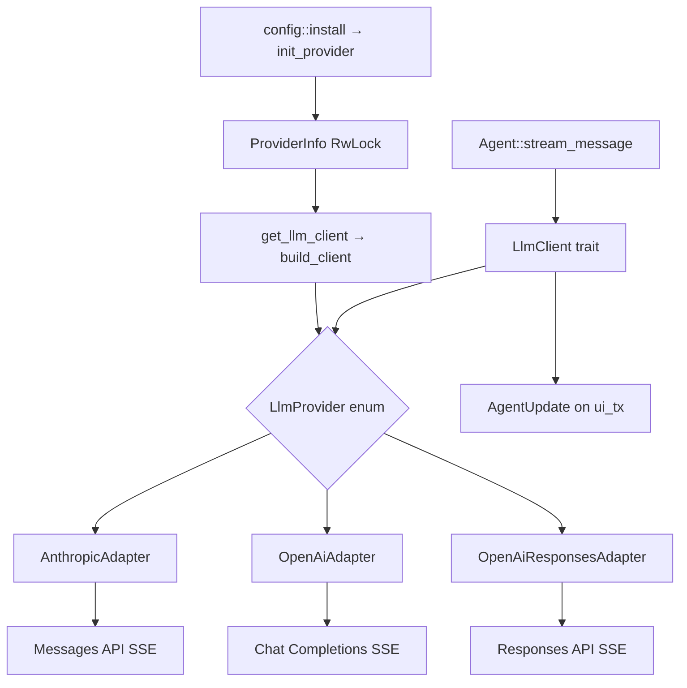
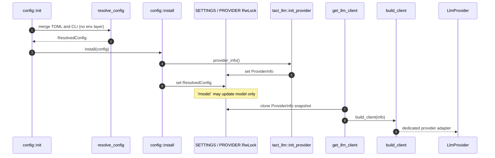
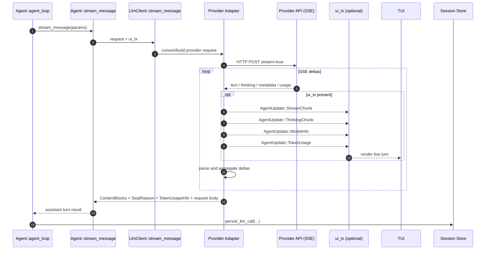
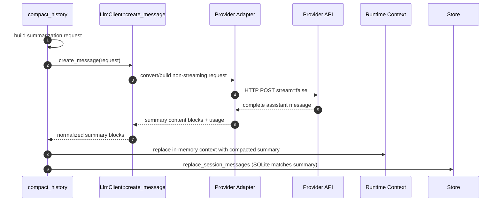
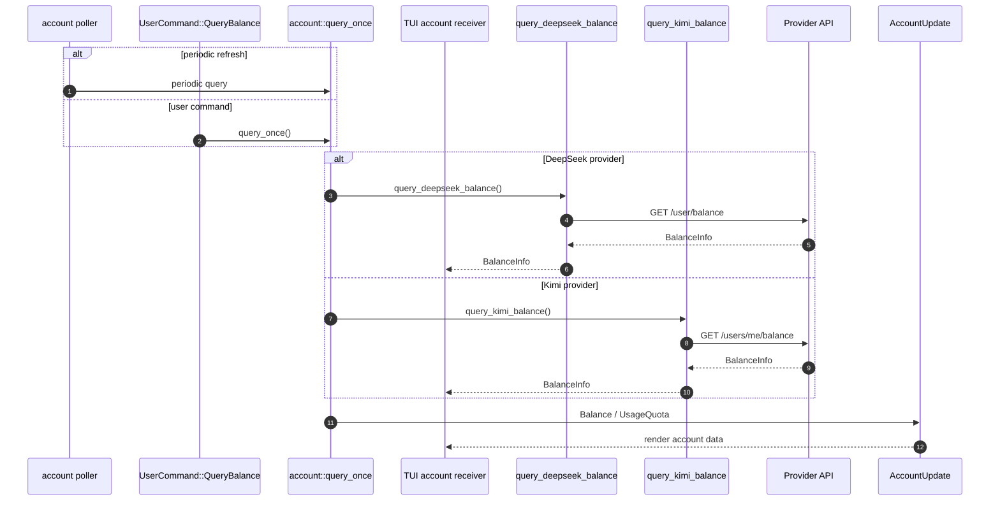

# LLM Providers
> Language: [English](./22_chapter_llm.md) · [中文](./22_chapter_llm_zh.md)

This chapter covers the `tact_llm` crate: provider selection, adapter construction, streaming and non-streaming calls, token usage, session-scoped cache keys, and balance queries for DeepSeek and Kimi.

Configuration that feeds this layer is resolved in [Ch 21 Configuration](./21_chapter_config.md). The agent loop consumes the client via `Agent::stream_message` ([Ch 18 Agent Main Loop](./18_chapter_agent_loop.md)).

Implementation: `crates/tact_llm/src/` (`lib.rs`, `client.rs`, `provider.rs`, `types.rs`, `content.rs`, `anthropic/`, `openai/`, `deepseek/`, `kimi/`, `convert.rs`).

---

## 1. Architecture Overview


```mermaid
flowchart TB
    Config[config::install → init_provider] --> PI[ProviderInfo RwLock]
    PI --> Build[get_llm_client → build_client]
    Build --> LP{LlmProvider enum}
    LP --> Anthropic[AnthropicAdapter]
    LP --> OpenAi[OpenAiAdapter]
    LP --> Responses[OpenAiResponsesAdapter]
    Anthropic --> API1[Messages API SSE]
    OpenAi --> API2[Chat Completions SSE]
    Responses --> API3[Responses API SSE]
    Agent[Agent::stream_message] --> LlmClient[LlmClient trait]
    LlmClient --> LP
    LlmClient --> TUI[AgentUpdate on ui_tx]
```

Three adapter families share one trait:

| Adapter | Providers | HTTP API |
|---------|-----------|----------|
| `AnthropicAdapter` | `anthropic` | Anthropic Messages (`/messages`) |
| `OpenAiAdapter` | `openai`, `deepseek`, `kimi` | OpenAI-compatible Chat Completions |
| `OpenAiResponsesAdapter` | `openai` with `protocol = "responses"` | OpenAI Responses (`/responses`) |

DeepSeek and Kimi reuse `OpenAiAdapter` with different default base URLs from config resolution.

---

## 2. ProviderInfo and Initialization

```rust
pub enum ProviderKind {
    Anthropic,
    OpenAi,
    DeepSeek,
    Kimi,
}

pub enum OpenAiProtocol {
    ChatCompletions,
    Responses,
}

pub struct ProviderInfo {
    pub api_key: String,
    pub base_url: String,
    pub model: String,
    pub provider: ProviderKind,
    pub protocol: OpenAiProtocol,
}
```

`ProviderKind` is the single identity type for config, CLI (`FromStr`), and
`build_client` (exhaustive match). TOML names are lowercase:
`anthropic` | `openai` | `deepseek` | `kimi`.

Installed at startup (and re-init under test overrides). The active provider is
kept in an `RwLock` so the TUI `/model` command can change only the `model`
string mid-session via `tact_llm::set_model` (in-flight streams keep the old id;
`max_tokens` / thinking heuristics from process start are not recomputed).

```rust
// crates/tact/src/config/mod.rs
pub fn install(config: ResolvedConfig) {
    tact_llm::init_provider(config.llm.provider_info());
    *SETTINGS.write().expect("tact config lock poisoned") = Some(config);
}
```

Runtime access:

```rust
let mut client = tact_llm::get_llm_client()?;
client.set_user_id(&session_id);   // DeepSeek per-session KV cache isolation
```

`build_client()` validates non-empty `api_key` and matches on `ProviderKind`.
Anthropic, DeepSeek, and Kimi select their dedicated variants. OpenAI then
matches `protocol`: `chat_completions` selects `LlmProvider::OpenAi`, while
`responses` selects `LlmProvider::OpenAiResponses`. The protocol defaults to
`chat_completions`; `responses` is rejected for non-OpenAI providers.


```mermaid
sequenceDiagram
    autonumber
    participant Init as config::init
    participant Resolve as resolve_config
    participant Install as config::install
    participant State as SETTINGS / PROVIDER RwLock
    participant LlmInit as tact_llm::init_provider
    participant Get as get_llm_client
    participant Build as build_client
    participant Provider as LlmProvider

    Init->>Resolve: merge TOML and CLI (no env layer)
    Resolve-->>Init: ResolvedConfig
    Init->>Install: install(config)
    Install->>LlmInit: provider_info()
    LlmInit->>State: set ProviderInfo
    Install->>State: set ResolvedConfig
    Note over State: `/model` may update model only
    Get->>State: clone ProviderInfo snapshot
    Get->>Build: build_client(info)
    Build-->>Provider: dedicated provider adapter
```

Provider initialization flows from Ch 21's resolved configuration into `tact_llm`.
The active `ProviderInfo` is mutable for mid-session model switches (`set_model`).

---

## 3. Kimi / DeepSeek Detection Helpers

Heuristic helpers on `ProviderInfo` (also exported at crate root):

| Function | Purpose |
|----------|---------|
| `is_kimi()` | `provider == Kimi`, **or** base URL / model contains moonshot/kimi |
| `is_kimi_k2x()` | K2.x family — drives the **32k max_tokens** default and Kimi thinking wire shape |
| `is_kimi_k27()` | K2.7-code / `kimi-for-coding` / `api.kimi.com/coding` |
| `is_deepseek()` | `provider == DeepSeek`, **or** URL/model contains deepseek |

So `provider = openai` + a Moonshot-compatible `base_url` still behaves as Kimi
for thinking injection. Balance polling is enabled only for the official HTTPS
`api.moonshot.cn` / `api.moonshot.ai` hosts; custom proxies never forward their
credentials to Moonshot. Prefer a dedicated `[llm.providers.kimi]` entry.

---

## 4. LlmClient Trait

```rust
#[async_trait]
pub trait LlmClient: Send + Sync {
    async fn stream_message(
        &self,
        request: &CreateMessageParams,
        ui_tx: Option<UnboundedSender<AgentUpdate>>,
    ) -> Result<(Vec<ContentBlock>, Option<StopReason>, Option<TokenUsageInfo>, Option<LlmRequestBody>), LlmError>;

    async fn create_message(
        &self,
        request: &CreateMessageParams,
    ) -> Result<(...), LlmError>;
}
```

| Method | Used by |
|--------|---------|
| **`stream_message`** | `Agent::agent_loop` — emits `StreamChunk`, `ThinkingChunk`, `ModelInfo`, `TokenUsage` |
| **`create_message`** | `compact_history` — non-streaming summarization ([Ch 5](./05_chapter_compact.md)) |

Both return the serialized request body (`LlmRequestBody`) for session-store debugging.

Errors unify as `LlmError::Anthropic`, `LlmError::OpenAi`, or `LlmError::Other`.

### StopReason (provider-agnostic)

`StopReason` is owned by `tact_llm` (`types.rs`) — **not** re-exported from the Anthropic SDK. Adapters normalize provider-native strings at the boundary, so the agent loop never matches on raw API values:

```rust
pub enum StopReason {
    EndTurn,          // anthropic end_turn / openai stop
    MaxTokens,        // max_tokens, model_context_window_exceeded / length
    StopSequence,     // stop_sequence / content_filter
    ToolUse,          // tool_use / tool_calls, function_call (legacy)
    Refusal,          // anthropic refusal (safety classifier, HTTP 200)
    PauseTurn,        // anthropic pause_turn (server-tool loop paused)
    Unknown(String),  // unrecognized value — raw string kept for diagnostics
}
```

| Constructor | Input | Notes |
|-------------|-------|-------|
| `StopReason::from_anthropic` | Messages API `stop_reason` string | `model_context_window_exceeded` → `MaxTokens` (treat as truncation) |
| `StopReason::from_openai` | Chat Completions `finish_reason` string | legacy `function_call` → `ToolUse`; `content_filter` → `StopSequence` |

Unknown values become `Unknown(raw)` instead of parse failures, so new provider values degrade gracefully. How each variant drives the loop (continue / tools / error) is defined in [Ch 18 §4](./18_chapter_agent_loop.md#4-stop-reasons-and-loop-exit).


```mermaid
sequenceDiagram
    autonumber
    participant AgentLoop as Agent::agent_loop
    participant Agent as Agent::stream_message
    participant Client as LlmClient::stream_message
    participant Adapter as Provider Adapter
    participant API as Provider API (SSE)
    participant UI as ui_tx (optional)
    participant TUI as TUI
    participant Store as Session Store

    AgentLoop->>Agent: stream_message(params)
    Agent->>Client: request + ui_tx
    Client->>Adapter: convert/build provider request
    Adapter->>API: HTTP POST stream=true
    loop SSE deltas
        API-->>Adapter: text / thinking / metadata / usage
        opt ui_tx present
            Adapter-->>UI: AgentUpdate::StreamChunk
            Adapter-->>UI: AgentUpdate::ThinkingChunk
            Adapter-->>UI: AgentUpdate::ModelInfo
            Adapter-->>UI: AgentUpdate::TokenUsage
            UI-->>TUI: render live turn
        end
        Adapter->>Adapter: parse and aggregate deltas
    end
    Adapter-->>Agent: ContentBlocks + StopReason + TokenUsageInfo + request body
    Agent-->>AgentLoop: assistant turn result
    AgentLoop->>Store: persist_llm_call(...)
```

The streaming turn is the hot path from [Ch 18](./18_chapter_agent_loop.md): adapters translate the shared request, stream provider-specific SSE, optionally emit UI updates, and return normalized assistant content to the loop.


```mermaid
sequenceDiagram
    autonumber
    participant Compact as compact_history
    participant Client as LlmClient::create_message
    participant Adapter as Provider Adapter
    participant API as Provider API
    participant Context as Runtime Context

    Compact->>Compact: build summarization request
    Compact->>Client: create_message(request)
    Client->>Adapter: convert/build non-streaming request
    Adapter->>API: HTTP POST stream=false
    API-->>Adapter: complete assistant message
    Adapter-->>Client: summary content blocks + usage
    Client-->>Compact: normalized summary blocks
    Compact->>Context: replace in-memory context with compacted summary
    Compact->>Store: replace_session_messages (SQLite matches summary)
```

Compaction uses the same provider adapters without SSE; conceptually this is the Ch 5 summarization path running beside the streaming loop.

---

## 5. Anthropic Adapter

`anthropic/mod.rs` uses direct HTTP + SSE (`reqwest-eventsource`) instead of the SDK streaming client so new `stop_reason` values can be mapped into Tact’s own [`StopReason`](../crates/tact_llm/src/types.rs) without waiting on the Anthropic SDK enum.

Streaming path:

1. POST JSON to `{base_url}/messages` with `stream: true`.
2. Parse SSE events into `ContentBlockDelta` variants.
3. Forward text/thinking to `ui_tx` as `AgentUpdate::StreamChunk` / `ThinkingChunk::{Started,Delta,Finished}`.
4. Emit `AgentUpdate::ModelInfo` with model name and generation limits.
5. Aggregate final blocks, `StopReason`, and `TokenUsageInfo`.

The Anthropic adapter does not attach the session `user_id` to request metadata.

---

## 6. OpenAI APIs and Compatible Adapters

### 6.1 Chat Completions and compatible providers

`openai/mod.rs` provides the shared Chat Completions HTTP/SSE transport. Dedicated `deepseek/mod.rs`, `kimi/mod.rs`, and `openai/multi_model.rs` adapters select provider-specific body hooks after the common request conversion.

Notable behaviors:

- **SSE parsing** via `eventsource-stream` (handles `\n\n` / `\r\n\r\n` correctly).
- **`reasoning_content` field** mapped to `ThinkingChunk::{Started, Delta, Finished}` (synthesized lifecycle) for DeepSeek/Kimi reasoning models.
- **Tool call deltas** reassembled by `index` across stream events.
- **`StreamUsage`** captures prompt/completion tokens, cache hit/miss (DeepSeek), and `reasoning_tokens`.
- **`set_user_id`** adds `"user_id"` only when the selected body hook is DeepSeek.

`convert.rs` builds provider-specific request JSON from shared `CreateMessageParams` (Anthropic message shape used internally throughout Tact).

**Tools, not legacy functions:** requests use the current `tools` / `tool_choice` API (parallel `tool_calls`, `role: "tool"` results). The deprecated 2023-era `functions` / `function_call` fields are always sent as `None` (struct literal requires them); only the *response* value `finish_reason=function_call` is still accepted and mapped to `StopReason::ToolUse` for older OpenAI-compatible services.

**User image attachments:** TUI/headless turn `@file.png` / `` into `ContentBlock::Image` ([Ch 23](./23_chapter_tui.md)). For OpenAI-compatible requests, `messages_to_openai` maps those blocks to `{ type: "image_url", image_url: { url: "data:<media_type>;base64,..." } }`. Anthropic keeps the native Messages `image` + base64 `source` shape. There is no per-model vision capability gate: text-only Chat Completions APIs (or proxies whose content-part enum only allows `text`) reject `image_url` with HTTP 400.

**Kimi reasoning replay:** `messages_to_openai` returns a `reasoning` vector aligned **one-to-one** with emitted OpenAI messages (not Anthropic source messages). When a user turn splits into multiple tool-result messages, each gets `None`; assistant thinking is attached only to the matching assistant row. `inject_reasoning_content` uses that parallel vector for Kimi/Moonshot.

**Incomplete tool calls:** stream and non-stream parsers skip tool-call slots with empty `id` or `name` so truncated SSE does not insert phantom `ToolUse` blocks.

**Empty assistant sanitization:** because thinking blocks are dropped when targeting non-Kimi OpenAI-compatible APIs, an assistant turn that contains only thinking (or only orphaned tool calls after truncation) would serialize as `{ "role": "assistant", "content": null, "tool_calls": null }` and be rejected with 400. `sanitize_assistant_messages` in `convert.rs` stubs such messages and strips orphaned `tool_calls` on every request. See [Error Recovery](./06_chapter_recovery.md) for the full context.

### 6.2 Responses API

An OpenAI provider entry opts in explicitly:

```toml
[llm.providers.openai]
api_key = "sk-..."
model = "gpt-4o"
protocol = "responses"
reasoning_effort = "high"
```

`openai/responses/` uses `async-openai` 0.41.1 through a dependency alias;
the existing Chat Completions types remain on 0.20 so the non-standard Kimi
and DeepSeek wire shapes do not change. The adapter implements both
`stream_message` and non-streaming `create_message` behind the same
provider-independent contract. The alias enables the SDK's `byot` extension:
request construction still starts from SDK types, while final JSON dispatch
allows the current `max` effort value that the SDK enum does not yet expose.
Responses and stream events remain SDK-typed.

Tact remains the conversation owner. Every request sends the persisted
protocol baseline plus the newly uncovered logical messages with `store:
false`; it does not use Conversations or `previous_response_id`. Conversion
maps system instructions, user/assistant text, image data URLs, function
calls, function outputs, function tools, tool choice, sampling fields, and
`max_tokens → max_output_tokens`. `top_k` and stop sequences are omitted
because the Responses request type has no matching fields.

Responses requests include `reasoning.encrypted_content`. A returned reasoning
item becomes `ContentBlock::Thinking`: summary text is stored in `thinking`,
while `signature` stores a versioned opaque envelope containing the complete
reasoning item and related `fc_*` function-call item ids. The next request
reconstructs the original `rs_*` / `fc_*` identities; a thinking block without
an encrypted payload is display-only and is not sent back.

Responses uses its own `responses_system_prompt_template.md`, leaving other
provider templates unchanged. Its skill-loading policy forbids
`load_skill` for greetings, small talk, and ordinary questions; a skill must be
explicitly slash-invoked or explicitly requested, and a skill description
cannot make its own invocation mandatory.

Streaming deltas drive live UI updates and retain visible output text as a
fallback. Reasoning summary/text deltas map to `ThinkingChunk`, visible
output/refusal deltas map to `StreamChunk`, and the terminal
`response.completed` / `response.incomplete` object is authoritative for final
blocks, tool calls, usage, and stop reason when it includes the completed
output. Some compatible endpoints omit the final message from that object; in
that case, already received output text deltas are restored as the final text
block. This avoids duplicating content found in both delta and terminal events.
The stream adapter deserializes only the event types it consumes; unrelated or
newer provider events are ignored. For terminal events from compatible
endpoints, missing response/output-item IDs receive internal placeholder values
solely to satisfy the SDK schema; Tact does not treat those placeholders as
provider identities. Missing terminal-response, output-message, and
function-call statuses are inferred from the terminal event type. Requests with
tools explicitly send `tool_choice: "auto"` unless the caller selected another
policy, avoiding provider-specific defaults that disable tool use. When
replaying assistant history, Tact serializes text as a completed Responses
output message (`output_text` with a stable local item ID), rather than an
assistant `input_text` message; this is required by strict compatible endpoints
on multi-turn requests.
Input/cache/output/reasoning token counts map to the existing
`TokenUsageInfo` fields.

Unsupported in this adapter: server-hosted tools, background responses,
Conversations, and `previous_response_id`. Native compaction is supported:
ordinary requests carry `context_management` when a compact threshold is
resolved, and `compact()` sends an explicit `POST /responses/compact` request
([Ch 5](./05_chapter_compact.md)).

#### 6.2.1 Conversion pipeline: `Message` → `/responses` input

The Responses adapter receives the same shared `CreateMessageParams` used by other providers. The critical difference is that it emits a heterogeneous `/responses` `input` array rather than a chat-style list of role/content messages.

`create_response` performs these steps:

1. Take the persisted state baseline (`input_items`) verbatim when a valid
   `ResponsesConversationState` is supplied; otherwise start empty.
2. Walk the uncovered suffix of `request.messages` (beyond the state's
   `logical_message_count`) and call `message_to_input`.
3. Flatten the returned `InputItem`s into the final `input` array after the
   baseline items.
4. Add request-level fields: `instructions`, `tools`, `tool_choice`, `reasoning`,
   `temperature`, `top_p`, `max_output_tokens`, `store: false`, and
   `context_management` (`[{ "type": "compaction", "compact_threshold": N }]`)
   when a compact threshold is configured.
5. Normalize assistant history items so prior assistant text becomes a completed Responses output message with stable local ids and `output_text` content.

The per-message mapping is:

| Shared Tact content | Responses item emitted |
|---|---|
| `Message::Text(User)` | `message(role=user, content=text)` |
| `Message::Text(Assistant)` | assistant `message`, later normalized to completed output form |
| `ContentBlock::Text` | `input_text` inside the current message |
| `ContentBlock::Image` | `input_image` with a data URL |
| `ContentBlock::Thinking` with decodable signature | standalone `reasoning` item |
| `ContentBlock::ToolUse` | standalone `function_call` item |
| `ContentBlock::ToolResult` | standalone `function_call_output` item |
| `ContentBlock::RedactedThinking` | omitted |

Two details matter for multi-turn correctness:

- `flush_message_content` emits accumulated text/image parts as one message **before** emitting standalone reasoning or tool items, preserving the order required by the Responses API.
- `normalize_assistant_history_items` rewrites assistant history into completed output messages because some compatible endpoints reject prior assistant turns if they are replayed as plain assistant input text.

#### 6.2.2 Compaction interaction: where Responses differs

For `protocol = "responses"`, compaction is **native**: there is no local
summary rebuild, and the logical context (`runtime.context`) is never rewritten
by `compact_history` ([Ch 5](./05_chapter_compact.md)). The Responses adapter
owns the exact **conversion/state boundaries**:

- **State baseline** — `ResponsesConversationState` holds the opaque protocol
  baseline: `input_items` (verbatim JSON from previous terminal outputs,
  including `compaction` and `reasoning` items), `compaction_id`,
  `is_compacted`, `logical_message_count`, and `logical_context_hash`.
- **Validation** — before reuse, `validate_conversion_state` checks that the
  persisted state binds to the same provider/model and that the logical-message
  prefix covered by the state hashes to the recorded value. A mismatch is a
  hard protocol error; Tact never silently duplicates, truncates, or
  reconstructs the baseline.
- **Incremental conversion** — `create_response` sends the state baseline
  verbatim plus only the newly uncovered logical messages converted to
  `/responses` items. With no state, every logical message is converted.
- **`context_management`** — when a compact threshold is configured (or
  derived), every ordinary `/responses` request carries
  `context_management: [{ "type": "compaction", "compact_threshold": N }]`, so
  the endpoint may compact the baseline automatically inside a normal stream.
- **Explicit `/responses/compact`** — when Tact decides to compact, the agent
  calls `compact()` on the adapter: a real `POST /responses/compact` request
  carrying the current baseline plus uncovered messages. The returned compact
  resource replaces the baseline; `focus` text has no meaning and is ignored.
- **State update** — every call returns `LlmResponse` with a
  `state_update: ProviderStateUpdate` (`Replace(new state)` or `Unchanged`).
  The agent commits the assistant message and the state baseline in **one
  transaction** before any further LLM call or tool execution.

#### `LlmResponse` and terminal response authority

`LlmResponse` is the adapter's single return contract:

| Field | Meaning |
|-------|---------|
| `blocks` | Final `ContentBlock`s for the TUI/agent |
| `stop_reason` | Terminal stop reason |
| `usage` | Token usage (when reported) |
| `request_body` | Serialized JSON body actually sent (for session debugging) |
| `state_update` | `ProviderStateUpdate::Replace(…)` or `Unchanged` |

The terminal `response.completed` / `response.incomplete` object is
**authoritative** for final blocks, tool calls, usage, and stop reason when it
includes the completed output. Streamed deltas are used for live UI only; for
compatible endpoints that omit the final message from the terminal object,
already received output-text deltas are restored as the final text block, and
missing output-message/function-call statuses are inferred from the terminal
event type. Placeholder ids injected for such endpoints are never treated as
provider identities.

#### The `compaction` item round-trip

A compaction item appears either in an explicit `/responses/compact` resource
or in the terminal output of an ordinary request after automatic
`context_management` compaction. In both cases it round-trips as **opaque
state**, not content:

1. `normalize_response` retains every terminal output item as JSON in output
   order (`output_items`), including `compaction` items and unknown future item
   types. A terminal response may carry at most one compaction item, and its
   `encrypted_content` must be non-empty.
2. `state_update` packages those items into the next request's `input_items`
   baseline, and `create_response` replays them **verbatim** on the next call.
3. The item is **never** mapped to a `ContentBlock`: `encrypted_content` is
   opaque provider state, not assistant text. It must not surface in TUI
   rendering, `AgentUpdate::Info` messages, `tracing` output, or error strings.

Why not a `ContentBlock`? Because a `ContentBlock` is logical content the
agent loop renders, persists, and may tool-dispatch over. A `compaction` item
is protocol plumbing: it exists only to tell the endpoint that the baseline
was compacted and carries an opaque payload Tact cannot interpret. Treating it
as content would leak encrypted provider state into the UI and would break the
round-trip (the exact JSON must be replayed, not reconstructed from visible
fields).

#### 6.2.3 Reasoning-history replay

Responses reasoning items are not re-derived from visible text. Instead, Tact persists a versioned opaque signature (`openai-responses-v1:...`) inside `ContentBlock::Thinking`. The payload stores:

- the full `ReasoningItem`
- a map from local tool call ids to provider `function_call` item ids

On a later request, `history::decode` can recover that state so `message_to_input` can emit:

- a proper standalone `reasoning` item
- `function_call` items carrying the matching provider item ids when available

This is why a compacted conversation can still replay Responses-native reasoning/function-call history even though the adapter rebuilds every request from the persisted baseline plus local messages rather than a server-side `previous_response_id` chain.

### 6.3 Shared thinking configuration

**Thinking / reasoning injection:** the internal request always carries Anthropic-shaped `Thinking { budget_tokens }`. Provider body hooks rewrite that into each wire protocol:

| Provider | When thinking is set | Wire field |
|----------|----------------------|------------|
| Anthropic | always (native Messages type) | `thinking: { type, budget_tokens }` |
| Kimi K2.5 | budget > 0 | `thinking: { type: "enabled" }`; otherwise `disabled` |
| Kimi K2.6 | budget > 0 | `thinking: { type: "enabled", keep: "all" }`; otherwise `disabled` |
| Kimi K2.7 / coding | skipped | *(thinking always on server-side)* |
| DeepSeek | budget > 0 | `thinking: { type: "enabled" }` + `reasoning_effort: high\|max`; otherwise `thinking: disabled` |
| OpenAI Chat Completions | explicit effort or budget > 0 | `reasoning_effort: none\|minimal\|low\|medium\|high\|xhigh\|max` |
| OpenAI Responses | explicit effort or budget > 0 | `reasoning: { effort: none\|minimal\|low\|medium\|high\|xhigh\|max, summary: auto }` |

OpenAI's optional per-provider `reasoning_effort` is forwarded unchanged and
takes precedence over `thinking_budget`. When absent, the legacy bands remain:
zero omits the field, `1..=10_000` maps to `low`, `10_001..=32_000` to
`medium`, and larger budgets to `high`. Tact deliberately does not invent
budget thresholds for `xhigh` or `max`. `ModelCallParams.reasoning_effort`
reports the effective value to the TUI. Exact support is model-dependent; see
the [OpenAI reasoning guide](https://developers.openai.com/api/docs/guides/reasoning).

---

## 7. Streaming → TUI Events

During `stream_message`, adapters push to the optional `ui_tx`:

| Event | `AgentUpdate` |
|-------|---------------|
| Text token | `StreamChunk(String)` |
| Reasoning / thinking | `ThinkingChunk::{Started, Delta, Finished}` |
| Request metadata | `ModelInfo(ModelCallParams)` |
| Usage at end of stream | `TokenUsage { ... }` |

The agent persists token usage via `persist_llm_call` after each successful stream ([Ch 1 Store](./01_chapter_store.md)).

Recovery around transport failures is handled in the agent loop, not inside adapters ([Ch 6 Recovery](./06_chapter_recovery.md)).

---

## 8. Session `user_id`

When a session is attached in `Agent::with_session`:

```rust
self.runtime.client.set_user_id(&session_id);
```

| Adapter | Injection site |
|---------|----------------|
| DeepSeek (including heuristic selection through the OpenAI adapter) | Top-level `"user_id"` in request JSON |
| Anthropic / Kimi / native OpenAI | Not injected |

Intent: per-session KV cache isolation on DeepSeek (and compatible proxies), reducing cross-session cache pollution.

---

## 9. Balance Queries

| Function | Endpoint | When used |
|----------|----------|-----------|
| `query_deepseek_balance()` | `GET .../user/balance` | TUI startup + periodic timer + `/balance` command |
| `query_kimi_balance()` | `GET .../v1/users/me/balance` on `api.moonshot.cn` or `api.moonshot.ai` | Same |
| `query_kimi_code_usage()` | `GET .../v1/usages` on `api.kimi.com/coding` | Kimi Code subscription quota |

`query_*_balance()` returns `tact_protocol::BalanceInfo`, routed on the separate account channel as `AccountUpdate::Balance`. Kimi Code usage returns `UsageQuotaInfo` as `AccountUpdate::UsageQuota`.

**Kimi Code endpoint:** `api.kimi.com/coding` has no balance REST API. Use `query_kimi_code_usage()` instead; surfaced as `AccountUpdate::UsageQuota` on the bottom bar (`week` + `5h` windows).

**Credential boundary:** Kimi balance polling is enabled only when `base_url`
uses HTTPS with the exact host `api.moonshot.cn` or `api.moonshot.ai`. Custom
OpenAI-compatible proxies are treated as unsupported and their API keys are
never sent to an official Moonshot balance endpoint.

**Polling:** `interactive.rs` performs one startup query and starts
`account::spawn_poller` only when `account::is_supported()` is true. The
`/balance` command uses the same `query_once` path through the command driver.


```mermaid
sequenceDiagram
    autonumber
    participant Poller as account poller
    participant Cmd as UserCommand::QueryBalance
    participant Service as account::query_once
    participant TUI as TUI account receiver
    participant DeepSeek as query_deepseek_balance
    participant Kimi as query_kimi_balance
    participant API as Provider API
    participant Update as AccountUpdate

    alt periodic refresh
        Poller->>Service: periodic query
    else user command
        Cmd->>Service: query_once()
    end
    alt DeepSeek provider
        Service->>DeepSeek: query_deepseek_balance()
        DeepSeek->>API: GET /user/balance
        API-->>DeepSeek: BalanceInfo
        DeepSeek-->>TUI: BalanceInfo
    else Kimi provider
        Service->>Kimi: query_kimi_balance()
        Kimi->>API: GET /users/me/balance
        API-->>Kimi: BalanceInfo
        Kimi-->>TUI: BalanceInfo
    end
    Service->>Update: Balance / UsageQuota
    Update-->>TUI: render account data
```

Balance checks stay outside `Agent::agent_loop`; the TUI owns the timer and command path, then renders the provider-specific result through the normal update handler.

---

## 10. Code Map

| File | Role |
|------|------|
| `tact_llm/src/types.rs` | `ProviderKind`, `OpenAiProtocol`, request types, and provider-agnostic `StopReason` |
| `tact_llm/src/content.rs` | Owned `ContentBlock`, `Message`, `ContentBlockDelta`, `StreamUsage`, … |
| `tact_llm/src/client.rs` | `LlmClient`, dedicated `LlmProvider` variants, session user-id routing |
| `tact_llm/src/provider.rs` | `ProviderInfo`, provider initialization, client construction, detection helpers |
| `tact_llm/src/account.rs` | DeepSeek balance and Kimi balance/quota queries |
| `tact_llm/src/anthropic/mod.rs` | Messages API streaming + non-streaming |
| `tact_llm/src/openai/` | Chat Completions transport/hooks plus the isolated Responses converter, normalizer, and stream state |
| `tact_llm/src/deepseek/mod.rs` / `kimi/mod.rs` | Provider-specific thinking and history hooks |
| `tact_llm/src/convert.rs` | Request translation, Image → `image_url`, Kimi thinking blocks |
| `crates/tact/src/agent/mod.rs` | `stream_message` wrapper, `set_user_id` in `with_session` |
| `crates/tact/src/compact/mod.rs` | `create_message` for summarization |

---

## 11. Current Gaps

| Gap | Detail |
|-----|--------|
| **Four named providers only** | `ProviderKind` / `FromStr` reject unknown names; generic OpenAI proxies must use `provider = "openai"` |
| **No retry in adapters** | Transport retry/backoff lives in agent recovery, not `tact_llm` |
| **No Anthropic SDK dependency** | Conversation, request, stop, stream-delta, and error types are all owned by `tact_llm`; Anthropic is spoken via custom HTTP + SSE only |
| **Adapter rebuilt per `get_llm_client()` call** | New adapter instance each call; for DeepSeek, `set_user_id` mutates the copy held on `Agent` |
| **No vision capability gate** | Attached images are always sent as multimodal parts; text-only models/proxies may return 400 on `image_url` |
| **Responses core subset only** | No Conversations, `previous_response_id`, hosted tools, or background mode (native compaction is supported) |

### Protocol compatibility gaps (internal Anthropic shape → wire)

`tact_llm` owns [`CreateMessageParams`](../crates/tact_llm/src/types.rs) (same Anthropic *wire shape* for serde, but no longer the SDK type). Each adapter must translate fields. The table below describes the Chat Completions path; Responses mappings are documented in §6.2. Several Chat Completions differences are **not** handled yet:

| Internal / intent | Anthropic | DeepSeek / Kimi (OpenAI-compat) | Native OpenAI Chat Completions | Status |
|-------------------|-----------|----------------------------------|--------------------------------|--------|
| Enable extended thinking | `thinking.budget_tokens` (internal) | Anthropic: `thinking.budget_tokens`; DeepSeek/Kimi hooks: `thinking.type` (±effort/keep) | OpenAI: `reasoning_effort` | OK — body hooks map by API wire shape |
| Thinking / effort knob | `thinking_budget` plus optional OpenAI `reasoning_effort` | mapped to `budget_tokens` | explicit effort, otherwise `reasoning_effort_from_budget` bands | OK (explicit effort wins) |
| Max output | `max_tokens` | `max_tokens` | o-series often want `max_completion_tokens`; some reject `max_tokens` | not remapped |
| System prompt | top-level `system` | first `role: system` message | same; some reasoning models prefer `developer` | always `system` |
| Tool definitions | `tools` (Anthropic schema) | `tools` + `type: function` | same modern tools API | OK (`convert.rs`) |
| Stop / finish reason | `stop_reason` string | `finish_reason` string | `finish_reason` (+ legacy `function_call`) | OK (`StopReason::from_*`) |
| Refusal detail | `stop_details` | n/a | n/a | not parsed |
| Cache / user scoping | not sent | DeepSeek: top-level `user_id`; Kimi: not sent | not sent | DeepSeek only |
| Stream usage | event usage | `stream_options.include_usage` | same | OK |
| Vision parts | `image` + base64 source | `image_url` data URL | `image_url` | OK for vision models; no capability gate |
| Temperature / top_p | optional | optional | many reasoning models reject non-default sampling | passed through blindly |

Remaining OpenAI-native gaps above (`max_completion_tokens`, `developer` role, sampling restrictions) are still open; the former `reasoning_effort` gap is fixed.

---

## Related Docs

- [Configuration](./21_chapter_config.md) — credentials and defaults
- [Agent Main Loop](./18_chapter_agent_loop.md) — streaming integration
- [Context Compaction](./05_chapter_compact.md) — non-streaming `create_message`
- [Error Recovery](./06_chapter_recovery.md) — LLM failure handling
- [TUI](./23_chapter_tui.md) — balance display and stream rendering
