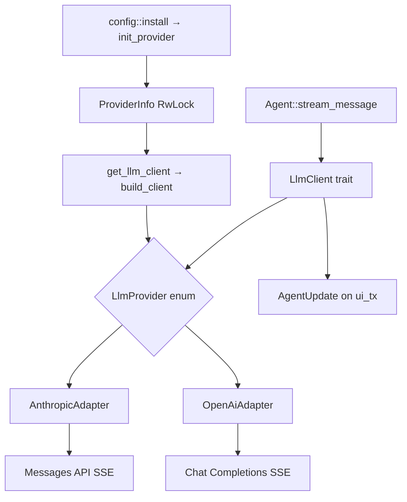
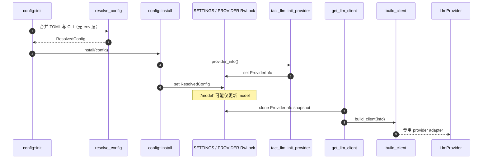
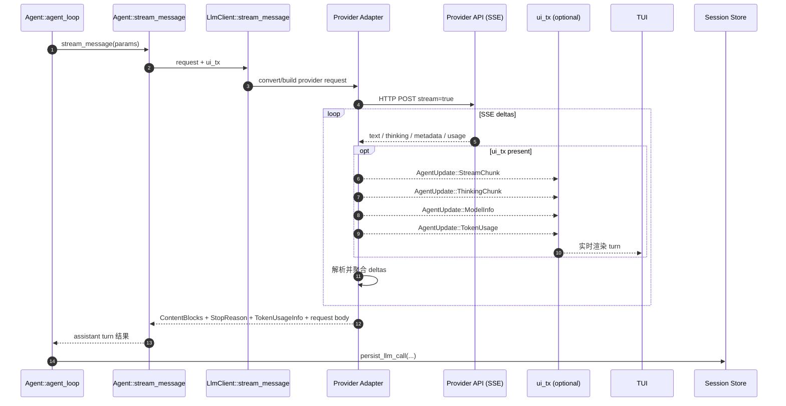
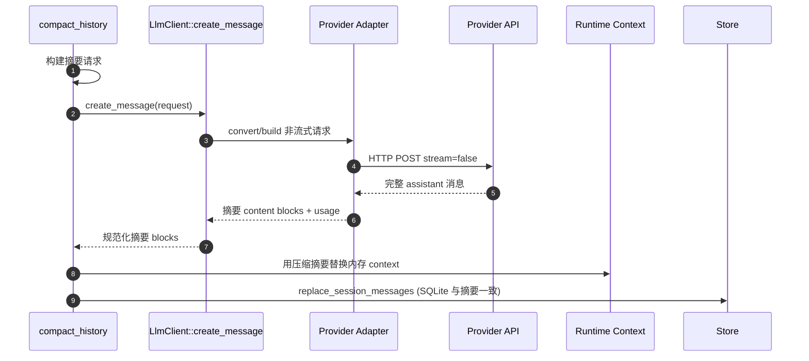
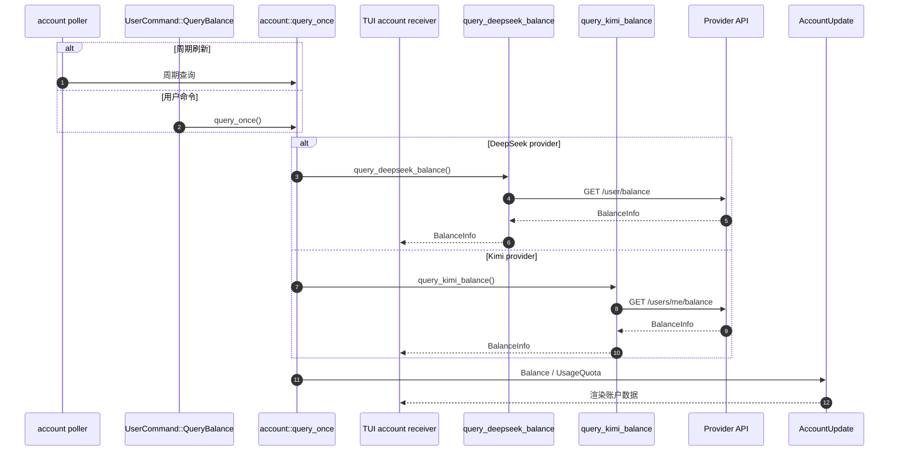

# LLM Providers

> 语言：[中文](./22_chapter_llm_zh.md) · [English](./22_chapter_llm.md)

本章涵盖 `tact_llm` crate：provider 选择、adapter 构建、流式与非流式调用、token 用量、session 级 cache 键，以及 DeepSeek 与 Kimi 的余额查询。

本层配置在 [Ch 21 配置](./21_chapter_config_zh.md) 中 resolve。Agent 循环通过 `Agent::stream_message` 消费 client（[Ch 18 Agent Main Loop](./18_chapter_agent_loop.md)）。

实现：`crates/tact_llm/src/`（`lib.rs`、`client.rs`、`provider.rs`、`types.rs`、`content.rs`、`anthropic/`、`openai/`、`deepseek/`、`kimi/`、`convert.rs`）。

---

## 1. 架构概览



两个 adapter 家族共享同一 trait：

| Adapter | Providers | HTTP API |
|---------|-----------|----------|
| `AnthropicAdapter` | `anthropic` | Anthropic Messages（`/messages`） |
| `OpenAiAdapter` | `openai`、`deepseek`、`kimi` | OpenAI 兼容 Chat Completions |

DeepSeek 与 Kimi 复用 `OpenAiAdapter`，默认 base URL 来自 config resolve。

---

## 2. ProviderInfo 与初始化

```rust
pub enum ProviderKind {
    Anthropic,
    OpenAi,
    DeepSeek,
    Kimi,
}

pub struct ProviderInfo {
    pub api_key: String,
    pub base_url: String,
    pub model: String,
    pub provider: ProviderKind,
}
```

`ProviderKind` 是 config、CLI（`FromStr`）与 `build_client`（穷尽 match）的单一身份类型。TOML 名称为小写：`anthropic` | `openai` | `deepseek` | `kimi`。

启动时安装（测试 override 下可 re-init）。活跃 provider 保存在 `RwLock` 中，TUI `/model` 命令可在 session 中仅通过 `tact_llm::set_model` 更改 `model` 字符串（进行中的流保留旧 id；进程启动时的 `max_tokens` / thinking 启发式不会重算）。

```rust
// crates/tact/src/config/mod.rs
pub fn install(config: ResolvedConfig) {
    tact_llm::init_provider(config.llm.provider_info());
    *SETTINGS.write().expect("tact config lock poisoned") = Some(config);
}
```

运行时访问：

```rust
let mut client = tact_llm::get_llm_client()?;
client.set_user_id(&session_id);   // DeepSeek per-session KV cache 隔离
```

`build_client()` 校验非空 `api_key`，按 `ProviderKind` match：Anthropic → `LlmProvider::Anthropic`；OpenAi → `LlmProvider::OpenAi`；DeepSeek → `LlmProvider::DeepSeek`；Kimi → `LlmProvider::Kimi`。后三者共享 OpenAI 兼容 transport，但使用不同 body hook。



Provider 初始化从 Ch 21 的 resolved 配置流入 `tact_llm`。活跃 `ProviderInfo` 对 mid-session 模型切换（`set_model`）可变。

---

## 3. Kimi / DeepSeek 检测辅助函数

`ProviderInfo` 上的启发式辅助函数（也在 crate 根 re-export）：

| 函数 | 用途 |
|------|------|
| `is_kimi()` | `provider == Kimi`，**或** base URL / model 含 moonshot/kimi |
| `is_kimi_k2x()` | K2.x 家族 — 驱动 **32k max_tokens** 默认值与 Kimi thinking wire shape |
| `is_kimi_k27()` | K2.7-code / `kimi-for-coding` / `api.kimi.com/coding` |
| `is_deepseek()` | `provider == DeepSeek`，**或** URL/model 含 deepseek |

因此 `provider = openai` + Moonshot 兼容 `base_url` 在 thinking 注入上仍按 Kimi 行为。余额轮询仅对官方 HTTPS `api.moonshot.cn` / `api.moonshot.ai` 主机启用；自定义代理绝不会把凭据转发给 Moonshot。更推荐专用 `[llm.providers.kimi]` 条目。

---

## 4. LlmClient Trait

```rust
#[async_trait]
pub trait LlmClient: Send + Sync {
    async fn stream_message(
        &self,
        request: &CreateMessageParams,
        ui_tx: Option<UnboundedSender<AgentUpdate>>,
    ) -> Result<(Vec<ContentBlock>, Option<StopReason>, Option<TokenUsageInfo>, Option<LlmRequestBody>), LlmError>;

    async fn create_message(
        &self,
        request: &CreateMessageParams,
    ) -> Result<(...), LlmError>;
}
```

| 方法 | 使用者 |
|------|--------|
| **`stream_message`** | `Agent::agent_loop` — 发出 `StreamChunk`、`ThinkingChunk`、`ModelInfo`、`TokenUsage` |
| **`create_message`** | `compact_history` — 非流式摘要（[Ch 5](./05_chapter_compact_zh.md)） |

两者均返回序列化请求体（`LlmRequestBody`）供 session-store 调试。

错误统一为 `LlmError::Anthropic`、`LlmError::OpenAi` 或 `LlmError::Other`。

### StopReason（与 provider 无关）

`StopReason` 由 `tact_llm` 拥有（`types.rs`）— **不**从 Anthropic SDK re-export。Adapter 在边界将 provider 原生字符串规范化，agent 循环从不匹配原始 API 值：

```rust
pub enum StopReason {
    EndTurn,          // anthropic end_turn / openai stop
    MaxTokens,        // max_tokens, model_context_window_exceeded / length
    StopSequence,     // stop_sequence / content_filter
    ToolUse,          // tool_use / tool_calls, function_call (legacy)
    Refusal,          // anthropic refusal (safety classifier, HTTP 200)
    PauseTurn,        // anthropic pause_turn (server-tool loop paused)
    Unknown(String),  // 未识别值 — 保留原始字符串供诊断
}
```

| 构造器 | 输入 | 说明 |
|--------|------|------|
| `StopReason::from_anthropic` | Messages API `stop_reason` 字符串 | `model_context_window_exceeded` → `MaxTokens`（视为截断） |
| `StopReason::from_openai` | Chat Completions `finish_reason` 字符串 | 旧版 `function_call` → `ToolUse`；`content_filter` → `StopSequence` |

未知值变为 `Unknown(raw)` 而非解析失败，新 provider 值可优雅降级。各 variant 如何驱动循环（继续 / 工具 / 错误）见 [Ch 18 §4](./18_chapter_agent_loop.md#4-stop-reasons-and-loop-exit)。



流式 turn 是 [Ch 18](./18_chapter_agent_loop.md) 的热路径：adapter 翻译共享请求、流式 provider 特定 SSE、可选发出 UI 更新，并向循环返回规范化 assistant 内容。



压缩复用同一 provider adapter 但不走 SSE；概念上是 Ch 5 摘要路径与流式循环并行运行。

---

## 5. Anthropic Adapter

`anthropic/mod.rs` 使用直接 HTTP + SSE（`reqwest-eventsource`），而非 SDK 流式 client，以便将新 `stop_reason` 值映射到 Tact 自有 [`StopReason`](../crates/tact_llm/src/types.rs)，无需等待 Anthropic SDK enum。

流式路径：

1. POST JSON 到 `{base_url}/messages`，`stream: true`。
2. 将 SSE 事件解析为 `ContentBlockDelta` variant。
3. 将 text/thinking 转发到 `ui_tx` 为 `AgentUpdate::StreamChunk` / `ThinkingChunk::{Started,Delta,Finished}`。
4. 发出 `AgentUpdate::ModelInfo`（模型名与生成限制）。
5. 聚合最终 blocks、`StopReason` 与 `TokenUsageInfo`。

Anthropic adapter 不会把 session `user_id` 附加到请求 metadata。

---

## 6. OpenAI 兼容 Adapter

`openai/mod.rs` 提供共享 Chat Completions HTTP/SSE transport。专用的 `deepseek/mod.rs`、`kimi/mod.rs` 与 `openai/multi_model.rs` adapter 在公共请求转换后选择 provider 特定 body hook。

值得注意的行为：

- **SSE 解析** via `eventsource-stream`（正确处理 `\n\n` / `\r\n\r\n`）。
- **`reasoning_content` 字段**映射到 `ThinkingChunk::{Started, Delta, Finished}`（合成生命周期），供 DeepSeek/Kimi 推理模型使用。
- **Tool call deltas** 按流事件中 `index` 重组。
- **`StreamUsage`** 捕获 prompt/completion tokens、cache hit/miss（DeepSeek）与 `reasoning_tokens`。
- **`set_user_id`** 仅在选中的 body hook 为 DeepSeek 时向 JSON 体添加 `"user_id"`。

`convert.rs` 从共享 `CreateMessageParams` 构建 provider 特定请求 JSON（Tact 内部全程使用 Anthropic message 形状）。

**Tools，非 legacy functions：** 请求使用当前 `tools` / `tool_choice` API（并行 `tool_calls`、`role: "tool"` 结果）。已弃用 2023 时代的 `functions` / `function_call` 字段始终发 `None`（struct literal 要求）；仅*响应*值 `finish_reason=function_call` 仍接受并映射为 `StopReason::ToolUse`，兼容旧 OpenAI 兼容服务。

**用户图片附件：** TUI/headless 将 `@file.png` / `` 转为 `ContentBlock::Image`（[Ch 23](./23_chapter_tui_zh.md)）。OpenAI 兼容请求中，`messages_to_openai` 将这些 block 映射为 `{ type: "image_url", image_url: { url: "data:<media_type>;base64,..." } }`。Anthropic 保留原生 Messages `image` + base64 `source` 形状。无 per-model vision 能力门控：纯文本 Chat Completions API（或 content-part enum 仅允许 `text` 的代理）会对 `image_url` 返回 HTTP 400。

**Kimi reasoning replay：** `messages_to_openai` 返回与发出的 OpenAI 消息**一一对应**的 `reasoning` 向量（非 Anthropic 源消息）。用户 turn 拆成多条 tool-result 消息时，每条得 `None`；assistant thinking 仅附在匹配的 assistant 行。`inject_reasoning_content` 用该并行向量服务 Kimi/Moonshot。

**不完整 tool calls：** 流式与非流式解析器跳过 `id` 或 `name` 为空的 tool-call 槽，避免截断 SSE 插入 phantom `ToolUse` block。

**空 assistant 清理：** 因 thinking block 在面向非 Kimi OpenAI 兼容 API 时被丢弃，仅含 thinking（或截断后仅剩 orphan tool calls）的 assistant turn 会序列化为 `{ "role": "assistant", "content": null, "tool_calls": null }` 并被 400 拒绝。`convert.rs` 中 `sanitize_assistant_messages` 对这类消息打 stub 并在每次请求剥离 orphan `tool_calls`。完整上下文见 [错误恢复](./06_chapter_recovery.md)。

**Thinking / reasoning 注入：** 内部请求始终携带 Anthropic 形 `Thinking { budget_tokens }`。Provider body hook 将其改写为各 wire 协议：

| Provider | thinking 设置时 | Wire 字段 |
|----------|-----------------|-----------|
| Anthropic | 始终（原生 Messages 类型） | `thinking: { type, budget_tokens }` |
| Kimi K2.5 | budget > 0 | `thinking: { type: "enabled" }`；否则 `disabled` |
| Kimi K2.6 | budget > 0 | `thinking: { type: "enabled", keep: "all" }`；否则 `disabled` |
| Kimi K2.7 / coding | 跳过 | *（服务端始终开启 thinking）* |
| DeepSeek | budget > 0 | `thinking: { type: "enabled" }` + `reasoning_effort: high\|max`；否则 `thinking: disabled` |
| OpenAI（原生） | 若 `request.thinking` 且 budget > 0 | `reasoning_effort` via `reasoning_effort_from_budget`（`low` / `medium` / `high`）— **非** Anthropic `thinking.budget_tokens` |

`ModelCallParams.reasoning_effort` 为 TUI 镜像该 budget→effort 映射。Config 仍仅暴露 `thinking_budget`；尚无独立 `reasoning_effort` TOML 键。

---

## 7. 流式 → TUI 事件

`stream_message` 期间，adapter 向可选 `ui_tx` 推送：

| 事件 | `AgentUpdate` |
|------|---------------|
| Text token | `StreamChunk(String)` |
| Reasoning / thinking | `ThinkingChunk::{Started, Delta, Finished}` |
| 请求元数据 | `ModelInfo(ModelCallParams)` |
| 流结束用量 | `TokenUsage { ... }` |

Agent 在每次成功流后通过 `persist_llm_call` 持久化 token 用量（[Ch 1 Store](./01_chapter_store.md)）。

传输失败恢复在 agent 循环中处理，不在 adapter 内（[Ch 6 Recovery](./06_chapter_recovery.md)）。

---

## 8. Session `user_id`

在 `Agent::with_session` 绑定 session 时：

```rust
self.runtime.client.set_user_id(&session_id);
```

| Adapter | 注入位置 |
|---------|----------|
| DeepSeek（包括 OpenAI adapter 的启发式选择） | 请求 JSON 顶层 `"user_id"` |
| Anthropic / Kimi / 原生 OpenAI | 不注入 |

意图：DeepSeek（及兼容代理）上 per-session KV cache 隔离，减少跨 session cache 污染。

---

## 9. 余额查询

| 函数 | 端点 | 使用时机 |
|------|------|----------|
| `query_deepseek_balance()` | `GET .../user/balance` | TUI 启动 + 周期 timer + `/balance` 命令 |
| `query_kimi_balance()` | `GET .../v1/users/me/balance` on `api.moonshot.cn` 或 `api.moonshot.ai` | 同上 |
| `query_kimi_code_usage()` | `GET .../v1/usages` on `api.kimi.com/coding` | Kimi Code 订阅配额 |

`query_*_balance()` 返回 `tact_protocol::BalanceInfo`，并通过独立 account channel 路由为 `AccountUpdate::Balance`。Kimi Code 用量返回 `UsageQuotaInfo` 为 `AccountUpdate::UsageQuota`。

**Kimi Code 端点：** `api.kimi.com/coding` 无余额 REST API。改用 `query_kimi_code_usage()`；在底栏显示为 `AccountUpdate::UsageQuota`（`week` + `5h` 窗口）。

**凭据边界：** Kimi 余额轮询仅在 `base_url` 使用 HTTPS 且主机精确为 `api.moonshot.cn` 或 `api.moonshot.ai` 时启用。自定义 OpenAI 兼容代理视为不支持，代理 API key 绝不会发送到官方 Moonshot 余额端点。

**轮询：** `interactive.rs` 仅在 `account::is_supported()` 为 true 时执行一次启动查询并启动 `account::spawn_poller`。`/balance` 命令通过 command driver 复用同一 `query_once` 路径。



余额检查在 `Agent::agent_loop` 外；TUI 拥有 timer 与命令路径，再通过常规 update handler 渲染 provider 特定结果。

---

## 10. 代码地图

| 文件 | 角色 |
|------|------|
| `tact_llm/src/types.rs` | `ProviderKind`、请求类型及 provider 无关的 `StopReason` |
| `tact_llm/src/content.rs` | 自有 `ContentBlock`、`Message`、`ContentBlockDelta`、`StreamUsage` 等 |
| `tact_llm/src/client.rs` | `LlmClient`、专用 `LlmProvider` variant、session user-id 路由 |
| `tact_llm/src/provider.rs` | `ProviderInfo`、provider 初始化、client 构建、检测辅助 |
| `tact_llm/src/account.rs` | DeepSeek 余额与 Kimi 余额/额度查询 |
| `tact_llm/src/anthropic/mod.rs` | Messages API 流式 + 非流式 |
| `tact_llm/src/openai/` | 共享 Chat Completions transport/body 组装与实时 hook 选择 |
| `tact_llm/src/deepseek/mod.rs` / `kimi/mod.rs` | Provider 特定 thinking 与历史 hook |
| `tact_llm/src/convert.rs` | 请求翻译、Image → `image_url`、Kimi thinking blocks |
| `crates/tact/src/agent/mod.rs` | `stream_message` 包装、`with_session` 中设置 `user_id` |
| `crates/tact/src/compact.rs` | 摘要用 `create_message` |

---

## 11. 当前缺口

| 缺口 | 详情 |
|------|------|
| **仅四个命名 provider** | `ProviderKind` / `FromStr` 拒绝未知名；通用 OpenAI 代理须用 `provider = "openai"` |
| **Adapter 内无重试** | 传输重试/退避在 agent 恢复中，不在 `tact_llm` |
| **无 Anthropic SDK 依赖** | 对话、请求、stop、stream-delta、错误类型均由 `tact_llm` 拥有；Anthropic 仅通过自定义 HTTP + SSE |
| **每次 `get_llm_client()` 重建 adapter** | 每次调用新 adapter 实例；DeepSeek 下 `set_user_id` 变更 `Agent` 持有的副本 |
| **无 vision 能力门控** | 附加图片始终作为 multimodal part 发送；纯文本模型/代理可能对 `image_url` 返回 400 |

### 协议兼容缺口（内部 Anthropic 形 → wire）

`tact_llm` 拥有 [`CreateMessageParams`](../crates/tact_llm/src/types.rs)（serde 用相同 Anthropic *wire 形*，但不再是 SDK 类型）。各 adapter 须翻译字段；若干 OpenAI 原生差异**尚未**处理：

| 内部 / 意图 | Anthropic | DeepSeek / Kimi（OpenAI-compat） | 原生 OpenAI Chat Completions | 状态 |
|-------------|-----------|----------------------------------|------------------------------|------|
| 启用扩展 thinking | `thinking.budget_tokens`（内部） | Anthropic：`thinking.budget_tokens`；DeepSeek/Kimi hook：`thinking.type`（±effort/keep） | OpenAI：`reasoning_effort` | OK — body hook 按 API wire 形映射 |
| Thinking budget 旋钮 | `thinking_budget` config | 映射到 `budget_tokens` | `reasoning_effort_from_budget` 档位 | OK（档位在 `openai/mod.rs`；无专用 TOML 键） |
| 最大输出 | `max_tokens` | `max_tokens` | o 系列常要 `max_completion_tokens`；部分拒绝 `max_tokens` | 未重映射 |
| System prompt | 顶层 `system` | 首条 `role: system` 消息 | 同上；部分推理模型偏好 `developer` | 始终 `system` |
| Tool 定义 | `tools`（Anthropic schema） | `tools` + `type: function` | 同上现代 tools API | OK（`convert.rs`） |
| Stop / finish reason | `stop_reason` 字符串 | `finish_reason` 字符串 | `finish_reason`（+ legacy `function_call`） | OK（`StopReason::from_*`） |
| Refusal 详情 | `stop_details` | n/a | n/a | 未解析 |
| Cache / user 作用域 | 不发送 | DeepSeek：顶层 `user_id`；Kimi：不发送 | 不发送 | 仅 DeepSeek |
| Stream usage | event usage | `stream_options.include_usage` | 同上 | OK |
| Vision parts | `image` + base64 source | `image_url` data URL | `image_url` | vision 模型 OK；无能力门控 |
| Temperature / top_p | 可选 | 可选 | 许多推理模型拒绝非默认采样 | 盲目透传 |

上述剩余 OpenAI 原生缺口（`max_completion_tokens`、`developer` role、采样限制）仍开放；原 `reasoning_effort` 缺口已修复。

---

## 相关文档

- [Configuration](./21_chapter_config_zh.md) — 凭证与默认值
- [Agent Main Loop](./18_chapter_agent_loop.md) — 流式集成
- [Context Compaction](./05_chapter_compact_zh.md) — 非流式 `create_message`
- [Error Recovery](./06_chapter_recovery.md) — LLM 失败处理
- [TUI](./23_chapter_tui_zh.md) — 余额显示与流渲染
