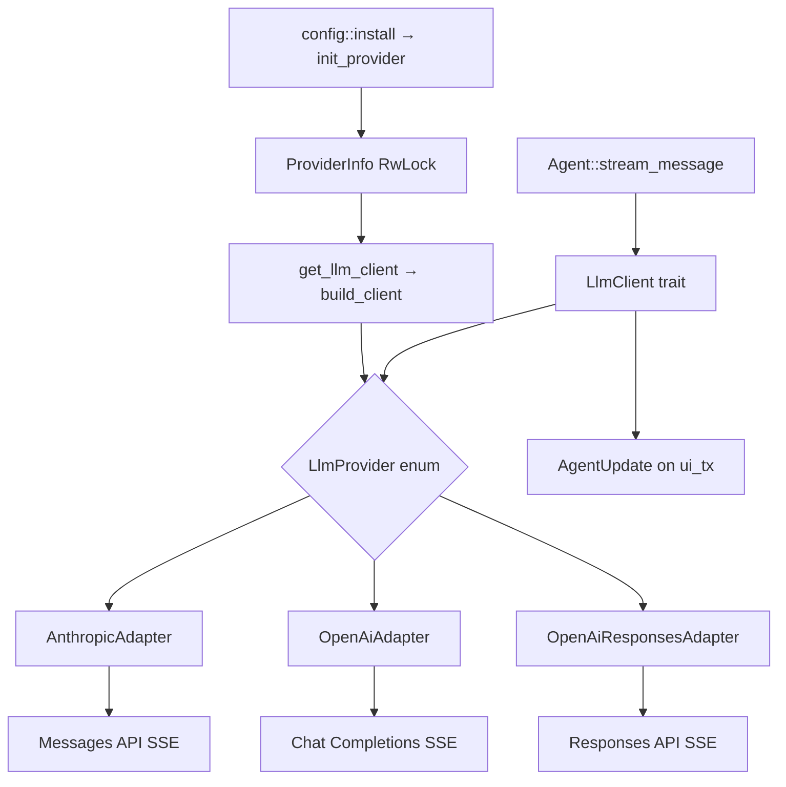
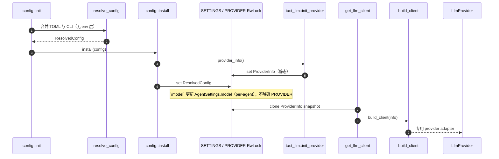
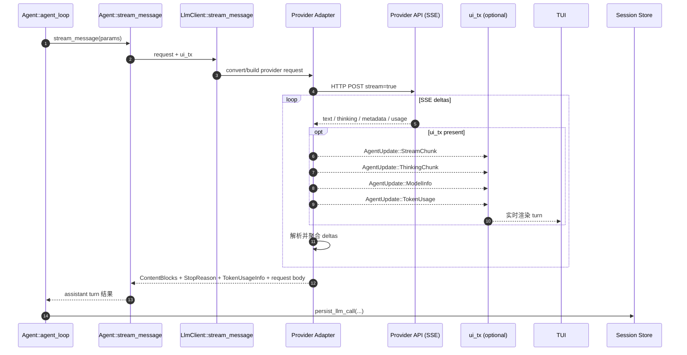
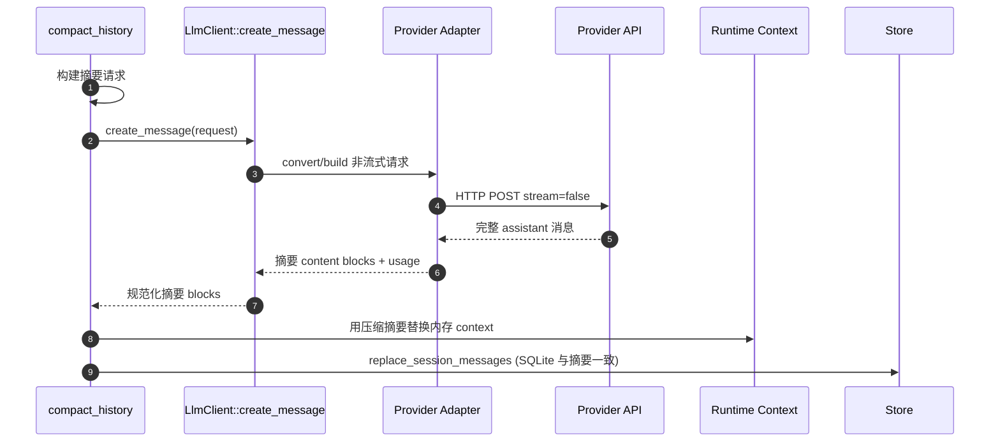
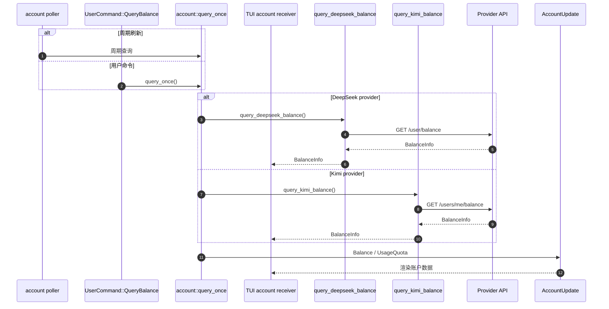

# LLM Providers

> 语言：[中文](./22_chapter_llm_zh.md) · [English](./22_chapter_llm.md)

本章涵盖 `tact_llm` crate：provider 选择、adapter 构建、流式与非流式调用、token 用量、session 级 cache 键，以及 DeepSeek 与 Kimi 的余额查询。

本层配置在 [Ch 21 配置](./21_chapter_config_zh.md) 中 resolve。Agent 循环通过 `Agent::stream_message` 消费 client（[Ch 18 Agent Main Loop](./18_chapter_agent_loop.md)）。

实现：`crates/tact_llm/src/`（`lib.rs`、`client.rs`、`provider.rs`、`types.rs`、`content.rs`、`anthropic/`、`openai/`、`deepseek/`、`kimi/`、`convert.rs`）。

---

## 1. 架构概览


```mermaid
flowchart TB
    Config[config::install → init_provider] --> PI[ProviderInfo RwLock]
    PI --> Build[get_llm_client → build_client]
    Build --> LP{LlmProvider enum}
    LP --> Anthropic[AnthropicAdapter]
    LP --> OpenAi[OpenAiAdapter]
    LP --> Responses[OpenAiResponsesAdapter]
    Anthropic --> API1[Messages API SSE]
    OpenAi --> API2[Chat Completions SSE]
    Responses --> API3[Responses API SSE]
    Agent[Agent::stream_message] --> LlmClient[LlmClient trait]
    LlmClient --> LP
    LlmClient --> TUI[AgentUpdate on ui_tx]
```

三个 adapter 家族共享同一 trait：

| Adapter | Providers | HTTP API |
|---------|-----------|----------|
| `AnthropicAdapter` | `anthropic` | Anthropic Messages（`/messages`） |
| `OpenAiAdapter` | `openai`、`deepseek`、`kimi` | OpenAI 兼容 Chat Completions |
| `OpenAiResponsesAdapter` | 配置 `protocol = "responses"` 的 `openai` | OpenAI Responses（`/responses`） |

DeepSeek 与 Kimi 复用 `OpenAiAdapter`，默认 base URL 来自 config resolve。

---

## 2. ProviderInfo 与初始化

```rust
pub enum ProviderKind {
    Anthropic,
    OpenAi,
    DeepSeek,
    Kimi,
}

pub enum OpenAiProtocol {
    ChatCompletions,
    Responses,
}

pub struct ProviderInfo {
    pub api_key: String,
    pub base_url: String,
    pub model: String,
    pub provider: ProviderKind,
    pub protocol: OpenAiProtocol,
}
```

`ProviderKind` 是 config、CLI（`FromStr`）与 `build_client`（穷尽 match）的单一身份类型。TOML 名称为小写：`anthropic` | `openai` | `deepseek` | `kimi`。

启动时安装（测试 override 下可 re-init）。provider 是**静态快照**：`/model` 不再修改它。per-agent model 存于 `AgentSettings.model`（经 `UserCommand::SetModel` 更新）、per-request 存于 `CreateMessageParams.model`——wire 形状启发式（`is_kimi_k2x`、body hook 选择）读取 *request* model，因此 `/model` 切换无需重建 client 即可改变 wire。`RwLock<Option<ProviderInfo>>` 保留用于 test-support override；生产 install 只执行一次。

```rust
// crates/tact/src/config/mod.rs
pub fn install(config: ResolvedConfig) {
    tact_llm::init_provider(config.llm.provider_info());
    *SETTINGS.write().expect("tact config lock poisoned") = Some(config);
}
```

运行时访问：

```rust
let mut client = tact_llm::get_llm_client()?;
client.set_user_id(&session_id);   // DeepSeek per-session KV cache 隔离
```

`build_client()` 校验非空 `api_key` 并按 `ProviderKind` match。Anthropic、DeepSeek 与 Kimi 选择各自专用 variant。OpenAI 再按 `protocol` match：`chat_completions` 选择 `LlmProvider::OpenAi`，`responses` 选择 `LlmProvider::OpenAiResponses`。协议默认 `chat_completions`；非 OpenAI provider 配置 `responses` 会被拒绝。


```mermaid
sequenceDiagram
    autonumber
    participant Init as config::init
    participant Resolve as resolve_config
    participant Install as config::install
    participant State as SETTINGS / PROVIDER RwLock
    participant LlmInit as tact_llm::init_provider
    participant Get as get_llm_client
    participant Build as build_client
    participant Provider as LlmProvider

    Init->>Resolve: 合并 TOML 与 CLI（无 env 层）
    Resolve-->>Init: ResolvedConfig
    Init->>Install: install(config)
    Install->>LlmInit: provider_info()
    LlmInit->>State: set ProviderInfo（静态）
    Install->>State: set ResolvedConfig
    Note over State: `/model` 更新 AgentSettings.model（per-agent），不触碰 PROVIDER
    Get->>State: clone ProviderInfo snapshot
    Get->>Build: build_client(info)
    Build-->>Provider: 专用 provider adapter
```

Provider 初始化从 Ch 21 的 resolved 配置流入 `tact_llm`。活跃 `ProviderInfo` 是**静态快照**；mid-session 的 `/model` 切换更新 `AgentSettings.model`（per-agent），请求模型随 `CreateMessageParams.model` 传递。

---

## 3. Kimi / DeepSeek 检测辅助函数

`ProviderInfo` 上的启发式辅助函数（也在 crate 根 re-export）：

| 函数 | 用途 |
|------|------|
| `is_kimi()` | `provider == Kimi`，**或** base URL / model 含 moonshot/kimi |
| `is_kimi_k2x()` | K2.x 家族 — 驱动 **32k max_tokens** 默认值与 Kimi thinking wire shape |
| `is_kimi_k27()` | K2.7-code / `kimi-for-coding` / `api.kimi.com/coding` |
| `is_deepseek()` | `provider == DeepSeek`，**或** URL/model 含 deepseek |

因此 `provider = openai` + Moonshot 兼容 `base_url` 在 thinking 注入上仍按 Kimi 行为。余额轮询仅对官方 HTTPS `api.moonshot.cn` / `api.moonshot.ai` 主机启用；自定义代理绝不会把凭据转发给 Moonshot。更推荐专用 `[llm.providers.kimi]` 条目。

---

## 4. LlmClient Trait

```rust
#[async_trait]
pub trait LlmClient: Send + Sync {
    async fn stream_message(
        &self,
        request: &CreateMessageParams,
        ui_tx: Option<UnboundedSender<AgentUpdate>>,
    ) -> Result<(Vec<ContentBlock>, Option<StopReason>, Option<TokenUsageInfo>, Option<LlmRequestBody>), LlmError>;

    async fn create_message(
        &self,
        request: &CreateMessageParams,
    ) -> Result<(...), LlmError>;
}
```

| 方法 | 使用者 |
|------|--------|
| **`stream_message`** | `Agent::agent_loop` — 发出 `StreamChunk`、`ThinkingChunk`、`ModelInfo`、`TokenUsage` |
| **`create_message`** | `compact_history` — 非流式摘要（[Ch 5](./05_chapter_compact_zh.md)） |

两者均返回序列化请求体（`LlmRequestBody`）供 session-store 调试。

错误统一为 `LlmError::Anthropic`、`LlmError::OpenAi` 或 `LlmError::Other`。

### StopReason（与 provider 无关）

`StopReason` 由 `tact_llm` 拥有（`types.rs`）— **不**从 Anthropic SDK re-export。Adapter 在边界将 provider 原生字符串规范化，agent 循环从不匹配原始 API 值：

```rust
pub enum StopReason {
    EndTurn,          // anthropic end_turn / openai stop
    MaxTokens,        // max_tokens, model_context_window_exceeded / length
    StopSequence,     // stop_sequence / content_filter
    ToolUse,          // tool_use / tool_calls, function_call (legacy)
    Refusal,          // anthropic refusal (safety classifier, HTTP 200)
    PauseTurn,        // anthropic pause_turn (server-tool loop paused)
    Unknown(String),  // 未识别值 — 保留原始字符串供诊断
}
```

| 构造器 | 输入 | 说明 |
|--------|------|------|
| `StopReason::from_anthropic` | Messages API `stop_reason` 字符串 | `model_context_window_exceeded` → `MaxTokens`（视为截断） |
| `StopReason::from_openai` | Chat Completions `finish_reason` 字符串 | 旧版 `function_call` → `ToolUse`；`content_filter` → `StopSequence` |

未知值变为 `Unknown(raw)` 而非解析失败，新 provider 值可优雅降级。各 variant 如何驱动循环（继续 / 工具 / 错误）见 [Ch 18 §4](./18_chapter_agent_loop.md#4-stop-reasons-and-loop-exit)。


```mermaid
sequenceDiagram
    autonumber
    participant AgentLoop as Agent::agent_loop
    participant Agent as Agent::stream_message
    participant Client as LlmClient::stream_message
    participant Adapter as Provider Adapter
    participant API as Provider API (SSE)
    participant UI as ui_tx (optional)
    participant TUI as TUI
    participant Store as Session Store

    AgentLoop->>Agent: stream_message(params)
    Agent->>Client: request + ui_tx
    Client->>Adapter: convert/build provider request
    Adapter->>API: HTTP POST stream=true
    loop SSE deltas
        API-->>Adapter: text / thinking / metadata / usage
        opt ui_tx present
            Adapter-->>UI: AgentUpdate::StreamChunk
            Adapter-->>UI: AgentUpdate::ThinkingChunk
            Adapter-->>UI: AgentUpdate::ModelInfo
            Adapter-->>UI: AgentUpdate::TokenUsage
            UI-->>TUI: 实时渲染 turn
        end
        Adapter->>Adapter: 解析并聚合 deltas
    end
    Adapter-->>Agent: ContentBlocks + StopReason + TokenUsageInfo + request body
    Agent-->>AgentLoop: assistant turn 结果
    AgentLoop->>Store: persist_llm_call(...)
```

流式 turn 是 [Ch 18](./18_chapter_agent_loop.md) 的热路径：adapter 翻译共享请求、流式 provider 特定 SSE、可选发出 UI 更新，并向循环返回规范化 assistant 内容。


```mermaid
sequenceDiagram
    autonumber
    participant Compact as compact_history
    participant Client as LlmClient::create_message
    participant Adapter as Provider Adapter
    participant API as Provider API
    participant Context as Runtime Context

    Compact->>Compact: 构建摘要请求
    Compact->>Client: create_message(request)
    Client->>Adapter: convert/build 非流式请求
    Adapter->>API: HTTP POST stream=false
    API-->>Adapter: 完整 assistant 消息
    Adapter-->>Client: 摘要 content blocks + usage
    Client-->>Compact: 规范化摘要 blocks
    Compact->>Context: 用压缩摘要替换内存 context
    Compact->>Store: replace_session_messages (SQLite 与摘要一致)
```

压缩复用同一 provider adapter 但不走 SSE；概念上是 Ch 5 摘要路径与流式循环并行运行。

---

## 5. Anthropic Adapter

`anthropic/mod.rs` 使用直接 HTTP + SSE（`reqwest-eventsource`），而非 SDK 流式 client，以便将新 `stop_reason` 值映射到 Tact 自有 [`StopReason`](../crates/tact_llm/src/types.rs)，无需等待 Anthropic SDK enum。

流式路径：

1. POST JSON 到 `{base_url}/messages`，`stream: true`。
2. 将 SSE 事件解析为 `ContentBlockDelta` variant。
3. 将 text/thinking 转发到 `ui_tx` 为 `AgentUpdate::StreamChunk` / `ThinkingChunk::{Started,Delta,Finished}`。
4. 发出 `AgentUpdate::ModelInfo`（模型名与生成限制）。
5. 聚合最终 blocks、`StopReason` 与 `TokenUsageInfo`。

Anthropic adapter 不会把 session `user_id` 附加到请求 metadata。

---

## 6. OpenAI API 与兼容 Adapter

### 6.1 Chat Completions 与兼容 provider

`openai/mod.rs` 提供共享 Chat Completions HTTP/SSE transport。专用的 `deepseek/mod.rs`、`kimi/mod.rs` 与 `openai/multi_model.rs` adapter 在公共请求转换后选择 provider 特定 body hook。

值得注意的行为：

- **SSE 解析** via `eventsource-stream`（正确处理 `\n\n` / `\r\n\r\n`）。
- **`reasoning_content` 字段**映射到 `ThinkingChunk::{Started, Delta, Finished}`（合成生命周期），供 DeepSeek/Kimi 推理模型使用。
- **Tool call deltas** 按流事件中 `index` 重组。
- **`StreamUsage`** 捕获 prompt/completion tokens、cache hit/miss（DeepSeek）与 `reasoning_tokens`。
- **`set_user_id`** 仅在选中的 body hook 为 DeepSeek 时向 JSON 体添加 `"user_id"`。

`convert.rs` 从共享 `CreateMessageParams` 构建 provider 特定请求 JSON（Tact 内部全程使用 Anthropic message 形状）。

**Tools，非 legacy functions：** 请求使用当前 `tools` / `tool_choice` API（并行 `tool_calls`、`role: "tool"` 结果）。已弃用 2023 时代的 `functions` / `function_call` 字段始终发 `None`（struct literal 要求）；仅*响应*值 `finish_reason=function_call` 仍接受并映射为 `StopReason::ToolUse`，兼容旧 OpenAI 兼容服务。

**用户图片附件：** TUI/headless 将 `@file.png` / `` 转为 `ContentBlock::Image`（[Ch 23](./23_chapter_tui_zh.md)）。OpenAI 兼容请求中，`messages_to_openai` 将这些 block 映射为 `{ type: "image_url", image_url: { url: "data:<media_type>;base64,..." } }`。Anthropic 保留原生 Messages `image` + base64 `source` 形状。无 per-model vision 能力门控：纯文本 Chat Completions API（或 content-part enum 仅允许 `text` 的代理）会对 `image_url` 返回 HTTP 400。

**Kimi reasoning replay：** `messages_to_openai` 返回与发出的 OpenAI 消息**一一对应**的 `reasoning` 向量（非 Anthropic 源消息）。用户 turn 拆成多条 tool-result 消息时，每条得 `None`；assistant thinking 仅附在匹配的 assistant 行。`inject_reasoning_content` 用该并行向量服务 Kimi/Moonshot。

**不完整 tool calls：** 流式与非流式解析器跳过 `id` 或 `name` 为空的 tool-call 槽，避免截断 SSE 插入 phantom `ToolUse` block。

**空 assistant 清理：** 因 thinking block 在面向非 Kimi OpenAI 兼容 API 时被丢弃，仅含 thinking（或截断后仅剩 orphan tool calls）的 assistant turn 会序列化为 `{ "role": "assistant", "content": null, "tool_calls": null }` 并被 400 拒绝。`convert.rs` 中 `sanitize_assistant_messages` 对这类消息打 stub 并在每次请求剥离 orphan `tool_calls`。完整上下文见 [错误恢复](./06_chapter_recovery.md)。

### 6.2 Responses API

OpenAI provider entry 需要显式 opt-in：

```toml
[llm.providers.openai]
api_key = "sk-..."
model = "gpt-4o"
protocol = "responses"
reasoning_effort = "high"
```

`openai/responses/` 通过依赖别名使用 `async-openai` 0.41.1；现有 Chat Completions 类型保留在 0.20，使 Kimi 与 DeepSeek 的非标准 wire 形不发生变化。Adapter 在同一个 provider 无关 contract 后实现流式 `stream_message` 与非流式 `create_message`。该别名启用 SDK 的 `byot` 扩展：请求仍从 SDK 类型构建，最终 JSON dispatch 可以发送 SDK enum 尚未暴露的当前 `max` effort；Response 与 stream event 继续使用 SDK 类型。

Tact 继续拥有 conversation。每次请求以 `store: false` 发送**已持久化的协议基线 + 新出现的逻辑消息**；不使用 Conversations 或 `previous_response_id`。转换覆盖 system instructions、用户/assistant 文本、图片 data URL、function call、function output、function tools、tool choice、采样字段，以及 `max_tokens → max_output_tokens`。`top_k` 与 stop sequences 因 Responses 请求类型无对应字段而省略。

Responses 请求包含 `reasoning.encrypted_content`。返回的 reasoning item 转为 `ContentBlock::Thinking`：summary 文本存入 `thinking`，`signature` 保存一个带版本的 opaque envelope，其中包含完整 reasoning item 与相关 `fc_*` function-call item id。下一次请求由该 envelope 重建原始 `rs_*` / `fc_*` identity；没有 encrypted payload 的 thinking block 仅用于显示，不发送回 API。

Responses 使用独立的 `responses_system_prompt_template.md`，不改变其他 provider 模板。其 skill 加载策略禁止对问候、闲聊和普通问题调用 `load_skill`；必须由用户显式 slash 调用或明确要求使用某个 skill，且 skill 描述不得自行要求必须调用该 skill。

流式 delta 用于实时 UI，并保留可见输出文本作为回退。Reasoning summary/text delta 映射为 `ThinkingChunk`，可见 output/refusal delta 映射为 `StreamChunk`；当终态包含完整输出时，terminal `response.completed` / `response.incomplete` 对象是最终 blocks、tool calls、usage 与 stop reason 的权威来源。部分兼容端点不会在终态对象中返回最终 message，此时已收到的输出文本 delta 会恢复为最终文本 block。这样在正常情况下仍避免 delta 与 terminal event 中同一内容重复。流 adapter 仅反序列化实际消费的 event type，其他或更新的 provider event 会忽略。兼容端点的终态 event 若缺少 response/output-item ID，则仅为满足 SDK schema 写入内部占位值；Tact 不会将其当作 provider 身份。若缺少 terminal response、output message 或 function call 的 status，则从 terminal event type 推断。请求包含工具且调用方未选择其他策略时，会显式发送 `tool_choice: "auto"`，避免兼容端点以禁用工具作为默认行为。回放 assistant 历史时，Tact 将文本序列化为已完成的 Responses output message（带 `output_text` 和稳定的本地 item ID），而不是 assistant `input_text` message；严格兼容端点的多轮请求需要这一形式。Input/cache/output/reasoning token 数映射到现有 `TokenUsageInfo` 字段。
用量计数器是**受检转换**：必填 token 字段缺失、不是无符号整数、或大于
`u32` 都是硬性协议错误 — 数值绝不会被截断、回绕或钳制。

此 adapter 不支持：server-hosted tools、background responses、Conversations 与
`previous_response_id`。原生压缩是受支持的：解析出压缩阈值后，普通请求会携带
`context_management`；`compact()` 会发送显式 `POST /responses/compact` 请求
（见 [Ch 5](./05_chapter_compact_zh.md)）。

#### 6.2.1 转换流水线：`Message` → `/responses` input

Responses adapter 接收的仍是与其他 provider 相同的共享 `CreateMessageParams`。关键区别在于，它输出的是异构的 `/responses` `input` 数组，而不是 chat 风格的 role/content 消息列表。

`create_response` 会执行以下步骤：

1. 当提供了合法 `ResponsesConversationState` 时，原样取用其中已持久化的基线
   `input_items`；否则从空开始。
2. 只遍历 `request.messages` 中超出基线 `logical_message_count` 的未覆盖后缀，
   对每条 `Message` 调用 `message_to_input`。
3. 把返回的 `InputItem` 追加到基线 items 之后，扁平化进最终 `input` 数组。
4. 追加请求级字段：`instructions`、`tools`、`tool_choice`、`reasoning`、
   `temperature`、`top_p`、`max_output_tokens`、`store: false`；解析出压缩阈值
   时还会追加 `context_management`（`[{ "type": "compaction",
   "compact_threshold": N }]`）。
5. 规范化 assistant 历史项，使先前 assistant 文本变成已完成的 Responses output message，带稳定本地 ID 与 `output_text` content。

逐消息映射如下：

| Tact 共享内容 | 发出的 Responses item |
|---|---|
| `Message::Text(User)` | `message(role=user, content=text)` |
| `Message::Text(Assistant)` | assistant `message`，随后被规范化为 completed output 形式 |
| `ContentBlock::Text` | 当前消息里的 `input_text` |
| `ContentBlock::Image` | 带 data URL 的 `input_image` |
| 带可解码 signature 的 `ContentBlock::Thinking` | 独立的 `reasoning` item |
| `ContentBlock::ToolUse` | 独立的 `function_call` item |
| `ContentBlock::ToolResult` | 独立的 `function_call_output` item |
| `ContentBlock::RedactedThinking` | 省略 |

有两个细节对多轮正确性尤其重要：

- `flush_message_content` 会先把已累积的 text/image part 作为一条消息发出，**然后**再发出独立的 reasoning 或 tool item，保证顺序符合 Responses API 预期。
- `normalize_assistant_history_items` 会把 assistant 历史重写成 completed output message，因为有些兼容端点会拒绝把旧 assistant turn 当作普通 assistant input text 回放。

#### 6.2.2 与压缩的交互：Responses 的特殊点

当配置 `protocol = "responses"` 时，压缩是**原生**的：不存在本地摘要重建，
`compact_history` 也**不会**改写逻辑 context（`runtime.context`）（见
[Ch 5](./05_chapter_compact_zh.md)）。Responses adapter 负责精确的
**转换 / 状态边界**：

- **状态基线** — `ResponsesConversationState` 保存不透明协议基线：
  `input_items`（此前 terminal outputs 的原样 JSON，含 `compaction` 与
  `reasoning` item）、`compaction_id`、`is_compacted`、`logical_message_count`
  与 `logical_context_hash`。
- **校验** — 复用前，`validate_conversion_state` 检查持久化状态是否绑定到同一
  provider/model，并确认基线覆盖的逻辑消息前缀哈希与记录值一致。不一致是硬性
  协议错误；Tact 绝不静默重复、截断或重建基线。
- **增量转换** — `create_response` 发送状态基线原文，再加上仅新出现的逻辑
  消息转换出的 `/responses` items。无状态时则转换全部逻辑消息。
- **`context_management`** — 解析出压缩阈值（配置或推导）后，每个普通
  `/responses` 请求都会携带
  `context_management: [{ "type": "compaction", "compact_threshold": N }]`，
  端点可以在正常流式过程中自动压缩基线。推导阈值按 agent 分别解析：subagent
  使用**subagent 自己的 `max_tokens`** 预算推导（结合共享 context window 与
  10% 余量），绝不使用主 agent 的预算。
- **显式 `/responses/compact`** — 当 Tact 决定压缩时，agent 调用 adapter 的
  `compact()`：发送真正的 `POST /responses/compact` 请求，携带当前基线加未覆盖
  消息。返回的 compact resource 替换基线；`focus` 文本无意义并被忽略。
  显式调用的 usage 行（`responses_compact`）持久化**不是**尽力而为：该行写入
  失败时，压缩会在**任何**新消息 / provider 状态提交之前以错误失败，旧提交
  状态完全保持原样，且不会记录任何压缩。
- **状态更新** — 每次调用返回 `LlmResponse`，内含
  `state_update: ProviderStateUpdate`（`Replace(新状态)` 或 `Unchanged`）。
  对于普通终态响应，替换基线已包含请求输入**加**终态输出，因此
  `logical_message_count` 与 `logical_context_hash` 锚定在**assistant 之后**
  的逻辑 context（请求消息加 agent 随后 push 的 assistant 消息）；下一轮只
  转换新的 user/tool 后缀，绝不重复 assistant/reasoning/function-call item
  或 id。仅当终态响应完全没有输出 items 时（兼容端点可见文本恢复路径），锚点
  才停留在请求前缀，使 assistant 消息在下一轮被转换而不是丢失。agent 在任何
  后续 LLM 调用或工具执行之前，用**同一事务**提交 assistant 消息与状态基线。

#### `LlmResponse` 与终态响应权威

`LlmResponse` 是 adapter 唯一的返回契约：

| 字段 | 含义 |
|------|------|
| `blocks` | 交给 TUI / agent 的最终 `ContentBlock` |
| `stop_reason` | 终态 stop reason |
| `usage` | token 用量（若有上报） |
| `request_body` | 实际发送的序列化 JSON body（会话调试用） |
| `state_update` | `ProviderStateUpdate::Replace(…)` 或 `Unchanged` |

当终态包含完整输出时，terminal `response.completed` / `response.incomplete`
对象是最终 blocks、tool calls、usage 与 stop reason 的**权威来源**。流式 delta
仅用于实时 UI；兼容端点若在终态对象中省略最终 message，则已收到的输出文本
delta 恢复为最终文本 block，缺失的 output-message / function-call status 从
terminal event type 推断。为兼容端点注入的占位 id 绝不被当作 provider 身份。

#### `compaction` item 的往返

`compaction` item 要么出现在显式 `/responses/compact` resource 中，要么出现在
自动 `context_management` 压缩后普通请求的 terminal output 里。两种情况下它都
以**不透明状态**往返，而不是内容：

1. `normalize_response` 按输出顺序把每个 terminal output item 保留为 JSON
   （`output_items`），包括 `compaction` item 以及 typed SDK 已知的每种 item
   类型（file/web search 等未映射类型不产生 `ContentBlock`，但仍被保留）。
   一个 terminal response 至多含一个 compaction item，且其
   `encrypted_content` 必须非空。真正未知的未来 item 类型会被 typed SDK 边界
   拒绝（async-openai `OutputItem` 没有 `Unknown` variant）：这是硬性协议
   错误，绝不静默丢弃，也绝不回退。
2. `state_update` 把这些 items 打包进下一次请求的 `input_items` 基线，
   `create_response` 在后续调用中**原样**回放。
3. 该 item **绝不会**映射为 `ContentBlock`：`encrypted_content` 是不透明
   provider 状态，不是 assistant 文本，绝不出现在 TUI 渲染、
   `AgentUpdate::Info` 消息、`tracing` 输出或错误字符串中。面向用户的诊断
   只显示**有界的 compaction-id 前缀**；完整 id 仅保留在 provider 状态与
   SQLite 元数据中。

流式中被宣布（`output_item.added`）但从未完成的 compaction item 是流 adapter
`finish()` 中的**硬性协议错误**：既不能走 done-sequence 重建，也不能走
可见文本恢复 — 两者都会静默丢弃 compaction 边界，丢失下一轮所需的压缩后基线。
流会响亮失败，绝不会把流式输出文本当作最终结果来“恢复”。

为什么不是 `ContentBlock`？因为 `ContentBlock` 是 agent loop 会渲染、持久化并
可能参与工具分派的逻辑内容；`compaction` item 是协议管道：它只用于告诉端点
基线已被压缩，并携带 Tact 无法解读的不透明载荷。把它当作内容会向 UI 泄漏
加密的 provider 状态，并破坏往返（必须回放精确 JSON，而不是从可见字段重建）。

#### 6.2.3 Reasoning 历史回放

Responses reasoning item 并不是从可见文本重新推导出来的。相反，Tact 会把一个带版本的 opaque signature（`openai-responses-v1:...`）持久化在 `ContentBlock::Thinking` 中。该 payload 保存：

- 完整的 `ReasoningItem`
- 本地 tool call id 到 provider `function_call` item id 的映射

后续请求中，`history::decode` 可以恢复这份状态，使 `message_to_input` 发出：

- 一个正确的独立 `reasoning` item
- 在可用时带匹配 provider item id 的 `function_call` item

这也是为什么即使 adapter 每次都从持久化基线 + 本地消息重建请求，而不是依赖服务端 `previous_response_id` 链，compact 过的会话依然能回放 Responses-native 的 reasoning / function-call 历史。

**加密边界。** reasoning 的 `encrypted_content` **只允许**存在于这个内部、
不可渲染的 signature envelope 中：绝不进入可见的 `thinking` 摘要文本，绝不
进入可渲染的 `ContentBlock::Text`，绝不进入持久化的输出文本，也绝不进入错误
字符串或 `Info` 诊断。这与 compaction 载荷的“加密数据保持不透明”规则相同，
但载体不同：compaction 的 `encrypted_content` 从不进入任何 `ContentBlock`
（它**仅为 provider 状态**，只存在于协议基线与请求体中）；而 reasoning 加密
数据由 `Thinking` block 的内部 signature 携带，以便可以回放为原生 `reasoning`
item。

### 6.3 共享 thinking 配置

**Thinking / reasoning 注入：** 内部请求携带 Anthropic 形 `Thinking { budget_tokens }` 以及显式 per-request `reasoning_effort`（`CreateMessageParams.reasoning_effort`）。Provider body hook 将其改写为各 wire 协议。**budget→effort 波段映射已删除**：`reasoning_effort = None` 表示不发送该字段（使用 provider 默认），`Some` 原样发送。

| Provider | effort/thinking 设置时 | Wire 字段 |
|----------|------------------------|-----------|
| Anthropic | 始终（原生 Messages 类型） | `thinking: { type, budget_tokens }` |
| Kimi K2.5 | budget > 0 | `thinking: { type: "enabled" }`；否则 `disabled` |
| Kimi K2.6 | budget > 0 | `thinking: { type: "enabled", keep: "all" }`；否则 `disabled` |
| Kimi K2.7 / coding | 跳过 | *（服务端始终开启 thinking）* |
| Kimi K3 / K3-256k | `Some(low\|high\|max)` | `thinking: { type: "enabled" }` + `reasoning_effort` 原值；`None` → 不发送（服务端默认开启 + high） |
| DeepSeek | `Some(low\|high\|xhigh\|max)` | `thinking: { type: "enabled" }` + `reasoning_effort` 原值（服务端按模型映射 flash/pro）；`None` → 不发送（默认开启 + high） |
| OpenAI Chat Completions | `Some(...)` | `reasoning_effort: minimal\|low\|medium\|high\|xhigh\|max`；`None` → 不发送（默认 medium） |
| OpenAI Responses | `Some(...)` | `reasoning: { effort, summary: auto }`；`None` → 不发送 |

effort 是 **per-request**：随 `CreateMessageParams.reasoning_effort` 从 agent 自己的
`AgentSettings.reasoning_effort` 传递（主 agent 与 subagent 相互独立——无全局
effort 状态）。`[llm.providers.*].reasoning_effort` 配置值作为主 agent 快照的
种子；`/model` 的 effort 选择经 `UserCommand::SetReasoningEffort` 运行时更新。
`ModelCallParams.reasoning_effort` 向 TUI 报告会话值。具体支持取决于模型，参见
[OpenAI reasoning 指南](https://developers.openai.com/api/docs/guides/reasoning)、
[DeepSeek thinking mode](https://api-docs.deepseek.com/zh-cn/guides/thinking_mode)
与 [Kimi Code models](https://www.kimi.com/code/docs/kimi-code/models.html)。

**`/model` 第二步** 按所选模型的语义分流（`tact_llm::model_uses_effort`，与
body hook 同一套启发式）：effort 语义模型（openai / deepseek / kimi k3、k3-256k）
打开 effort 选择器；budget 语义模型（anthropic / kimi coding 系）保持 budget
选择器。可选档位来自 `[llm.model_profiles."<model>"]`（或内置默认），否则回落
provider 默认（openai 6 档、deepseek/kimi k3 3 档、budget 5 档）。

---

## 7. 流式 → TUI 事件

`stream_message` 期间，adapter 向可选 `ui_tx` 推送：

| 事件 | `AgentUpdate` |
|------|---------------|
| Text token | `StreamChunk(String)` |
| Reasoning / thinking | `ThinkingChunk::{Started, Delta, Finished}` |
| 请求元数据 | `ModelInfo(ModelCallParams)` |
| 流结束用量 | `TokenUsage { ... }` |

Agent 在每次成功流后通过 `persist_llm_call` 持久化 token 用量（[Ch 1 Store](./01_chapter_store.md)）。

传输失败恢复在 agent 循环中处理，不在 adapter 内（[Ch 6 Recovery](./06_chapter_recovery.md)）。

---

## 8. Session `user_id`

在 `Agent::with_session` 绑定 session 时：

```rust
self.runtime.client.set_user_id(&session_id);
```

| Adapter | 注入位置 |
|---------|----------|
| DeepSeek（包括 OpenAI adapter 的启发式选择） | 请求 JSON 顶层 `"user_id"` |
| Anthropic / Kimi / 原生 OpenAI | 不注入 |

意图：DeepSeek（及兼容代理）上 per-session KV cache 隔离，减少跨 session cache 污染。

---

## 9. 余额查询

| 函数 | 端点 | 使用时机 |
|------|------|----------|
| `query_deepseek_balance()` | `GET .../user/balance` | TUI 启动 + 周期 timer + `/balance` 命令 |
| `query_kimi_balance()` | `GET .../v1/users/me/balance` on `api.moonshot.cn` 或 `api.moonshot.ai` | 同上 |
| `query_kimi_code_usage()` | `GET .../v1/usages` on `api.kimi.com/coding` | Kimi Code 订阅配额 |

`query_*_balance()` 返回 `tact_protocol::BalanceInfo`，并通过独立 account channel 路由为 `AccountUpdate::Balance`。Kimi Code 用量返回 `UsageQuotaInfo` 为 `AccountUpdate::UsageQuota`。

**Kimi Code 端点：** `api.kimi.com/coding` 无余额 REST API。改用 `query_kimi_code_usage()`；在底栏显示为 `AccountUpdate::UsageQuota`（`week` + `5h` 窗口）。

**凭据边界：** Kimi 余额轮询仅在 `base_url` 使用 HTTPS 且主机精确为 `api.moonshot.cn` 或 `api.moonshot.ai` 时启用。自定义 OpenAI 兼容代理视为不支持，代理 API key 绝不会发送到官方 Moonshot 余额端点。

**轮询：** `interactive.rs` 仅在 `account::is_supported()` 为 true 时执行一次启动查询并启动 `account::spawn_poller`。`/balance` 命令通过 command driver 复用同一 `query_once` 路径。


```mermaid
sequenceDiagram
    autonumber
    participant Poller as account poller
    participant Cmd as UserCommand::QueryBalance
    participant Service as account::query_once
    participant TUI as TUI account receiver
    participant DeepSeek as query_deepseek_balance
    participant Kimi as query_kimi_balance
    participant API as Provider API
    participant Update as AccountUpdate

    alt 周期刷新
        Poller->>Service: 周期查询
    else 用户命令
        Cmd->>Service: query_once()
    end
    alt DeepSeek provider
        Service->>DeepSeek: query_deepseek_balance()
        DeepSeek->>API: GET /user/balance
        API-->>DeepSeek: BalanceInfo
        DeepSeek-->>TUI: BalanceInfo
    else Kimi provider
        Service->>Kimi: query_kimi_balance()
        Kimi->>API: GET /users/me/balance
        API-->>Kimi: BalanceInfo
        Kimi-->>TUI: BalanceInfo
    end
    Service->>Update: Balance / UsageQuota
    Update-->>TUI: 渲染账户数据
```

余额检查在 `Agent::agent_loop` 外；TUI 拥有 timer 与命令路径，再通过常规 update handler 渲染 provider 特定结果。

---

## 10. 代码地图

| 文件 | 角色 |
|------|------|
| `tact_llm/src/types.rs` | `ProviderKind`、`OpenAiProtocol`、请求类型及 provider 无关的 `StopReason` |
| `tact_llm/src/content.rs` | 自有 `ContentBlock`、`Message`、`ContentBlockDelta`、`StreamUsage` 等 |
| `tact_llm/src/client.rs` | `LlmClient`、专用 `LlmProvider` variant、session user-id 路由 |
| `tact_llm/src/provider.rs` | `ProviderInfo`、provider 初始化、client 构建、检测辅助 |
| `tact_llm/src/account.rs` | DeepSeek 余额与 Kimi 余额/额度查询 |
| `tact_llm/src/anthropic/mod.rs` | Messages API 流式 + 非流式 |
| `tact_llm/src/openai/` | Chat Completions transport/hooks，以及隔离的 Responses converter、normalizer 与 stream state |
| `tact_llm/src/deepseek/mod.rs` / `kimi/mod.rs` | Provider 特定 thinking 与历史 hook |
| `tact_llm/src/convert.rs` | 请求翻译、Image → `image_url`、Kimi thinking blocks |
| `crates/tact/src/agent/mod.rs` | `stream_message` 包装、`with_session` 中设置 `user_id` |
| `crates/tact/src/compact/mod.rs` | 摘要用 `create_message` |

---

## 11. 当前缺口

| 缺口 | 详情 |
|------|------|
| **仅四个命名 provider** | `ProviderKind` / `FromStr` 拒绝未知名；通用 OpenAI 代理须用 `provider = "openai"` |
| **Adapter 内无重试** | 传输重试/退避在 agent 恢复中，不在 `tact_llm` |
| **无 Anthropic SDK 依赖** | 对话、请求、stop、stream-delta、错误类型均由 `tact_llm` 拥有；Anthropic 仅通过自定义 HTTP + SSE |
| **每次 `get_llm_client()` 重建 adapter** | 每次调用新 adapter 实例；DeepSeek 下 `set_user_id` 变更 `Agent` 持有的副本 |
| **无 vision 能力门控** | 附加图片始终作为 multimodal part 发送；纯文本模型/代理可能对 `image_url` 返回 400 |
| **Responses 仅核心子集** | 无 Conversations、`previous_response_id`、hosted tools 或 background mode（原生压缩受支持） |

### 协议兼容缺口（内部 Anthropic 形 → wire）

`tact_llm` 拥有 [`CreateMessageParams`](../crates/tact_llm/src/types.rs)（serde 用相同 Anthropic *wire 形*，但不再是 SDK 类型）。各 adapter 须翻译字段。下表描述 Chat Completions 路径；Responses 映射见 §6.2。若干 Chat Completions 差异**尚未**处理：

| 内部 / 意图 | Anthropic | DeepSeek / Kimi（OpenAI-compat） | 原生 OpenAI Chat Completions | 状态 |
|-------------|-----------|----------------------------------|------------------------------|------|
| 启用扩展 thinking | `thinking.budget_tokens`（内部） | Anthropic：`thinking.budget_tokens`；DeepSeek/Kimi hook：`thinking.type`（±effort/keep） | OpenAI：`reasoning_effort` | OK — body hook 按 API wire 形映射 |
| Thinking / effort 旋钮 | `thinking_budget` 加可选 OpenAI `reasoning_effort` | 映射到 `budget_tokens` | 显式 effort，否则 `reasoning_effort_from_budget` 档位 | OK（显式 effort 优先） |
| 最大输出 | `max_tokens` | `max_tokens` | o 系列常要 `max_completion_tokens`；部分拒绝 `max_tokens` | 未重映射 |
| System prompt | 顶层 `system` | 首条 `role: system` 消息 | 同上；部分推理模型偏好 `developer` | 始终 `system` |
| Tool 定义 | `tools`（Anthropic schema） | `tools` + `type: function` | 同上现代 tools API | OK（`convert.rs`） |
| Stop / finish reason | `stop_reason` 字符串 | `finish_reason` 字符串 | `finish_reason`（+ legacy `function_call`） | OK（`StopReason::from_*`） |
| Refusal 详情 | `stop_details` | n/a | n/a | 未解析 |
| Cache / user 作用域 | 不发送 | DeepSeek：顶层 `user_id`；Kimi：不发送 | 不发送 | 仅 DeepSeek |
| Stream usage | event usage | `stream_options.include_usage` | 同上 | OK |
| Vision parts | `image` + base64 source | `image_url` data URL | `image_url` | vision 模型 OK；无能力门控 |
| Temperature / top_p | 可选 | 可选 | 许多推理模型拒绝非默认采样 | 盲目透传 |

上述剩余 OpenAI 原生缺口（`max_completion_tokens`、`developer` role、采样限制）仍开放；原 `reasoning_effort` 缺口已修复。

---

## 相关文档

- [Configuration](./21_chapter_config_zh.md) — 凭证与默认值
- [Agent Main Loop](./18_chapter_agent_loop.md) — 流式集成
- [Context Compaction](./05_chapter_compact_zh.md) — 非流式 `create_message`
- [Error Recovery](./06_chapter_recovery.md) — LLM 失败处理
- [TUI](./23_chapter_tui_zh.md) — 余额显示与流渲染
