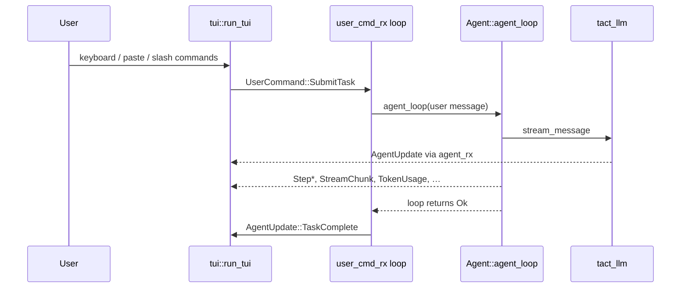
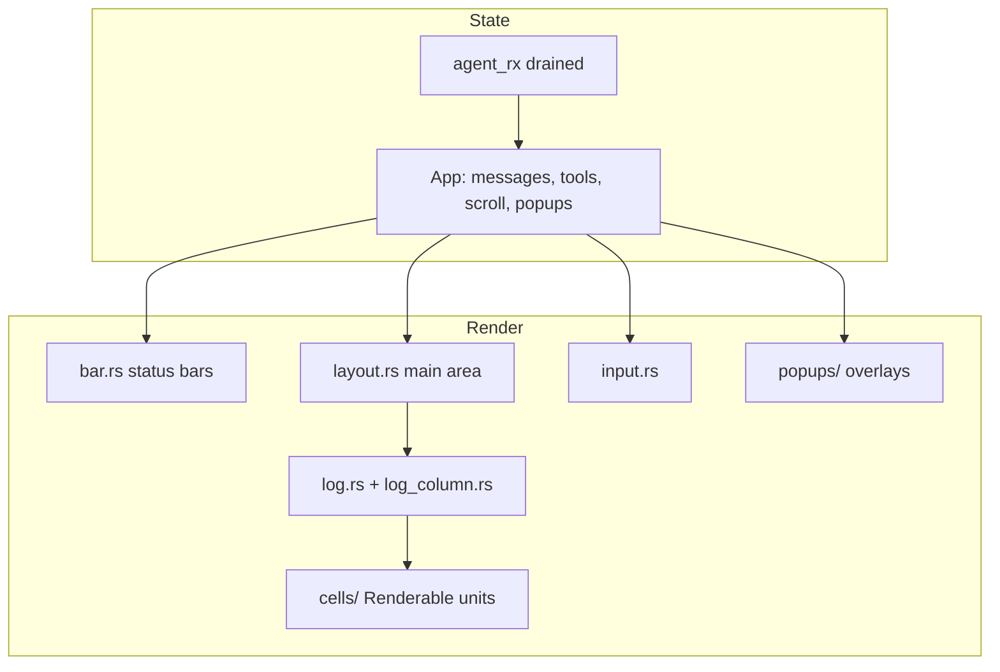
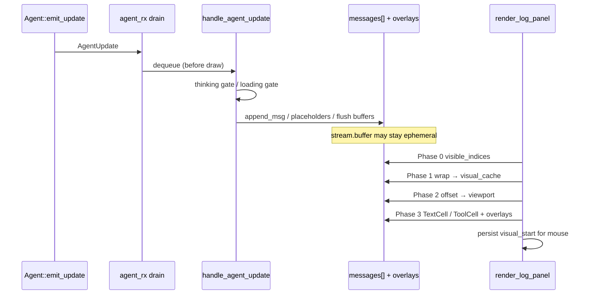

# Terminal UI (TUI)
> Language: [English](./23_chapter_tui.md) · [中文](./23_chapter_tui_zh.md)

This chapter describes the `tui` crate: how `tact-ui` wires the agent loop through async channels, and how the **render layer** turns `App` state into a ratatui frame each tick.

For even more implementation detail (extension recipes, profiling notes), see [docs/tui_rendering.md](../docs/tui_rendering.md).

---

## 1. Process Architecture



Five unbounded MPSC channel pairs bridge the agent task, account service, plugin worker, and the TUI task:

| Channel | Type | Direction |
|---------|------|-----------|
| `agent_tx` / `agent_rx` | `AgentUpdate` | Agent → TUI |
| `user_cmd_tx` / `user_cmd_rx` | `UserCommand` | TUI → agent driver (`tui.rs`) |
| `account_tx` / `account_rx` | `AccountUpdate` | Account service → TUI |
| `plugin_tx` / `plugin_request_rx` | `PluginRequest` | TUI → plugin worker |
| `plugin_event_tx` / `plugin_rx` | `PluginEvent` | Plugin worker → TUI |

`AgentUpdate`, `UserCommand`, and `AccountUpdate` are defined in `tact_protocol`. `PluginRequest` and `PluginEvent` are defined in `tact::plugin`; `tact-ui` starts the worker and the TUI drains plugin events before rendering.

---

## 2. Entry Points

### Interactive (`tact-ui`)

`run_interactive` in `crates/tact-ui/src/interactive.rs` (dispatched from `main.rs`):

1. `tact::config::init()` — settings + LLM provider ([Ch 21](./21_chapter_config.md)).
2. Open SQLite session store, resolve `session_id` (`--session`, `--resume-last`, or new UUID). `--resume-last` and `--list-sessions` filter sessions by the current workdir's `root_dir` so other projects' rows are ignored. `SessionLockGuard` retries `try_lock_session` on contention before failing.
3. Build `Agent` with `toolset()`, MCP router, managers, and `with_ui_channel(agent_tx)`.
4. Spawn `tui::run_tui(...)` on a separate tokio task.
5. Loop on `user_cmd_rx` — dispatch `SubmitTask`, `Cancel`, `QueryBalance`.

Theme comes from `config::settings().ui.theme` (default `"retro"`).

### Headless (`tact-ui headless "prompt"`)

`run_headless` in `crates/tact-ui/src/headless.rs`. Runs a single `agent_loop` without TUI, prints final text to stdout, sends a desktop notification. Tool progress remains final-result-only because there is no live card. Uses config-driven permission mode — same as interactive mode.

---

## 3. `UserCommand` Protocol

```rust
pub enum UserCommand {
    SubmitTask(String),
    Cancel,
    QueryBalance,
}
```

| Command | Source | Handler in `tui.rs` |
|---------|--------|---------------------|
| **`SubmitTask`** | Enter in insert mode, slash commands, `@` file picker submit | Reset `tool_use_counter`, clear `cancel_flag`, `build_user_message`, `agent_loop`; emit `TaskComplete` only if loop succeeds and was not cancelled |
| **`Cancel`** | `/cancel`, or Normal-mode `c` while `Planning` / `Executing` | Set `cancel_flag`; loop exits at next check; next `SubmitTask` clears the flag ([Ch 18](./18_chapter_agent_loop.md)) |
| **`QueryBalance`** | `/balance` (DeepSeek/Kimi only) | `account::query_once()` → `AccountUpdate` channel ([Ch 25](./25_chapter_protocol.md)) |

`build_user_message` (in `crates/tact-ui/src/user_message.rs`) parses inline `` images and `@file` references into multimodal `ContentBlock`s. Raster images use `[ui.vision_image]` in config: `compress` (default `true`) downscales and re-encodes as JPEG (`max_edge` 1280, `jpeg_quality` 80); set `compress = false` to send the original file bytes. File paths are resolved with `tact::tool::safe_path` — references outside the workspace are left unchanged in the prompt text.

**Vision capability required.** Compression only shrinks payloads; it does not make a text-only model accept images. On OpenAI-compatible providers (`openai` / `deepseek` / `kimi`), `ContentBlock::Image` is converted to Chat Completions `image_url` parts ([Ch 22](./22_chapter_llm.md)). Endpoints that only deserialize `text` content parts return HTTP 400 (`unknown variant image_url, expected text`). Anthropic uses native Messages API image blocks instead. Use a multimodal model, or do not attach images.

---

## 4. `AgentUpdate` Handling

Protocol types, step lifecycle, and task-level transitions: [Ch 25](./25_chapter_protocol.md).

The TUI consumes updates in `crates/tui/src/widgets/state/app/agent.rs` → `handle_agent_update`.

| Update | UI effect |
|--------|-----------|
| `StreamChunk` | Append to active assistant text cell |
| `ThinkingChunk` | Thinking card / preview |
| `StepAdded` / `StepStarted` / `StepFinished` / `StepFailed` | Tool timeline ([Ch 11](./11_chapter_task.md)) |
| `ToolProgress` | Update the matching active tool's 1→3 line live tail |
| `RequestSelect` | Permission popup ([Ch 10](./10_chapter_permission.md)) |
| `TokenUsage` | Status bar counters |
| `ModelInfo` | Model name / limits display |
| `TaskComplete` | Mark task done, enable follow-up input |
| `Error` | Error banner with `AgentErrorKind` |
| `Info` | System message line |

Balance and quota use the separate `AccountUpdate` channel (`crates/tact-ui/src/account.rs`), not `AgentUpdate`.

**Important:** `Agent::agent_loop` does **not** emit `TaskComplete`. `interactive.rs` sends it only after a successful, non-cancelled loop return:

```rust
match agent.agent_loop(Some(task_message)).await {
    Ok(()) if !agent.runtime.cancel_flag.load(Ordering::Relaxed) => {
        if let Some(last) = agent.runtime.context.last() {
            agent.emit_update(AgentUpdate::TaskComplete(extract_text(&last.content)));
        }
    }
    Ok(()) => {}
    Err(e) => agent.emit_update(AgentUpdate::Error(...)),
}
```

See [Ch 18 §7](./18_chapter_agent_loop.md#7-tui-integration).

---

## 5. TUI Main Loop

`crates/tui/src/lib.rs` — `run_tui`:

1. **Terminal setup** — raw mode, alternate screen, bracketed paste, mouse capture, keyboard enhancement flags.
2. **`App::new`** — wires channels, work dir, input history, session id, theme.
3. **Event stream** — `crossterm::EventStream` on a background tokio task.
4. **Update → draw → poll** loop (see [§6 Rendering Layer](#6-rendering-layer)):
   - Drain all pending `AgentUpdate`s **before** render (avoids scroll/hit-test races).
   - Repaint only when `dirty`, `Status::Done`, or a tool is still running (live elapsed time).
   - Dispatch keyboard/mouse to mode-specific handlers.
5. **Balance timer** — when DeepSeek or Kimi is active, random 5–15 s interval sends `UserCommand::QueryBalance` (same gate as startup fetch).
6. **Shutdown** — restore terminal on exit.

Timed state cleanup also runs outside `draw`: `Status::Done` reverts to `Idle` after 2 s; `flash_msg` clears after 3 s.

---

## 6. Rendering Layer

The render stack lives under `crates/tui/src/render/`. It is **read-only with respect to agent logic**: handlers and `handle_agent_update` mutate `App`; render functions only read `App` and write ratatui `Buffer`s.



### 6.1 Module map

| Path | Role |
|------|------|
| `render/mod.rs` | Re-exports panel entry points |
| `render/layout.rs` | Main content routing (history, help, plan+log, popups) |
| `render/bar.rs` | Top status bar + bottom stats bar |
| `render/input.rs` | Multi-line input box, approval banner, palette command line |
| `render/log.rs` | Log panel: wrap cache, scroll, overlays, scrollbar |
| `render/log_column.rs` | Viewport-clipped `Renderable` compositor |
| `render/log_style.rs` | Shared log text styles |
| `render/plan.rs` | Left plan panel when visible |
| `render/render_md.rs` | Markdown → ratatui `Line`s (`tui-markdown`) |
| `render/renderable.rs` | `Renderable` trait |
| `render/util.rs` | `wrap_line`, tool indent constants |
| `render/welcome.rs` | Startup logo |
| `render/cells/` | `text`, `thinking`, `tool`, `code`, `separator` |
| `render/popups/` | Palette, select, file picker, slash commands, help, history, thinking/diff/code detail |

Supporting pieces outside `render/`: `theme.rs` (colors), `i18n.rs` (`Messages` strings), `widgets/state/` (`App`, `LogScroll`, tool state).

### 6.2 Frame pipeline

Each repaint runs inside `terminal.draw(|f| { ... })` when the dirty check passes:

```text
┌─ row 0 ─────────────────────────────  render_status_bar
│  main area (flex)                     render_main_area
│    ├─ optional plan panel (left)
│    ├─ draggable divider
│    └─ log panel (right or full width)
├─ input (1–3 lines + border) ───────── render_input_box
└─ bottom (2 rows) ──────────────────── render_bottom_bar
     optional full-screen overlays ───── popups (palette, select, file picker, slash)
```

Vertical constraints in `lib.rs`:

- Top bar: fixed 1 row.
- Main area: `Constraint::Min(3)`.
- Input height: `min(lines, 3) + 2` for border.
- Bottom height: always 2 rows (account balance/quota appends to row 1, not a third row).

Popups are drawn **after** the base layout so they paint on top. Most use `Clear` first (no drop shadow — avoids dark bands on some terminals).

**Update-before-draw invariant:** `agent_rx` is drained completely before `terminal.draw`. Comments in `lib.rs` note that interleaving updates with drawing would desync `log_scroll.visual_start` and break mouse line mapping.

### 6.3 Main area modes (`layout.rs`)

`render_main_area` switches layout from `App` flags:

| Condition | Layout |
|-----------|--------|
| `show_history` | Full-screen history panel (`popups/history.rs`) |
| `show_help` | Full-screen help (`popups/help.rs`) |
| `plan.visible` | Horizontal split: plan (left) + 2-col divider + log (right); ratio from `panel_split_ratio` (10–70%), draggable |
| default | Log panel only |

When plan+log is active, `app.mouse.plan_area`, `divider_area`, and `log_area` are set for hit testing and panel resize.

Detail popups anchored over the main area (not separate input modes):

- `thinking.popup` → `thinking_popup.rs`
- `tools.popup` → `diff_popup.rs` (tool output / file preview)
- `code_popup` → `code_popup.rs`

### 6.4 Three coordinate spaces

The log panel is the most complex renderer. `log.rs` documents three spaces:

```text
PHYSICAL (messages[])     LOGICAL (scroll unit)       VISUAL (screen lines)
┌───┬───┬───┬───┐         ┌───┬───┬───┐                 ┌───┬───┬───┬───┐
│ 0 │ 1 │ 2 │ 3 │  hide  │ 0 │ 1 │ 2 │  wrap at width  │ 0 │ 1 │ 2 │ 3 │ …
└───┴───┴───┴───┘  ──→    └───┴───┴───┘  ──→            └───┴───┴───┴───┘
 every stored row          visible rows only            one terminal row each
```

| Space | Meaning | Scrollbar tracks |
|-------|---------|------------------|
| **Physical** | Index in `app.messages[]` | — |
| **Logical** | Visible messages + optional streaming buffer row | `log_scroll.offset` |
| **Visual** | Wrapped lines at current panel width | Total visual line count |

Pipeline phases in `render_log_panel`:

1. **Phase 0** — Rebuild `visible_indices` / `phys_to_logical_cache` when `messages.len()` changes; direct-card placeholder rows remain addressable for scroll and hit testing.
2. **Phase 1** — `wrap_line` → `visual_cache` + `visual_start_cache` when width or message count changes.
3. **Phase 2** — Map `log_scroll.offset` to a visual viewport (`visual_scroll`, clip height).
4. **Phase 3** — Build `LogColumnRenderer` with `TextCell`, `ToolCell`, and `ThinkingCell`; code remains an overlay. Only cells intersecting the viewport are drawn.

Streaming text uses `app.stream.buffer` as an extra logical row while tokens arrive.

For message types, `AgentUpdate` mapping, streaming lifecycle, visibility, scroll behavior, overlays, and mouse interaction, see [§6.11–§6.18](#611-log-message-model).

### 6.5 `Renderable` trait and cells

All drawable log units implement:

```rust
pub(crate) trait Renderable {
    fn render(&self, area: Rect, buf: &mut Buffer);
    fn render_partial(&self, area: Rect, buf: &mut Buffer, skip_lines: usize);
    fn height(&self, width: u16) -> u16;
}
```

`LogColumnRenderer` calls `render_partial` when a cell is only partly visible after scrolling — each cell maps `skip_lines` to its internal row model.

| Cell | File | Draws |
|------|------|-------|
| `TextCell` | `cells/text.rs` | User/assistant/system text, selection, stream buffer |
| `ToolCell` | `cells/tool.rs` | Tool title + meta + optional detail card (single `Renderable`) |
| `ThinkingCell` | `cells/thinking.rs` | Direct live card with one blank row on each side: 1→3 line tail, then one-line completion summary; title and footer report the full line count |
| Diff overlay | (legacy path in `log.rs`) | File-write preview with `+` lines |
| `CodeCell` | `cells/code.rs` | Syntax-tinted code block card |
| Separator | `cells/separator.rs` | Visual gap between blocks |

**Tool rendering split:** `ToolWidget` (`widgets/`) borrows theme/i18n and builds a `ToolRenderOutput`; `ToolCell` copies owned data for storage in the renderer list. This avoids lifetime issues across frames. `StepAdded` updates the plan panel only; the log block appears on `StepStarted`. Concurrent tools use `tools.active: Vec<_>` with per-row hit testing via `find_tool_at_logical()`.

### 6.6 Status bars and input

**Top bar** (`render_status_bar`): input mode, focused panel (`Log` / `Plan`), `Status` (Idle / Planning / Executing / WaitingForUser / Done), theme/language hints. Overrides: temporary `flash_msg`.

**Bottom bar** (`render_bottom_bar`, always 2 rows):
- Row 1: focus hint, prompt elapsed time (live while running; frozen after complete/fail until next prompt), process uptime, cwd, git branch, plus optional account suffix (`💰 Balance…` or `📊 Quota…` for DeepSeek / Kimi when available).
- Row 2: model + token limits, token usage (prompt / completion / cache / reasoning).

**Input** (`render_input_box`): rounded border in `Insert` mode; up to 3 content lines; CJK-aware cursor width; approval banner when `WaitingForUser`. Palette mode uses `render_command_line`.

### 6.7 Markdown

`render_md.rs` converts assistant markdown via `tui-markdown` with a custom `TuiStyleSheet` (headings, code, links, blockquotes). Code blocks get a unified dark background; tables are column-aligned. Hyperlink OSC-8 sequences are not preserved — ratatui strips escape sequences.

### 6.8 Popups

| Popup | Trigger | File |
|-------|---------|------|
| Command palette | `/` in Normal mode / `InputMode::Palette` | `popups/command_palette.rs` |
| Slash commands | `/` while typing in Insert | `popups/slash_command.rs` |
| File picker | `@` attachment flow | `popups/file_picker.rs` |
| Select | `RequestSelect` permission / agent choice | `popups/select.rs` |
| Help | `Ctrl+?` | `popups/help.rs` |
| History | `Ctrl+H` | `popups/history.rs` |
| Thinking detail | double-click thinking card; adjacent ordered-list items have blank-row separation | `popups/thinking_popup.rs` |
| Tool/file detail | double-click tool card | `popups/diff_popup.rs` |
| Code detail | double-click code card | `popups/code_popup.rs` |

Popups typically occupy ~80%×80% of the terminal, record `app.mouse.*_popup_area` for click-outside-to-close, and show `[y] Copy` / `[Esc] Close` / `[j/k] Scroll` hints. `diff_popup` lazy-loads full content via `cached_content` — no file I/O inside hot `render()` paths.

The tool/file and Thinking detail popups support left-button text selection. Mouse hits map each rendered extended grapheme cluster to byte offsets, so combining and emoji sequences remain indivisible while line numbers, diff gutters, borders, titles, footers, metadata, and other display-only prefixes are excluded. The selection survives popup scrolling; dragging above or below the body clamps to the first or last visible source boundary without auto-scrolling. `y` copies selected original text in tool popups and selected visible text in Thinking popups; without a non-empty selection it copies the popup's complete original content. Code detail popups keep their existing mouse behavior.

### 6.9 Performance

**Dirty rendering:** `terminal.draw` runs only when `app.dirty`, `Status::Done`, or `!tools.active.is_empty()`. After draw, `dirty` is cleared.

**Caches** (`LogScroll`):

| Cache | Invalidates when |
|-------|------------------|
| `visible_indices` | `messages.len()` changes |
| `visual_cache` | `messages.len()`, width, or theme changes |
| `phys_to_logical_cache` | `messages.len()` changes |
| Code/diff preview rows | At block creation |

**Adaptive poll intervals** (event loop `select!` timeout):

| State | Interval | Why |
|-------|----------|-----|
| `Done` or `flash_msg` | 200 ms | Timed revert to `Idle` |
| `dirty` | 10 ms | Fast redraw |
| Planning / Executing / Waiting | 150 ms | Spinner animation |
| Idle | 1000 ms | Low CPU when quiescent |

Active tool rows also force redraw so duration counters tick without new `AgentUpdate`s.

### 6.10 Theme and i18n in rendering

Colors come from `Theme` in `theme.rs` (11 themes; default `retro` from config). `Ctrl+T` cycles themes at runtime; cache invalidation on theme change prevents stale styled lines.

UI strings are centralized in `i18n.rs` (`English` / `Chinese`); render code pulls labels via `app.msgs()`. `Ctrl+L` toggles language.

### 6.11 Log message model

The log is not a single list of strings. Every row in `app.messages[]` is backed by three parallel vectors that must stay in sync (see `append_msg` in `widgets/state/app/popups.rs`):

| Vector | Type | Purpose |
|--------|------|---------|
| `messages[]` | `Vec<Line<'static>>` | Pre-styled ratatui line for rendering (Markdown, colors, modifiers) |
| `raw_messages[]` | `Vec<String>` | Plain text for copy, category detection, and hit testing |
| `raw_message_types[]` | `Vec<RawMessageType>` | Gutter indent and styling hints |

`RawMessageType` has three variants (`widgets/state/mod.rs`):

| Type | Typical content | Indent (`log_indent`) |
|------|-----------------|----------------------|
| `LLM` | User messages, assistant markdown, task-end separators | 0 |
| `LLMThinking` | Blank placeholder rows reserved for one direct thinking card | `LOG_THINKING_INDENT` |
| `SysTool` | Plan steps, tool placeholders, loading spinner row | `LOG_TOOL_INDENT` |

**Row categories** (by how they are created, not by a dedicated enum):

| Category | How it appears in `messages[]` | Notes |
|----------|-------------------------------|-------|
| **User** | Green prefixed lines (`💬 …` / continuation `  …`) via `add_user_message` | Preceded by a blank separator row |
| **Assistant text** | Markdown-rendered lines from `StreamChunk` / `flush_stream_pending` | May span many physical rows per paragraph |
| **System / info** | Colored prefix lines (`✓`, `⚠`, `▶`, plan text, …) via `add_system_message` | `classify_system_message` picks `SysTool` vs `LLM` for indent |
| **Thinking card** | Placeholder rows (`LLMThinking`) | One `ThinkingCell`; one blank row separates it from adjacent content, the active tail grows from 1 to 3 lines, completion shows one summary line, and title/footer report the full count |
| **Tool blocks** | Blank placeholder rows (`SysTool`) | Actual drawing is a single `ToolCell`; placeholders reserve scroll height |
| **Code blocks** | Blank placeholder rows after fence closes | Card drawn by `render_code_cards` overlay |
| **Loading placeholder** | One blank `SysTool` row at `app.loading_idx` | **Legacy:** only inserted when `PlanGenerated` arrives — agent never emits today, so spinner overlay is usually inactive |
| **Task-end separator** | Sentinel row with magic raw text `\x07tact-task-end` | Rendered as a full-width dashed rule, not plain text |

Several **overlay registries** hold metadata keyed by physical index — they do not duplicate text in `messages[]`:

| Registry | Key | Used for |
|----------|-----|----------|
| `thinking.active` / `thinking.blocks[]` | `phys_idx` | Active/completed direct card + thinking popup |
| `tools.active[]` / `tools.blocks[]` | `phys_idx` | Running / completed tool cards |
| `code_blocks[]` | `start_idx`, `end_idx` | Syntax-tinted code card |
| `stream.buffer` | (not in `messages[]` yet) | Extra *logical* row while tokens stream |

Physical rows are append-only during normal streaming; `splice_msgs` / `drain_msgs` rewrite ranges when code fences close or tool placeholders resize.

### 6.12 AgentUpdate → log row mapping

`handle_agent_update` (`widgets/state/app/agent.rs`) is the sole writer of log rows from agent events. Every update sets `dirty = true`. Two global gates run before the match arm:

1. **Thinking gate** — content-producing updates *except* `ThinkingChunk` / `TokenUsage` / `ModelInfo` / `ToolProgress` call `flush_and_close_thinking()` as a safety net if a thinking region is still open. Prefer explicit `ThinkingChunk::Finished` from producers.
2. **Loading gate** — most updates call `remove_loading_placeholder()`. Informational or metadata-like updates (`TokenUsage`, `ModelInfo`, `ToolProgress`) skip removal. Legacy `PlanGenerated` handler also skips removal, but the agent never emits it — the loading row path is inactive.

**Active agent path:** `StepAdded` updates the plan panel only (no log row). `StepStarted` creates tool placeholder rows and drives `Planning → Executing`. Do not expect `PlanGenerated` in current runs.

| `AgentUpdate` | Physical rows inserted / updated | Side effects |
|---------------|----------------------------------|--------------|
| **`StreamChunk`** | Completed lines → `append_msg` (`LLM`); incomplete tail stays in `stream.buffer` | Auto-scroll; code/table/paragraph sub-parsers; safety-closes thinking if still open |
| **`ThinkingChunk::Started`** | Placeholder rows for a one-line `ThinkingCell` plus leading/trailing blank rows | Opens active thinking card |
| **`ThinkingChunk::Delta`** | Mutates active card buffer; placeholder range grows only 1→2→3 body lines | Auto-scroll; opens card if `Started` was missed |
| **`ThinkingChunk::Finished`** | Same placeholder becomes completed `ThinkingBlock` with one summary row | Closes active card |
| **`PlanGenerated`** | *(legacy handler)* System lines + loading row | Agent **does not emit**; would flush stream, cancel tools, set `loading_idx` |
| **`StepAdded`** | *(none in log)* | Plan panel only; flushes stream; first step transitions `Planning → Executing` |
| **`StepStarted`** | `N` blank placeholder rows + `ActiveToolBlock` | Flushes stream; cancels stale same-`tool_id` block |
| **`ToolProgress`** | Mutate matching `ActiveToolBlock.live_output`; first output resizes once | Does not close thinking/loading; ignores unknown or late IDs; preserves scroll intent |
| **`StepFinished`** | Resize placeholders → `ToolBlock` | Flushes stream; plan step output updated |
| **`StepFailed`** | Finalize tool card *or* system error line | Status → `Idle` |
| **`RequestSelect`** | *(none)* | Opens select popup |
| **`Info`** | System message line(s) | Markdown if no system prefix |
| **`Error`** | System error line (fatal) | Flushes stream on fatal |
| **`TaskComplete`** | Task-end separator only | Does **not** re-append summary text (already streamed); scroll to bottom |
| **`TokenUsage` / `ModelInfo`** | *(none)* | Status bar only |

**StreamChunk parsing** deserves extra detail because one token batch can produce heterogeneous rows:

- **Paragraph mode** — non-blank lines accumulate in `stream.paragraph` until a blank line or horizontal rule; then `render_markdown_tui` emits styled rows.
- **Table mode** — `| … |` lines buffer until a non-table line; `format_table` emits aligned rows.
- **Code fence mode** — opening ` ```lang ` sets `stream.code_block`; interior lines stream with a ` ▌` indicator; closing ` ``` ` splices placeholder rows and pushes a `CodeBlock` overlay entry.
- **Gap rules** — `ensure_gap_after_tools()` inserts a blank before assistant text following a tool card; tool start calls `ensure_gap_before_tools()`.

When a tool starts, `flush_stream_pending()` runs first — any partial paragraph, table, code block, or `stream.buffer` tail is committed to `messages[]` before placeholder rows appear.

### 6.13 Streaming lifecycle

Three buffers can hold text that is not yet a permanent log row:

| Buffer | Owner | Becomes physical rows when… |
|--------|-------|----------------------------|
| `stream.buffer` | `StreamState` | A `\n` completes a line (→ paragraph/table/code path) or `flush_stream_pending()` runs |
| `thinking.active` | `ThinkingState` | Immediately reserved as direct-card placeholder rows; deltas mutate its buffer rather than adding source rows |
| `stream.paragraph` / `table_buffer` / `code_block_buffer` | `StreamState` | Blank line, fence close, or flush |

**Active vs completed assistant text:**

While tokens arrive, the tail of the current assistant reply lives in `stream.buffer`. During render Phase 1, if the buffer is non-empty, `total_logical` counts one extra logical row beyond visible physical messages. That row is wrapped with accent color directly from the buffer — it is **not** stored in `messages[]` until flushed.

**Thinking block lifecycle:**

```text
ThinkingChunk::Started →  reserve direct-card placeholder rows at phys_idx
ThinkingChunk::Delta   →  append active content; render 1→2→3 line tail
ThinkingChunk::Finished→  finalize same phys_idx as ThinkingBlock { summary, content, markdown }
StreamChunk / Step*    →  safety-close if Finished was missed
TokenUsage / ModelInfo →  do not close thinking
```
The active card body grows from one to three logical lines and then keeps the latest three-line tail. On close it changes in place to a one-line summary; complete content remains in state for the detail popup and copy command.

**Final persistence:** `TaskComplete` calls `flush_stream_pending()` then `add_task_end_separator()`. The summary string in the update is saved to `task_history` only — the UI assumes `StreamChunk` already displayed the assistant's final text. Setting `log_scroll.offset = u16::MAX` pins the viewport to the bottom (clamped in render).

### 6.14 Visibility rules

Thinking, tool, and code placeholder rows remain visible individually in Phase 0 so logical-to-physical mapping remains stable. Phase 3 replaces a thinking or tool placeholder range with one direct cell; code retains its overlay. Thinking has no hidden source rows or special `is_message_visible` collapse rule.

`total_log_lines()` skips invisible physical indices, keeping logical numbering aligned with what the user sees.

### 6.15 Wrap, scroll, and auto-follow

**Phase 1 wrap cache** rebuilds when `messages.len()`, panel content width, or theme name changes. Each logical row is restyled via `log_style::restyle_log_line` (theme-aware) then passed through `wrap_line`. Prefix sums in `visual_start_cache` map logical → visual line indices.

**Scroll units:** `log_scroll.offset` is in **logical rows**, not visual lines. The scrollbar thumb, however, tracks **visual** position — a long wrapped paragraph makes the thumb jump further per logical step.

**Auto-scroll-to-bottom:** handlers set `offset = u16::MAX` when the user submits input, when streaming chunks arrive, when thinking grows, when tools finish, and on `TaskComplete`. Render clamps `offset` to `effective_max_logical` computed from visual height. The special value `u16::MAX` therefore means "stick to bottom" without storing the exact count.

**Bottom pinning (`resolve_visual_scroll`):** when offset is at the maximum, the viewport pins to `total_visual − visible_height` rather than using `visual_start_cache[offset]`. This prevents a tall tool detail card at the bottom from leaving its last rows unreachable when the preceding row is a long wrapped paragraph (see unit tests in `log.rs`).

**Manual scroll:** mouse wheel and `j`/`k` in normal mode adjust logical offset by one. A `ToolProgress` update preserves an explicit numeric offset, while `u16::MAX` remains pinned to the bottom as the active card changes. Assistant `StreamChunk` updates still request bottom-following.

**Cache persistence:** after each draw, `visual_start_cache` is copied to `log_scroll.visual_start` for mouse hit testing outside the render function (click row → visual → logical mapping in `lib.rs`).

### 6.16 Overlays vs inline cells

The log uses a **two-layer** drawing model inside the bordered panel:

```text
┌─ Log panel ──────────────────────────────┐
│  Layer 1: LogColumnRenderer (inline)      │
│    TextCell │ ToolCell │ ThinkingCell     │
│    MessageSeparator (category gaps)         │
│  Layer 2: frame overlays (same viewport)    │
│    code cards │ spinner                     │
└───────────────────────────────────────────┘
```

| Construct | Layer | Height source | Double-click |
|-----------|-------|---------------|--------------|
| **TextCell** | Inline | Wrapped line count from cache | Word select / line select |
| **ToolCell** | Inline | `ToolRenderOutput.visual_rows()` — replaces placeholder range | Opens `diff_popup` |
| **ThinkingCell** | Inline | One blank row on each side; active 1→3 tail rows; completed one summary row | Opens `thinking_popup` |
| **TaskEndSeparator** | Inline | 1 visual row (dynamic dashes) | — |
| **MessageSeparator** | Inline | 1 blank row between user/system/assistant groups | — |
| **Code card** | Overlay | Placeholder row span in `code_blocks[]` | Opens `code_popup` |
| **Loading spinner** | Overlay | 1 row at `loading_idx` if set | — (usually inactive — see `PlanGenerated` legacy) |

**TextCell** (`cells/text.rs`) clones cached wrap lines for normal draw. Selection applies `REVERSED` modifier (word-level or whole-line). Left gutter `indent_cols` comes from `RawMessageType`.

**ToolCell** supersedes placeholder `TextCell`s: Phase 3 detects any physical index inside `[phys_idx .. phys_idx + placeholder_rows]` and pushes one cell at the block's visual start, then skips the remaining placeholder logical rows. Running tools pass `started_at` for live duration and retain a bounded `live_output` buffer. Visible `bash` output grows the card from one to three rows; later chunks update the three-line tail in place. stdout uses normal text, stderr uses warning color. Live card counts (`Live output (N lines)`) use streamed output lines only; popup/`detail_full` still prepend `$ <command>` for consistency with completed cards, where the counter and popup share that combined content. Completion collapses to the existing compact card and makes `StepResult.detail` authoritative.

**Why code remains an overlay:** code blocks replace streamed fence lines with blank placeholders plus a pre-rendered `styled` cache for the card interior. Thinking instead follows the direct `Renderable` model used by tool cards, so its live tail and completion summary have one rendering owner.

Diff previews for file-write tools are now folded into `ToolCell` detail cards; the legacy `DiffBlock` overlay path is mostly migrated ([§11 Gaps](#11-current-gaps)).

### 6.17 Log interaction

**Mouse selection** (log area clicks in `lib.rs`):

| Gesture | Behavior |
|---------|----------|
| Single click + drag | Line-range selection (`log_selection: (start, end)`) |
| Double click (plain text) | Word selection via `find_word_bounds` |
| Triple click | Whole logical line; inside code block → entire block range |
| Single click on thinking/tool/code card | Remember card index; no text selection |
| Double click on card | Open corresponding detail popup |
| Left-button drag in tool/Thinking detail popup | Select original tool text or visible Thinking text; display-only prefixes are excluded |

Copy (`y` in normal mode) prefers a non-empty selection while a tool or Thinking popup is active; with an empty popup selection it copies the full original popup content. Without a selectable popup, it prefers log word selection, then concatenates selected logical rows' `raw_messages`.

**Hit testing chain:**

```text
mouse row in log_area
  → visual_row = visual_start[offset] + (mouse.y − log_area.y − 1)
  → logical_idx = binary_search visual_start
  → phys_idx = visible_message_index(logical_idx)
  → card/tool/code lookup on logical_idx
```

`find_tool_at_logical` checks `tools.active` then `tools.blocks`, using `phys_to_logical_cache` for O(1) range tests — important when multiple tools run concurrently.

**Keyboard scroll** (normal mode, log focused): `j`/`k` ±1 logical row; `G`/`g` bottom/top. Wheel events adjust offset when no popup is open.

Decorative **category separators** (user ↔ system ↔ assistant) are inserted at render time in Phase 3 by sniffing `raw_messages` prefixes — they are not stored in `messages[]`.

### 6.18 Log pipeline sequence



Cross-reference: [Ch 25 Agent–TUI Protocol](./25_chapter_protocol.md) for message types and state transitions; [§4 AgentUpdate Handling](#4-agentupdate-handling) for TUI-specific effects; [docs/tui_rendering.md §6](../docs/tui_rendering.md) for extension recipes.

---

## 7. Input Modes and Themes

`InputMode` in `widgets/state/mod.rs`: `Normal`, `Insert`, `Palette`, `Select`, `FilePicker`. Handlers live under `crates/tui/src/handlers/`. Normal-mode `/` opens the command palette; Insert-mode `/` opens the slash-command popup (same command list, grouped as **Commands** then **Skills**). Palette command `save` writes the log to `std::env::temp_dir()/agent_log_{timestamp}.txt` and shows the full path in a system message.

### Slash skills

Each discovered skill appears as `/{name}` with its frontmatter `description`. Built-ins **override** same-named skills (those skills are omitted from the Skills group). Flow (`handlers/skills.rs`):

| Input | Behavior |
|-------|----------|
| Slash popup Enter on a **skill** | Autocomplete to `/name ` only (same as Tab) — add optional args, then Enter to run |
| Slash popup Enter on a **built-in** | Execute immediately (`/quit`, `/cancel`, …) |
| `/skill-name` or `/skill-name args` + Enter | **Invoke**: log shows the slash line; agent gets `<skill>` body (bare `$ARGUMENTS` substituted, else Claude-style `ARGUMENTS:` appended when args present) |
| Palette Enter on a skill | Insert mode with `/name ` prefilled (undo checkpoint preserved) |
| `/skill-reload` | Rescan roots into shared registry (TUI + agent), invalidate visual cache |
| `/plugin …` | Queue install, list, reload, and marketplace operations; successful install/reload refreshes shared skills |

Input box and user log lines highlight `/skill-name` (accent+bold) vs args (`theme.fg`) via `render/slash_style.rs`. Full discovery paths and `$ARGUMENTS` rules: [Ch 2](./02_chapter_skill.md). Separate from the model calling `load_skill` mid-turn.

Eleven built-in themes in `theme.rs`: `dark`, `light`, `solarized-dark/light`, `gruvbox-dark`, `nord`, `retro` (default), `kawaii`, `japanese`, `brutal`. Initial theme from config ([Ch 21](./21_chapter_config.md)); cycle with `Ctrl+T` in normal mode.

---

## 8. Agent Construction (Interactive)

`run_interactive` builds shared state before `Agent::new`:

| Dependency | Purpose |
|------------|---------|
| `get_skill_registry` | Skills ([Ch 2](./02_chapter_skill.md)) |
| `StoreRoot` + managers | Tasks, background, cron, team, worktree |
| `get_memory_manager` | Memory ([Ch 3](./03_chapter_memory.md)) |
| `load_mcp_router` | MCP tools ([Ch 8](./08_chapter_mcp.md)) |
| `PermissionManager::try_new(PermissionMode::Default)` | **Hardcoded** — see gaps |
| `open_sqlite_session_store` | Session + input history ([Ch 1](./01_chapter_store.md)) |

Input history is appended asynchronously via `history_save_tx` → `append_input_history`.

On DeepSeek/Kimi startup, a background task queries balance once and sends `AccountUpdate::Balance` on the account channel.

---

## 9. Notifications and Config

Desktop notifications are triggered inside `Agent::emit_update` for `TaskComplete` and `StepFailed` when `config::settings().agent.notifications_enabled` is true ([Ch 17](./17_chapter_notify.md)).

The TUI itself does not call notification APIs directly for streaming events.

---

## 10. Code Map

| File | Role |
|------|------|
| `crates/tact-ui/src/main.rs` | CLI dispatch (`init`, `--list-sessions`, headless vs interactive) |
| `crates/tact-ui/src/interactive.rs` | TUI wiring, `UserCommand` dispatch, `TaskComplete` |
| `crates/tact-ui/src/headless.rs` | Non-interactive single-shot agent run |
| `crates/tact-ui/src/user_message.rs` | Multimodal `@file` / markdown image parsing |
| `crates/tact-ui/src/permission.rs` | `permission_mode_from_config()` |
| `crates/tact-ui/src/sessions.rs` | `--list-sessions` output |
| `crates/tui/src/lib.rs` | `run_tui` main loop, dirty check, terminal lifecycle |
| `crates/tui/src/handlers/` | Keyboard/mouse per input mode |
| `crates/tui/src/render/layout.rs` | Main area layout modes, popup anchoring |
| `crates/tui/src/render/log.rs` | Log wrap/scroll pipeline, three coordinate spaces |
| `crates/tui/src/render/log_column.rs` | Viewport-clipped `Renderable` compositor |
| `crates/tui/src/render/cells/` | Text, tool, thinking, code cells |
| `crates/tui/src/render/popups/` | Overlays (palette, select, detail views) |
| `crates/tui/src/widgets/state/app/agent.rs` | `AgentUpdate` → UI state |
| `crates/tui/src/theme.rs` | Color schemes |
| `tact_protocol` | `AgentUpdate`, `UserCommand`, `AccountUpdate`, `BalanceInfo` ([Ch 25](./25_chapter_protocol.md)) |
| `docs/tui_rendering.md` | Extended rendering reference and extension guide |
| `docs/tool_rendering.md` | Tool block data flow and migration notes |

---

## 11. Current Gaps

| Gap | Detail |
|-----|--------|
| **`permission_mode` ignored in interactive mode** | TUI always uses `PermissionMode::Default`; TOML/CLI `-m` only affects headless ([Ch 10](./10_chapter_permission.md)) |
| **`TaskComplete` text heuristic** | Uses last message in context, not strictly last assistant turn |
| **No live config reload** | Theme can cycle in UI; LLM/provider changes require restart |
| **Single agent instance** | One in-flight `agent_loop` per session driver; no multiplexed tasks |
| **Platform terminal assumptions** | crossterm/ratatui; no web or GUI fallback in this crate |
| **Deprecated `PlanGenerated` / loading spinner** | `#[deprecated(since = "0.19.0")]`; TUI handler retained — plan uses `StepAdded` / `StepStarted` |
| **Legacy diff overlay path** | Some tool cards still use `DiffBlock` overlay logic alongside migrating `ToolCell` |

---

## Related Docs

- [Agent Main Loop](./18_chapter_agent_loop.md) — what the TUI drives
- [Configuration](./21_chapter_config.md) — theme and startup flags
- [LLM Providers](./22_chapter_llm.md) — streaming and balance APIs
- [Permission Model](./10_chapter_permission.md) — `RequestSelect` flow
- [docs/tui_rendering.md](../docs/tui_rendering.md) — extension recipes and profiling
- [docs/tool_rendering.md](../docs/tool_rendering.md) — tool block rendering pipeline
