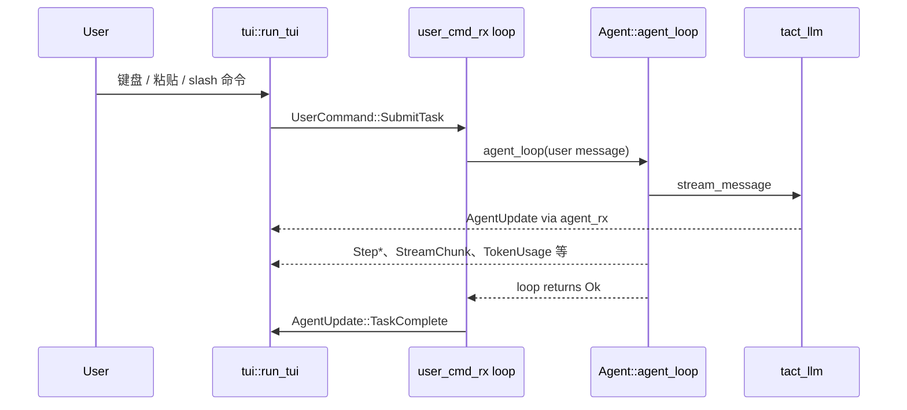
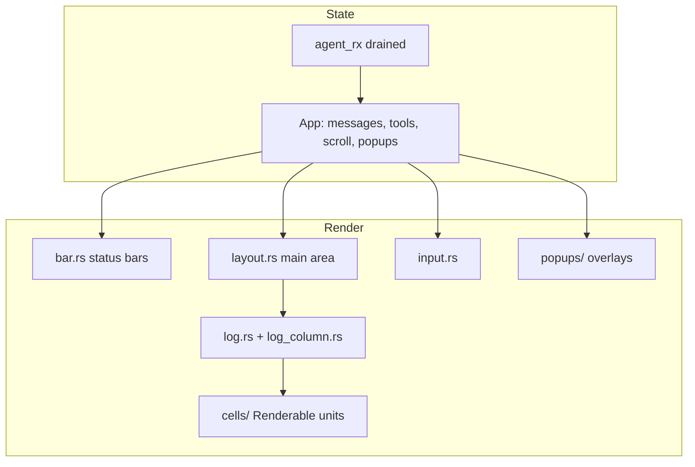
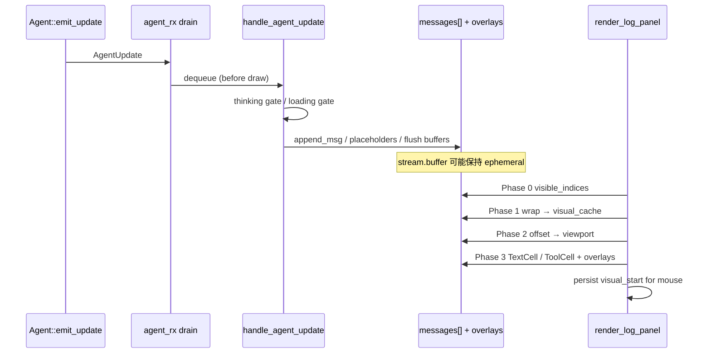

# 终端 UI（TUI）

> 语言：[中文](./23_chapter_tui_zh.md) · [English](./23_chapter_tui.md)

本章描述 `tui` crate：`tact-ui` 如何通过 async channel 接线 agent 循环，以及**渲染层**如何在每个 tick 将 `App` 状态转为 ratatui 帧。

更多实现细节（扩展配方、性能分析）见 [docs/tui_rendering.md](../docs/tui_rendering.md)。

---

## 1. 进程架构



五组 unbounded MPSC channel 连接 agent task、account service、plugin worker 与 TUI task：

| Channel | 类型 | 方向 |
|---------|------|------|
| `agent_tx` / `agent_rx` | `AgentUpdate` | Agent → TUI |
| `user_cmd_tx` / `user_cmd_rx` | `UserCommand` | TUI → agent driver（`tui.rs`） |
| `account_tx` / `account_rx` | `AccountUpdate` | Account service → TUI |
| `plugin_tx` / `plugin_request_rx` | `PluginRequest` | TUI → plugin worker |
| `plugin_event_tx` / `plugin_rx` | `PluginEvent` | Plugin worker → TUI |

`AgentUpdate`、`UserCommand` 与 `AccountUpdate` 定义在 `tact_protocol`。`PluginRequest` 与 `PluginEvent` 定义在 `tact::plugin`；`tact-ui` 启动 worker，TUI 在渲染前 drain plugin event。

---

## 2. 入口点

### 交互式（`tact-ui`）

`crates/tact-ui/src/interactive.rs` 中的 `run_interactive`（由 `main.rs` 分发）：

1. `tact::config::init()` — 设置 + LLM provider（[Ch 21](./21_chapter_config_zh.md)）。
2. 打开 SQLite session store，resolve `session_id`（`--session`、`--resume-last` 或新 UUID）。`--resume-last` 与 `--list-sessions` 按当前工作目录的 `root_dir` 过滤 session，忽略其他项目行。`SessionLockGuard` 在争用前重试 `try_lock_session`。
3. 用 `toolset()`、MCP router、managers 与 `with_ui_channel(agent_tx)` 构建 `Agent`。
4. 在独立 tokio task 上 spawn `tui::run_tui(...)`。
5. 循环 `user_cmd_rx` — 分发 `SubmitTask`、`Cancel`、`QueryBalance`。

主题来自 `config::settings().ui.theme`（默认 `"retro"`）。

### Headless（`tact-ui headless "prompt"`）

`crates/tact-ui/src/headless.rs` 中的 `run_headless`。无 TUI 运行单次 `agent_loop`，最终文本打印到 stdout，发送桌面通知。由于没有 live card，工具进度保持仅输出最终结果。使用 config 驱动的权限模式 — 与交互模式相同。

---

## 3. `UserCommand` 协议

```rust
pub enum UserCommand {
    SubmitTask(String),
    Cancel,
    QueryBalance,
}
```

| 命令 | 来源 | `tui.rs` 中 handler |
|------|------|---------------------|
| **`SubmitTask`** | Insert 模式 Enter、slash 命令、`@` 文件选择器提交 | 重置 `tool_use_counter`、清除 `cancel_flag`、`build_user_message`、`agent_loop`；仅 loop 成功且未取消时发出 `TaskComplete` |
| **`Cancel`** | `/cancel`，或 Planning/Executing 时 Normal 模式 `c` | 设置 `cancel_flag`；循环在下次检查时退出；下次 `SubmitTask` 清除 flag（[Ch 18](./18_chapter_agent_loop.md)） |
| **`QueryBalance`** | `/balance`（仅 DeepSeek/Kimi） | `account::query_once()` → `AccountUpdate` channel（[Ch 25](./25_chapter_protocol_zh.md)） |

`build_user_message`（`crates/tact-ui/src/user_message.rs`）将行内 `` 图片与 `@file` 引用解析为多模态 `ContentBlock`。栅格图使用 config 中 `[ui.vision_image]`：`compress`（默认 `true`）缩小并重编码为 JPEG（`max_edge` 1280、`jpeg_quality` 80）；设 `compress = false` 发送原始文件字节。文件路径用 `tact::tool::safe_path` 解析 — 工作区外引用在 prompt 文本中保持不变。

**需要 vision 能力。** 压缩仅缩小 payload；不会让纯文本模型接受图片。OpenAI 兼容 provider（`openai` / `deepseek` / `kimi`）上 `ContentBlock::Image` 转为 Chat Completions `image_url` part（[Ch 22](./22_chapter_llm_zh.md)）。仅反序列化 `text` content part 的端点返回 HTTP 400（`unknown variant image_url, expected text`）。Anthropic 使用原生 Messages API image block。请用多模态模型，或不附加图片。

---

## 4. `AgentUpdate` 处理

协议类型、step 生命周期与任务级转换：[Ch 25](./25_chapter_protocol_zh.md)。

TUI 在 `crates/tui/src/widgets/state/app/agent.rs` → `handle_agent_update` 消费更新。

| Update | UI 效果 |
|--------|---------|
| `StreamChunk` | 追加到活跃 assistant 文本 cell |
| `ThinkingChunk` | Thinking card / preview |
| `StepAdded` / `StepStarted` / `StepFinished` / `StepFailed` | 工具时间线（[Ch 11](./11_chapter_task.md)） |
| `ToolProgress` | 更新匹配 active tool 的 1→3 行 live tail |
| `RequestSelect` | 权限 popup（[Ch 10](./10_chapter_permission.md)） |
| `TokenUsage` | 状态栏计数 |
| `ModelInfo` | 模型名 / 限制显示 |
| `TaskComplete` | 标记任务完成，启用后续输入 |
| `Error` | 带 `AgentErrorKind` 的错误横幅 |
| `Info` | 系统消息行 |

余额与配额使用独立 `AccountUpdate` channel（`crates/tact-ui/src/account.rs`），非 `AgentUpdate`。

**重要：** `Agent::agent_loop` **不**发出 `TaskComplete`。`interactive.rs` 仅在成功、未取消的 loop 返回后发送：

```rust
match agent.agent_loop(Some(task_message)).await {
    Ok(()) if !agent.runtime.cancel_flag.load(Ordering::Relaxed) => {
        if let Some(last) = agent.runtime.context.last() {
            agent.emit_update(AgentUpdate::TaskComplete(extract_text(&last.content)));
        }
    }
    Ok(()) => {}
    Err(e) => agent.emit_update(AgentUpdate::Error(...)),
}
```

见 [Ch 18 §7](./18_chapter_agent_loop.md#7-tui-integration)。

---

## 5. TUI 主循环

`crates/tui/src/lib.rs` — `run_tui`：

1. **终端设置** — raw mode、alternate screen、bracketed paste、鼠标捕获、键盘增强标志。
2. **`App::new`** — 接线 channel、工作目录、输入历史、session id、主题。
3. **事件流** — 后台 tokio task 上的 `crossterm::EventStream`。
4. **Update → draw → poll** 循环（见 [§6 渲染层](#6-渲染层)）：
   - 渲染前**完全** drain 待处理 `AgentUpdate`（避免 scroll/hit-test 竞态）。
   - 仅当 `dirty`、`Status::Done` 或仍有工具运行时重绘（实时 elapsed）。
   - 将键盘/鼠标分发给模式特定 handler。
5. **余额 timer** — DeepSeek 或 Kimi 活跃时，随机 5–15 s 间隔发送 `UserCommand::QueryBalance`（与启动 fetch 相同门控）。
6. **Shutdown** — 退出时恢复终端。

定时状态清理也在 `draw` 外运行：`Status::Done` 2 s 后 revert 到 `Idle`；`flash_msg` 3 s 后清除。

---

## 6. 渲染层

渲染栈在 `crates/tui/src/render/` 下。对 agent 逻辑**只读**：handler 与 `handle_agent_update` 变更 `App`；render 函数仅读 `App` 并写 ratatui `Buffer`。



### 6.1 模块地图

| 路径 | 角色 |
|------|------|
| `render/mod.rs` | Re-export 面板入口 |
| `render/layout.rs` | 主内容路由（history、help、plan+log、popups） |
| `render/bar.rs` | 顶栏 + 底栏统计 |
| `render/input.rs` | 多行输入框、批准横幅、palette 命令行 |
| `render/log.rs` | Log 面板：wrap cache、scroll、overlays、scrollbar |
| `render/log_column.rs` | Viewport 裁剪的 `Renderable` 合成器 |
| `render/log_style.rs` | 共享 log 文本样式 |
| `render/plan.rs` | plan 可见时左侧面板 |
| `render/render_md.rs` | Markdown → ratatui `Line`s（`tui-markdown`） |
| `render/renderable.rs` | `Renderable` trait |
| `render/util.rs` | `wrap_line`、tool 缩进常量 |
| `render/welcome.rs` | 启动 logo |
| `render/cells/` | `text`、`thinking`、`tool`、`code`、`separator` |
| `render/popups/` | Palette、select、file picker、slash commands、help、history、thinking/diff/code detail |

`render/` 外支撑：`theme.rs`（颜色）、`i18n.rs`（`Messages` 字符串）、`widgets/state/`（`App`、`LogScroll`、tool state）。

### 6.2 帧管线

每次重绘在 dirty 检查通过时于 `terminal.draw(|f| { ... })` 内运行：

```text
┌─ row 0 ─────────────────────────────  render_status_bar
│  main area (flex)                     render_main_area
│    ├─ optional plan panel (left)
│    ├─ draggable divider
│    └─ log panel (right or full width)
├─ input (1–3 lines + border) ───────── render_input_box
└─ bottom (2 rows) ──────────────────── render_bottom_bar
     optional full-screen overlays ───── popups (palette, select, file picker, slash)
```

`lib.rs` 中垂直约束：

- 顶栏：固定 1 行。
- 主区域：`Constraint::Min(3)`。
- 输入高度：`min(lines, 3) + 2`（含 border）。
- 底栏高度：始终 2 行（账户余额/配额追加到第 2 行，非第三行）。

Popups 在基础布局**之后**绘制以置顶。多数先用 `Clear`（无 drop shadow — 避免部分终端暗带）。

**先更新后绘制不变量：** `agent_rx` 在 `terminal.draw` 前完全 drain。`lib.rs` 注释说明更新与绘制交错会 desync `log_scroll.visual_start` 并破坏鼠标行映射。

### 6.3 主区域模式（`layout.rs`）

`render_main_area` 按 `App` 标志切换布局：

| 条件 | 布局 |
|------|------|
| `show_history` | 全屏 history 面板（`popups/history.rs`） |
| `show_help` | 全屏 help（`popups/help.rs`） |
| `plan.visible` | 水平分割：plan（左）+ 2 列 divider + log（右）；比例来自 `panel_split_ratio`（10–70%），可拖拽 |
| default | 仅 log 面板 |

plan+log 活跃时设置 `app.mouse.plan_area`、`divider_area`、`log_area` 供 hit test 与面板 resize。

锚定在主区域上的 detail popups（非独立输入模式）：

- `thinking.popup` → `thinking_popup.rs`
- `tools.popup` → `diff_popup.rs`（tool 输出 / 文件预览）
- `code_popup` → `code_popup.rs`

### 6.4 三种坐标空间

Log 面板是最复杂渲染器。`log.rs` 文档化三种空间：

```text
PHYSICAL (messages[])     LOGICAL (scroll unit)       VISUAL (screen lines)
┌───┬───┬───┬───┐         ┌───┬───┬───┐                 ┌───┬───┬───┬───┐
│ 0 │ 1 │ 2 │ 3 │  hide  │ 0 │ 1 │ 2 │  wrap at width  │ 0 │ 1 │ 2 │ 3 │ …
└───┴───┴───┴───┘  ──→    └───┴───┴───┘  ──→            └───┴───┴───┴───┘
 every stored row          visible rows only            one terminal row each
```

| 空间 | 含义 | Scrollbar 跟踪 |
|------|------|----------------|
| **Physical** | `app.messages[]` 中的索引 | — |
| **Logical** | 可见消息 + 可选流式 buffer 行 | `log_scroll.offset` |
| **Visual** | 当前面板宽度下的换行 | 总 visual 行数 |

`render_log_panel` 管线阶段：

1. **Phase 0** — `messages.len()` 变化时重建 `visible_indices` / `phys_to_logical_cache`；direct card 的 placeholder 行仍可寻址，供 scroll 与 hit test 使用。
2. **Phase 1** — 宽度或消息数变化时 `wrap_line` → `visual_cache` + `visual_start_cache`。
3. **Phase 2** — 将 `log_scroll.offset` 映射到 visual viewport（`visual_scroll`、clip height）。
4. **Phase 3** — 用 `TextCell`、`ToolCell`、`ThinkingCell` 构建 `LogColumnRenderer`；code 保持 overlay；仅绘制与 viewport 相交的 cell。

流式文本在 token 到达时用 `app.stream.buffer` 作为额外 logical 行。

消息类型、`AgentUpdate` 映射、流式生命周期、可见性、scroll 行为、overlays 与鼠标交互见 [§6.11–§6.18](#611-log-消息模型)。

### 6.5 `Renderable` trait 与 cells

所有可绘制 log 单元实现：

```rust
pub(crate) trait Renderable {
    fn render(&self, area: Rect, buf: &mut Buffer);
    fn render_partial(&self, area: Rect, buf: &mut Buffer, skip_lines: usize);
    fn height(&self, width: u16) -> u16;
}
```

scroll 后 cell 仅部分可见时 `LogColumnRenderer` 调用 `render_partial` — 各 cell 将 `skip_lines` 映射到内部行模型。

| Cell | 文件 | 绘制 |
|------|------|------|
| `TextCell` | `cells/text.rs` | User/assistant/system 文本、选择、stream buffer |
| `ToolCell` | `cells/tool.rs` | Tool 标题 + meta + 可选 detail card（单个 `Renderable`） |
| `ThinkingCell` | `cells/thinking.rs` | Direct live card：前后各有一行空白，1→3 行 tail，完成后为 1 行 summary；标题和底栏显示总行数 |
| Diff overlay |（`log.rs` 中 legacy 路径） | 带 `+` 行的写文件 preview |
| `CodeCell` | `cells/code.rs` | 语法着色 code block card |
| Separator | `cells/separator.rs` | block 间视觉间隙 |

**Tool 渲染拆分：** `ToolWidget`（`widgets/`）借用 theme/i18n 构建 `ToolRenderOutput`；`ToolCell` 复制 owned 数据存入 renderer 列表。避免跨帧 lifetime 问题。`StepAdded` 仅更新 plan panel；log block 在 `StepStarted` 出现。并发工具用 `tools.active: Vec<_>`，经 `find_tool_at_logical()` 逐行 hit test。

### 6.6 状态栏与输入

**顶栏**（`render_status_bar`）：输入模式、焦点面板（`Log` / `Plan`）、`Status`（Idle / Planning / Executing / WaitingForUser / Done）、主题/语言提示。覆盖：临时 `flash_msg`。

**底栏**（`render_bottom_bar`，始终 2 行）：
- 第 1 行：焦点提示、prompt elapsed（运行中实时；完成/失败后冻结至下次 prompt）、进程 uptime、cwd、git 分支，及可选账户后缀（DeepSeek / Kimi 可用时 `💰 Balance…` 或 `📊 Quota…`）。
- 第 2 行：模型 + token 限制、token 用量（prompt / completion / cache / reasoning）。

**输入**（`render_input_box`）：`Insert` 模式圆角 border；最多 3 行内容；CJK 感知光标宽度；`WaitingForUser` 时批准横幅。Palette 模式用 `render_command_line`。

### 6.7 Markdown

`render_md.rs` 经 `tui-markdown` 与自定义 `TuiStyleSheet`（标题、代码、链接、引用）转换 assistant markdown。Code block 统一深色背景；表格列对齐。不保留 Hyperlink OSC-8 序列 — ratatui 剥离转义序列。

### 6.8 Popups

| Popup | 触发 | 文件 |
|-------|------|------|
| Command palette | Normal 模式 `/` / `InputMode::Palette` | `popups/command_palette.rs` |
| Slash commands | Insert 模式输入 `/` | `popups/slash_command.rs` |
| File picker | `@` 附件流程 | `popups/file_picker.rs` |
| Select | `RequestSelect` 权限 / agent 选择 | `popups/select.rs` |
| Help | `Ctrl+?` | `popups/help.rs` |
| History | `Ctrl+H` | `popups/history.rs` |
| Thinking detail | 双击 thinking card；相邻有序列表项以空行分隔 | `popups/thinking_popup.rs` |
| Tool/file detail | 双击 tool card | `popups/diff_popup.rs` |
| Code detail | 双击 code card | `popups/code_popup.rs` |

Popups 通常占终端约 80%×80%，记录 `app.mouse.*_popup_area` 供点击外部关闭，显示 `[y] Copy` / `[Esc] Close` / `[j/k] Scroll` 提示。`diff_popup` 经 `cached_content` 懒加载全文 — 热路径 `render()` 内无文件 I/O。

Tool/file 与 Thinking detail popup 支持鼠标左键文本选择。Mouse hit 将每个渲染出的扩展字素簇映射至 byte offset，因此组合字符与 emoji 序列保持不可分割，行号、diff gutter、边框、标题、底栏、元数据及其他仅用于显示的前缀不会进入选择。Popup 滚动时选择保留；拖拽到 body 上方或下方会 clamp 到首个或末个可见 source boundary，且不会自动滚动。`y` 在 tool popup 中复制选中的原始文本，在 Thinking popup 中复制选中的可见文本；没有非空选择时复制 popup 的完整原始内容。Code detail popup 保持原有鼠标行为。

### 6.9 性能

**Dirty 渲染：** 仅当 `app.dirty`、`Status::Done` 或 `!tools.active.is_empty()` 时运行 `terminal.draw`。绘制后清除 `dirty`。

**Caches**（`LogScroll`）：

| Cache | 失效时机 |
|-------|----------|
| `visible_indices` | `messages.len()` 变化 |
| `visual_cache` | `messages.len()`、宽度或主题变化 |
| `phys_to_logical_cache` | `messages.len()` 变化 |
| Code/diff preview 行 | block 创建时 |

**自适应 poll 间隔**（事件循环 `select!` timeout）：

| 状态 | 间隔 | 原因 |
|------|------|------|
| `Done` 或 `flash_msg` | 200 ms | 定时 revert 到 `Idle` |
| `dirty` | 10 ms | 快速重绘 |
| Planning / Executing / Waiting | 150 ms | Spinner 动画 |
| Idle | 1000 ms | 静止时低 CPU |

活跃 tool 行也强制重绘，使 duration 计数器在无新 `AgentUpdate` 时仍 tick。

### 6.10 渲染中的主题与 i18n

颜色来自 `theme.rs` 的 `Theme`（11 主题；config 默认 `retro`）。运行时 `Ctrl+T` 循环主题；主题变化时 cache 失效防止 stale  styled 行。

UI 字符串集中在 `i18n.rs`（`English` / `Chinese`）；render 经 `app.msgs()` 取标签。`Ctrl+L` 切换语言。

### 6.11 Log 消息模型

Log 不是单一字符串列表。`app.messages[]` 中每行由三个并行 vector 支撑且须同步（见 `widgets/state/app/popups.rs` 中 `append_msg`）：

| Vector | 类型 | 用途 |
|--------|------|------|
| `messages[]` | `Vec<Line<'static>>` | 预 styled ratatui 行（Markdown、颜色、modifier） |
| `raw_messages[]` | `Vec<String>` | 纯文本：复制、类别检测、hit test |
| `raw_message_types[]` | `Vec<RawMessageType>` | Gutter 缩进与样式提示 |

`RawMessageType` 三个 variant（`widgets/state/mod.rs`）：

| 类型 | 典型内容 | 缩进（`log_indent`） |
|------|----------|----------------------|
| `LLM` | 用户消息、assistant markdown、任务结束分隔符 | 0 |
| `LLMThinking` | 为一个 direct thinking card 保留的 blank placeholder 行 | `LOG_THINKING_INDENT` |
| `SysTool` | Plan 步骤、tool placeholder、loading spinner 行 | `LOG_TOOL_INDENT` |

**行类别**（按创建方式，非专用 enum）：

| 类别 | 在 `messages[]` 中如何出现 | 说明 |
|------|---------------------------|------|
| **User** | 绿色前缀行（`💬 …` / 续行 `  …`）via `add_user_message` | 前有 blank 分隔行 |
| **Assistant text** | `StreamChunk` / `flush_stream_pending` 的 Markdown 行 | 单段可能占多 physical 行 |
| **System / info** | 彩色前缀行（`✓`、`⚠`、`▶`、plan 文本等）via `add_system_message` | `classify_system_message` 选 `SysTool` vs `LLM` 缩进 |
| **Thinking card** | Placeholder 行（`LLMThinking`） | 一个 `ThinkingCell`；前后各有一行空白与相邻内容分隔，active tail 从 1 增至 3 行，完成后显示 1 行 summary，标题和底栏显示总行数 |
| **Tool blocks** | Blank placeholder 行（`SysTool`） | 实际绘制为单个 `ToolCell`；placeholder 预留 scroll 高度 |
| **Code blocks** | fence 关闭后 blank placeholder | `render_code_cards` overlay 绘制 card |
| **Loading placeholder** | `app.loading_idx` 处一行 blank `SysTool` | **Legacy：** 仅 `PlanGenerated` 到达时插入 — agent 今日不发，spinner overlay 通常 inactive |
| **Task-end separator** | 魔法 raw `\x07tact-task-end` 的 sentinel 行 | 渲染为全宽强调色实线，非纯文本 |

若干 **overlay 注册表** 按 physical 索引存元数据 — 不在 `messages[]` 重复文本：

| 注册表 | Key | 用于 |
|--------|-----|------|
| `thinking.active` / `thinking.blocks[]` | `phys_idx` | Active/completed direct card + thinking popup |
| `tools.active[]` / `tools.blocks[]` | `phys_idx` | 运行中 / 完成 tool card |
| `code_blocks[]` | `start_idx`、`end_idx` | 语法着色 code card |
| `stream.buffer` |（不在 `messages[]`） | token 流期间额外 *logical* 行 |

正常流式期间 physical 行仅 append；code fence 关闭或 tool placeholder resize 时 `splice_msgs` / `drain_msgs` 重写区间。

### 6.12 AgentUpdate → log 行映射

`handle_agent_update`（`widgets/state/app/agent.rs`）是 agent 事件写入 log 行的唯一 writer。每次 update 设 `dirty = true`。match 前两个全局门：

1. **Thinking gate** — 产出内容的 update *除* `ThinkingChunk` / `TokenUsage` / `ModelInfo` / `ToolProgress` 外，若 thinking 区域仍开则调用 `flush_and_close_thinking()` 作安全网。优先显式 `ThinkingChunk::Finished`。
2. **Loading gate** — 多数 update 调用 `remove_loading_placeholder()`。信息性或类元数据 update（`TokenUsage`、`ModelInfo`、`ToolProgress`）跳过移除。Legacy `PlanGenerated` handler 也跳过，但 agent 从不发出 — loading 行路径 inactive。

**当前 agent 路径：** `StepAdded` 仅更新 plan panel（无 log 行）。`StepStarted` 创建 tool placeholder 并驱动 `Planning → Executing`。当前运行勿期望 `PlanGenerated`。

| `AgentUpdate` | 插入/更新的 physical 行 | 副作用 |
|---------------|-------------------------|--------|
| **`StreamChunk`** | 完成行 → `append_msg`（`LLM`）；不完整 tail 留在 `stream.buffer` | 自动 scroll；code/table/paragraph 子解析；thinking 仍开则 safety-close |
| **`ThinkingChunk::Started`** | 为一行 `ThinkingCell` 及前后空白行保留 placeholder 行 | 打开 active thinking card |
| **`ThinkingChunk::Delta`** | 修改 active card buffer；placeholder 范围只在 body 1→2→3 行时增长 | 自动 scroll；若漏 `Started` 则打开 card |
| **`ThinkingChunk::Finished`** | 同一 placeholder 变为带 1 行 summary 的 completed `ThinkingBlock` | 关闭 active card |
| **`PlanGenerated`** | *（legacy handler）* 系统行 + loading 行 | Agent **不发**；会 flush stream、cancel tools、设 `loading_idx` |
| **`StepAdded`** | *（log 无）* | 仅 plan panel；flush stream；首 step 转 `Planning → Executing` |
| **`StepStarted`** | `N` blank placeholder + `ActiveToolBlock` | Flush stream；取消 stale 同 `tool_id` block |
| **`ToolProgress`** | 修改匹配的 `ActiveToolBlock.live_output`；首个输出仅 resize 一次 | 不关闭 thinking/loading；忽略未知或迟到 ID；保留 scroll 意图 |
| **`StepFinished`** | Resize placeholder → `ToolBlock` | Flush stream；更新 plan step output |
| **`StepFailed`** | 完成 tool card *或* 系统错误行 | Status → `Idle` |
| **`RequestSelect`** | *（无）* | 打开 select popup |
| **`Info`** | 系统消息行 | 无系统前缀则 Markdown |
| **`Error`** | 系统错误行（fatal） | Fatal 时 flush stream |
| **`TaskComplete`** | 仅 task-end separator | **不**重追加摘要文本（已流式）；scroll 到底 |
| **`TokenUsage` / `ModelInfo`** | *（无）* | 仅状态栏 |

**StreamChunk 解析** 需额外细节，因单批 token 可产出异构行：

- **Paragraph 模式** — 非空行累积于 `stream.paragraph` 直至 blank 或水平规则；然后 `render_markdown_tui` 发出 styled 行。
- **Table 模式** — `| … |` 行缓冲至非 table 行；`format_table` 发出对齐行。
- **Code fence 模式** — opening ` ```lang ` 设 `stream.code_block`；内部行带 ` ▌` 流式； closing ` ``` ` splice placeholder 并 push `CodeBlock` overlay。
- **Gap 规则** — tool card 后 assistant 文本前 `ensure_gap_after_tools()` 插 blank；tool 开始 `ensure_gap_before_tools()`。

Tool 开始时先 `flush_stream_pending()` — 任何 partial paragraph、table、code block 或 `stream.buffer` tail 在 placeholder 前提交到 `messages[]`。

### 6.13 流式生命周期

三 buffer 可持有尚未成为 permanent log 行的文本：

| Buffer | 所有者 | 何时成为 physical 行… |
|--------|--------|-------------------------|
| `stream.buffer` | `StreamState` | `\n` 完成一行（→ paragraph/table/code）或 `flush_stream_pending()` |
| `thinking.active` | `ThinkingState` | 立即作为 direct-card placeholder 行保留；delta 修改 buffer，不增加 source 行 |
| `stream.paragraph` / `table_buffer` / `code_block_buffer` | `StreamState` | Blank 行、fence 关闭或 flush |

**活跃 vs 已完成 assistant 文本：**

Token 到达时当前 assistant 回复 tail 在 `stream.buffer`。Render Phase 1 若 buffer 非空，`total_logical` 在可见 physical 消息外多计一行 logical。该行用 accent 色直接从 buffer wrap — **未** flush 前进 `messages[]`。

**Thinking block 生命周期：**

```text
ThinkingChunk::Started →  在 phys_idx 保留 direct-card placeholder 行
ThinkingChunk::Delta   →  追加 active content；渲染 1→2→3 行 tail
ThinkingChunk::Finished→  在同一 phys_idx 完成为 ThinkingBlock { summary, content, markdown }
StreamChunk / Step*    →  若漏 Finished 则 safety-close
TokenUsage / ModelInfo →  不关闭 thinking
```

Active card body 从一行增长到三行，之后保持最新三行 tail。关闭时原地变为一行 summary；完整内容保留在 state，供 detail popup 与 copy 使用。

**最终持久化：** `TaskComplete` 调用 `flush_stream_pending()` 再 `add_task_end_separator()`。update 中摘要字符串仅写入 `task_history` — UI 假定 `StreamChunk` 已显示 assistant 最终文本。设 `log_scroll.offset = u16::MAX` 将 viewport 钉在底部（render 中 clamp）。

### 6.14 可见性规则

Thinking、tool 与 code placeholder 行在 Phase 0 各自可见，使 logical-to-physical 映射稳定。Phase 3 用单个 direct cell 替换 thinking 或 tool 的 placeholder 范围；code 仍使用 overlay。Thinking 没有隐藏 source 行，也没有 `is_message_visible` 折叠规则。

`total_log_lines()` 跳过不可见 physical 索引，使 logical 编号与用户所见对齐。

### 6.15 Wrap、scroll 与自动跟随

**Phase 1 wrap cache** 在 `messages.len()`、面板内容宽度或主题名变化时重建。每 logical 行经 `log_style::restyle_log_line`（主题感知）再 `wrap_line`。`visual_start_cache` 中前缀和映射 logical → visual 行索引。

**Scroll 单位：** `log_scroll.offset` 以 **logical 行**计，非 visual 行。Scrollbar thumb 则跟踪 **visual** 位置 — 长换行段落使每 logical 步 thumb 跳更远。

**自动 scroll 到底：** handler 在用户提交输入、流 chunk、thinking 增长、tool 完成、`TaskComplete` 时设 `offset = u16::MAX`。Render 将 `offset` clamp 到由 visual 高度算的 `effective_max_logical`。特殊值 `u16::MAX` 因此表示「粘底」而不存精确计数。

**底钉（`resolve_visual_scroll`）：** offset 最大时 viewport 钉在 `total_visual − visible_height`，而非 `visual_start_cache[offset]`。防止底部高 tool detail card 在前一行是长换行段落时末行 unreachable（见 `log.rs` 单元测试）。

**手动 scroll：** 鼠标滚轮与 normal 模式 `j`/`k` 按 logical offset ±1。
`ToolProgress` 更新保留显式数字 offset；若为 `u16::MAX`，active card 变化时仍粘底。
Assistant `StreamChunk` 更新仍会请求跟随底部。

**Cache 持久化：** 每次 draw 后 `visual_start_cache` 复制到 `log_scroll.visual_start`，供 render 外鼠标 hit test（点击行 → visual → logical 映射于 `lib.rs`）。

### 6.16 Overlays vs inline cells

Log 在 bordered 面板内用**双层**绘制模型：

```text
┌─ Log panel ──────────────────────────────┐
│  Layer 1: LogColumnRenderer (inline)      │
│    TextCell │ ToolCell │ ThinkingCell     │
│    MessageSeparator (category gaps)         │
│  Layer 2: frame overlays (same viewport)    │
│    code cards │ spinner                     │
└───────────────────────────────────────────┘
```

| 构造 | 层 | 高度来源 | 双击 |
|------|-----|----------|------|
| **TextCell** | Inline | Cache 换行数 | 词选 / 行选 |
| **ToolCell** | Inline | `ToolRenderOutput.visual_rows()` — 替换 placeholder 范围 | 打开 `diff_popup` |
| **ThinkingCell** | Inline | 前后各一行空白；active 1→3 tail 行；completed 一行 summary | 打开 `thinking_popup` |
| **TaskEndSeparator** | Inline | 1 visual 行（动态 dash） | — |
| **MessageSeparator** | Inline | user/system/assistant 组间 1 blank | — |
| **Code card** | Overlay | `code_blocks[]` 中 placeholder 行 span | 打开 `code_popup` |
| **Loading spinner** | Overlay | `loading_idx` 处 1 行（若设） | —（通常 inactive — 见 `PlanGenerated` legacy） |

**TextCell**（`cells/text.rs`）正常绘制 clone cache wrap 行。选择应用 `REVERSED`（词级或整行）。左 gutter `indent_cols` 来自 `RawMessageType`。

**ToolCell** 取代 placeholder `TextCell`：Phase 3 检测 physical 索引在 `[phys_idx .. phys_idx + placeholder_rows]` 内则在该 block visual start 推一个 cell，跳过剩余 placeholder logical 行。运行中 tool 传 `started_at` 作 live duration，并持有有界 `live_output` buffer。可见的 `bash` 输出会让 card 从 1 行增长到 3 行；后续 chunk 原位更新三行 tail。stdout 用普通文本，stderr 用 warning 色。Live card 的计数（`Live output (N lines)`）只统计流式输出行数；popup/`detail_full` 仍会前置 `$ <command>`，与完成后卡片一致——完成后则是计数与 popup 共用这份「命令 + 输出」内容。完成后折叠为现有 compact card，并以 `StepResult.detail` 为准。

**为何仅 code 用 overlay：** code block 将流式 fence 行换成 blank placeholder，并用预渲染 `styled` cache 绘制 card。Thinking 则采用与 tool card 相同的 direct `Renderable` 模型，因此 live tail 与 completion summary 只有一个渲染所有者。

写文件 tool 的 diff preview 现 fold 进 `ToolCell` detail card；legacy `DiffBlock` overlay 路径大多已迁移（[§11 缺口](#11-当前缺口)）。

### 6.17 Log 交互

**鼠标选择**（`lib.rs` 中 log 区点击）：

| 手势 | 行为 |
|------|------|
| 单击 + 拖拽 | 行范围选择（`log_selection: (start, end)`） |
| 双击（纯文本） | `find_word_bounds` 词选 |
| 三击 | 整 logical 行；code block 内 → 整块范围 |
| 单击 thinking/tool/code card | 记住 card 索引；无文本选择 |
| 双击 card | 打开对应 detail popup |
| 在 tool/Thinking detail popup 内左键拖拽 | 选择原始 tool 文本或可见 Thinking 文本；排除仅用于显示的前缀 |

复制（normal 模式 `y`）在 tool 或 Thinking popup active 时优先非空 popup 选择；popup 选择为空时复制完整原始 popup 内容。无 selectable popup 时，优先 log 词选，然后拼接选中 logical 行的 `raw_messages`。

**Hit test 链：**

```text
mouse row in log_area
  → visual_row = visual_start[offset] + (mouse.y − log_area.y − 1)
  → logical_idx = binary_search visual_start
  → phys_idx = visible_message_index(logical_idx)
  → card/tool/code lookup on logical_idx
```

`find_tool_at_logical` 先查 `tools.active` 再 `tools.blocks`，用 `phys_to_logical_cache` O(1) 范围测试 — 多 tool 并发时重要。

**键盘 scroll**（normal 模式，log 焦点）：`j`/`k` ±1 logical 行；`G`/`g` 底/顶。无 popup 时滚轮事件调整 offset。

装饰性 **类别分隔符**（user ↔ system ↔ assistant）在 Phase 3 render 时嗅探 `raw_messages` 前缀插入 — 不在 `messages[]` 存储。

### 6.18 Log 管线序列



交叉引用：[Ch 25 Agent–TUI Protocol](./25_chapter_protocol_zh.md) 消息类型与状态转换；[§4 AgentUpdate 处理](#4-agentupdate-处理) TUI 特定效果；[docs/tui_rendering.md §6](../docs/tui_rendering.md) 扩展配方。

---

## 7. 输入模式与主题

`widgets/state/mod.rs` 中 `InputMode`：`Normal`、`Insert`、`Palette`、`Select`、`FilePicker`。Handler 在 `crates/tui/src/handlers/`。Normal 模式 `/` 打开 command palette；Insert 模式 `/` 打开 slash-command popup（同一命令列表，分组为 **Commands** 然后 **Skills**）。Palette 命令 `save` 将 log 写入 `std::env::temp_dir()/agent_log_{timestamp}.txt` 并在系统消息显示完整路径。

### Slash skills

每个发现的 skill 显示为 `/{name}` 及 frontmatter `description`。Built-in **覆盖**同名 skill（Skills 组省略）。流程（`handlers/skills.rs`）：

| 输入 | 行为 |
|------|------|
| Slash popup Enter 于 **skill** | 仅自动补全到 `/name `（同 Tab）— 加可选 args，再 Enter 运行 |
| Slash popup Enter 于 **built-in** | 立即执行（`/quit`、`/cancel` 等） |
| `/skill-name` 或 `/skill-name args` + Enter | **Invoke**：log 显示 slash 行；agent 收到 `<skill>` body（裸 `$ARGUMENTS` 替换，或有 args 时 append Claude 式 `ARGUMENTS:`） |
| Palette Enter 于 skill | Insert 模式预填 `/name `（undo checkpoint 保留） |
| `/skill-reload` | 重扫 root 到共享 registry（TUI + agent），失效 visual cache |
| `/plugin …` | 排队安装、列出、重载及 marketplace 操作；成功的 install/reload 刷新共享 skills |

输入框与用户 log 行经 `render/slash_style.rs` 高亮 `/skill-name`（accent+bold）与 args（`theme.fg`）。完整发现路径与 `$ARGUMENTS` 规则：[Ch 2](./02_chapter_skill.md)。与模型 mid-turn 调用 `load_skill` 分离。

`theme.rs` 中十一个 built-in 主题：`dark`、`light`、`solarized-dark/light`、`gruvbox-dark`、`nord`、`retro`（默认）、`kawaii`、`japanese`、`brutal`。初始主题来自 config（[Ch 21](./21_chapter_config_zh.md)）；normal 模式 `Ctrl+T` 循环。

---

## 8. Agent 构建（交互式）

`run_interactive` 在 `Agent::new` 前构建共享状态：

| 依赖 | 用途 |
|------|------|
| `get_skill_registry` | Skills（[Ch 2](./02_chapter_skill.md)） |
| `StoreRoot` + managers | Tasks、background、cron、team、worktree |
| `get_memory_manager` | Memory（[Ch 3](./03_chapter_memory.md)） |
| `load_mcp_router` | MCP tools（[Ch 8](./08_chapter_mcp.md)） |
| `PermissionManager::try_new(PermissionMode::Default)` | **硬编码** — 见缺口 |
| `open_sqlite_session_store` | Session + 输入历史（[Ch 1](./01_chapter_store.md)） |

输入历史经 `history_save_tx` → `append_input_history` 异步追加。

DeepSeek/Kimi 启动时后台 task 查询一次余额并经 account channel 发送 `AccountUpdate::Balance`。

---

## 9. 通知与配置

桌面通知在 `Agent::emit_update` 内对 `TaskComplete` 与 `StepFailed` 触发，当 `config::settings().agent.notifications_enabled` 为 true（[Ch 17](./17_chapter_notify.md)）。

TUI 本身不对流式事件直接调用 notification API。

---

## 10. 代码地图

| 文件 | 角色 |
|------|------|
| `crates/tact-ui/src/main.rs` | CLI 分发（`init`、`--list-sessions`、headless vs interactive） |
| `crates/tact-ui/src/interactive.rs` | TUI 接线、`UserCommand` 分发、`TaskComplete` |
| `crates/tact-ui/src/headless.rs` | 非交互单次 agent 运行 |
| `crates/tact-ui/src/user_message.rs` | 多模态 `@file` / markdown 图片解析 |
| `crates/tact-ui/src/permission.rs` | `permission_mode_from_config()` |
| `crates/tact-ui/src/sessions.rs` | `--list-sessions` 输出 |
| `crates/tui/src/lib.rs` | `run_tui` 主循环、dirty 检查、终端生命周期 |
| `crates/tui/src/handlers/` | 各输入模式键盘/鼠标 |
| `crates/tui/src/render/layout.rs` | 主区域布局模式、popup 锚定 |
| `crates/tui/src/render/log.rs` | Log wrap/scroll 管线、三种坐标空间 |
| `crates/tui/src/render/log_column.rs` | Viewport 裁剪 `Renderable` 合成器 |
| `crates/tui/src/render/cells/` | Text、tool、thinking、code cells |
| `crates/tui/src/render/popups/` | Overlays（palette、select、detail views） |
| `crates/tui/src/widgets/state/app/agent.rs` | `AgentUpdate` → UI 状态 |
| `crates/tui/src/theme.rs` | 配色方案 |
| `tact_protocol` | `AgentUpdate`、`UserCommand`、`AccountUpdate`、`BalanceInfo`（[Ch 25](./25_chapter_protocol_zh.md)） |
| `docs/tui_rendering.md` | 扩展渲染参考与扩展指南 |
| `docs/tool_rendering.md` | Tool block 数据流与迁移说明 |

---

## 11. 当前缺口

| 缺口 | 详情 |
|------|------|
| **交互模式忽略 `permission_mode`** | TUI 始终 `PermissionMode::Default`；TOML/CLI `-m` 仅影响 headless（[Ch 10](./10_chapter_permission.md)） |
| **`TaskComplete` 文本启发式** | 用 context 最后一条消息，非严格最后 assistant turn |
| **无 live config reload** | UI 可循环主题；LLM/provider 变更需重启 |
| **单 agent 实例** | 每 session driver 一个 in-flight `agent_loop`；无多路复用任务 |
| **平台终端假设** | crossterm/ratatui；本 crate 无 web 或 GUI 回退 |
| **已弃用 `PlanGenerated` / loading spinner** | `#[deprecated(since = "0.19.0")]`；TUI handler 保留 — plan 用 `StepAdded` / `StepStarted` |
| **Legacy diff overlay 路径** | 部分 tool card 仍用 `DiffBlock` overlay 逻辑，与迁移中 `ToolCell` 并存 |

---

## 相关文档

- [Agent Main Loop](./18_chapter_agent_loop.md) — TUI 驱动内容
- [Configuration](./21_chapter_config_zh.md) — 主题与启动标志
- [LLM Providers](./22_chapter_llm_zh.md) — 流式与余额 API
- [Permission Model](./10_chapter_permission.md) — `RequestSelect` 流程
- [docs/tui_rendering.md](../docs/tui_rendering.md) — 扩展配方与性能分析
- [docs/tool_rendering.md](../docs/tool_rendering.md) — tool block 渲染管线
