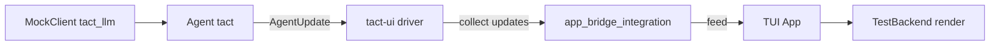

# Testing Strategy

Tact uses layered integration tests: **agent runtime** (`tact`), **headless UI driver** (`tact-ui`), and **TUI render** (`tui`). All run without a real LLM or terminal.

---

## Overview



| Layer | Crate | What is tested |
|-------|-------|----------------|
| LLM mock | `tact_llm` | Scripted turns, token usage emission |
| Agent | `tact` | Tool scheduling, permissions, parallel reads |
| Headless driver | `tact-ui` | `run_command_loop`, SubmitTask/Cancel, session |
| TUI state | `tui` | `handle_agent_update` lifecycle |
| TUI render | `tui` | Full-frame `TestBackend` snapshots (text assertions) |
| Bridge | `tact-ui` + `tui` | Driver updates → App → rendered output |

---

## Running tests

```bash
# Integration-focused packages
cargo test -p tact-ui -p tui -p tact -p tact_llm

# Render layer only
cargo test -p tui render::

# Single integration file
cargo test -p tact-ui --test app_bridge_integration
cargo test -p tact-ui --test permission_integration
```

CI runs the integration packages explicitly, then the full workspace (`cargo test --verbose`).

---

## tact-ui harness (no terminal)

**Location:** `crates/tact-ui/src/test_support.rs`, `crates/tact-ui/tests/harness/mod.rs`

- `build_test_agent` / `build_test_agent_with_mode` — mock LLM + isolated workspace (`unique_workspace_name` avoids parallel test collisions)
- `run_command_loop` — same code path as interactive mode, driven by `UserCommand` channels
- `run_single_task` / `run_commands` — submit tasks, auto-respond to permission prompts, collect `AgentUpdate` stream
- `wire_permission_responder` — strips `RequestSelect` and sends allow/deny choice

**Test files:**

| File | Focus |
|------|--------|
| `tests/driver_integration.rs` | Submit, cancel, sequential tasks, session |
| `tests/tool_integration.rs` | Parallel read, Plan deny, bash, read→write chain, token usage |
| `tests/permission_integration.rs` | Default Allow/Deny, shell guard, always_allow |
| `tests/app_bridge_integration.rs` | Driver → `tui::test_support::TestApp` → render |

---

## TUI render tests (TestBackend)

**Location:** `crates/tui/src/render/test_harness.rs`, `scene_tests.rs`, `popup_scene_tests.rs`

- `make_app()` — minimal App with retro theme
- `draw_full_ui` — mirrors `lib.rs` layout (status, main, input, bottom, palette/select/file-picker/slash overlays)
- `render_app_text` / `render_main_area_text` — flatten buffer to plain text for assertions

**Coverage includes:** idle/executing/done, tool cards, stream/thinking, errors, token/model info, command palette, slash commands, file picker (empty + listed), diff/code/thinking popups, `open_diff_popup` after real `StepFinished`.

**Handler tests:** `crates/tui/src/handlers/file_picker.rs` (j/k navigation, Enter, Esc).

---

## Cross-crate bridge (`test-support` feature)

Enable on `tui` when testing from `tact-ui`:

```toml
tui = { path = "../tui", features = ["test-support"] }
```

`tui::test_support::TestApp` wraps `App` with:

- `new_in_dir(work_dir)` — match driver workspace
- `feed` / `feed_all` — apply `AgentUpdate` batch
- `render` / `render_main` — TestBackend output
- `open_last_tool_popup` — exercise real `open_diff_popup` path

---

## MockClient patterns

```rust
use tact_llm::MockClient;
use anthropic_ai_sdk::types::message::StopReason;

let mock = MockClient::new(vec![
    (vec![tool_use_block], Some(StopReason::ToolUse)),
    (vec![text_block("done")], Some(StopReason::EndTurn)),
]);

// With TokenUsage emission:
let mock = MockClient::with_usage(vec![(/* blocks */, stop, usage)]]);
```

---

## Adding a new scenario

1. **Agent-only behavior** → `crates/tact/src/agent/mod.rs` or tool tests under `crates/tact/src/tool/`
2. **Driver / permission / session** → new `#[tokio::test]` in `crates/tact-ui/tests/`, reuse `harness::run_single_task`
3. **UI state transition** → `crates/tui/src/widgets/state/app/agent.rs` lifecycle tests
4. **Visible layout** → `scene_tests.rs` or `popup_scene_tests.rs`; seed via `handle_agent_update` or popup helpers
5. **End-to-end driver + render** → `app_bridge_integration.rs`

Prefer **text contains** assertions on rendered buffer over pixel/golden tests — fast and stable across themes.

---

## Related

- TUI architecture: [23_chapter_tui.md](./23_chapter_tui.md)
- Parallel tools: [../docs/parallel_tool_execution.md](../docs/parallel_tool_execution.md)
- Tool rendering: [../docs/tool_rendering.md](../docs/tool_rendering.md)
