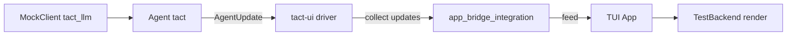

# 测试策略（Testing Strategy）

> 语言：[中文](./24_chapter_testing_zh.md) · [English](./24_chapter_testing.md)

Tact 采用分层集成测试：**agent 运行时**（`tact`）、**headless UI 驱动**（`tact-ui`）与 **TUI 渲染**（`tui`）。全部在无真实 LLM 与终端的情况下运行。

---

## 概览



| 层 | Crate | 测试内容 |
|----|-------|----------|
| LLM mock | `tact_llm` | 脚本化 turn、token 用量发出 |
| Agent | `tact` | 工具调度、权限、并行读 |
| Headless driver | `tact-ui` | `run_command_loop`、SubmitTask/Cancel、session |
| TUI state | `tui` | `handle_agent_update` 生命周期 |
| TUI render | `tui` | 全帧 `TestBackend` 快照（文本断言） |
| Bridge | `tact-ui` + `tui` | Driver updates → App → 渲染输出 |
| Headless session | `tact-ui` | Driver + 实时 App 轮询循环（镜像 `interactive.rs`） |

---

## 运行测试

```bash
# 集成重点包
cargo test -p tact-ui -p tui -p tact -p tact_llm

# 仅渲染层
cargo test -p tui render::

# 单个集成文件
cargo test -p tact-ui --test app_bridge_integration
cargo test -p tact-ui --test permission_integration
```

CI 显式运行集成包，然后全 workspace（`cargo test --verbose`）。

### 提交前

本地运行与 CI 相同检查：

```bash
cargo fmt --all          # 先格式化
./scripts/check-rust.sh  # fmt check + clippy + tests
```

安装 git pre-push hook（每个 clone 一次）：

```bash
./scripts/install-git-hooks.sh
```

Pre-push 运行 `./scripts/check-rust.sh`（fmt check、clippy、集成测试）。

---

## tact-ui harness（无终端）

**位置：** `crates/tact-ui/src/test_support.rs`、`crates/tact-ui/tests/harness/mod.rs`

- `build_test_agent` / `build_test_agent_with_mode` — mock LLM + 隔离 workspace（`unique_workspace_name` 避免并行测试冲突）
- `run_command_loop` — 与交互模式相同代码路径，由 `UserCommand` channel 驱动
- `run_single_task` / `run_commands` — 提交任务、自动响应权限提示、收集 `AgentUpdate` 流
- `wire_permission_responder` — 剥离 `RequestSelect` 并发送 allow/deny 选择

**测试文件：**

| 文件 | 焦点 |
|------|------|
| `tests/driver_integration.rs` | Submit、cancel、顺序任务、session |
| `tests/tool_integration.rs` | 并行读、Plan deny、bash、read→write 链、token 用量 |
| `tests/permission_integration.rs` | Default Allow/Deny、shell guard、always_allow |
| `tests/app_bridge_integration.rs` | Driver → `tui::test_support::TestApp` → render |
| `tests/headless_session_integration.rs` | 实时 driver + `HeadlessApp::run_while` 快照 |

---

## TUI 渲染测试（TestBackend）

**位置：** `crates/tui/src/render/test_harness.rs`、`scene_tests.rs`、`popup_scene_tests.rs`

- `make_app()` — 最小 App，retro 主题
- `draw_full_ui` — 镜像 `lib.rs` 布局（status、main、input、bottom、palette/select/file-picker/slash overlays）
- `render_app_text` / `render_main_area_text` — 将 buffer 压平为纯文本供断言

**覆盖包括：** idle/executing/done、tool cards、stream/thinking、errors、token/model info、command palette、slash commands、file picker（空 + 选中行）、diff/code/thinking popups（scroll + write_file gutter + bash output）、真实 `StepFinished` 后 `open_diff_popup`、Normal mode、WaitingForUser 全帧、plan 多步、log 中 markdown/code cards、窄终端。

**Handler 测试：** `file_picker.rs`、`select.rs`、`palette.rs`、`normal.rs`、`mouse.rs`（键盘、滚轮、tool 双击）。

**Gap 测试：** `render_gap_tests.rs`（P0/P1/P2 + Balance/flash_msg/startup logo/theme）。

**单元测试：** `log_column.rs`（viewport clip）、`welcome.rs`（LogoWidget）、`popups/mod.rs`（居中几何）、`render_md.rs`（markdown）。

---

## Headless 交互 session

**位置：** `crates/tact-ui/src/headless_session.rs`、`crates/tui/src/headless_loop.rs`

镜像 `interactive.rs`（driver task + App update drain），无 crossterm：

```rust
use tact_ui::headless_session::run_headless_session;

let result = run_headless_session(
    mock,
    PermissionMode::Default,
    Some(0), // 自动确认权限 select
    |work_dir| { /* seed files */ },
    |user_cmd_tx| {
        tokio::spawn(async move {
            user_cmd_tx.send(UserCommand::SubmitTask("…".into())).unwrap();
            drop(user_cmd_tx);
        })
    },
).await;

// 执行期间捕获的里程碑渲染
result.snapshots.executing  // tools 运行中
result.snapshots.select      // 权限 popup 可见
result.snapshots.final_render
result.is_done
```

`HeadlessApp::run_while` 每 10ms 轮询 `agent_rx`，在 executing/select 里程碑捕获渲染，配置时自动确认权限提示。

---

从 `tact-ui` 测试时在 `tui` 上启用：

```toml
tui = { path = "../tui", features = ["test-support"] }
```

`tui::test_support::TestApp` 包装 `App`：

- `new_in_dir(work_dir)` — 匹配 driver workspace
- `feed` / `feed_all` — 应用 `AgentUpdate` 批次
- `render` / `render_main` — TestBackend 输出
- `open_last_tool_popup` — 走真实 `open_diff_popup` 路径

---

## MockClient 模式

```rust
use tact_llm::MockClient;
use tact_llm::StopReason;

let mock = MockClient::new(vec![
    (vec![tool_use_block], Some(StopReason::ToolUse)),
    (vec![text_block("done")], Some(StopReason::EndTurn)),
]);

// 带 TokenUsage 发出：
let mock = MockClient::with_usage(vec![(/* blocks */, stop, usage)]]);
```

---

## 添加新场景

1. **仅 Agent 行为** → `crates/tact/src/agent/mod.rs` 或 `crates/tact/src/tool/` 下工具测试
2. **Driver / 权限 / session** → `crates/tact-ui/tests/` 中新 `#[tokio::test]`，复用 `harness::run_single_task`
3. **UI 状态转换** → `crates/tui/src/widgets/state/app/agent.rs` 生命周期测试
4. **可见布局** → `scene_tests.rs` 或 `popup_scene_tests.rs`；通过 `handle_agent_update` 或 popup 辅助 seed
5. **端到端 driver + render** → `app_bridge_integration.rs`

优先对渲染 buffer 做**文本包含**断言，而非像素/golden 测试 — 跨主题快且稳定。

---

## 相关

- TUI 架构：[23_chapter_tui_zh.md](./23_chapter_tui_zh.md)
- 并行工具：[../docs/parallel_tool_execution.md](../docs/parallel_tool_execution.md)
- Tool 渲染：[../docs/tool_rendering.md](../docs/tool_rendering.md)
