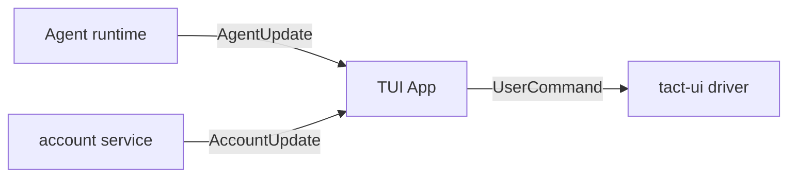
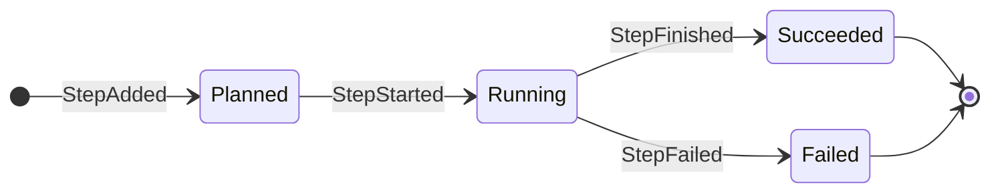
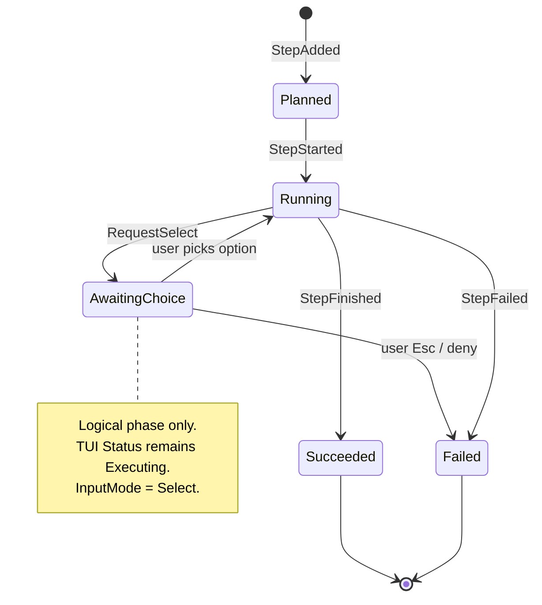
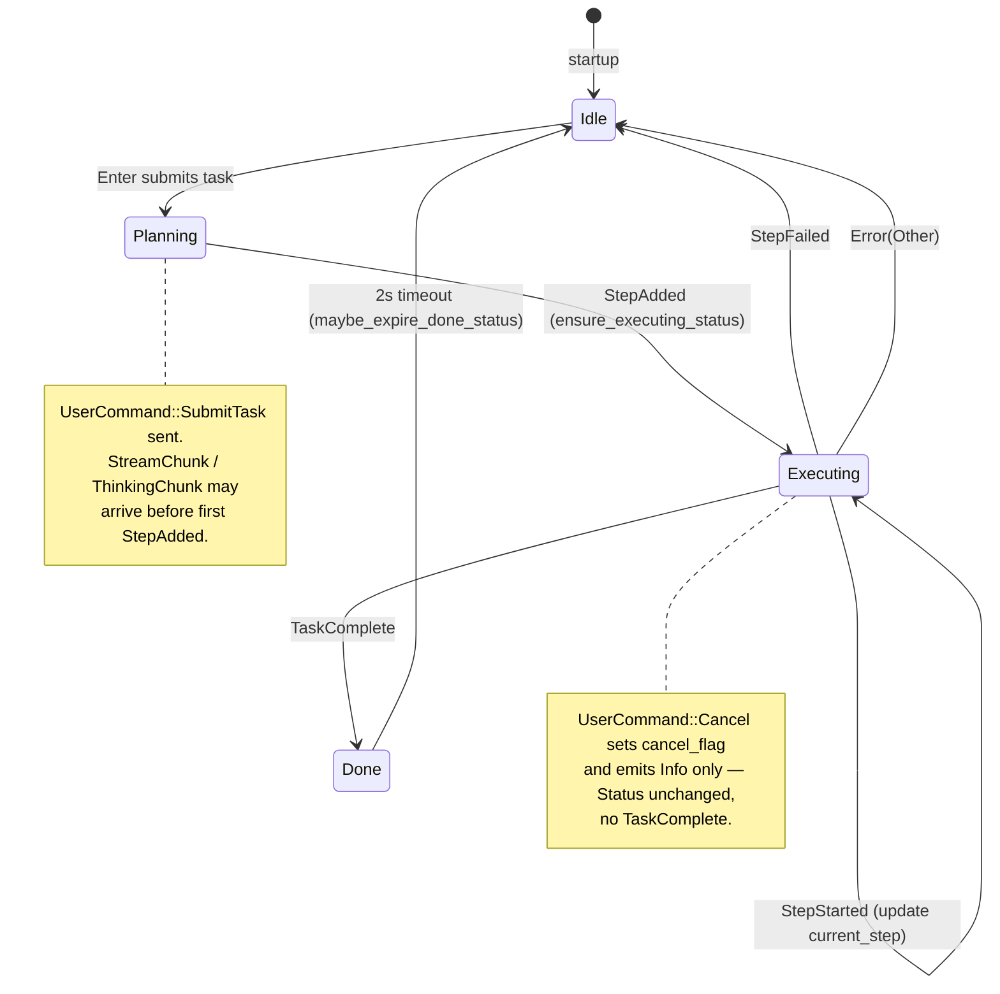
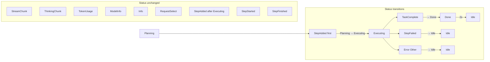
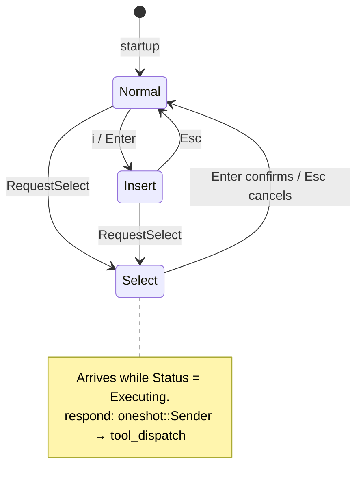
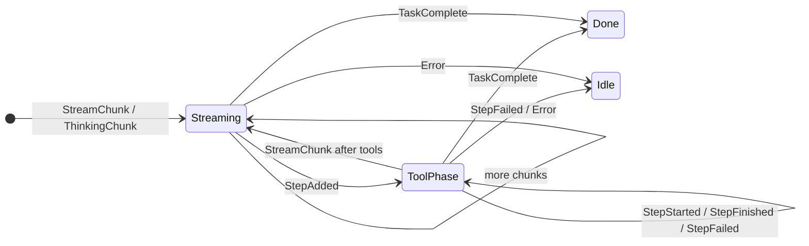
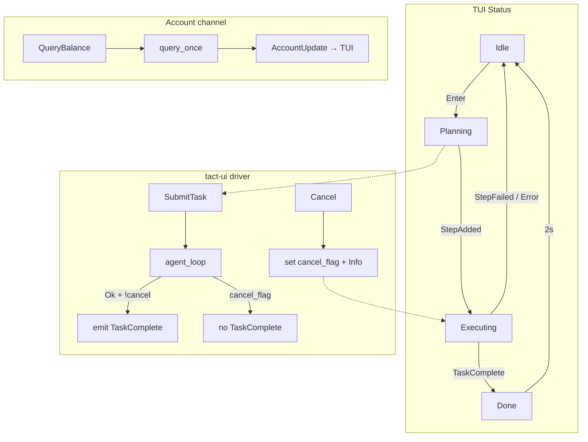
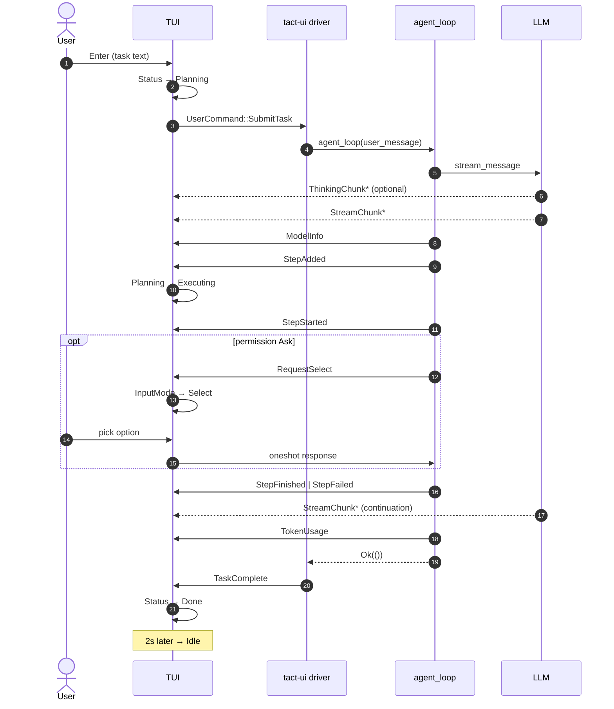

# Agent–TUI Protocol

This chapter documents the `tact_protocol` crate: message types exchanged between the agent runtime and the terminal UI, and how each `AgentUpdate` variant drives state transitions on both sides.

Implementation: `crates/protocol/src/agent.rs`, `crates/protocol/src/biz.rs`. TUI consumer: `crates/tui/src/widgets/state/app/agent.rs`. Agent emitter: `crates/tact/src/agent/tool_dispatch.rs`, `crates/tact_llm` (streaming).

Related chapters: [Ch 18 Agent Loop](./18_chapter_agent_loop.md), [Ch 23 TUI](./23_chapter_tui.md). Other state machines (input mode, permissions, tasks) live in [docs/state_machines.md](../docs/state_machines.md).

---

## 1. Channels



| Channel | Type | Direction | Purpose |
|---------|------|-----------|---------|
| `agent_tx` / `agent_rx` | `AgentUpdate` | Agent → TUI | Progress, streaming, metadata |
| `user_cmd_tx` / `user_cmd_rx` | `UserCommand` | TUI → driver | Submit task, cancel, balance query |
| `account_tx` / `account_rx` | `AccountUpdate` | Account → TUI | Balance / quota (separate from agent protocol) |

All three use `tokio::sync::mpsc::unbounded_channel`. `RequestSelect` embeds a `oneshot::Sender` for in-process request–response; it is not serializable and cannot be replayed from session storage.

---

## 2. Core Types

### `AgentUpdate`

```rust
pub enum AgentUpdate {
    StepAdded(PlanStep),
    StepStarted { idx, tool_id, tool_name, arg_summary, arg_full },
    StepFinished { idx, tool_id, result: StepResult },
    StepFailed { idx, tool_id, error },
    TaskComplete(String),
    Error(AgentErrorKind),
    TokenUsage(TokenUsageInfo),
    ModelInfo(ModelCallParams),
    Info(String),
    RequestSelect { prompt, options, respond },
    StreamChunk(String),
    ThinkingChunk(String),
}
```

### `UserCommand`

```rust
pub enum UserCommand {
    SubmitTask(String),
    Cancel,
    QueryBalance,
}
```

### `PlanStep`

```rust
pub struct PlanStep {
    pub description: String,
    pub tool: String,
    pub tool_id: String,
    pub args: serde_json::Map<String, serde_json::Value>,
    pub output: Option<String>,
}
```

`args` preserves the model's JSON object order and nested values. The TUI does not re-parse tool-specific fields from `args` at runtime — `StepStarted.arg_full` carries the display string computed by the agent.

### `AccountUpdate` (biz module)

Balance and quota updates use `AccountUpdate` on a dedicated channel so provider-specific account state does not leak into `AgentUpdate`. See `crates/protocol/src/biz.rs` and `crates/tact-ui/src/account.rs`.

---

## 3. Plan Step Lifecycle

Each tool call in an assistant turn follows a fixed three-phase emission sequence from `tool_dispatch.rs`:



When permission mode is `Ask`, a `RequestSelect` popup may appear **after** `StepStarted` and **before** the tool runs. `Status` stays `Executing`; only `InputMode` switches to `Select` ([§4.3](#43-inputmode-overlay-requestselect)).



| Phase | `AgentUpdate` | Agent emitter | TUI effect |
|-------|---------------|---------------|------------|
| Planned | `StepAdded(PlanStep)` | pre-flight | Append to `plan.steps`; `ensure_executing_status` |
| Running | `StepStarted { … }` | pre-flight | Push `ActiveToolBlock`; update `current_step` |
| Succeeded | `StepFinished { result }` | post-flight | `finalize_tool_block`; set `plan.steps[idx].output` |
| Failed | `StepFailed { error }` | permission / hooks / execution | Failed tool card or system message; `Status → Idle` |

**`arg_summary` vs `arg_full`:** `arg_summary` is truncated (≤120 chars) for the log title row. `arg_full` is the complete argument string (path, command, or raw JSON) so popups and diff views do not depend on tool-name heuristics in the TUI.

Parallel tools in one turn each run the sequence above. `StepFinished` is emitted as each tool completes — not after the whole scheduling wave joins — so the UI shows concurrent progress ([Ch 11](./11_chapter_task.md)).

### Per-tool emission order

```text
StepAdded
  → StepStarted { arg_summary, arg_full }
  → RequestSelect?          (permission Ask only)
  → StepFinished | StepFailed
```

Independent tools may interleave at the wave level, but each `tool_id` keeps this sequence.

---

## 4. Task-Level Flow

### 4.1 TUI `Status` state machine

The top-level execution state lives in `crates/tui/src/widgets/state/mod.rs`. It drives the status bar and whether a new prompt can be submitted.

```rust
pub(crate) enum Status {
    Idle,
    Planning,
    Executing { current_step: usize, total: usize },
    Done,
}
```



| From | To | Trigger | Notes |
|------|-----|---------|-------|
| `Idle` | `Planning` | User presses `Enter` in Insert mode | Clears plan panel; sends `UserCommand::SubmitTask` |
| `Planning` | `Executing` | First `AgentUpdate::StepAdded` | `ensure_executing_status`; `total` from plan length |
| `Executing` | `Executing` | `StepStarted { idx, … }` | Updates `current_step`; may have concurrent `ActiveToolBlock`s |
| `Executing` | `Done` | `TaskComplete` | Sets `task_done_time`; freezes cost timer |
| `Executing` | `Idle` | `StepFailed` or `Error(Other)` | Freezes cost timer |
| `Done` | `Idle` | 2 s after `task_done_time` | Main loop calls `maybe_expire_done_status` |
| *(unchanged)* | *(unchanged)* | `UserCommand::Cancel` | `Info("Cancelling…")` only; loop exits without `TaskComplete` |

`TaskComplete` is sent by `crates/tact-ui/src/driver.rs` only when `agent_loop` returns `Ok(())` and `cancel_flag` is false ([Ch 18 §7](./18_chapter_agent_loop.md#7-tui-integration)).

### 4.2 `AgentUpdate` → `Status` mapping

Orthogonal to step lifecycle: which protocol messages actually flip `Status`.



| `AgentUpdate` | TUI `Status` / mode | Notes |
|---------------|---------------------|-------|
| `StepAdded` (first) | `Planning → Executing` | `ensure_executing_status` |
| `StepStarted` | `Executing` (update `current_step`) | May have multiple concurrent `ActiveToolBlock`s |
| `StepFailed` / `Error(Other)` | `→ Idle` | Cost timer frozen |
| `RequestSelect` | `InputMode::Select` (Status stays `Executing`) | See [Ch 10](./10_chapter_permission.md) |
| `TaskComplete` | `→ Done` (2s → `Idle`) | Emitted by driver, not `agent_loop` |
| `TokenUsage` / `ModelInfo` | No status change | Metadata-only; status bar update |
| `StreamChunk` / `ThinkingChunk` / `Info` | No status change | Log / stream only |

### 4.3 InputMode overlay (`RequestSelect`)

Permission prompts use a separate input-mode state machine. `RequestSelect` does **not** add a `Status` variant — the status bar can still read `Executing` while the select popup is open.



### 4.4 Logical phases within `Executing`

While `Status` is `Executing`, the log panel alternates between streaming and tool phases. This is a **view** state, not a separate `Status` enum value:



---

## 5. Message Categories

| Category | Variants | TUI side effects |
|----------|----------|------------------|
| **Content-producing** | `StepAdded`, `StepStarted`, `StepFinished`, `StepFailed`, `StreamChunk`, `ThinkingChunk`, `Info`, `TaskComplete`, `Error`, `RequestSelect` | Close thinking block; remove loading placeholder; mutate log / plan |
| **Metadata-only** | `TokenUsage(TokenUsageInfo)`, `ModelInfo(ModelCallParams)` | Update status bar only; keep loading placeholder |
| **Request–response** | `RequestSelect { respond }` | Blocks on user choice via oneshot channel |

Before handling any non-`ThinkingChunk` update, the TUI calls `flush_and_close_thinking()` so subsequent output does not append to the thinking region.

---

## 6. `UserCommand` Transitions



| Command | TUI precondition | Handler effect |
|---------|------------------|----------------|
| `SubmitTask(text)` | Enter in Insert mode → `Status::Planning` | `build_user_message` → `agent_loop` |
| `Cancel` | `/cancel` or Escape during run | Set `cancel_flag`; loop exits without `TaskComplete` |
| `QueryBalance` | `/balance` or palette | `account::query_once()` → `AccountUpdate` channel |

---

## 7. Typical Message Ordering

Single assistant turn with one tool call:



Text timeline (same turn):

```text
ThinkingChunk*          ← LLM reasoning stream (optional)
StreamChunk*            ← assistant text before / between tools
ModelInfo               ← model name / max_tokens (metadata)
StepAdded               ← plan panel entry
StepStarted             ← running tool card (arg_summary + arg_full)
RequestSelect?          ← permission Ask (optional)
StepFinished | StepFailed
StreamChunk*            ← assistant continuation text
TokenUsage              ← final usage chunk (metadata)
TaskComplete            ← driver after agent_loop Ok
```

Streaming chunks may arrive between step events. `TokenUsage` is usually emitted from the final LLM stream chunk when `stream_options.include_usage` is set.

---

## 8. Type Reference

| Type | File | Role |
|------|------|------|
| `AgentUpdate` | `agent.rs` | Agent → TUI event enum |
| `UserCommand` | `agent.rs` | TUI → agent command enum |
| `PlanStep` | `agent.rs` | Plan panel row; serde for session persistence |
| `StepResult` / `StepStatus` | `agent.rs` | Structured tool outcome |
| `TokenUsageInfo` | `agent.rs` | LLM token counters (incl. cache / reasoning) |
| `ModelCallParams` | `agent.rs` | Active model configuration snapshot |
| `AgentErrorKind` | `agent.rs` | Fatal error classification (`Display` + `Error`) |
| `BalanceInfo` / `UsageQuotaInfo` | `biz.rs` | Account query results (`f64` amounts, `Option<f64>` quotas) |
| `AccountUpdate` / `AccountError` | `biz.rs` | Account channel messages |

---

## 9. Related Resources

- Protocol source: [crates/protocol/src/agent.rs](../crates/protocol/src/agent.rs)
- Biz types: [crates/protocol/src/biz.rs](../crates/protocol/src/biz.rs)
- TUI handler: [crates/tui/src/widgets/state/app/agent.rs](../crates/tui/src/widgets/state/app/agent.rs)
- Tool dispatch emitter: [crates/tact/src/agent/tool_dispatch.rs](../crates/tact/src/agent/tool_dispatch.rs)
- Other state machines: [docs/state_machines.md](../docs/state_machines.md)
