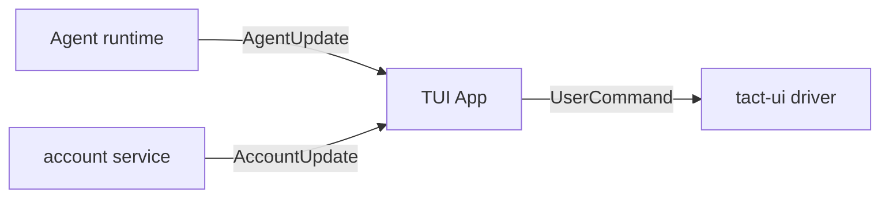
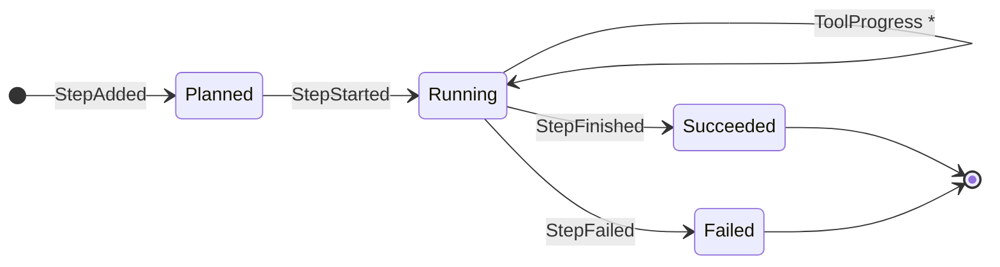
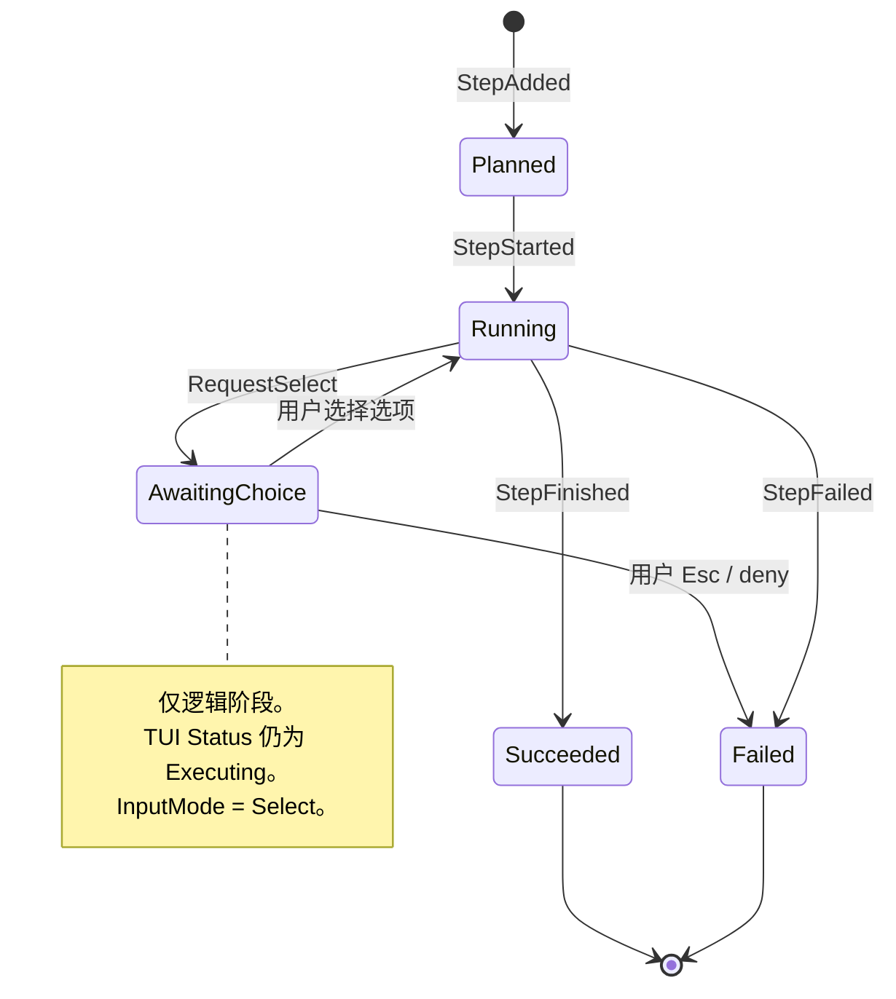
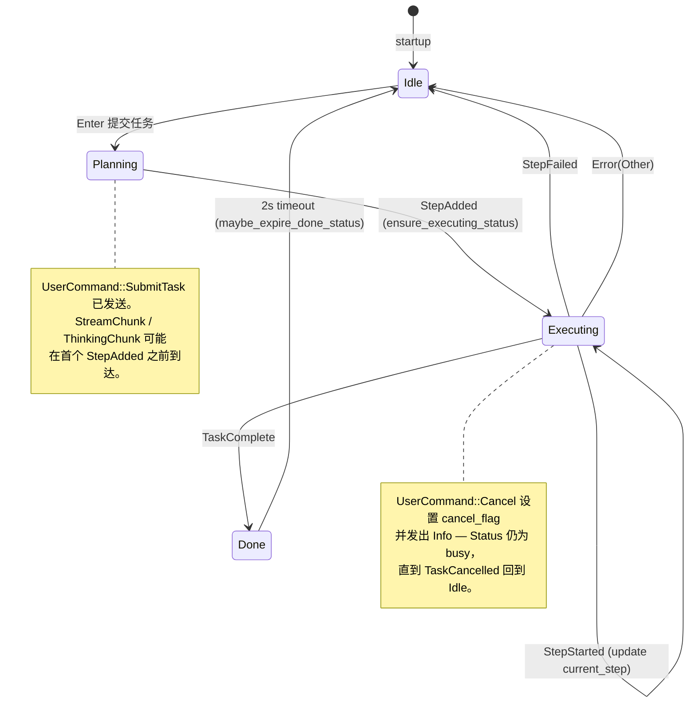
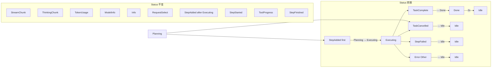
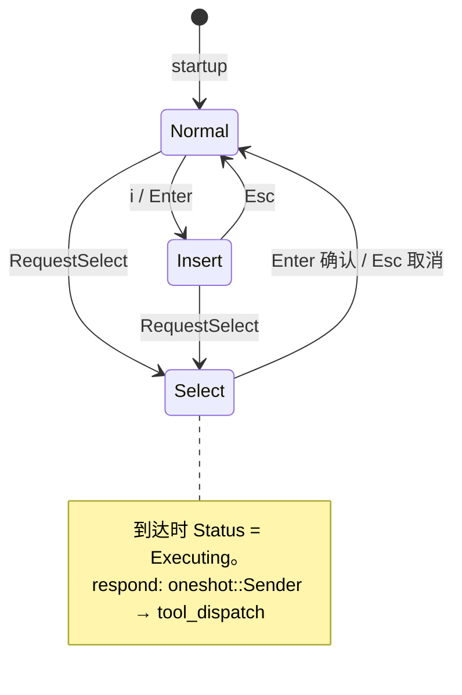
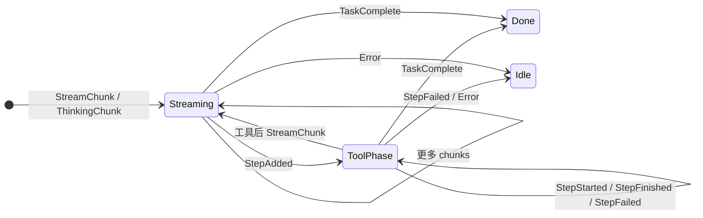
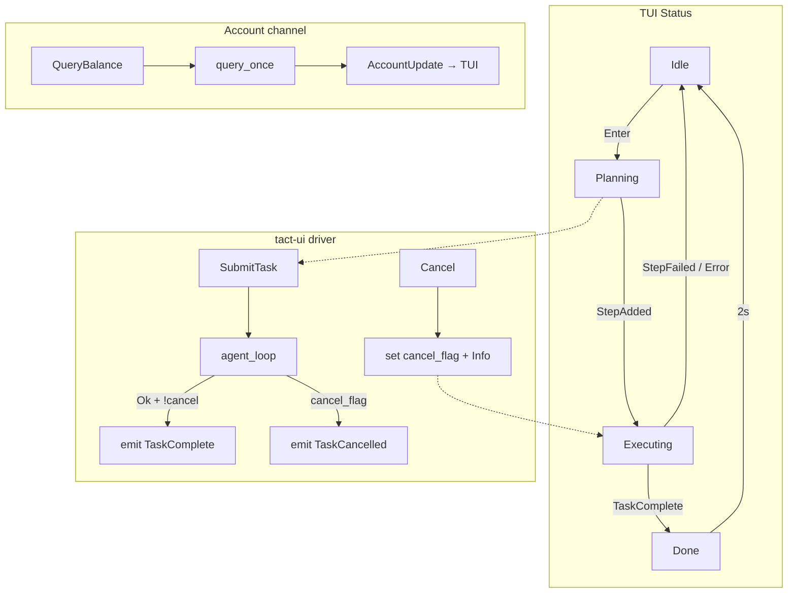
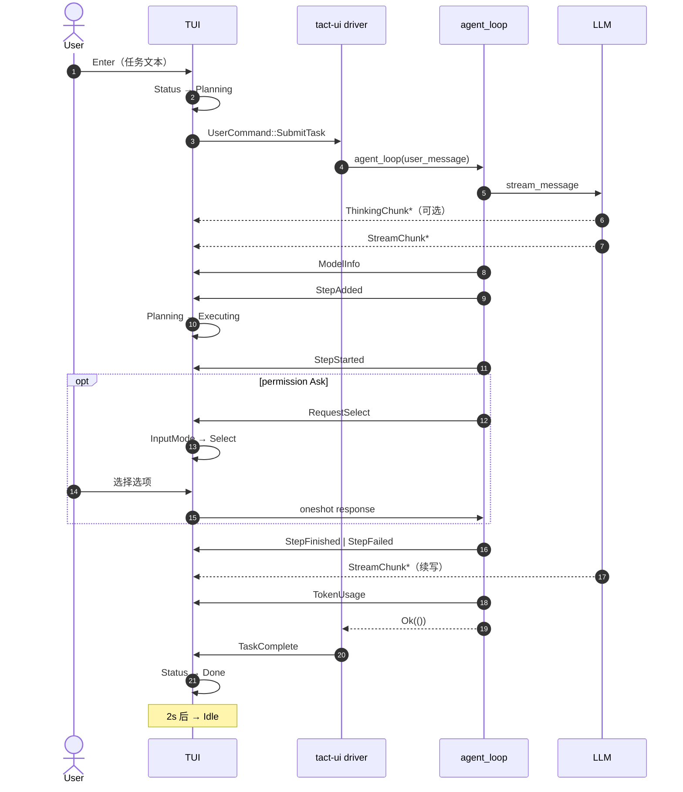

# Agent–TUI 协议（Agent–TUI Protocol）

> 语言：[中文](./25_chapter_protocol_zh.md) · [English](./25_chapter_protocol.md)

本章文档化 `tact_protocol` crate：agent 运行时与终端 UI 之间交换的消息类型，以及各 `AgentUpdate` variant 如何在两侧驱动状态转换。

实现：`crates/protocol/src/agent.rs`、`crates/protocol/src/biz.rs`。TUI 消费者：`crates/tui/src/widgets/state/app/agent.rs`。Agent 发出者：`crates/tact/src/agent/tool_dispatch.rs`、`crates/tact_llm`（流式）。

相关章节：[Ch 18 Agent Loop](./18_chapter_agent_loop.md)、[Ch 23 TUI](./23_chapter_tui_zh.md)。其他状态机（输入模式、权限、任务）见 [docs/state_machines.md](../docs/state_machines.md)。

---

## 1. Channels



| Channel | 类型 | 方向 | 用途 |
|---------|------|------|------|
| `agent_tx` / `agent_rx` | `AgentUpdate` | Agent → TUI | 进度、流式、元数据 |
| `user_cmd_tx` / `user_cmd_rx` | `UserCommand` | TUI → driver | 提交任务、取消、余额查询 |
| `account_tx` / `account_rx` | `AccountUpdate` | Account → TUI | 余额 / 配额（与 agent 协议分离） |

三者均用 `tokio::sync::mpsc::unbounded_channel`。`RequestSelect` 嵌入 `oneshot::Sender` 做进程内请求–响应；不可序列化，无法从 session 存储重放。

---

## 2. 核心类型

### `AgentUpdate`

```rust
pub enum AgentUpdate {
    StepAdded(PlanStep),
    StepStarted { idx, tool_id, tool_name, arg_summary, arg_full },
    ToolProgress { tool_id, chunks: Vec<ToolOutputChunk> },
    StepFinished { idx, tool_id, result: StepResult },
    StepFailed { idx, tool_id, error },
    TaskComplete(String),
    /// 任务中取消 — TUI 必须离开 Planning/Executing
    TaskCancelled,
    Error(AgentErrorKind),
    TokenUsage(TokenUsageInfo),
    ModelInfo(ModelCallParams),
    Info(String),
    RequestSelect { prompt, options, respond, log_confirm }, // 单选；permission=`false`，ask_user=`true`
    RequestMultiSelect { prompt, options, respond },         // 多选；仅 ask_user（`multi_select`）
    StreamChunk(String),
    ThinkingChunk(ThinkingChunk),
}

pub enum ThinkingChunk {
    Started,
    Delta(String),
    Finished,
}
```

`ThinkingChunk` 是生命周期 enum：生产者发出 `Started`、零或多个 `Delta` 片段，然后 `Finished`。仅暴露 `reasoning_content` delta 的 OpenAI 兼容 adapter 在流周围合成 `Started` / `Finished`。

`ToolOutputChunk` 携带增量解码文本与 `ToolOutputStream`（`Stdout`、
`Stderr` 或 `Other`）。一个 chunk batch 保留 aggregator 观察到的跨 stream 顺序。
`ToolProgress` 是信息性的：不表示成功或失败；TUI 忽略未知或迟到的 `tool_id`。

### `UserCommand`

```rust
pub enum UserCommand {
    SubmitTask(String),
    Cancel,
    QueryBalance,
}
```

### `PlanStep`

```rust
pub struct PlanStep {
    pub description: String,
    pub tool: String,
    pub tool_id: String,
    pub args: serde_json::Map<String, serde_json::Value>,
    pub output: Option<String>,
}
```

`args` 保留模型 JSON 对象顺序与嵌套值。TUI 运行时不再从 `args` 重解析工具特定字段 — `StepStarted.arg_full` 携带 agent 计算的显示字符串。

### `AccountUpdate`（biz 模块）

余额与配额更新使用专用 channel 上的 `AccountUpdate`，避免 provider 特定账户状态泄漏进 `AgentUpdate`。见 `crates/protocol/src/biz.rs` 与 `crates/tact-ui/src/account.rs`。

---

## 3. Plan Step 生命周期

assistant turn 中每次工具调用遵循 `tool_dispatch.rs` 固定的三阶段发出序列：



权限模式为 `Ask` 时，**`StepStarted` 之后、工具运行之前**可能出现 `RequestSelect` popup。`Status` 保持 `Executing`；仅 `InputMode` 切换到 `Select`（[§4.3](#43-inputmode-叠加-requestselect)）。



| 阶段 | `AgentUpdate` | Agent 发出者 | TUI 效果 |
|------|---------------|--------------|----------|
| Planned | `StepAdded(PlanStep)` | pre-flight | 追加到 `plan.steps`；`ensure_executing_status` |
| Running | `StepStarted { … }` | pre-flight | 推送 `ActiveToolBlock`；更新 `current_step` |
| Progress | `ToolProgress { tool_id, chunks }` | in-flight tool | 仅更新匹配 active block；保留 thinking/loading gate 与 scroll 意图 |
| Succeeded | `StepFinished { result }` | post-flight | `finalize_tool_block`；设置 `plan.steps[idx].output` |
| Failed | `StepFailed { error }` | permission / hooks / execution | 失败 tool card 或系统消息；`Status → Idle` |

**`arg_summary` vs `arg_full`：** `arg_summary` 截断（≤120 字符）供 log 标题行。`arg_full` 为完整参数字符串（路径、命令或原始 JSON），popup 与 diff 视图不依赖 TUI 内工具名启发式。

同一 turn 中并行工具各自运行上述序列。`StepFinished` 在各工具完成时发出 — 非整波 join 之后 — UI 显示并发进度（[Ch 11](./11_chapter_task.md)）。

### 每工具发出顺序

```text
StepAdded
  → StepStarted { arg_summary, arg_full }
  → RequestSelect?          （仅 permission Ask）
  → ToolProgress*           （执行开始后；信息性）
  → StepFinished | StepFailed
```

独立工具可在波次层面交错，但每个 `tool_id` 保持此序列。
对于 `bash`，首个 progress batch 可立即发送；常规 batch 至少间隔 50 ms、最多
4 KiB，并在终态事件前 final flush。共享 output buffer 移除 ANSI CSI/OSC、应用
carriage-return 替换、保留 stream identity 供样式使用，并将 detail 限制为 50,000 字符。

---

## 4. 任务级流程

### 4.1 TUI `Status` 状态机

顶层执行状态在 `crates/tui/src/widgets/state/mod.rs`。驱动状态栏及是否可提交新 prompt。

```rust
pub(crate) enum Status {
    Idle,
    Planning,
    Executing { current_step: usize, total: usize },
    Done,
}
```



| 从 | 到 | 触发 | 说明 |
|----|-----|------|------|
| `Idle` | `Planning` | Insert 模式按 `Enter` | 清空 plan panel；发送 `UserCommand::SubmitTask` |
| `Planning` | `Executing` | 首个 `AgentUpdate::StepAdded` | `ensure_executing_status`；`total` 来自 plan 长度 |
| `Executing` | `Executing` | `StepStarted { idx, … }` | 更新 `current_step`；可有并发 `ActiveToolBlock`s |
| `Executing` | `Done` | `TaskComplete` | 设置 `task_done_time`；冻结 cost timer |
| `Planning` / `Executing` | `Idle` | `TaskCancelled` | 取消后的 driver；释放输入 |
| `Executing` | `Idle` | `StepFailed` 或 `Error(Other)` | 冻结 cost timer |
| `Done` | `Idle` | `task_done_time` 后 2 s | 主循环调用 `maybe_expire_done_status` |
| *（不变）* | *（不变）* | `UserCommand::Cancel` | `Info("Cancelling…")` + 设 `cancel_flag`；随后 `TaskCancelled` |

`TaskComplete` 由 `crates/tact-ui/src/driver.rs` 在 `agent_loop` 返回 `Ok(())` 且 `cancel_flag` 为 false 时发送（[Ch 18 §7](./18_chapter_agent_loop.md#7-tui-integration)）。取消路径改为发送 `TaskCancelled`。

### 4.2 `AgentUpdate` → `Status` 映射

与 step 生命周期正交：哪些协议消息实际翻转 `Status`。



| `AgentUpdate` | TUI `Status` / mode | 说明 |
|---------------|---------------------|------|
| `StepAdded`（首个） | `Planning → Executing` | `ensure_executing_status` |
| `StepStarted` | `Executing`（更新 `current_step`） | 可有多个并发 `ActiveToolBlock`s |
| `ToolProgress` | 无 status 变化 | 一个 active `tool_id` 的信息性 live output |
| `StepFailed` / `Error(Other)` | `→ Idle` | Cost timer 冻结 |
| `RequestSelect` | `InputMode::Select`（Status 保持 `Executing`） | 见 [Ch 10](./10_chapter_permission.md) |
| `TaskComplete` | `→ Done`（2s → `Idle`） | 由 driver 发出，非 `agent_loop` |
| `TaskCancelled` | `→ Idle` | 取消后的 driver；解除新 prompt 阻塞 |
| `TokenUsage` / `ModelInfo` | 无 status 变化 | 仅元数据；状态栏更新 |
| `StreamChunk` / `ThinkingChunk` / `Info` | 无 status 变化 | 仅 log / stream |

### 4.3 InputMode 叠加（`RequestSelect`）

权限提示使用独立输入模式状态机。`RequestSelect` **不**添加 `Status` variant — select popup 打开时状态栏仍可读 `Executing`。



### 4.4 `Executing` 内逻辑阶段

`Status` 为 `Executing` 时，log panel 在流式与工具阶段间交替。这是**视图**状态，非独立 `Status` enum 值：



---

## 5. 消息类别

| 类别 | Variants | TUI 副作用 |
|------|----------|------------|
| **内容产出** | `StepAdded`、`StepStarted`、`StepFinished`、`StepFailed`、`StreamChunk`、`ThinkingChunk`、`Info`、`TaskComplete`、`TaskCancelled`、`Error`、`RequestSelect` | 优先 `ThinkingChunk::Finished` 关闭 thinking；其他内容更新上 safety-flush；移除 loading placeholder；变更 log / plan |
| **仅元数据** | `TokenUsage(TokenUsageInfo)`、`ModelInfo(ModelCallParams)` | 仅更新状态栏；保留 loading placeholder；**不**关闭已开 thinking 区域 |
| **请求–响应** | `RequestSelect { respond }` | 经 oneshot channel 阻塞等待用户选择 |

Thinking 生命周期显式：`ThinkingChunk::Started` 打开区域，`Delta` 追加文本，`Finished` flush 并折叠。安全网：其他内容产出非 thinking 更新仍会在区域仍开时调用 `flush_and_close_thinking()`。`TokenUsage` / `ModelInfo` 从不关闭 thinking（可能 mid-stream 到达）。

---

## 6. `UserCommand` 转换



| 命令 | TUI 前置条件 | Handler 效果 |
|------|--------------|--------------|
| `SubmitTask(text)` | Insert 模式 Enter → `Status::Planning` | `build_user_message` → `agent_loop` |
| `Cancel` | `/cancel` 或 Planning/Executing 时 Normal 模式 `c` | 设置 `cancel_flag`；循环退出后 driver 发 `TaskCancelled` → `Idle` |
| `QueryBalance` | `/balance` 或 palette | `account::query_once()` → `AccountUpdate` channel |

---

## 7. 典型消息顺序

单次 assistant turn、一次工具调用：



文本时间线（同一 turn）：

```text
ThinkingChunk*          ← LLM 推理流（可选）
StreamChunk*            ← 工具前/之间的 assistant 文本
ModelInfo               ← 模型名 / max_tokens（元数据）
StepAdded               ← plan panel 条目
StepStarted             ← 运行中 tool card（arg_summary + arg_full）
RequestSelect?          ← permission Ask（可选）
StepFinished | StepFailed
StreamChunk*            ← assistant 续写文本
TokenUsage              ← 最终 usage chunk（元数据）
TaskComplete            ← agent_loop Ok 后 driver
```

流式 chunk 可在 step 事件之间到达。`TokenUsage` 通常在 `stream_options.include_usage` 设置时从最终 LLM 流 chunk 发出。

---

## 8. 类型参考

| 类型 | 文件 | 角色 |
|------|------|------|
| `AgentUpdate` | `agent.rs` | Agent → TUI 事件 enum |
| `ThinkingChunk` | `agent.rs` | Thinking 流生命周期（`Started` / `Delta` / `Finished`） |
| `UserCommand` | `agent.rs` | TUI → agent 命令 enum |
| `PlanStep` | `agent.rs` | Plan panel 行；serde 供 session 持久化 |
| `StepResult` / `StepStatus` | `agent.rs` | 结构化工具结果 |
| `TokenUsageInfo` | `agent.rs` | LLM token 计数（含 cache / reasoning） |
| `ModelCallParams` | `agent.rs` | 活跃模型配置快照 |
| `AgentErrorKind` | `agent.rs` | 致命错误分类（`Display` + `Error`） |
| `BalanceInfo` / `UsageQuotaInfo` | `biz.rs` | 账户查询结果（`f64` 金额、`Option<f64>` 配额） |
| `AccountUpdate` / `AccountError` | `biz.rs` | Account channel 消息 |

---

## 9. 相关资源

- 协议源码：[crates/protocol/src/agent.rs](../crates/protocol/src/agent.rs)
- Biz 类型：[crates/protocol/src/biz.rs](../crates/protocol/src/biz.rs)
- TUI handler：[crates/tui/src/widgets/state/app/agent.rs](../crates/tui/src/widgets/state/app/agent.rs)
- Tool dispatch 发出者：[crates/tact/src/agent/tool_dispatch.rs](../crates/tact/src/agent/tool_dispatch.rs)
- 其他状态机：[docs/state_machines.md](../docs/state_machines.md)
