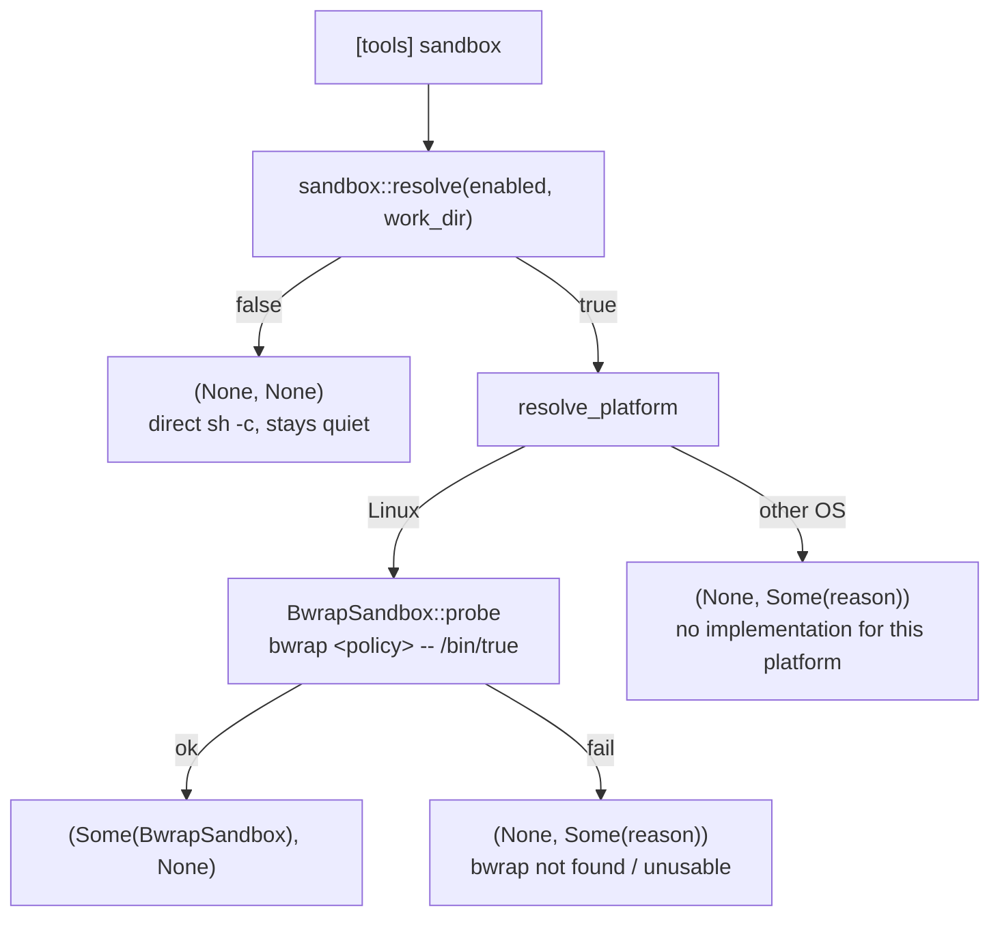
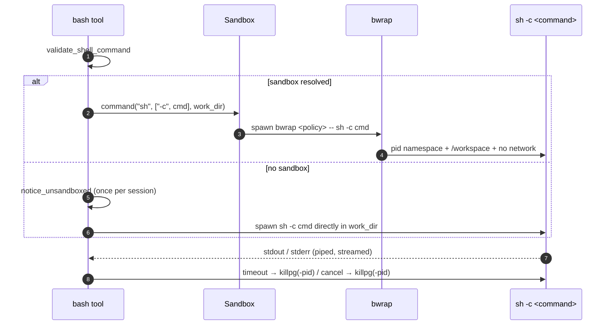

# Bash Sandbox
> Language: [English](./27_chapter_sandbox.md) · [中文](./27_chapter_sandbox_zh.md)

This chapter explains Tact's **opt-in OS-level sandbox** for shell execution: one boolean in `config.toml` wraps the `bash` tool's `sh -c` process in the platform's sandbox implementation (Linux: `bubblewrap`), so third-party code an approved command pulls in — `cargo` build scripts, `npm` lifecycle scripts, test binaries, `make` recipes — cannot read the host home directory or reach the network.

The implementation lives in `crates/tact/src/sandbox/` (`mod.rs` resolves, `bwrap.rs` is the Linux backend); the only call site is the `bash` tool in `crates/tact/src/tool/bash.rs`. Permissions are untouched: the sandbox answers *what a command can reach*, not *whether it may run* ([Permission Model](./10_chapter_permission.md)).

---

## 1. The Switch

```toml
[tools]
sandbox = true   # default: false
```

| Property | Value |
|---|---|
| Config key | `[tools] sandbox`, TOML only — there is no CLI flag |
| Type | boolean (`true` / `false`); a non-boolean is a **parse error**, never a silent fallback |
| Default | `false` — a default install behaves exactly as before |
| Backend | not configurable on purpose: the platform picks it (`crate::sandbox::resolve`) |

The key is a plain on/off switch because the *mechanism* is not a user choice. Naming a backend in the config would let a user write a value that cannot work on the machine reading it; instead the code decides:

| Platform | Implementation |
|---|---|
| Linux | `BwrapSandbox` (`bwrap` from `PATH`) |
| everything else | none yet — the switch is accepted, resolved, and **inert**, with a reason |

Resolution happens **once at startup**, not per `bash` call, because the result decides the `bash` tool description too:

```rust
// crates/tact-ui/src/interactive.rs / headless.rs
let (sandbox, sandbox_degraded) =
    tact::sandbox::resolve(tact::config::settings().tools.sandbox, &work_dir);
if sandbox.is_some() {
    tools.set_tool_description("bash", tact::tool::SANDBOXED_BASH_DESCRIPTION);
}
```

Both frontends do this identically; the resolved pair lands on `ToolContext` (`sandbox`, `sandbox_degraded`), which is cloned per invocation — and cloned into every subagent, so a subagent's `bash` runs under the same sandbox as its parent's ([Subagents](./12_chapter_subagent.md)).

---

## 2. Fail-Open, Never Silent



Every path that does not produce a sandbox produces a **reason** (`SandboxDegradation.reason`), and the downgrade is announced on two channels:

| Channel | Where | When |
|---|---|---|
| Startup notice | TUI: `AgentUpdate::Info`; headless: `eprintln!("[sandbox] …")` | once, during startup |
| Point-of-use notice | `bash` tool → `tracing::warn!` (+ `AgentUpdate::Info` in the TUI) | on the **first** `bash` call of the session (`OnceLock`, so exactly once) |

`enabled = false` is not a degradation and emits nothing — being unsandboxed by configuration is a choice, not a failure. The point-of-use notice exists because the startup line scrolls away long before the command it applies to.

**Why probe at startup?** A mis-specified policy fails on *every* command with a misleading error — a missing `/lib64` looks like `bwrap: execvp sh: No such file or directory` (a missing shell), and a kernel refusing unprivileged user namespaces looks like "the user's command exited 1". `BwrapSandbox::probe` therefore runs the complete policy once against `/bin/true` and converts the failure into one explainable reason.

---

## 3. The Policy

The flag list is built by a **pure** function, `bwrap_args_with(work_dir, exists)`, so every rule below is unit-testable without bubblewrap on the host (`bwrap_args` is the real-filesystem wrapper).

| Element | Flags | Notes |
|---|---|---|
| Lifecycle | `--die-with-parent` | bwrap dies with Tact |
| Network | `--unshare-net` | no DNS, no proxy listener, no host loopback |
| Process namespace | `--unshare-pid` | the sandbox sees its own `/proc` (measured: ~5 pids instead of the host's ~475, and Tact's own host pid is absent — asserted by `pid_namespace_hides_the_host_process_table`), so it cannot signal same-uid host processes |
| Workspace | `--bind <work_dir> /workspace` | the **only** read-write host directory, and it is *not* visible under its host path |
| System paths | `--ro-bind /usr /bin /lib /etc` | skipped with a `tracing::warn!` when absent |
| Loader | `--ro-bind /lib64` | **required**: missing means construction fails, because every command would otherwise report a missing shell |
| Toolchain homes | `--ro-bind` of `~/.rustup`, `~/.cargo`, `~/.config/git`, `~/.npm` | mounted at their **host** paths and wired through `RUSTUP_HOME` / `CARGO_HOME` / `GIT_CONFIG_GLOBAL` / `NPM_CONFIG_CACHE` |
| Kernel interfaces | `--proc /proc`, `--dev /dev`, `--tmpfs /tmp` | 0.12 creates none of these by default |
| Working directory | `--chdir /workspace` | matches `$HOME` (below) |
| Environment | `--clearenv` then `--setenv` | allowlist, not inheritance (below) |

The workspace bind is the reason shell commands and in-process tools disagree about paths: the shell sees `/workspace/...` while `read_file` / `edit_file` / `grep` keep reporting host absolute paths. That split is surfaced to the model by rewriting the `bash` description at startup — and **only** when a sandbox is actually active, so an unsandboxed session never advertises a `/workspace` that does not exist.

### Environment allowlist

`--clearenv` is not hygiene for its own sake: the host environment leaks `HOME` (a directory that is *not* mounted) and `http_proxy` / `https_proxy` / `all_proxy` (a listener that does not exist inside), which turns real failures into misleading ones — a blocked `curl` would report a *proxy* error.

| Variable | Value | Why |
|---|---|---|
| `PATH` | `/usr/local/bin:/usr/bin:/bin` | fixed; the host `PATH` is meaningless here |
| `HOME` | `/workspace` | `~` resolves into the workspace, never the host home |
| `TERM` | `dumb` | no terminal is attached |
| `LANG`, `LC_ALL` | passed through when set | keeps output encodings stable |
| `RUSTUP_HOME`, `CARGO_HOME`, `GIT_CONFIG_GLOBAL`, `NPM_CONFIG_CACHE` | host paths of the mounted homes | because `HOME=/workspace`, `~` no longer finds the toolchain — these four are load-bearing |

### Workspace guard

A read-write bind of the wrong directory would silently expose far more than the project, so `guard_workspace` refuses (after canonicalization):

| Refused | Example |
|---|---|
| the filesystem root | `/` |
| the host home directory | `/home/rg` |
| an ancestor of the host home | `/home`, `/` |
| system directories | `/etc`, `/usr/lib`, `/boot`, `/bin`, `/lib`, `/lib64` |

A project *inside* `$HOME` (the normal case, e.g. `~/Projects/tact`) is explicitly accepted and pinned by a test.

---

## 4. Execution Path

The sandbox changes **how the process is started**, nothing else:

```text
Hook → Permission → bash tool → Sandbox (optional) → bwrap → sh -c → command
```



Everything after `spawn` is unchanged: piped stdio, `process_group(0)`, the configured or per-call timeout, cancellation, streaming output, and `killpg` teardown. The sandbox trait is deliberately command-oriented — it builds a `tokio::process::Command` and returns it — so the execution lifecycle has no sandbox-specific code path.

`work_dir` is passed **per call**, not captured at startup, so a worktree-lane subagent (whose context was cloned with a different `work_dir`) gets its own lane mounted at `/workspace`.

---

## 5. The `--new-session` Invariant

`bwrap` must never be given `--new-session`. Measured on bubblewrap 0.12.0:

| | With `--new-session` | Without |
|---|---|---|
| Process group | bwrap `setsid()`s the command into its **own** session; the pgid Tact recorded belongs to bwrap | every process keeps pgid == bwrap's pid |
| Teardown | `killpg(bwrap_pid)` kills only bwrap; a grandchild (`sh -c 'sleep 300 & wait'`) survives, holds the inherited stdout/stderr write ends open | `killpg` clears the tree, both pipes reach EOF within milliseconds |
| Symptom | the tool call never returns — the reader loop waits for an EOF that cannot arrive | timeout and cancellation return promptly |

`--unshare-pid` provides the stronger guarantee instead: the namespace dies with bwrap, taking its members with it. `never_passes_new_session` asserts the flag's absence, and two integration tests assert that a timed-out and a cancelled sandboxed command leave no survivors.

---

## 6. Scope and Non-Goals

| In scope | Out of scope |
|---|---|
| The `bash` tool's own process tree, including subagents' `bash` | `background_run` — spawns its own host shell ([Background Tasks](./13_chapter_background.md)) |
| Third-party code an approved command runs | `worktree_run` and the lane-management `git` calls ([Worktree Lanes](./15_chapter_worktree.md)) |
| Path space, network, pid visibility, environment | MCP servers, plugin hooks, voice transcription, `rtk` filtering |
| | In-process file tools (`read_file`, `edit_file`, `grep`) keep full host access |

The sandbox is therefore **not** a boundary around the agent: an agent that wants an unsandboxed shell has one tool call away from it. What it bounds is the failure mode that matters in practice — approved commands that pull in third-party code.

It is also best-effort by construction: it is opt-in, and any host condition that prevents it (no `bwrap`, restricted user namespaces, another platform) degrades to unsandboxed rather than failing the tool. Nothing should rely on it for correctness.

---

## 7. Testing

| Layer | Tests |
|---|---|
| Resolution (`sandbox/mod.rs`) | `the_switch_being_off_is_not_a_degradation`, `an_enabled_switch_resolves_to_a_handle_or_a_reasoned_degradation`, `degradation_notice_fires_only_once`, `degradation_reason_names_the_cause_and_the_effect` |
| Flag construction (`sandbox/bwrap.rs`, no bwrap needed) | `emits_the_documented_flag_order`, `never_passes_new_session`, `missing_lib64_is_a_hard_error`, `absent_optional_system_path_is_skipped`, `clears_the_environment_and_sets_an_allowlist`, `guard_rejects_the_filesystem_root`, `guard_rejects_the_home_directory_and_its_ancestors`, `guard_rejects_system_directories`, `guard_accepts_a_project_directory_under_the_home_directory` |
| Real sandbox (`tool/bash.rs`, `#[cfg(all(test, target_os = "linux"))]`, skips when bwrap is unresolvable) | `workspace_is_mounted_at_workspace_and_the_host_home_is_not`, `system_files_are_readable_and_proxies_are_absent`, `network_is_blocked`, `pid_namespace_hides_the_host_process_table`, `toolchain_homes_are_mounted_read_only`, `timeout_returns_promptly_and_leaves_no_survivors`, `cancellation_leaves_no_survivors` |

Two traps the integration tests encode:

- **Survivor checks read `/proc/<pid>/cmdline`**, and bwrap's own argv contains the command string — parallel tests must use *distinct* markers (`sleep 311` vs `sleep 322`) or they observe each other's sandbox.
- **`SIGKILL` is asynchronous**, so a process can still be listed right after the call returns; the assertions poll (bounded) instead of asserting immediately.

---

## 8. Code Map

| File | Responsibility |
|---|---|
| `crates/tact/src/sandbox/mod.rs` | `Sandbox` trait, `resolve(enabled, work_dir)`, `resolve_platform` per-OS dispatch, `SandboxDegradation` (reason + once-per-session notice) |
| `crates/tact/src/sandbox/bwrap.rs` | Linux backend: `BwrapSandbox::probe`, pure `bwrap_args_with`, `guard_workspace` |
| `crates/tact/src/tool/bash.rs` | `match &ctx.sandbox` process construction, `notice_unsandboxed`, `SANDBOXED_BASH_DESCRIPTION` |
| `crates/tact/src/tool/mod.rs` | `ToolContext.sandbox` / `sandbox_degraded` |
| `crates/tact/src/config/types.rs` | `[tools] sandbox` (`Option<bool>`) and resolved `ToolSettings.sandbox: bool` |
| `crates/tact-ui/src/interactive.rs`, `headless.rs` | Startup resolution, degradation notice, `bash` description override |

---

## 9. Current Gaps

| Gap | Detail |
|---|---|
| Linux only | Other platforms accept the switch and do nothing; no Seatbelt / Windows backend |
| Only `bash` | Every other spawn path listed in §6 (`background_run`, `worktree_run` and the lane-management `git` calls, MCP servers, plugin hooks, voice transcription, the `rtk` filter) still starts host processes |
| No policy configuration | No per-mount, per-network or per-tool knobs; the policy is fixed in code |
| Reads are still broad | `/etc` and the toolchain homes are mounted read-only, so credentials inside `~/.cargo` etc. remain readable (they are needed for the toolchain to work at all) |
| `$HOME=/workspace` leaks to children | Any sandboxed command that consults `~/.tact/...` resolves it inside the workspace, i.e. against the *repository's own* `.tact/` directory |

---

## Related Docs

- [Tool System](./07_chapter_tool.md) §7.1 — where the sandbox sits in the tool pipeline
- [Permission Model](./10_chapter_permission.md) — why the sandbox is a separate, non-permission layer
- [Configuration](./21_chapter_config.md) — `tools.sandbox` in the config surface
- [Background Tasks](./13_chapter_background.md), [Worktree Lanes](./15_chapter_worktree.md) — the unsandboxed shell paths
- [Engineering Issue Log](./26_chapter_issue.md) — the 2026-09-15 entry that shipped this feature
- Design record: [`docs/superpowers/specs/2026-09-15-bwrap-sandbox-design.md`](../docs/superpowers/specs/2026-09-15-bwrap-sandbox-design.md); implementation plan with deviations: [`docs/superpowers/plans/2026-09-15-bwrap-sandbox.md`](../docs/superpowers/plans/2026-09-15-bwrap-sandbox.md)
