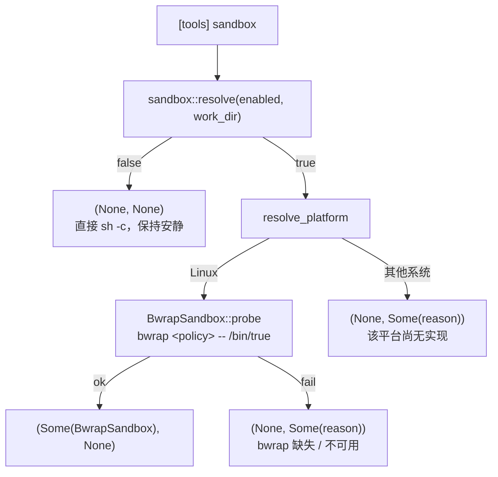
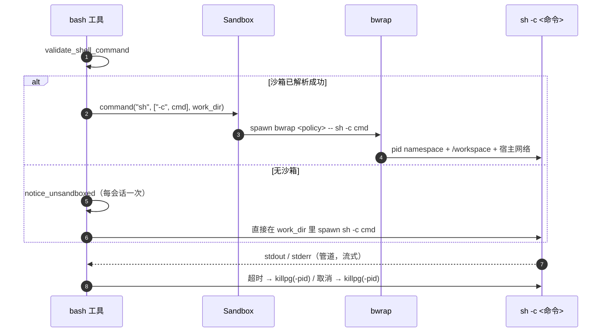

# Bash 沙箱（Bash Sandbox）

> 语言：[中文](./27_chapter_sandbox_zh.md) · [English](./27_chapter_sandbox.md)

本章说明 Tact 可选的 **OS 级 shell 沙箱**：`config.toml` 里一个布尔开关，把 `bash` 工具的 `sh -c` 进程包进平台的沙箱实现（Linux 用 `bubblewrap`），使得被批准命令引入的第三方代码——`cargo` 构建脚本、`npm` 生命周期脚本、测试二进制、`make` 配方——读不到宿主 home，也写不到工作区之外。**网络**是刻意保持共享的：沙箱约束的是文件系统，不是连通性。

实现在 `crates/tact/src/sandbox/`（`mod.rs` 负责解析，`bwrap.rs` 是 Linux 后端）；唯一的调用点是 `crates/tact/src/tool/bash.rs`。权限模型完全不动：沙箱回答的是*命令能触达什么*，而不是*它能不能运行*（见[权限模型](./10_chapter_permission_zh.md)）。

---

## 1. 开关

```toml
[tools]
sandbox = true   # 默认 false
```

| 属性 | 取值 |
|---|---|
| 配置键 | `[tools] sandbox`，仅 TOML——没有对应 CLI flag |
| 类型 | 布尔（`true` / `false`）；非布尔是**解析错误**，绝不静默回落 |
| 默认 | `false`——默认安装行为与以前完全一致 |
| 后端 | 刻意不可配置：由平台在 `crate::sandbox::resolve` 里决定 |

之所以是纯粹的开关，是因为**机制**不是用户的选择。在配置里写后端名，等于允许用户写出一份在读取它的机器上根本无法生效的配置；改由代码决定：

| 平台 | 实现 |
|---|---|
| Linux | `BwrapSandbox`（`PATH` 中的 `bwrap`） |
| 其他 | 尚无实现——开关被接受、被解析，但**不生效**，并给出原因 |

解析发生在**启动时一次**，而不是每次 `bash` 调用，因为这个结果同时决定 `bash` 的工具描述：

```rust
// crates/tact-ui/src/interactive.rs / headless.rs
let (sandbox, sandbox_degraded) =
    tact::sandbox::resolve(tact::config::settings().tools.sandbox, &work_dir);
if sandbox.is_some() {
    tools.set_tool_description("bash", tact::tool::SANDBOXED_BASH_DESCRIPTION);
}
```

两个入口点做的事完全一致；解析结果挂在 `ToolContext` 上（`sandbox`、`sandbox_degraded`），每次工具调用克隆一份——**也会被克隆进每个子 agent**，所以子 agent 的 `bash` 与父进程处在同一个沙箱里（见[子 Agent](./12_chapter_subagent_zh.md)）。

---

## 2. fail-open，但绝不静默



任何没能产出沙箱的路径都会产出一个**原因**（`SandboxDegradation.reason`），并且降级会通过两个渠道告知：

| 渠道 | 位置 | 时机 |
|---|---|---|
| 启动提示 | TUI：`AgentUpdate::Info`；headless：`eprintln!("[sandbox] …")` | 启动时一次 |
| 使用点提示 | `bash` 工具 → `tracing::warn!`（TUI 下再加 `AgentUpdate::Info`） | 本会话**第一条** `bash` 调用（`OnceLock`，只发一次） |

`enabled = false` 不算降级，也不会输出任何东西——"配置成不沙箱"是选择，不是失败。使用点提示存在的原因是：启动那行日志早在它适用的命令出现之前就滚出屏幕了。

**为什么要在启动时 probe？** 策略写错会让**每条**命令以误导性的错误失败：缺少 `/lib64` 会表现成 `bwrap: execvp sh: No such file or directory`（像是没有 shell），内核拒绝非特权 user namespace 会表现成"用户的命令退出码 1"。所以 `BwrapSandbox::probe` 先用完整策略对 `/bin/true` 跑一遍，把这类失败一次性转成一条可解释的原因。

---

## 3. 策略

flag 列表由**纯函数** `bwrap_args_with(work_dir, exists, env)` 生成，因此下面每条规则都能在宿主没有 bubblewrap 的情况下单测（`bwrap_args` 只是接真实文件系统与真实环境的外壳）。

| 元素 | flag | 说明 |
|---|---|---|
| 生命周期 | `--die-with-parent` | bwrap 随 Tact 一起退出 |
| 网络 | `--share-net` | 共享**宿主**网络命名空间：宿主能到的，命令也能到——包括监听在宿主 loopback 上的代理。`--share-net` 是 bwrap 默认行为的显式写法 |
| 域名解析 | `--ro-bind /run/systemd/resolve` | 只共享命名空间还不够：`/etc/resolv.conf` 通常是指向 `/run/systemd/resolve` 的符号链接，而 `/run` 本来不挂载，缺了这条绑定每次解析都会报 "Temporary failure in name resolution"。使用普通 `resolv.conf` 的宿主会静默跳过 |
| 进程命名空间 | `--unshare-pid` | 沙箱内看到自己的 `/proc`（实测约 5 个 pid，而不是宿主约 475 个；Tact 自身的宿主 pid 在沙箱内不存在，由 `pid_namespace_hides_the_host_process_table` 断言），因此也无法给同 uid 的宿主进程发信号 |
| 工作区 | `--bind <work_dir> /workspace` | **唯一**读写挂载的宿主目录，且**不**以其宿主路径出现 |
| 系统路径 | `--ro-bind /usr /bin /lib /etc` | 不存在时跳过并 `tracing::warn!` |
| 动态加载器 | `--ro-bind /lib64` | **必需**：缺失即构造失败，否则每条命令都会报"找不到 shell" |
| 工具链 home | `--ro-bind` `~/.rustup`、`~/.cargo`、`~/.config/git`、`~/.npm` | 按**宿主**路径挂载，并通过 `RUSTUP_HOME` / `CARGO_HOME` / `GIT_CONFIG_GLOBAL` / `NPM_CONFIG_CACHE` 接线 |
| 内核接口 | `--proc /proc`、`--dev /dev`、`--tmpfs /tmp` | 0.12 不会自动创建其中任何一个 |
| 工作目录 | `--chdir /workspace` | 与下面的 `$HOME` 一致 |
| 环境变量 | 先 `--clearenv`，再 `--setenv` | 白名单，而非继承（见下） |

工作区绑定正是 shell 与进程内工具对路径说法不一致的原因：shell 看到的是 `/workspace/...`，而 `read_file` / `edit_file` / `grep` 仍报宿主绝对路径。这个分裂通过在启动时重写 `bash` 描述告知模型——并且**只在沙箱真正生效时**才重写，未沙箱的会话绝不会宣称一个并不存在的 `/workspace`。

### 环境变量白名单

`--clearenv` 不只是卫生习惯：宿主环境会泄漏 `HOME`（一个**没有**被挂载的目录）以及 shell 恰好导出的任何凭据。因此白名单是逐变量显式列出的——唯一的例外是代理变量：沙箱共享宿主网络命名空间，而在那些只能靠代理出网的宿主上，丢掉它们会把一条本来能跑的命令变成连接错误。

| 变量 | 取值 | 原因 |
|---|---|---|
| `PATH` | `/usr/local/bin:/usr/bin:/bin` | 固定值；宿主 `PATH` 在这里没有意义 |
| `HOME` | `/workspace` | `~` 落在工作区内，永远不指向宿主 home |
| `TERM` | `dumb` | 没有终端 |
| `LANG`、`LC_ALL` | 有则透传 | 保持输出编码稳定 |
| `http_proxy`、`https_proxy`、`all_proxy`、`no_proxy`（含大写写法） | 有则透传 | 宿主的代理在沙箱内**确实**可达；两种拼写都带上，因为它们在"谁优先"上并不一致 |
| `RUSTUP_HOME`、`CARGO_HOME`、`GIT_CONFIG_GLOBAL`、`NPM_CONFIG_CACHE` | 被挂载 home 的宿主路径 | 因为 `HOME=/workspace`，`~` 再也找不到工具链——这四个是承重的 |

### 工作区守卫

把错误的目录以读写绑定进去，会静默暴露远超项目本身的范围，所以 `guard_workspace`（先做 canonicalize）会拒绝：

| 拒绝对象 | 例子 |
|---|---|
| 文件系统根 | `/` |
| 宿主 home 目录本身 | `/home/rg` |
| 宿主 home 的祖先 | `/home`、`/` |
| 系统目录 | `/etc`、`/usr/lib`、`/boot`、`/bin`、`/lib`、`/lib64` |

位于 `$HOME` **之内**的项目（常见情形，如 `~/Projects/tact`）被明确接受，并有测试钉住。

---

## 4. 执行路径

沙箱只改变**进程如何被启动**，其余一律不变：

```text
Hook → Permission → bash tool → Sandbox (optional) → bwrap → sh -c → command
```



`spawn` 之后的一切都不变：管道 stdio、`process_group(0)`、配置的或每次调用指定的超时、取消、流式输出、`killpg` 清理。沙箱 trait 刻意做成面向命令的——它只构造一个 `tokio::process::Command` 并返回——所以执行生命周期里没有任何沙箱专用分支。

`work_dir` 是**每次调用**传入的，而不是启动时捕获的，所以工作在 lane 里的子 agent（其 context 被克隆成了另一个 `work_dir`）会把**它自己的 lane** 挂载到 `/workspace`。

---

## 5. `--new-session` 不变式

绝不能给 `bwrap` 传 `--new-session`。在 bubblewrap 0.12.0 上实测：

| | 带 `--new-session` | 不带 |
|---|---|---|
| 进程组 | bwrap 会把命令 `setsid()` 到**自己的**会话；Tact 记录下来的 pgid 属于 bwrap | 每个进程的 pgid 都等于 bwrap 的 pid |
| 清理 | `killpg(bwrap_pid)` 只杀掉 bwrap；孙进程（`sh -c 'sleep 300 & wait'`）存活，持有继承来的 stdout/stderr 写端 | `killpg` 清掉整棵树，两条管道在毫秒内到达 EOF |
| 症状 | 工具调用永不返回——读循环在等一个不可能到达的 EOF | 超时与取消都能迅速返回 |

更强的保证由 `--unshare-pid` 提供：命名空间随 bwrap 一起消亡，成员一并消失。`never_passes_new_session` 断言该 flag 不存在，另外两个集成测试分别断言超时和取消的沙箱命令不会留下幸存进程。

---

## 6. 范围与非目标

| 覆盖 | 不覆盖 |
|---|---|
| `bash` 工具自己的进程树，包括子 agent 的 `bash` | `background_run`——自己启动宿主 shell（见[后台任务](./13_chapter_background_zh.md)） |
| 被批准命令拉起的第三方代码 | `worktree_run` 与 lane 管理里的 `git` 调用（见[Worktree 泳道](./15_chapter_worktree_zh.md)） |
| 路径空间、网络、pid 可见性、环境变量 | MCP server、插件 hook、语音转写、`rtk` 过滤 |
| | 进程内文件工具（`read_file`、`edit_file`、`grep`）仍拥有完整宿主访问权 |

因此沙箱**不是** agent 的边界：想看未沙箱 shell，agent 离它只有一个工具调用的距离。它真正约束的是实践中要紧的那个失败面——被批准命令引入的第三方代码。

它按设计也是 best-effort：可选、且任何导致无法启动的宿主条件（没有 `bwrap`、内核限制 user namespace、其他平台）都降级为不沙箱，而不是让工具失败。任何东西都不应依赖它来保证正确性。

---

## 7. 测试

| 层次 | 测试 |
|---|---|
| 解析（`sandbox/mod.rs`） | `the_switch_being_off_is_not_a_degradation`、`an_enabled_switch_resolves_to_a_handle_or_a_reasoned_degradation`、`degradation_notice_fires_only_once`、`degradation_reason_names_the_cause_and_the_effect` |
| flag 构造（`sandbox/bwrap.rs`，无需 bwrap） | `emits_the_documented_flag_order`、`never_passes_new_session`、`missing_lib64_is_a_hard_error`、`absent_optional_system_path_is_skipped`、`clears_the_environment_and_sets_an_allowlist`、`guard_rejects_the_filesystem_root`、`guard_rejects_the_home_directory_and_its_ancestors`、`guard_rejects_system_directories`、`guard_accepts_a_project_directory_under_the_home_directory` |
| 真实沙箱（`tool/bash.rs`，`#[cfg(all(test, target_os = "linux"))]`，bwrap 不可用时跳过） | `workspace_is_mounted_at_workspace_and_the_host_home_is_not`、`system_files_are_readable_and_proxies_follow_the_host`、`shares_the_host_network_namespace`、`pid_namespace_hides_the_host_process_table`、`toolchain_homes_are_mounted_read_only`、`timeout_returns_promptly_and_leaves_no_survivors`、`cancellation_leaves_no_survivors` |

集成测试里固化了两个坑：

- **幸存者检查读 `/proc/<pid>/cmdline`**，而 bwrap 自己的 argv 里就包含命令字符串——并行测试必须使用**互不相同**的标记（`sleep 311` 与 `sleep 322`），否则会看到彼此的沙箱。
- **`SIGKILL` 是异步的**，所以调用返回后进程可能仍短暂可见；断言采用有界的轮询，而不是立即判定。

---

## 8. 代码地图

| 文件 | 职责 |
|---|---|
| `crates/tact/src/sandbox/mod.rs` | `Sandbox` trait、`resolve(enabled, work_dir)`、按 OS 分派的 `resolve_platform`、`SandboxDegradation`（原因 + 每会话一次的提示状态） |
| `crates/tact/src/sandbox/bwrap.rs` | Linux 后端：`BwrapSandbox::probe`、纯函数 `bwrap_args_with`、`guard_workspace` |
| `crates/tact/src/tool/bash.rs` | `match &ctx.sandbox` 处的进程构造、`notice_unsandboxed`、`SANDBOXED_BASH_DESCRIPTION` |
| `crates/tact/src/tool/mod.rs` | `ToolContext.sandbox` / `sandbox_degraded` |
| `crates/tact/src/config/types.rs` | `[tools] sandbox`（`Option<bool>`）与解析后的 `ToolSettings.sandbox: bool` |
| `crates/tact-ui/src/interactive.rs`、`headless.rs` | 启动解析、降级提示、`bash` 描述覆盖 |

---

## 9. 当前缺口

| 缺口 | 详情 |
|---|---|
| 仅 Linux | 其他平台接受开关但什么都不做；没有 Seatbelt / Windows 后端 |
| 只有 `bash` | §6 列出的其余 spawn 路径（`background_run`、`worktree_run` 与 lane 管理的 `git` 调用、MCP server、插件 hook、语音转写、`rtk` 过滤）仍启动宿主进程 |
| 策略不可配置 | 没有按挂载点、按网络或按工具的策略开关；策略写死在代码里 |
| 读权限仍然很宽 | `/etc` 与工具链 home 是只读挂载，所以 `~/.cargo` 里的凭据仍可读（不挂上它们工具链根本跑不起来） |
| `$HOME=/workspace` 会传给子进程 | 任何读取 `~/.tact/...` 的沙箱内命令都会落在工作区里，也就是对上**仓库自己的** `.tact/` 目录 |

---

## 相关文档

- [工具系统](./07_chapter_tool_zh.md) §7.1——沙箱在工具管线中的位置
- [权限模型](./10_chapter_permission_zh.md)——为什么沙箱是独立于权限的另一层
- [配置](./21_chapter_config_zh.md)——配置面上的 `tools.sandbox`
- [后台任务](./13_chapter_background_zh.md)、[Worktree 泳道](./15_chapter_worktree_zh.md)——未沙箱的 shell 路径
- [工程问题与优化日志](./26_chapter_issue_zh.md)——交付本功能的 2026-09-15 条目
- 设计记录：[`docs/superpowers/specs/2026-09-15-bwrap-sandbox-design.md`](../docs/superpowers/specs/2026-09-15-bwrap-sandbox-design.md)；含偏差说明的实施计划：[`docs/superpowers/plans/2026-09-15-bwrap-sandbox.md`](../docs/superpowers/plans/2026-09-15-bwrap-sandbox.md)
