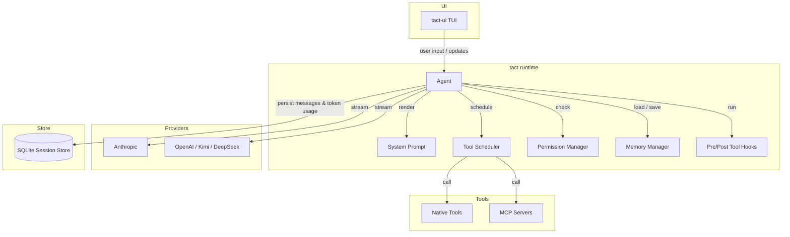

# Agent Development Tutorials

This directory collects design notes and hands-on tutorials for Tact and related agent runtimes. It is aimed at developers who want to understand or extend agent capabilities.

---

## Overall Architecture

---

## Table of Contents

| Chapter | Description |
|---------|-------------|
| [MCP Protocol and Agent Integration](./01_chapter_mcp.md) | Model Context Protocol fundamentals, step-by-step protocol flow, and MCP integration in Tact (configuration, handshake, tool calls, dynamic updates, graceful shutdown) |
| [System Prompt](./02_chapter_prompt.md) | How Tact assembles the system prompt from role, skills, guidelines, memory, and dynamic context, and how it stays cache-friendly across turns |
| [Tasks and Tool Scheduling](./03_chapter_task.md) | How a single agent turn runs tools through pre-flight, parallel wave execution, and post-processing while keeping conflicting operations ordered |
| [Agent Lifecycle Hooks](./04_chapter_hook.md) | PreToolUse / PostToolUse extension points, `HookControl`, registration API, and where hooks sit in the tool pipeline |

---

## How to Read

- **Protocol first, code second**: Each “Step N” in the tutorials maps cleanly to `crates/tact/src/mcp/mod.rs`.
- **Tact as the reference implementation**: Examples and code maps reflect this repository. Other agent frameworks follow similar ideas with different details.

---

## Planned Chapters

These topics are not written yet; they will be added over time:

- Agent main loop (`agent_loop`) and tool scheduling
- Permission model and `PermissionManager`
- Context compaction and session persistence

---

## Related Resources

- Project architecture: [ARCHITECTURE.md](../ARCHITECTURE.md)
- MCP official docs: <https://modelcontextprotocol.io/docs/learn/architecture>
- Tact MCP source: [crates/tact/src/mcp/mod.rs](../crates/tact/src/mcp/mod.rs)
- Tact hook source: [crates/tact/src/hook/mod.rs](../crates/tact/src/hook/mod.rs)

---

## Video Generation (AI Workflow)

Turn a chapter into slide + narration video with minimal manual work:

1. Generate `scenes.json` using the LLM prompt in [prompts/scene-generator.md](./prompts/scene-generator.md)
2. Run the pipeline: `./book/scripts/generate.sh <chapter> --all`

Full docs: [scripts/README.md](./scripts/README.md)
