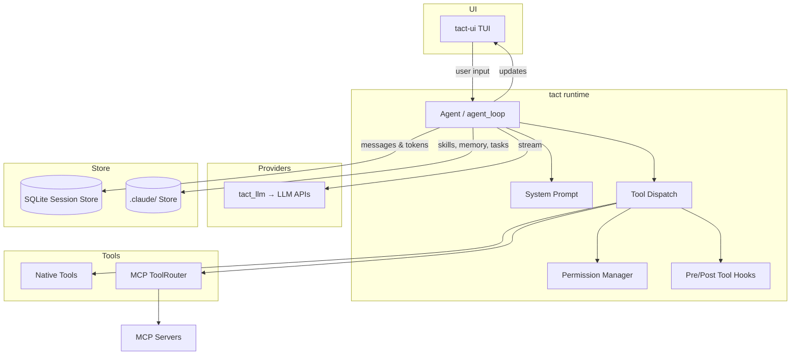
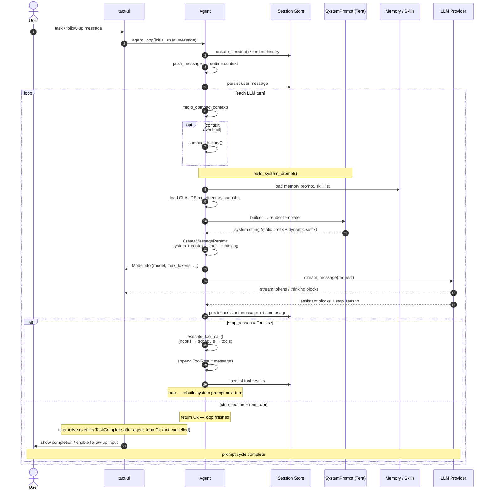

# Agent Development Tutorials

This directory collects design notes and hands-on tutorials for Tact and related agent runtimes. It is aimed at developers who want to understand or extend agent capabilities.

---

## Overall Architecture

High-level component map. For module-level detail see [ARCHITECTURE.md](../ARCHITECTURE.md).

---

## Prompt Flow: User Input to LLM Request

Each turn of `Agent::agent_loop` turns user input into a fully assembled prompt, streams it to the provider, and either finishes or loops through tool results. The sequence below focuses on how the **system prompt** is built and attached before the model runs.

**Stable vs. dynamic sections:** everything above `=== DYNAMIC_BOUNDARY ===` (role, guidelines, CLAUDE.md) is rebuilt but intended to stay byte-identical for prefix caching. Memory and dynamic context below the boundary refresh every turn. See [System Prompt](./04_chapter_prompt.md).

**Tool turns:** when the model returns `ToolUse`, the loop does not exit — tool results are appended to `runtime.context` and the next iteration runs steps 5–12 again with an updated message list and a freshly rendered system prompt.

**Compaction and recovery:** `micro_compact` / `compact_history` in the diagram are covered in [Context Compaction](./05_chapter_compact.md); retries and continuations around the LLM call are covered in [Error Recovery](./06_chapter_recovery.md).

---

## Table of Contents

Chapters follow **`Agent::agent_loop` execution order**: session → prompt inputs → compaction → LLM recovery → tool pipeline → domain tools → side systems.

| # | Chapter | Description |
|---|---------|-------------|
| 1 | [Store and Persistence](./01_chapter_store.md) | `StoreRoot` / JSON file store, SQLite session database, domain consumers, and agent persistence hooks |
| 2 | [Skill Registry](./02_chapter_skill.md) | `SKILL.md` discovery, prompt summaries, `load_skill` on-demand loading, and `<skill>` tag format |
| 3 | [Persistent Memory](./03_chapter_memory.md) | Markdown memories under `.claude/memory/`, types, system prompt injection, `save_memory`, and `MEMORY.md` index |
| 4 | [System Prompt](./04_chapter_prompt.md) | How Tact assembles the system prompt from role, skills, guidelines, memory, and dynamic context, and how it stays cache-friendly across turns |
| 5 | [Context Compaction](./05_chapter_compact.md) | `micro_compact` tool-result stubbing, `compact_history` LLM summarization, transcript spill, and large-output persistence |
| 6 | [Error Recovery](./06_chapter_recovery.md) | `RecoveryState`, transport back-off retries, prompt-too-long compaction, and output-limit continuation in `agent_loop` |
| 7 | [Tool System](./07_chapter_tool.md) | `Tool` trait, `ToolRouter`, `tool/registry.rs`, `ToolContext`, path safety, and `#[tool]` macro |
| 8 | [MCP Protocol and Agent Integration](./08_chapter_mcp.md) | Model Context Protocol fundamentals, step-by-step protocol flow, and MCP integration in Tact (configuration, handshake, tool calls, dynamic updates, graceful shutdown) |
| 9 | [Agent Lifecycle Hooks](./09_chapter_hook.md) | PreToolUse / PostToolUse extension points, `HookControl`, registration API, and where hooks sit in the tool pipeline |
| 10 | [Permission Model](./10_chapter_permission.md) | Capability risk classification, permission modes, allowlist, TUI approval flow, and shell high-risk detection |
| 11 | [Tasks and Tool Scheduling](./11_chapter_task.md) | **Tool** parallel scheduling (waves/barriers) — not [Ch 19 Persistent Tasks](./19_chapter_persistent_tasks.md) |
| 12 | [Subagents](./12_chapter_subagent.md) | The `task` tool: nested `agent_loop`, restricted toolset, static prompt, permission inheritance, and summary return |
| 13 | [Background Tasks](./13_chapter_background.md) | Async shell commands via `background_run` / `check_background`, tokio spawn lifecycle, timeouts, and startup repair |
| 14 | [Team Coordination](./14_chapter_team.md) | Teammate roster under `.claude/team/`, JSONL inboxes, broadcasts, and plan-approval / shutdown protocol messages |
| 15 | [Worktree Lanes](./15_chapter_worktree.md) | Isolated `git worktree` lanes: `worktree_create` / `list` / `status` / `run` / `events`, index file, and audit log |
| 16 | [Cron Scheduling](./16_chapter_cron.md) | Scheduled prompt registry: data model, `.claude/cron/` persistence, `cron_create` / `cron_list` / `cron_delete`, and current runtime gaps |
| 17 | [Desktop Notifications](./17_chapter_notify.md) | macOS native notifications for task completion and step failures, config flags, and platform gaps |
| 18 | [Agent Main Loop](./18_chapter_agent_loop.md) | Capstone: `agent_loop` turn cycle, streaming, `cancel_flag`, `AgentUpdate`, TUI `TaskComplete` wiring |
| 19 | [Persistent Task Manager](./19_chapter_persistent_tasks.md) | `TaskManager`, `task_create` / `get` / `list` / `update`, dependencies under `.claude/tasks/` |
| 20 | [LSP Code Intelligence](./20_chapter_lsp.md) | `LspManager`, `~/.tact/lsp_servers.json`, native `lsp` tool actions |
| 21 | [Configuration](./21_chapter_config.md) | TOML/CLI merge, `ResolvedConfig`, `init()` → `tact_llm::init_provider` |
| 22 | [LLM Providers](./22_chapter_llm.md) | `tact_llm` adapters, streaming, thinking, `user_id`, balance queries |
| 23 | [Terminal UI](./23_chapter_tui.md) | `tui` crate, `AgentUpdate` / `UserCommand` channels, `tact-ui` wiring |
| 24 | [Testing Strategy](./24_chapter_testing.md) | Mock LLM harness, tact-ui driver tests, TUI TestBackend render tests, CI |

---

## How to Read

- **Runtime order**: Chapters 1–11 follow one turn of `agent_loop` (store → prompt → compact → LLM → hooks → permissions → tool dispatch). Chapters 12–15 cover specific tool families; 16–17 are off-path systems. **Ch 18** ties the loop together; **19–20** cover TaskManager and LSP in depth. **Ch 21–23** cover bootstrap (config, LLM, TUI) — read them first if you are wiring a new binary or provider. **Ch 24** documents the integration test harness.
- **Tact as the reference implementation**: Examples and code maps reflect this repository. Other agent frameworks follow similar ideas with different details.

---

## Planned Chapters

Future additions may cover deployment or plugin APIs.

---

## Related Resources

- Project architecture: [ARCHITECTURE.md](../ARCHITECTURE.md)
- MCP official docs: <https://modelcontextprotocol.io/docs/learn/architecture>
- Tact MCP source: [crates/tact/src/mcp/mod.rs](../crates/tact/src/mcp/mod.rs)
- Tact hook source: [crates/tact/src/hook/mod.rs](../crates/tact/src/hook/mod.rs)
- Tact cron source: [crates/tact/src/cron/mod.rs](../crates/tact/src/cron/mod.rs)
- Tact permission source: [crates/tact/src/permission/mod.rs](../crates/tact/src/permission/mod.rs)
- Tact memory source: [crates/tact/src/memory/mod.rs](../crates/tact/src/memory/mod.rs)
- Tact notifications source: [crates/tact/src/notifications/mod.rs](../crates/tact/src/notifications/mod.rs)
- Tact store source: [crates/tact/src/store/mod.rs](../crates/tact/src/store/mod.rs)
- Tact session store source: [crates/tact/src/store/session_store/](../crates/tact/src/store/session_store/)
- Tact tool source: [crates/tact/src/tool/](../crates/tact/src/tool/) (`mod.rs`, `registry.rs`, individual tools)
- Tact skill source: [crates/tact/src/skill/mod.rs](../crates/tact/src/skill/mod.rs)
- Tact recovery source: [crates/tact/src/recovery.rs](../crates/tact/src/recovery.rs)
- Tact team source: [crates/tact/src/team.rs](../crates/tact/src/team.rs)
- Tact worktree source: [crates/tact/src/worktree/mod.rs](../crates/tact/src/worktree/mod.rs)
- Tact compaction source: [crates/tact/src/compact.rs](../crates/tact/src/compact.rs)
- Tact background source: [crates/tact/src/background.rs](../crates/tact/src/background.rs)
- Tact subagent source: [crates/tact/src/tool/subagent.rs](../crates/tact/src/tool/subagent.rs)
- Tact agent loop source: [crates/tact/src/agent/mod.rs](../crates/tact/src/agent/mod.rs)
- Tact task manager source: [crates/tact/src/task/mod.rs](../crates/tact/src/task/mod.rs)
- Tact LSP source: [crates/tact/src/lsp/](../crates/tact/src/lsp/)
- Tact config source: [crates/tact/src/config/](../crates/tact/src/config/)
- Tact LLM source: [crates/tact_llm/src/lib.rs](../crates/tact_llm/src/lib.rs)
- Tact TUI source: [crates/tui/src/lib.rs](../crates/tui/src/lib.rs)
- Tact UI binary: [crates/tact-ui/](../crates/tact-ui/) (`main.rs`, `interactive.rs`, `headless.rs`, …)
- TUI rendering deep dive: [docs/tui_rendering.md](../docs/tui_rendering.md)

---

## Video Generation (AI Workflow)

Turn a chapter into slide + narration video with minimal manual work:

1. Generate `scenes.json` using the LLM prompt in [prompts/scene-generator.md](./prompts/scene-generator.md)
2. Run the pipeline: `./book/scripts/generate.sh <chapter> --all`

`<chapter>` is the **slug** in the filename (e.g. `mcp` → `08_chapter_mcp.md`, `store` → `01_chapter_store.md`), not the numeric prefix.

Full docs: [scripts/README.md](./scripts/README.md)
