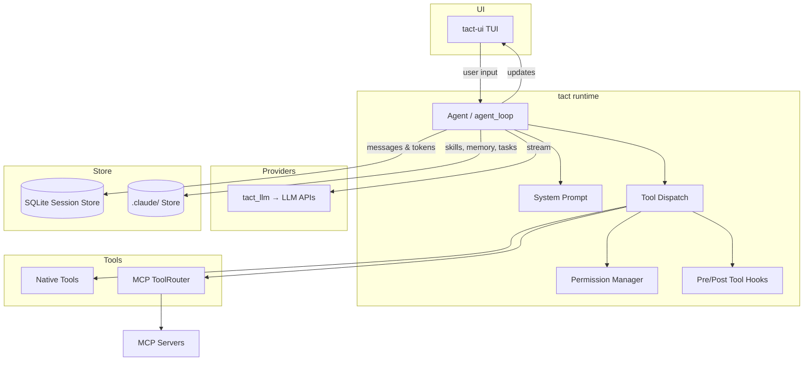
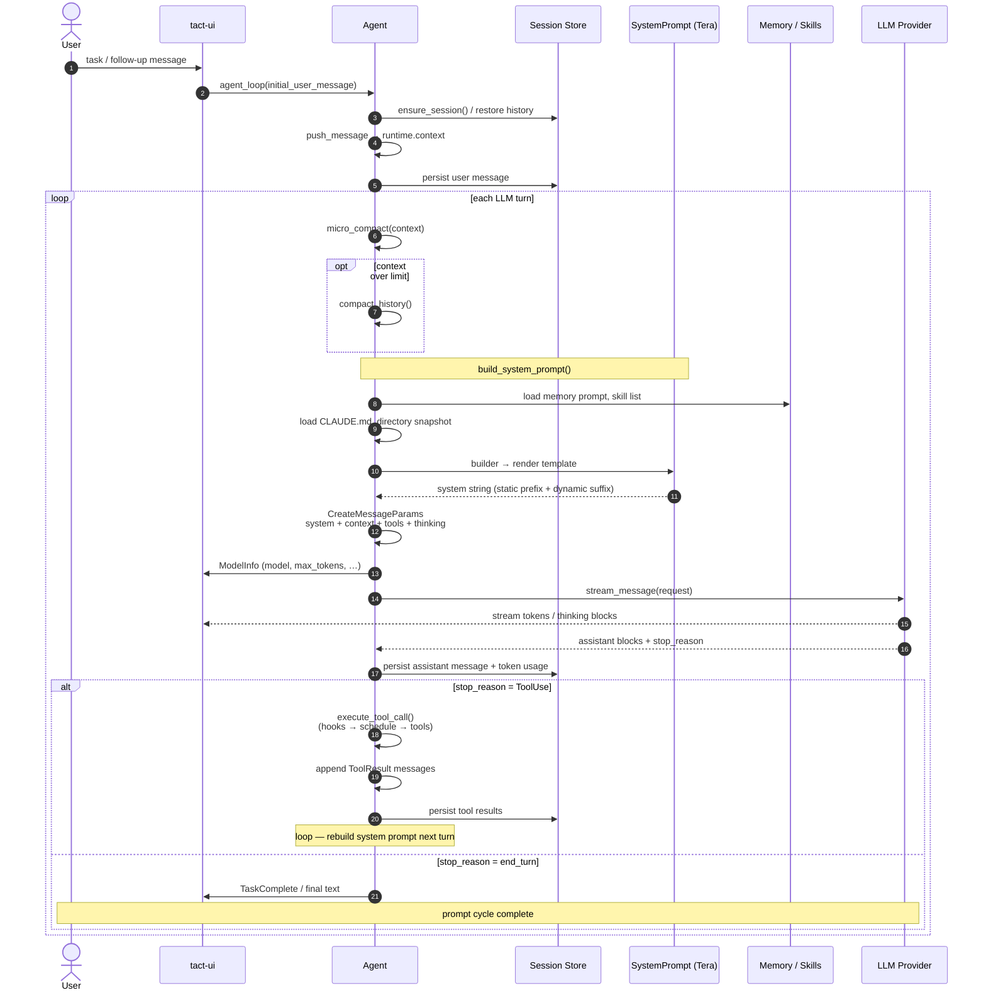

# Agent Development Tutorials

This directory collects design notes and hands-on tutorials for Tact and related agent runtimes. It is aimed at developers who want to understand or extend agent capabilities.

---

## Overall Architecture

High-level component map. For module-level detail see [ARCHITECTURE.md](../ARCHITECTURE.md).

---

## Prompt Flow: User Input to LLM Request

Each turn of `Agent::agent_loop` turns user input into a fully assembled prompt, streams it to the provider, and either finishes or loops through tool results. The sequence below focuses on how the **system prompt** is built and attached before the model runs.

**Stable vs. dynamic sections:** everything above `=== DYNAMIC_BOUNDARY ===` (role, guidelines, CLAUDE.md) is rebuilt but intended to stay byte-identical for prefix caching. Memory and dynamic context below the boundary refresh every turn. See [System Prompt](./02_chapter_prompt.md).

**Tool turns:** when the model returns `ToolUse`, the loop does not exit — tool results are appended to `runtime.context` and the next iteration runs steps 5–12 again with an updated message list and a freshly rendered system prompt.

**Compaction and recovery:** `micro_compact` / `compact_history` in the diagram are covered in [Context Compaction](./15_chapter_compact.md); retries and continuations around the LLM call are covered in [Error Recovery](./12_chapter_recovery.md).

---

## Table of Contents

| Chapter | Description |
|---------|-------------|
| [MCP Protocol and Agent Integration](./01_chapter_mcp.md) | Model Context Protocol fundamentals, step-by-step protocol flow, and MCP integration in Tact (configuration, handshake, tool calls, dynamic updates, graceful shutdown) |
| [System Prompt](./02_chapter_prompt.md) | How Tact assembles the system prompt from role, skills, guidelines, memory, and dynamic context, and how it stays cache-friendly across turns |
| [Tasks and Tool Scheduling](./03_chapter_task.md) | How a single agent turn runs tools through pre-flight, parallel wave execution, and post-processing while keeping conflicting operations ordered |
| [Agent Lifecycle Hooks](./04_chapter_hook.md) | PreToolUse / PostToolUse extension points, `HookControl`, registration API, and where hooks sit in the tool pipeline |
| [Cron Scheduling](./05_chapter_cron.md) | Scheduled prompt registry: data model, `.claude/cron/` persistence, `cron_create` / `cron_list` / `cron_delete`, and current runtime gaps |
| [Permission Model](./06_chapter_permission.md) | Capability risk classification, permission modes, allowlist, TUI approval flow, and shell high-risk detection |
| [Persistent Memory](./07_chapter_memory.md) | Markdown memories under `.claude/memory/`, types, system prompt injection, `save_memory`, and `MEMORY.md` index |
| [Desktop Notifications](./08_chapter_notify.md) | macOS native notifications for task completion and step failures, config flags, and platform gaps |
| [Store and Persistence](./09_chapter_store.md) | `StoreRoot` / JSON file store, SQLite session database, domain consumers, and agent persistence hooks |
| [Tool System](./10_chapter_tool.md) | `Tool` trait, `ToolRouter`, `ToolContext`, `toolset` / `subagent_toolset`, path safety, and `#[tool]` macro |
| [Skill Registry](./11_chapter_skill.md) | `SKILL.md` discovery, prompt summaries, `load_skill` on-demand loading, and `<skill>` tag format |
| [Error Recovery](./12_chapter_recovery.md) | `RecoveryState`, transport back-off retries, prompt-too-long compaction, and output-limit continuation in `agent_loop` |
| [Team Coordination](./13_chapter_team.md) | Teammate roster under `.claude/team/`, JSONL inboxes, broadcasts, and plan-approval / shutdown protocol messages |
| [Worktree Lanes](./14_chapter_worktree.md) | Isolated `git worktree` lanes: `worktree_create` / `list` / `status` / `run` / `events`, index file, and audit log |
| [Context Compaction](./15_chapter_compact.md) | `micro_compact` tool-result stubbing, `compact_history` LLM summarization, transcript spill, and large-output persistence |
| [Background Tasks](./16_chapter_background.md) | Async shell commands via `background_run` / `check_background`, tokio spawn lifecycle, timeouts, and startup repair |
| [Subagents](./17_chapter_subagent.md) | The `task` tool: nested `agent_loop`, restricted toolset, static prompt, permission inheritance, and summary return |

---

## How to Read

- **Protocol first, code second**: Each “Step N” in the tutorials maps cleanly to `crates/tact/src/mcp/mod.rs`.
- **Tact as the reference implementation**: Examples and code maps reflect this repository. Other agent frameworks follow similar ideas with different details.

---

## Planned Chapters

These topics are not written yet; they will be added over time:

- Agent main loop (`agent_loop`) — turn structure, cancellation (recovery and compaction are now covered in chapters [12](./12_chapter_recovery.md) and [15](./15_chapter_compact.md))

---

## Related Resources

- Project architecture: [ARCHITECTURE.md](../ARCHITECTURE.md)
- MCP official docs: <https://modelcontextprotocol.io/docs/learn/architecture>
- Tact MCP source: [crates/tact/src/mcp/mod.rs](../crates/tact/src/mcp/mod.rs)
- Tact hook source: [crates/tact/src/hook/mod.rs](../crates/tact/src/hook/mod.rs)
- Tact cron source: [crates/tact/src/cron/mod.rs](../crates/tact/src/cron/mod.rs)
- Tact permission source: [crates/tact/src/permission/mod.rs](../crates/tact/src/permission/mod.rs)
- Tact memory source: [crates/tact/src/memory/mod.rs](../crates/tact/src/memory/mod.rs)
- Tact notifications source: [crates/tact/src/notifications/mod.rs](../crates/tact/src/notifications/mod.rs)
- Tact store source: [crates/tact/src/store/mod.rs](../crates/tact/src/store/mod.rs)
- Tact session store source: [crates/tact/src/store/session_store/](../crates/tact/src/store/session_store/)
- Tact tool source: [crates/tact/src/tool/mod.rs](../crates/tact/src/tool/mod.rs)
- Tact skill source: [crates/tact/src/skill/mod.rs](../crates/tact/src/skill/mod.rs)
- Tact recovery source: [crates/tact/src/recovery.rs](../crates/tact/src/recovery.rs)
- Tact team source: [crates/tact/src/team.rs](../crates/tact/src/team.rs)
- Tact worktree source: [crates/tact/src/worktree/mod.rs](../crates/tact/src/worktree/mod.rs)
- Tact compaction source: [crates/tact/src/compact.rs](../crates/tact/src/compact.rs)
- Tact background source: [crates/tact/src/background.rs](../crates/tact/src/background.rs)
- Tact subagent source: [crates/tact/src/tool/subagent.rs](../crates/tact/src/tool/subagent.rs)

---

## Video Generation (AI Workflow)

Turn a chapter into slide + narration video with minimal manual work:

1. Generate `scenes.json` using the LLM prompt in [prompts/scene-generator.md](./prompts/scene-generator.md)
2. Run the pipeline: `./book/scripts/generate.sh <chapter> --all`

Full docs: [scripts/README.md](./scripts/README.md)
