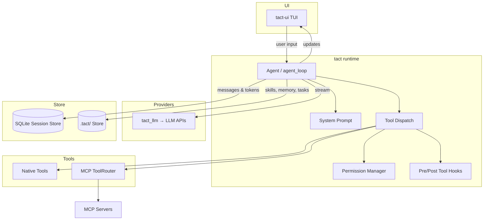

# Agent 开发教程（中文）

> 语言：[中文](./index_zh.md) · [English](./index.md)

本目录收集 Tact 及相关 agent 运行时的设计说明与动手教程。英文为权威全文；中文章节与英文结构对齐，便于双开对照。

---

## 中文命名约定

| 类型 | 英文（权威） | 中文 |
|------|--------------|------|
| 首页 | `index.md` | `index_zh.md` |
| 章节 | `NN_chapter_<slug>.md` | `NN_chapter_<slug>_zh.md` |

示例：`05_chapter_compact.md` ↔ `05_chapter_compact_zh.md`。

- 章内顶部有语言切换链接。
- CHM / HTML 构建自动收录所有 `*_zh.md`；目录见 `scripts/build-chm.sh`。
- 视频流水线：`./book/scripts/generate.sh <slug>_zh --all`（如 `compact_zh`）。

---

## 目录

章节顺序跟随 **`Agent::agent_loop` 执行路径**：会话 → prompt 输入 → 压缩 → LLM 恢复 → 工具管线 → 领域工具 → 旁路系统。

| # | 章节 | 说明 |
|---|------|------|
| 1 | [存储与持久化](./01_chapter_store_zh.md) | `StoreRoot` / JSON 文件存储、SQLite 会话库、领域消费者与 agent 持久化挂钩 |
| 2 | [Skill 注册表](./02_chapter_skill_zh.md) | `SKILL.md` 多根发现、prompt 摘要、`load_skill`、TUI slash（`$ARGUMENTS`）、`<skill>` 标签 |
| 3 | [持久记忆](./03_chapter_memory_zh.md) | `.tact/memory/` Markdown 记忆、类型、系统提示注入、`save_memory`、`MEMORY.md` 索引 |
| 4 | [系统提示](./04_chapter_prompt_zh.md) | 从 role / skills / guidelines / memory / 动态上下文组装系统提示，以及跨回合的缓存友好性 |
| 5 | [上下文压缩](./05_chapter_compact_zh.md) | `micro_compact` stub、`compact_history` 摘要、transcript / 大输出落盘 |
| 6 | [错误恢复](./06_chapter_recovery_zh.md) | `RecoveryState`、传输退避重试、prompt-too-long 压缩、输出截断续写 |
| 7 | [工具系统](./07_chapter_tool_zh.md) | `Tool` trait、`ToolRouter`、`registry.rs`、`ToolContext`、路径安全、`#[tool]` 宏 |
| 8 | [MCP 协议与集成](./08_chapter_mcp_zh.md) | MCP 基础、协议流程、Tact 中的配置 / 握手 / 工具调用 / 动态更新 / 优雅关闭 |
| 9 | [Agent 生命周期 Hooks](./09_chapter_hook_zh.md) | PreToolUse / PostToolUse、`HookControl`、注册 API、在工具管线中的位置 |
| 10 | [权限模型](./10_chapter_permission_zh.md) | 能力风险分级、权限模式、白名单、TUI 审批流、shell 高风险检测 |
| 11 | [任务与工具调度](./11_chapter_task_zh.md) | **工具**并行调度（waves/barriers）— 非 [Ch 19 持久任务](./19_chapter_persistent_tasks_zh.md) |
| 12 | [子 Agent](./12_chapter_subagent_zh.md) | `task` 工具：嵌套 `agent_loop`、受限工具集、静态 prompt、权限继承、摘要返回 |
| 13 | [后台任务](./13_chapter_background_zh.md) | `background_run` / `check_background`、tokio spawn、超时、启动修复 |
| 14 | [团队协作](./14_chapter_team_zh.md) | `.tact/team/` 队友名册、JSONL 收件箱、广播、计划审批 / 关机协议 |
| 15 | [Worktree 泳道](./15_chapter_worktree_zh.md) | 隔离 `git worktree`：`create` / `list` / `status` / `run` / `events`、索引与审计日志 |
| 16 | [Cron 调度](./16_chapter_cron_zh.md) | 定时 prompt 注册表、`.tact/cron/` 持久化、`cron_create` / `list` / `delete`、运行时缺口 |
| 17 | [桌面通知](./17_chapter_notify_zh.md) | macOS 原生通知（任务完成 / 步骤失败）、配置开关、平台缺口 |
| 18 | [Agent 主循环](./18_chapter_agent_loop_zh.md) | 收束章：`agent_loop` 回合、流式、`cancel_flag`、`AgentUpdate`、TUI `TaskComplete` |
| 19 | [持久任务管理器](./19_chapter_persistent_tasks_zh.md) | `TaskManager`、`task_create` / `get` / `list` / `update`、`.tact/tasks/` 依赖 |
| 20 | [LSP 代码智能](./20_chapter_lsp_zh.md) | `LspManager`、`~/.tact/lsp_servers.json`、原生 `lsp` 工具动作 |
| 21 | [配置](./21_chapter_config_zh.md) | TOML/CLI 合并、`ResolvedConfig`、`init()` → `tact_llm::init_provider` |
| 22 | [LLM Providers](./22_chapter_llm_zh.md) | `tact_llm` 适配器、流式、thinking、`user_id`、余额查询 |
| 23 | [终端 UI](./23_chapter_tui_zh.md) | `tui` crate、`AgentUpdate` / `UserCommand` 通道、`tact-ui` 接线 |
| 24 | [测试策略](./24_chapter_testing_zh.md) | Mock LLM、tact-ui driver、TUI TestBackend、CI |
| 25 | [Agent–TUI 协议](./25_chapter_protocol_zh.md) | `tact_protocol` 消息类型、计划步骤生命周期、任务级状态迁移 |

英文目录与架构总览见 [index.md](./index.md)。

---

## 总览架构

---

## 如何阅读

- **优先读 `_zh` 稿**；常量、代码地图以中英对齐为准。
- **运行时顺序**：第 1–11 章跟随 `agent_loop` 一回合；12–15 为工具族；**Ch 18** 收束主循环；19–20 深挖 TaskManager / LSP；21–23 为启动与 UI；24 测试；25 协议状态机。
- **压缩与恢复**：[上下文压缩](./05_chapter_compact_zh.md)、[错误恢复](./06_chapter_recovery_zh.md)。

---

## 相关资源

- 英文全书入口：[index.md](./index.md)
- 思维导图：[mindmap.html](./mindmap.html)
- 压缩调参：[docs/compaction.md](../docs/compaction.md)
- CHM / 视频流水线：[scripts/README.md](./scripts/README.md)
- 项目架构：[ARCHITECTURE.md](../ARCHITECTURE.md)
