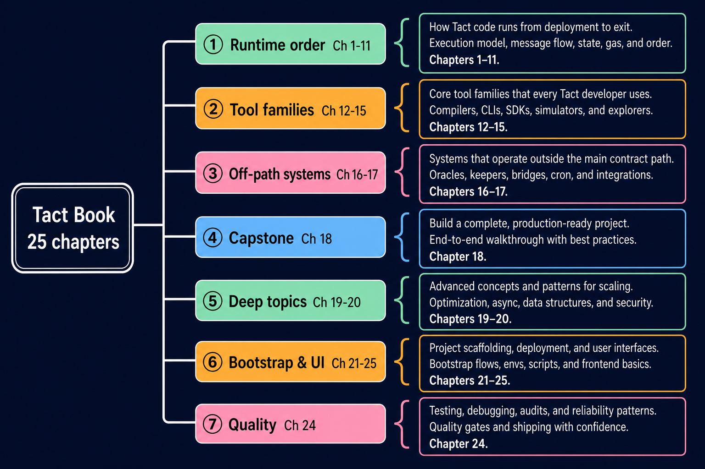
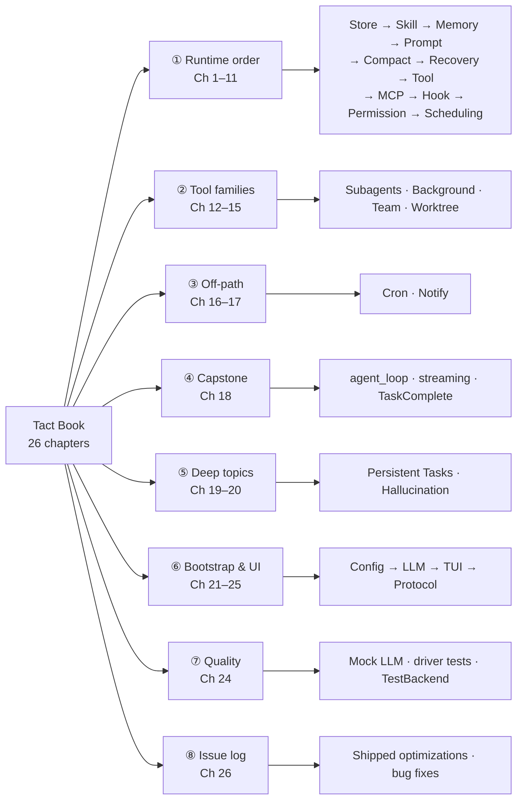
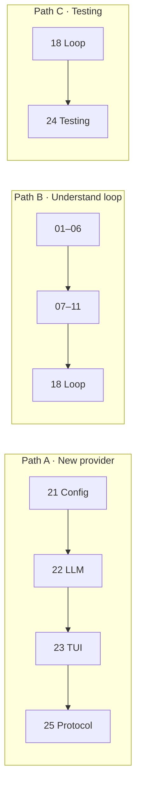

# Tact Book Mind Map

**Right-hand tree layout** (root on the left → topic column → descriptions on the right). Works better than a radial mind map for all 26 chapters.

## Interactive version (recommended)

Open **[mindmap.html](./mindmap.html)** in a browser — also embedded in [index.md](./index.md). Dark theme, color-coded topics, chapter links on the right.

---

## Layout options

| Layout | File | Notes |
|--------|------|-------|
| **Right-hand tree** | `mindmap.html` / `mindmap.png` | Root → topics → details (**default**) |
| Reading paths | Mermaid below | Three common entry paths |
| Runtime pipeline | Mermaid below | Single chain 01→18 |

---

## Mermaid approximation (right-hand tree)

Mermaid cannot draw `{` braces; this `flowchart LR` approximates the same structure:

---

## Reading paths

| Path | Chapters | When to use |
|------|----------|-------------|
| A | 21 → 22 → 23 → 25 | New provider or binary |
| B | 1 → 11 → 18 | One full agent_loop turn |
| C | 18 → 24 | Integration tests |

---

## Chapter index

| # | Chapters | Group |
|---|----------|-------|
| 1–11 | [Store](./01_chapter_store.md) … [Scheduling](./11_chapter_task.md) | ① Runtime order |
| 12–15 | [Subagent](./12_chapter_subagent.md) … [Worktree](./15_chapter_worktree.md) | ② Tool families |
| 16–17 | [Cron](./16_chapter_cron.md) · [Notify](./17_chapter_notify.md) | ③ Off-path |
| 18 | [Agent Loop](./18_chapter_agent_loop.md) | ④ Capstone |
| 19–20 | [Tasks](./19_chapter_persistent_tasks.md) · [Hallucination](./20_chapter_hallucination.md) | ⑤ Deep topics |
| 21–23, 25 | [Config](./21_chapter_config.md) … [Protocol](./25_chapter_protocol.md) | ⑥ Bootstrap & UI |
| 24 | [Testing](./24_chapter_testing.md) | ⑦ Quality |
| 26 | [Issue Log](./26_chapter_issue.md) | ⑧ Engineering changelog |
