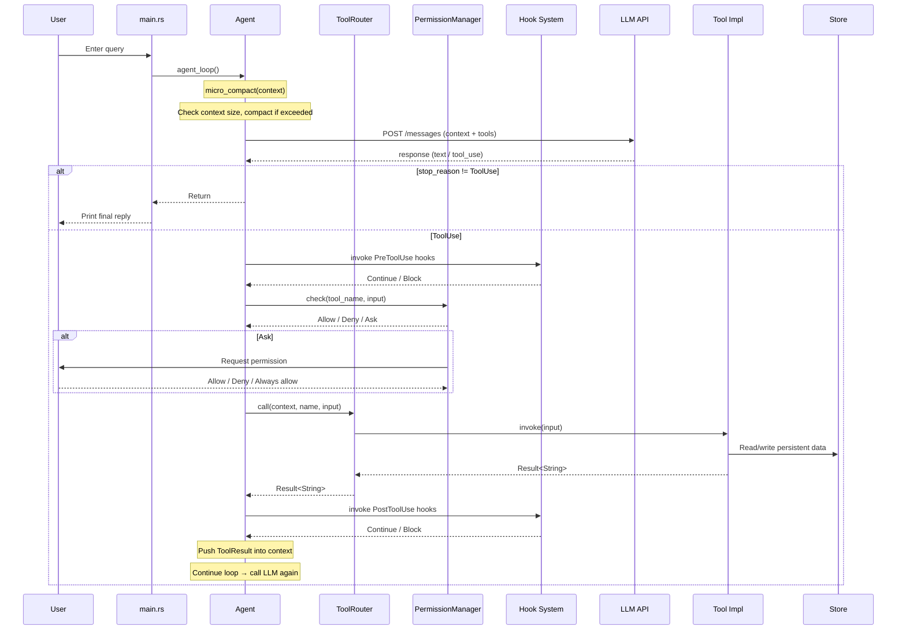

# sfull Architecture

```mermaid
graph TB
    %% ── Entry Layer ──
    Main(["main.rs<br/>REPL Loop"])

    %% ── Core Structures ──
    subgraph Core["Agent Core"]
        Agent["Agent"]
        Runtime["AgentRuntime<br/>client / context / compact_state / recovery_state"]
        ToolContext["ToolContext<br/>Shared state container"]
    end

    %% ── Tool Dispatch ──
    subgraph Tools["Tool Dispatch"]
        Router["ToolRouter<br/>30+ local tools"]
        McpRouter["MCPToolRouter<br/>mcp__server__tool"]
    end

    %% ── Lifecycle ──
    subgraph Lifecycle["Cross-cutting"]
        Hooks["Hook System<br/>PreToolUse / PostToolUse / SessionStart"]
        Perm["PermissionManager<br/>Plan / Default / Auto"]
        Compact["Compact<br/>micro_compact / full_compact / persist_large_output"]
        Recovery["Recovery<br/>backoff / continuation / compact-retry"]
    end

    %% ── Subsystems ──
    subgraph Subsystems["Subsystems (via ToolContext)"]
        MemoryMgr["MemoryManager<br/>frontmatter .md files"]
        SkillReg["SkillRegistry<br/>skills/ directory scan"]
        TaskMgr["TaskManager<br/>task_*.json + index"]
        BackgroundMgr["BackgroundManager<br/>background_tasks.json"]
        CronScheduler["CronScheduler<br/>scheduled_tasks.json"]
        TeamMgr["TeammateManager<br/>teammate + inbox"]
        WorktreeMgr["WorktreeManager<br/>git worktree isolation"]
    end

    %% ── Persistence ──
    Store["Store / CollectionStore<br/>JSON file persistence"]

    %% ── Prompt Builder ──
    Prompt["SystemPrompt Builder<br/>Tera template + dynamic assembly"]

    %% ── Tool Implementations (grouped) ──
    subgraph FileTools["File Tools"]
        ReadFile
        WriteFile
        EditFile
    end
    subgraph ExecTools["Execution"]
        Bash
        BackgroundRun
    end
    subgraph TaskTools["Task / Subagent"]
        TaskSubagent
        TaskCreate
        TaskGet
        TaskList
        TaskUpdate
    end
    subgraph CronTools["Cron"]
        CronCreate
        CronDelete
        CronList
    end
    subgraph TeamTools["Team"]
        SpawnTeammate
        ListTeammates
        SendMessage
        Broadcast
        ReadInbox
        PlanApproval
        ShutdownReqResp
    end
    subgraph WorktreeTools["Worktree"]
        WtCreate
        WtList
        WtStatus
        WtRun
        WtEvents
    end
    subgraph MiscTools["Misc"]
        SaveMemory
        LoadSkill
        Compact
        Add
    end

    %% ── Relationships ──
    Main -->|creates| Agent
    Main -->|creates| ToolContext

    Agent -->|contains| Runtime
    Agent -->|holds| Router
    Agent -->|holds| McpRouter
    Agent -->|holds| ToolContext
    Agent -->|owns| Hooks
    Agent -->|owns| Perm
    Agent -->|uses| Prompt
    Agent -->|agent_loop| Compact
    Agent -->|agent_loop| Recovery

    Router -->|dispatch| FileTools
    Router -->|dispatch| ExecTools
    Router -->|dispatch| TaskTools
    Router -->|dispatch| CronTools
    Router -->|dispatch| TeamTools
    Router -->|dispatch| WorktreeTools
    Router -->|dispatch| MiscTools

    ToolContext -->|injects| MemoryMgr
    ToolContext -->|injects| SkillReg
    ToolContext -->|injects| TaskMgr
    ToolContext -->|injects| BackgroundMgr
    ToolContext -->|injects| CronScheduler
    ToolContext -->|injects| TeamMgr
    ToolContext -->|injects| WorktreeMgr

    TaskMgr --> Store
    BackgroundMgr --> Store
    CronScheduler --> Store
    TeamMgr --> Store
    WorktreeMgr --> Store
    MemoryMgr -->|read/write| MemoryFiles[".md files"]

    McpRouter -->|starts connection| McpServer["MCP Server process"]
```



### Data Flow: A Complete Agent Interaction



---

## Known Issues

### MaxTokens Truncation + Orphaned tool_calls

**Discovery date**: 2026-06-06

**Error message**:
```
HTTP 400: "An assistant message with 'tool_calls' must be followed by
tool messages responding to each 'tool_call_id'. (insufficient tool
messages following tool_calls message)"
```

**Trigger condition**: LLM streaming response reaches `max_tokens` limit, and the assistant response was truncated while containing unexecuted tool calls.

**Root cause** (`crates/tact/src/lib.rs` `agent_loop()`):

The control flow before the fix had a defect — when `stream_message` returned `stop_reason=MaxTokens` and `content` contained `ToolUse` blocks:

```
1. stream_message → content=[ToolUse { id:"call_xxx", ... }], stop_reason=MaxTokens
2. context.push(Assistant(tool_calls=[...]))          ← Push assistant message with tool_calls
3. Detect MaxTokens → context.push(User("please continue..."))
4. continue → Next API call
```

At this point the context sequence is `Assistant(tool_calls=[id1]), User("continue")`, but the OpenAI API requires:
- An assistant message with `tool_calls` → must be **immediately followed** by a `ToolMessage` for each `tool_call_id`
- No other message types are allowed in between

The correct sequence should be: `Assistant(tool_calls=[id1]) → Tool(id1, result) → ... (subsequent messages)`

**Fix**:

| Layer | Location | Measure |
|-------|----------|---------|
| Layer 1 | `lib.rs` agent_loop MaxTokens path | Before pushing CONTINUATION_MESSAGE, check if content contains ToolUse; if so, execute_tool_call first, push result, then push continuation |
| Layer 2 (defense) | `convert.rs` | Added `sanitize_tool_call_sequence()`, scans for orphaned tool_calls after each conversion; if no matching ToolMessage found, strips tool_calls and replaces with stub text |

**Scope**:
- `crates/tact/src/lib.rs` — `agent_loop()` MaxTokens recovery path
- `crates/tact/src/llm/convert.rs` — `anthropic_messages_to_openai()` end-of-function defensive validation
- Only triggered on OpenAI backend (Anthropic native API has no such constraint)
