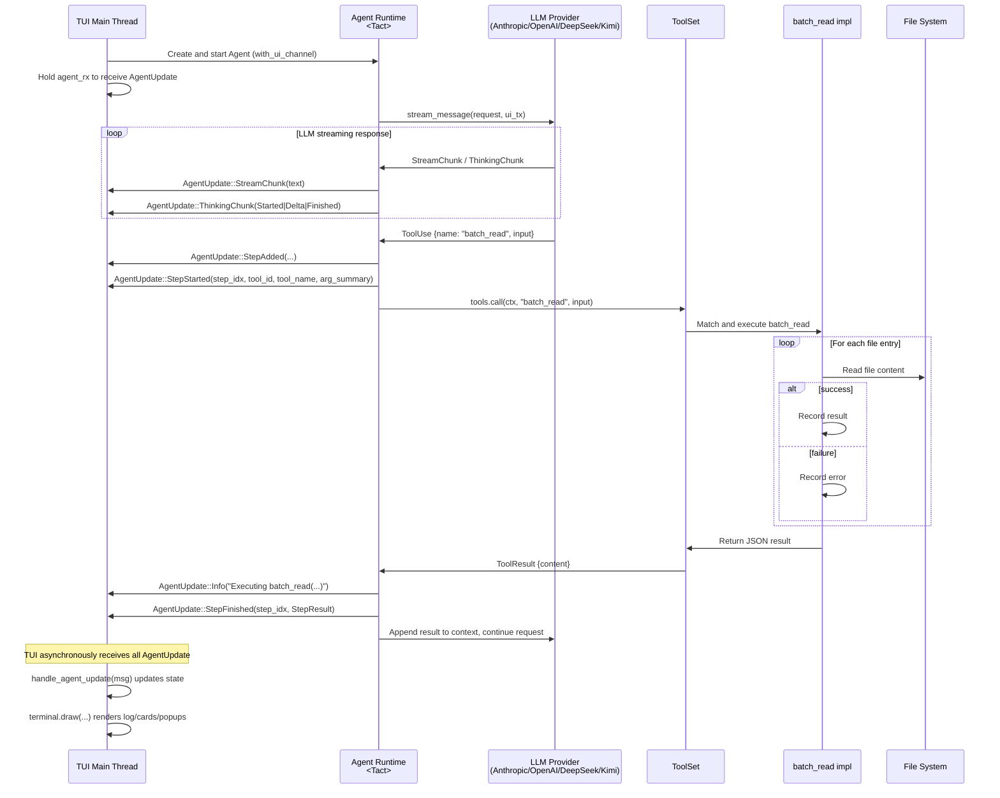
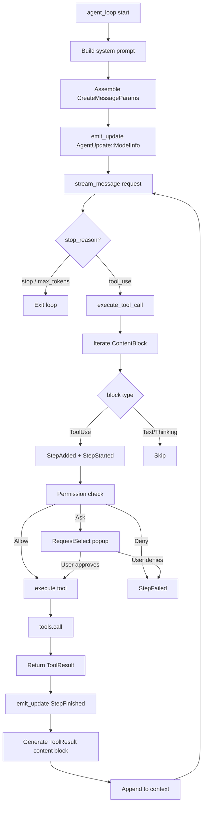
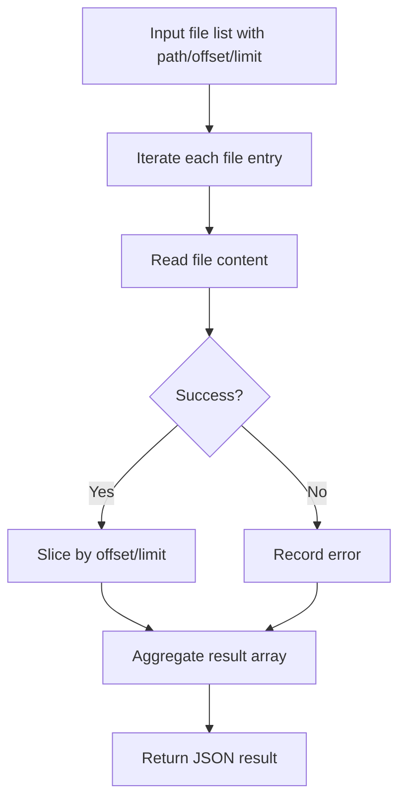
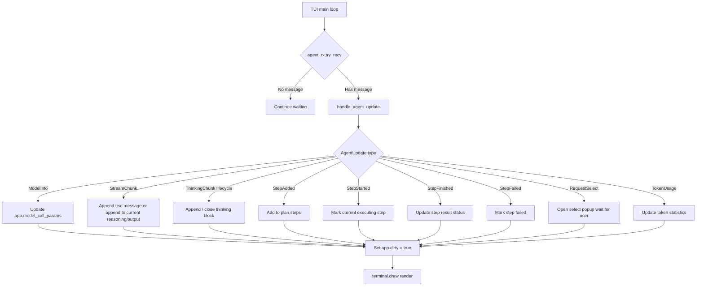

# `batch_read` Tool Execution & TUI Interaction Flowcharts

This Mermaid diagram document describes the complete data flow from the Agent main loop, through LLM streaming responses, to the actual execution of `batch_read`, and finally to the `AgentUpdate` messages sent to the TUI where they are consumed and rendered.

> Files involved: `crates/tact/src/tool/batch_read.rs`, `crates/tact/src/agent/mod.rs`, `crates/tact/src/agent/tool_dispatch.rs`, `crates/tact_llm/src/`, `crates/tui/src/lib.rs`, `crates/tui/src/widgets/state/app/agent.rs`, `crates/tui/src/widgets/tool_widget.rs`, `crates/tui/src/render/cells/tool.rs`  
> Tool UI design: [`tool_rendering.md`](./tool_rendering.md)

---

## 1. Overall Interaction Sequence

---

## 2. Agent Main Loop Internal Flow

---

## 3. `batch_read` Batch Read Flow

### Key Design

- Supports `offset`/`limit` parameters to avoid reading huge files at once.
- Each file returns its own `content` or `error` independently.
- A failed file does not affect the reading of other files.

---

## 4. TUI Consumption of AgentUpdate

---

## 5. Key Code Mapping

| Flow Node | Code Location |
|---|---|
| Agent main loop | `crates/tact/src/agent/mod.rs` `Agent::agent_loop()` |
| Tool call dispatch | `crates/tact/src/agent/tool_dispatch.rs` `Agent::execute_tool_call()` |
| Tool registration & routing | `crates/tact/src/tool/registry.rs` |
| `batch_read` implementation | `crates/tact/src/tool/batch_read.rs` |
| Streaming response Anthropic | `crates/tact_llm/src/anthropic.rs` `stream_message()` |
| Streaming response OpenAI | `crates/tact_llm/src/openai.rs` `stream_message()` |
| AgentUpdate definition | `crates/protocol/src/agent.rs` |
| TUI handle AgentUpdate | `crates/tui/src/widgets/state/app/agent.rs` `handle_agent_update()` |

---

## 6. Extension Guide

### Add a new batch tool

1. Create a new module under `crates/tact/src/tool/` (refer to `batch_read.rs`).
2. Register it in `toolset()` / `ToolRouter::route`.
3. If you need a special card, define a new `AgentUpdate` variant and handle it in `handle_agent_update`.
4. Add the corresponding renderer in `crates/tui/src/render/cells/`.
