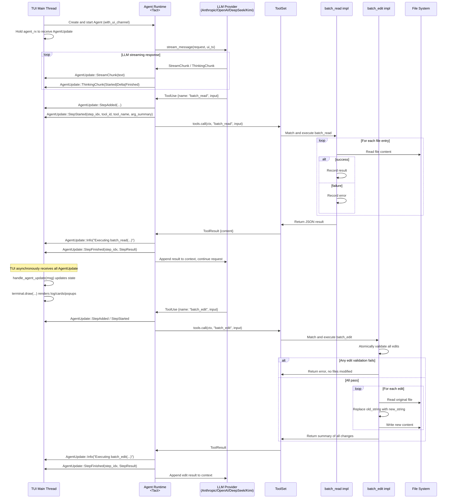
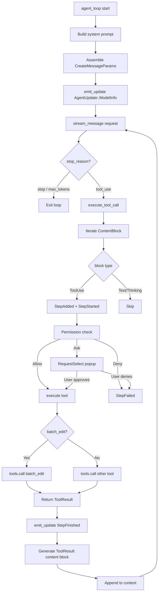
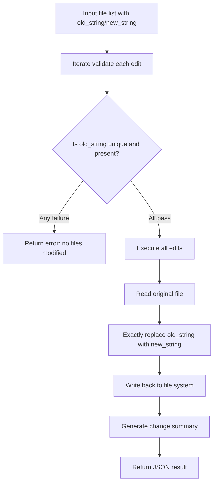
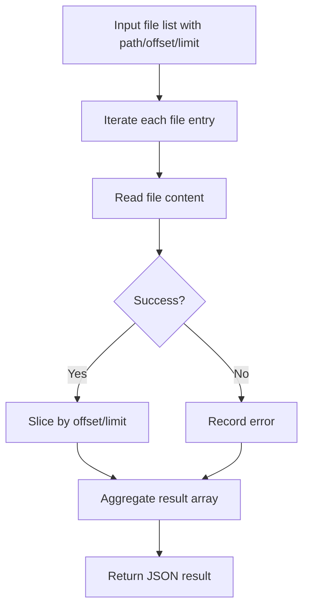
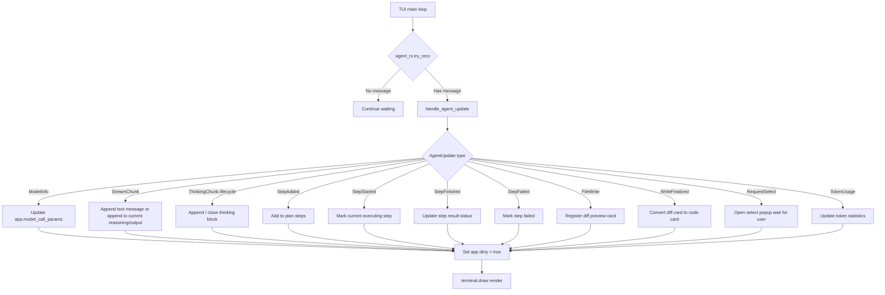
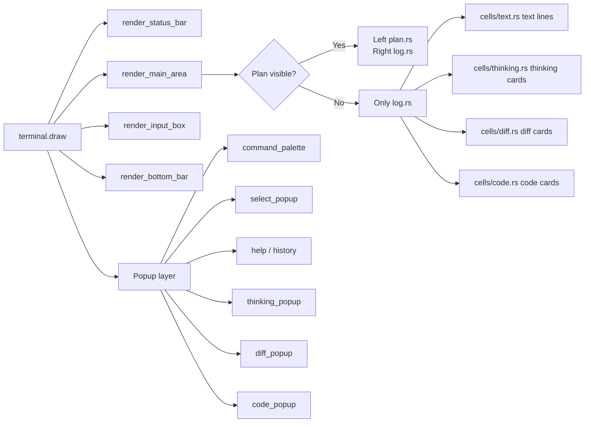

# `batch_read` / `batch_edit` Tool Execution & TUI Interaction Flowcharts

This Mermaid diagram document describes the complete data flow from the Agent main loop, through LLM streaming responses, to the actual execution of `batch_read` / `batch_edit`, and finally to the `AgentUpdate` messages sent to the TUI where they are consumed and rendered.

> Files involved: `crates/tact/src/tool/batch_read.rs`, `crates/tact/src/tool/batch_edit.rs`, `crates/tact/src/agent/mod.rs`, `crates/tact/src/agent/tool_dispatch.rs`, `crates/tact_llm/src/`, `crates/tui/src/lib.rs`, `crates/tui/src/widgets/state/app/agent.rs`, `crates/tui/src/widgets/tool_widget.rs`, `crates/tui/src/render/cells/tool.rs`  
> Tool UI design: [`tool_rendering.md`](./tool_rendering.md)

---

## 1. Overall Interaction Sequence

---

## 2. Agent Main Loop Internal Flow

---

## 3. `batch_edit` Atomic Execution Flow

### Key Design

- **Atomicity**: All `old_string` values are validated first; if any fails, no file is modified.
- **Exact match**: Uses `str::replace_once` semantics, requiring `old_string` to appear exactly once in the file.
- **TUI cards**: If the tool context contains `ui_tx`, `batch_edit` calls `emit_file_write_cards` to push `AgentUpdate::FileWrite` and `AgentUpdate::WriteFinalized` to the TUI, which renders the right-side diff cards.

---

## 4. `batch_read` Batch Read Flow

### Key Design

- Supports `offset`/`limit` parameters to avoid reading huge files at once.
- Each file returns its own `content` or `error` independently.
- A failed file does not affect the reading of other files.

---

## 5. TUI Consumption of AgentUpdate

---

## 6. TUI Rendering Layers

---

## 7. Key Code Mapping

| Flow Node | Code Location |
|---|---|
| Agent main loop | `crates/tact/src/agent/mod.rs` `Agent::agent_loop()` |
| Tool call dispatch | `crates/tact/src/agent/tool_dispatch.rs` `Agent::execute_tool_call()` |
| Concrete tool execution | `crates/tact/src/agent/tool_dispatch.rs` native/MCP dispatch helpers |
| Tool registration & routing | `crates/tact/src/tool/mod.rs` `ToolSet::call()` |
| `batch_read` implementation | `crates/tact/src/tool/batch_read.rs` `BatchRead::run()` |
| `batch_edit` implementation | `crates/tact/src/tool/batch_edit.rs` `BatchEdit::run()` |
| Streaming response Anthropic | `crates/tact_llm/src/anthropic.rs` `stream_message()` |
| Streaming response OpenAI | `crates/tact_llm/src/openai.rs` `stream_message()` |
| AgentUpdate definition | `crates/protocol/src/lib.rs` |
| TUI main loop consumption | `crates/tui/src/lib.rs` `run_tui()` |
| TUI handle AgentUpdate | `crates/tui/src/state/app/agent.rs` `handle_agent_update()` |
| Log / card rendering | `crates/tui/src/render/log.rs`, `crates/tui/src/render/cells/` |

---

## 8. Performance & Concurrency Notes

- `AgentUpdate` is sent via a **tokio unbounded channel**; `emit_update` uses `let _ = tx.send(...)`, so it never blocks even if the TUI is not connected.
- `batch_edit` performs **atomic validation and writes** inside the tool; it does not concurrently modify the same file; all file writes happen sequentially.
- `batch_read` reads each file independently in sequential order; it can be changed to concurrent `tokio::fs::read_to_string` if needed.
- The TUI uses `app.dirty` for **dirty rendering**, so it only redraws when new messages or state changes arrive, avoiding idle spinning.

---

## 9. Extension Guide

### Add a new batch tool

1. Create a new module under `crates/tact/src/tool/` (refer to `batch_read.rs` / `batch_edit.rs`).
2. Register it in `ToolSet::tool_specs()` and `ToolSet::call()`.
3. If you need a special card, define a new `AgentUpdate` variant and handle it in `handle_agent_update`.
4. Add the corresponding renderer in `crates/tui/src/render/cells/`.

### Adjust TUI rendering

- Modify `render/log.rs` `LogColumnRenderer` to change log layout.
- Modify `cells/*.rs` to change thinking/diff/code card styles.
- Modify `popups/*.rs` to change popup layout and interaction hints.
