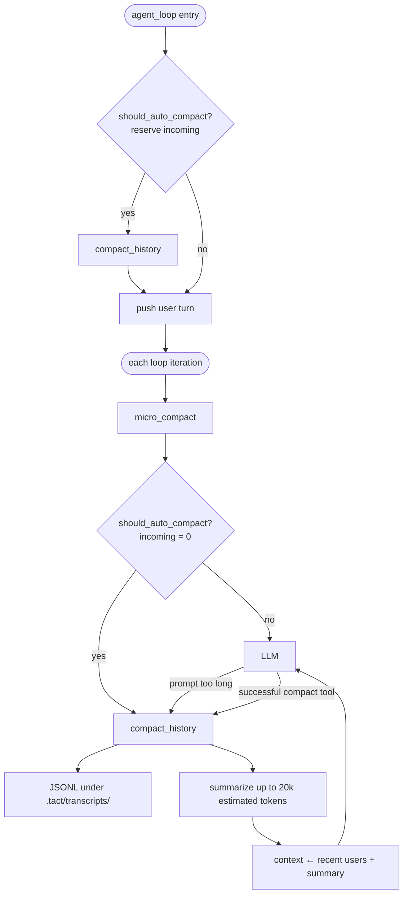

# Context Compaction

Companion notes for tuning and quick reference. For the full interactive walkthrough (diagrams, loop ordering, envelope vs stub), see **[book/05_chapter_compact.md](../book/05_chapter_compact.md)** ([中文](../book/05_chapter_compact_zh.md)).

tact implements **three-tier progressive compaction**:

| Tier | Trigger | Target | Strategy |
|------|---------|--------|----------|
| Tier 1: Large Output Persist | Any successful native/MCP output > 30K chars | One tool result | Write to disk, keep `<persisted-output>` preview |
| Tier 2: Micro Compaction | Before each LLM call | Old tool results | Stub (keep last 12; only if > 120 chars) |
| Tier 3: Full Compaction | Reported/estimated input reaches 80% of the window, prompt-too-long, or `compact` tool | Conversation history | JSONL transcript + LLM summary → retained real users + handoff |



---

## Tier 1: Large Output Persist

**Trigger**: any successful native or MCP tool result exceeds `PERSIST_THRESHOLD` (30,000 characters), **except `read_file`**. `read_file` already returns a line/token-bounded page (default 2,000 lines / ~25k approx tokens) with an explicit `[PARTIAL view …]` continuation marker, so dispatch skips `persist_large_output` for that tool.

**Process**:
1. Full output → `.tact/tool-results/{tool_use_id}.txt`
2. Context keeps a tagged envelope with path + first `PREVIEW_CHARS` (2,000) characters

```xml
<persisted-output>
Full output saved to: .tact/tool-results/abc123.txt
Preview:
[first 2000 characters...]
</persisted-output>
```

**Why the tags**: For the model, not runtime parsing. Marks a system envelope so metadata is not mistaken for stdout; full text is recoverable via `read_file`. Distinct from the micro-compact stub (older history), which uses `[Earlier tool result compacted. …]`.

| Constant | Default | Location |
|----------|---------|----------|
| `PERSIST_THRESHOLD` | 30,000 | `compact/mod.rs` |
| `PREVIEW_CHARS` | 2,000 | `compact/mod.rs` |

Each artifact directory retains at most the 100 newest files after a write.

---

## Tier 2: Micro Compaction

**Trigger**: Start of each `agent_loop` iteration when `agent.micro_compact_enabled` is true.

1. Collect all `ToolResult` blocks (user messages), chronological order  
2. Keep the last `KEEP_RECENT_TOOL_RESULTS` (12) intact  
3. Older results with **> 120** characters → stub  

```
[Earlier tool result compacted. Re-run the tool (e.g., read_file) for full content.]
```

Short results stay (high density, low cost). Assistant / thinking / user text are never stubbed.

| Constant | Default |
|----------|---------|
| `KEEP_RECENT_TOOL_RESULTS` | 12 |
| Stub length threshold | 120 chars |

---

## Tier 3: Full Compaction

**Triggers** (any of):
- **Entry**: before pushing the user turn, `should_auto_compact` with `incoming_turn` reserved
- **Each loop iteration**: after `micro_compact`, `should_auto_compact` with `incoming = 0`:
  - **Primary:** `last_token_total + estimate_message_tokens(incoming) >= 80% of agent.model_context_window` (default **200,000** tokens)
  - **Fallback:** estimated context + incoming tokens reaches the same 80% threshold; ASCII is estimated at ~4 chars/token, non-ASCII conservatively at 1 char/token
- Provider prompt-too-long recovery ([Ch 6](../book/06_chapter_recovery.md))
- Successful manual `compact` tool (after tool results are appended; failed invocations do not rewrite history)

### Steps

1. **`write_transcript`** (async) → unique `.tact/transcripts/transcript_{unix_nanos}_{collision}.jsonl`
2. **Recent window** — select from the tail within the model budget and a 20k estimated-token cap; oversized messages become valid text-only views and images become omission markers
3. **Summarize** — window-aware `create_message`, at most 2k output tokens, with output/headroom reserved; transient failures retry up to three times; abnormal stop reasons and empty summaries fail without replacing context
4. **Replace** — Codex-style `[recent real User…] + [SUMMARY_PREFIX + handoff]` (legacy: `compacted_context`); retained users reserve max output, system/tools/summary, and 20% headroom; block UI turns count as real users, tool-result-only blocks are excluded, and base64 is never truncated; a final full-request guard reduces retained users until the request fits
5. **`replace_session_messages`** — SQLite matches the new context; message-id window reset; `last_token_total = 0`

### Recent files

`CompactState.recent_files`: last 5 paths from successful `read_file`, `write_file`, `edit_file`, and non-dry-run `apply_patch` calls (dedupe, LRU). Injected into the summarizer prompt and final summary.

---

## Configuration

| Setting | Default | Effect |
|---------|---------|--------|
| `agent.model_context_window` | 200,000 | Token window: auto Tier-3 trigger at 80% + TUI usage meter; nonzero values must exceed `max_tokens` |
| `agent.micro_compact_enabled` | `true` | Tier-2 stub pass (`--no-micro-compact` disables) |

Breaking rename from `context_limit_chars` / `--context-limit-chars` — **no silent alias**.

Compile-time: 12 / 120 / 30k / 2k / 20k summary-input and retained-user tokens / 100 artifacts are not configurable yet.

---

## Integration with System Prompt

```
If a tool result was truncated and you need the details, re-run the relevant tool (e.g., read_file)
```

---

## Gaps (short)

- Cold-start token estimation remains heuristic (ASCII ~4 chars/token, non-ASCII 1 char/token); the TUI still uses a simple `used/window` meter without Codex baseline/effective-window math; fixed thresholds are compile-time constants.

### Micro Compact

- **Model memory loss**: truncated tool results vanish from context; model may fabricate if it misses the stub
- **False context mismatch**: diff/patch operations fail when model doesn't re-read truncated content
- **Crude selection**: recency+length only (keep last 12, stub > 120 chars) — a critical file at position 13 is lost while trivial `ls` outputs at positions 1–12 survive
- **Prefix cache pollution**: on auto-caching models (OpenAI, DeepSeek), stub replacement invalidates the cached prefix, causing a cache miss on every truncated result. See [OpenAI Prompt Caching](https://platform.openai.com/docs/guides/prompt-caching), [DeepSeek KV Cache](https://api-docs.deepseek.com/guides/kv_cache). Claude ([docs](https://docs.anthropic.com/en/docs/build-with-claude/prompt-caching)) is less affected — its explicit `cache_control` breakpoints sit before tool results

### Planned optimizations

| Idea | Priority |
|------|----------|
| Context-window-gated trigger (e.g., only run when > 50% of window is used) | High |
| Selective tool truncation (exempt already-bounded `read_file` pages; keep their outputs) | High |
| Semantic importance scoring (keep results referenced in later turns) | Medium |
| Configurable thresholds (runtime instead of compile-time constants) | Low |
| Stub-aware prompt (better guidance to trigger re-reads consistently) | Medium |

See the book chapter (§11) for the full list.
