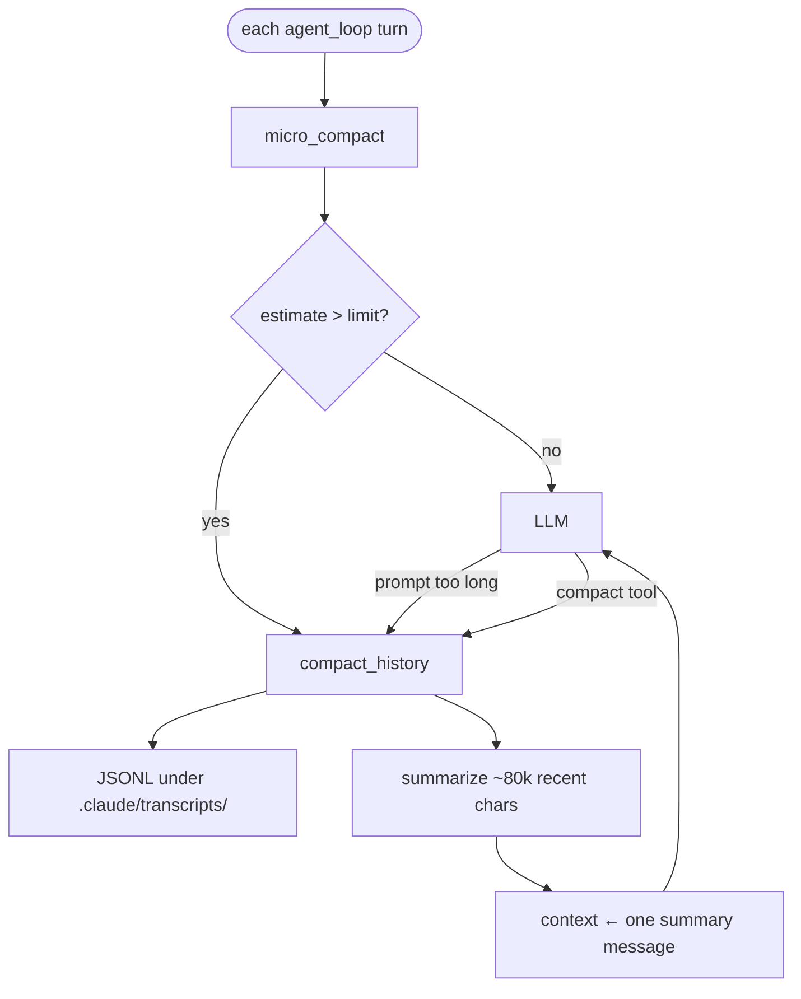

# Context Compaction

Companion notes for tuning and quick reference. For the full interactive walkthrough (diagrams, loop ordering, envelope vs stub), see **[book/05_chapter_compact.md](../book/05_chapter_compact.md)** ([中文](../book/05_chapter_compact_zh.md)).

tact implements **three-tier progressive compaction**:

| Tier | Trigger | Target | Strategy |
|------|---------|--------|----------|
| Tier 1: Large Output Persist | Single `bash` output > 30K chars | One tool result | Write to disk, keep `<persisted-output>` preview |
| Tier 2: Micro Compaction | Before each LLM call | Old tool results | Stub (keep last 12; only if > 120 chars) |
| Tier 3: Full Compaction | Context > `context_limit_chars` (default 500K), prompt-too-long, or `compact` tool | Entire conversation | JSONL transcript + LLM summary → single user message |



---

## Tier 1: Large Output Persist

**Trigger**: `bash` tool result exceeds `PERSIST_THRESHOLD` (30,000 characters).

**Process**:
1. Full output → `.claude/tool-results/{tool_use_id}.txt`
2. Context keeps a tagged envelope with path + first `PREVIEW_CHARS` (2,000) characters

```xml
<persisted-output>
Full output saved to: .claude/tool-results/abc123.txt
Preview:
[first 2000 characters...]
</persisted-output>
```

**Why the tags**: For the model, not runtime parsing. Marks a system envelope so metadata is not mistaken for stdout; full text is recoverable via `read_file`. Distinct from the micro-compact stub (older history), which uses `[Earlier tool result compacted. …]`.

| Constant | Default | Location |
|----------|---------|----------|
| `PERSIST_THRESHOLD` | 30,000 | `compact.rs` |
| `PREVIEW_CHARS` | 2,000 | `compact.rs` |

Only **`bash`** is spilled today.

---

## Tier 2: Micro Compaction

**Trigger**: Start of each `agent_loop` iteration when `agent.micro_compact_enabled` is true.

1. Collect all `ToolResult` blocks (user messages), chronological order  
2. Keep the last `KEEP_RECENT_TOOL_RESULTS` (12) intact  
3. Older results with **> 120** characters → stub  

```
[Earlier tool result compacted. If you need the full content to continue editing, re-read the relevant file.]
```

Short results stay (high density, low cost). Assistant / thinking / user text are never stubbed.

| Constant | Default |
|----------|---------|
| `KEEP_RECENT_TOOL_RESULTS` | 12 |
| Stub length threshold | 120 chars |

---

## Tier 3: Full Compaction

**Triggers** (any of):
- After micro_compact, `estimate_context_size` > `agent.context_limit_chars` (default **500,000**; CLI `--context-limit-chars` / TOML)
- Provider prompt-too-long recovery ([Ch 6](../book/06_chapter_recovery.md))
- Manual `compact` tool (after tool results are appended)

### Steps

1. **`write_transcript`** → `.claude/transcripts/transcript_{unix_ts}.jsonl`
2. **Recent window** — from the end of context until ~80,000 serialized chars (keep ≥ 1 message)
3. **Summarize** — `create_message`, `max_tokens=2000`, preserve goals / findings / files / next steps / constraints / errors; optional `focus` + `recent_files`
4. **Replace** — `compacted_context(summary)` plus appended recent-files list
5. **`replace_session_messages`** — SQLite matches the new single-message context; message-id window reset

### Recent files

`CompactState.recent_files`: last 5 successful `read_file` paths (dedupe, LRU). Injected into the summarizer prompt and the final summary. Writes/patches are not tracked.

---

## Configuration

| Setting | Default | Effect |
|---------|---------|--------|
| `agent.context_limit_chars` | 500,000 | Auto Tier-3 trigger |
| `agent.micro_compact_enabled` | `true` | Tier-2 stub pass (`--no-micro-compact` disables) |

Compile-time: 12 / 120 / 30k / 2k / 80k are not configurable yet.

---

## Integration with System Prompt

```
If a tool result was compacted and you need the details, re-run the relevant tool (e.g., read_file)
```

---

## Gaps (short)

- Char proxy ≠ tokens; summarization has no retry; spill is bash-only; transcripts/tool-results never pruned; `recent_files` is read-only.

See the book chapter for diagrams and loop ordering.
