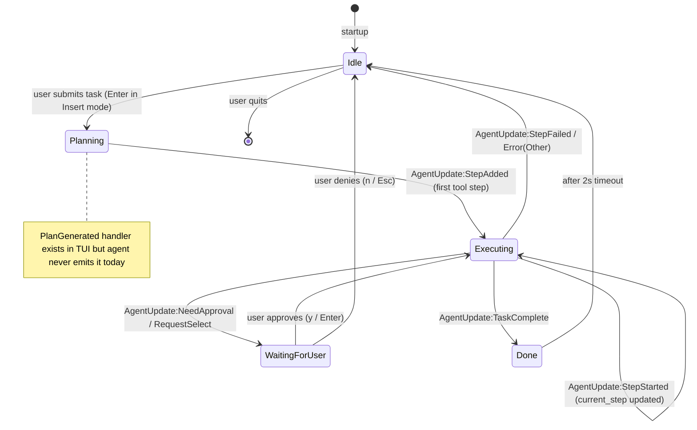
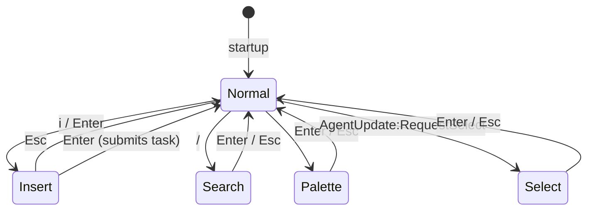
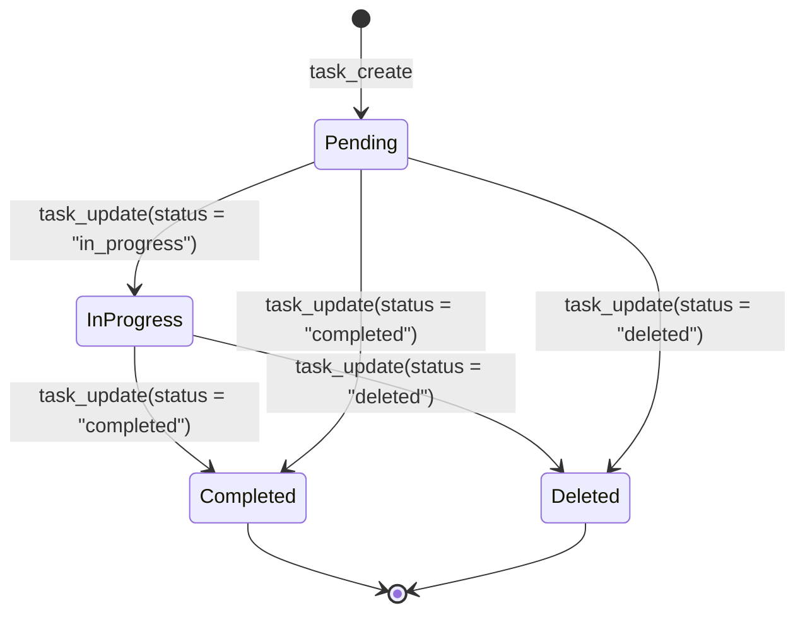
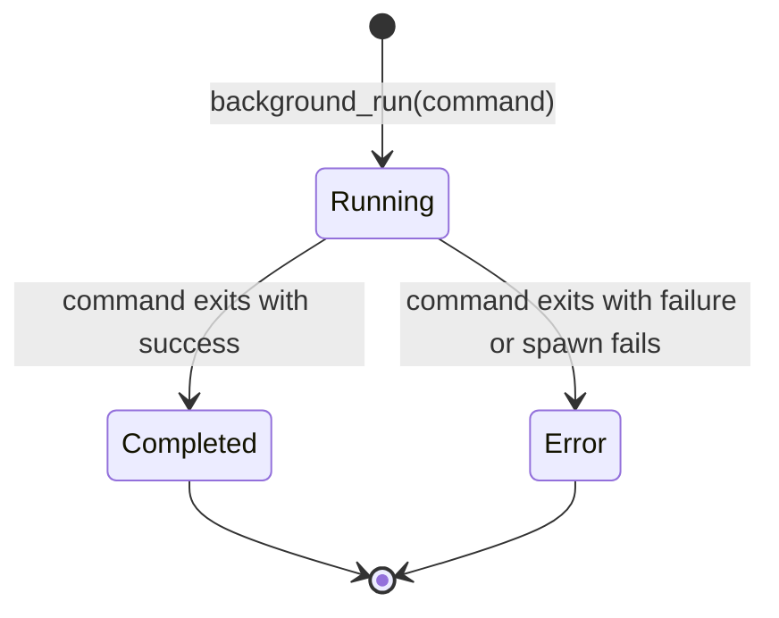
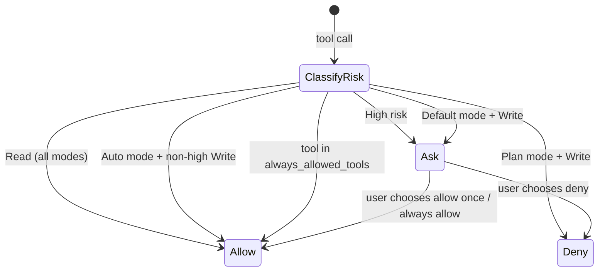
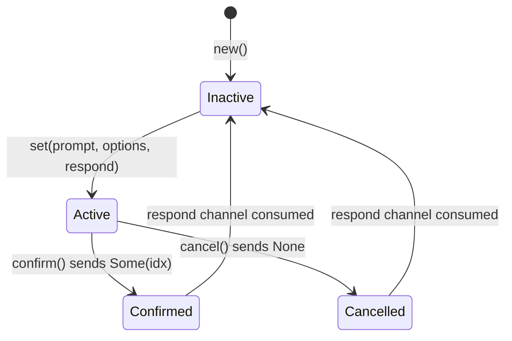

# State Machines

This document describes the state machines used across the `tact` codebase. Most are plain Rust enums with explicit transitions driven by `AgentUpdate` messages, user input, or tool results.

---

## 1. TUI Execution Status

File: `crates/tui/src/widgets/state/mod.rs`

This is the highest-level UI state. It drives the status bar, the plan panel, and whether the user is being asked for approval.

```rust
pub(crate) enum Status {
    Idle,
    Planning,
    Executing { current_step: usize, total: usize },
    WaitingForUser { prompt: String, step_index: usize, approval_tx: oneshot::Sender<bool> },
    Done,
}
```

### State transitions



### Transition triggers

| From | To | Trigger | Notes |
|---|---|---|---|
| `Idle` | `Planning` | User presses `Enter` in Insert mode with non-empty input. | Old approval (if any) is rejected; plan panel is cleared. |
| `Planning` | `Executing` | `AgentUpdate::StepAdded` (first step). | `total` is set from plan length. Legacy `PlanGenerated` would also transition here but is not emitted by agent. |
| `Executing` | `Executing` | `AgentUpdate::StepStarted(idx, tool_id, …)`. | `current_step` updated; TUI pushes `ActiveToolBlock` (supports concurrent tools). |
| `Executing` | `WaitingForUser` | `AgentUpdate::NeedApproval` or `AgentUpdate::RequestSelect`. | `input_mode` is forced to `Normal` or `Select`. |
| `Executing` | `Done` | `AgentUpdate::TaskComplete`. | `task_done_time` is recorded for the 2s highlight. |
| `Executing` | `Idle` | `AgentUpdate::StepFailed` or fatal `AgentUpdate::Error(Other)`. | Cost timer frozen; `task_start_time` cleared into `last_prompt_elapsed_secs`. |
| `WaitingForUser` | `Executing` | User presses `y` / `Enter` to approve. | `approval_tx.send(true)`. |
| `WaitingForUser` | `Idle` | User presses `n` / `Esc` to deny. | `approval_tx.send(false)`. |
| `Done` | `Idle` | 2-second auto-timeout elapses. | Implemented in the main TUI loop. Cost timer is frozen via `last_prompt_elapsed_secs` and kept until the next prompt. |

---

## 2. TUI Input Mode

File: `crates/tui/src/widgets/state/mod.rs`

Determines how keyboard input is interpreted.

```rust
pub(crate) enum InputMode {
    Normal,   // navigation, shortcuts
    Insert,   // typing a task
    Search,   // searching log messages
    Palette,  // command palette
    Select,   // option selection popup
}
```

### State transitions



### Mode-specific behavior

| Mode | Purpose | Confirm key | Cancel key |
|---|---|---|---|
| `Normal` | Navigate panels, run shortcuts, approve/deny. | — | — |
| `Insert` | Type a natural-language task. | `Enter` | `Esc` |
| `Search` | Filter log messages with `/term`. | `Enter` | `Esc` |
| `Palette` | Run commands (`theme`, `quit`, `balance`, …). | `Enter` | `Esc` |
| `Select` | Pick one option from a popup. | `Enter` | `Esc` |

---

## 3. Persistent Task Lifecycle

File: `crates/tact/src/task/mod.rs`

Tasks are durable work items with dependency tracking.

```rust
pub enum TaskStatus {
    Pending,
    InProgress,
    Completed,
    Deleted,
}
```

### State transitions



### Dependency rules

- `blocked_by`: list of task IDs that must be completed before this task is unblocked.
- `blocks`: list of task IDs that this task blocks.
- When a task is marked `Completed`, its ID is removed from all other tasks' `blocked_by` lists (`clear_dependency`).
- Rendering markers: `[ ]` Pending, `[>]` InProgress, `[x]` Completed, `[-]` Deleted.

---

## 4. Background Task Lifecycle

File: `crates/tact/src/background.rs`

Background tasks are asynchronous shell commands spawned via `tokio::spawn`.

```rust
pub enum BackgroundTaskStatus {
    Running,
    Completed,
    Error,
}
```

### State transitions



Each transition is persisted to disk under `.claude/background/tasks/<id>.json` so the task can be polled later with `check_background` even if the agent restarts.

---

## 5. Permission Decision

File: `crates/tact/src/permission/mod.rs`

Every tool call is classified and checked against the active permission mode.

```rust
pub enum PermissionBehavior {
    Allow,
    Deny,
    Ask,
}
```

### Decision flow

See [`ARCHITECTURE.md`](../ARCHITECTURE.md#3-permission-system) for the full diagram. In short:

1. `normalize_capability(tool, input)` computes `CapabilityRisk` (`Read`, `Write`, `High`).
2. `PermissionManager::check(mode, risk, allowlist)` returns `PermissionBehavior`.
3. If `Ask`, the TUI shows a `RequestSelect` popup or the headless runtime denies.
4. User choice transitions the allowlist (`always_allowed_tools`) and returns to `Allow` or `Deny`.

### Mode-specific state machine



---

## 6. Hook Control

File: `crates/tact/src/hook/mod.rs`

Hooks can permit or veto operations at three lifecycle points.

```rust
pub enum HookControl {
    Continue,
    Block(String),
}
```

### Behavior

- `Continue`: proceed to the next hook or to the next operation.
- `Block(reason)`: stop the chain and treat the tool call as failed with `reason`.

Hooks are invoked in this order during a tool call:

1. `PreToolUse` hooks — can mutate `ToolUse` input.
2. If all return `Continue`, permission check and tool execution run.
3. `PostToolUse` hooks — can mutate `ToolResult` content.

---

## 7. Step Execution Status

File: `crates/protocol/src/lib.rs`

A small enum attached to `StepResult` for TUI display.

```rust
pub enum StepStatus {
    Success,
    Failed,
}
```

This is not a lifecycle state machine by itself; it is the outcome of a single tool execution recorded in `StepResult`.

---

## 7.5 Tool Block State (concurrent active tools)

Files: `crates/tui/src/widgets/state/tool_state.rs`, `crates/tui/src/widgets/state/app/visibility.rs`

Each running tool call gets an `ActiveToolBlock` entry in `ToolState.active: Vec<ActiveToolBlock>`. Multiple tools can be active at once (e.g. parallel tool uses in one assistant turn).

```rust
pub(crate) struct ActiveToolBlock {
    pub phys_idx: usize,           // first placeholder row in messages[]
    pub tool_id: String,           // LLM tool_use id
    pub output: ToolRenderOutput,
    pub started_at: Instant,       // live elapsed in meta row while Running
}
```

Transitions:

| Event | Action |
|---|---|
| `StepStarted(_, tool_id, …)` | `cancel_active_tool(tool_id)` if restarting; push new `ActiveToolBlock` + placeholder rows |
| `StepFinished(_, tool_id, result)` | `finalize_tool_block()` — replace placeholders with final `ToolRenderOutput`, remove from `active` |
| `StepFailed(_, tool_id, …)` | Same finalize path, or fallback system message if no active block |
| New task (`SubmitTask`) / legacy `PlanGenerated` | `cancel_all_active_tools()` — `PlanGenerated` is not emitted by agent today |

`StepResult` (from runtime) includes `permission_label` (e.g. `"Allow once"`, `"Always allow this tool"`) shown in the tool meta row.

See [`tool_rendering.md`](./tool_rendering.md) for the full tool UI design.

---

## 8. Select Popup State

File: `crates/tui/src/widgets/state/select_popup.rs`

The select popup has its own implicit state machine managed through the `respond` oneshot channel.



`RequestSelect` from the agent activates the popup; `Enter` confirms and `Esc` cancels, both returning the UI to `InputMode::Normal`.

---

## 9. Streaming / Parsing State

File: `crates/tui/src/widgets/state/stream_state.rs` and `crates/tui/src/widgets/state/thinking_state.rs`

The TUI maintains mutable streaming parsers for assistant output:

- `StreamState` tracks whether the stream is inside a code block, a table, or a plain paragraph.
- `ThinkingState` buffers thinking content until a complete line or the end of the thinking block is detected.

These are not formal enums but are stateful machines with guarded transitions (e.g., ` ``` ` toggles code-block mode, blank lines flush paragraph mode).

Key transitions:

| Event | StreamState change |
|---|---|
| `AgentUpdate::ThinkingChunk` | Buffer thinking text; flush on newline; close on first non-thinking update. |
| `AgentUpdate::StreamChunk` with ` ```lang ` | Enter code-block mode, remember start index. |
| `AgentUpdate::StreamChunk` with ` ``` ` | Close code block, replace placeholders with a `CodeBlock` overlay. |
| `AgentUpdate::StreamChunk` blank line | Flush paragraph and table buffers. |

---

## 10. Agent Runtime Recovery State

File: `crates/tact/src/lib.rs` (via `AgentRuntime.recovery_state`)

The agent loop keeps counters for automatic recovery:

- `transport_attempts`: transient network errors → exponential backoff retry.
- `compact_attempts`: prompt-too-large errors → retry after `compact_history()`.
- `continuation_attempts`: `max_tokens` truncation → continue with a continuation prompt.

All three are reset to zero when the corresponding recovery path succeeds or when the loop moves on to a fresh LLM call.

---

## Summary Table

| State machine | File | Driven by | Purpose |
|---|---|---|---|
| `Status` | `crates/tui/src/widgets/state/mod.rs` | `AgentUpdate` + user input | Top-level TUI execution state. |
| `InputMode` | `crates/tui/src/widgets/state/mod.rs` | Keyboard events | Keyboard input interpretation. |
| `ToolState` | `crates/tui/src/widgets/state/tool_state.rs` | `StepStarted` / `StepFinished` | Concurrent running tool blocks + diff popup. |
| `TaskStatus` | `crates/tact/src/task/mod.rs` | `task_*` tools | Persistent task lifecycle. |
| `BackgroundTaskStatus` | `crates/tact/src/background.rs` | `background_run` / completion | Async shell task lifecycle. |
| `PermissionBehavior` | `crates/tact/src/permission/mod.rs` | Risk classification + mode | Approve/deny/ask for each tool call. |
| `HookControl` | `crates/tact/src/hook/mod.rs` | Hook return value | Permit or veto agent operations. |
| `StepStatus` | `crates/protocol/src/lib.rs` | Tool execution result | Per-step success/failure display. |
| `SelectPopup` | `crates/tui/src/widgets/state/select_popup.rs` | `RequestSelect` + keys | User option selection popup. |
| `StreamState` / `ThinkingState` | `crates/tui/src/widgets/state/stream_state.rs` / `thinking_state.rs` | Stream chunks | Parse Markdown/code/thinking output. |
| `RecoveryState` | `crates/tact/src/recovery.rs` | LLM errors | Auto-recovery from transport/context errors. |
