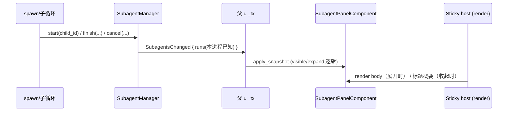

# Subagent Sticky Tab（重新实现）设计

> 日期：2026-09-07 · 状态：草稿待批准
> 关联：`crates/protocol/src/agent.rs`、`crates/tact/src/subagent.rs`、`crates/tact/src/tool/subagent.rs`、
> `crates/agent_tui_kit/src/{components,state,render}/task_panel.rs`、`crates/tui/src/render/task_panel.rs`
> 背景：2026-07-26 提交 `98a133f` 删除了旧的 Subagent sticky pane；本设计在**当前组件化架构**
> （agent_tui_kit registry + `TasksChanged`/TaskPanel 模式）上**重新实现**，不回滚该提交。

## 1. 背景与动机

Tasks 自 2026-07-24 起有一条 Log 下方的 sticky 条（`TaskPanelComponent` 拥有 `TaskPanelState`，
由 `AgentUpdate::TasksChanged` 快照驱动）。子代理目前**没有**对等的常驻进度面：

- 运行中的子代理流式内容被 `tagged_ui_channel_with_progress`（`tool/subagent_ui.rs`）路由进父级
  `spawn_subagent` **工具卡**（live card + `ToolProgress`），完成后可点开 SubagentPopup 看全文。
- 但这只在 Log 里随卡片滚动存在；**后台并行 `run_in_background` fan-out** 时，父 agent 一轮只能看到
  一个工具卡，多路子代理的"哪些还在跑 / 哪个刚完成 / 各自摘要"没有一处总览。

本设计为子代理补齐与 Tasks 对等的 sticky tab：一个常驻的总览条，展开后按状态分组列出**本会话启动过**
的子代理运行（child_id、状态、摘要首行、耗时），收起时一行概要。

**刻意不做的事**（保持 98a133f 的方向）：

- 子代理的流式明细不进 sticky body（仍是 tool card + popup）；sticky 只放**状态级总览**。
- 不恢复 `AgentUpdate::Subagent { update }` 包裹事件，不回滚 protocol/forwarder 的现有形状。
- 不把 subagent 事件复制进主 Log（Log 已有工具卡一行）。

## 2. 范围

### 在内（v1）

- 协议：`SubagentStatusSnapshot`（Running/Completed/Failed/Cancelled）、`SubagentRunSnapshot`、
  `AgentUpdate::SubagentsChanged { runs }`。
- tact 侧：`SubagentManager` 增加进程内「已知 child 集合」，提供 UI 快照与发射 helper；
  在 spawn start / sync+async finish / cancel_subagent 工具 / driver 的 `CancelSubagent` 路径发射。
- agent_tui_kit：新增 `SubagentPanelComponent` + `SubagentPanelState`（镜像 TaskPanel），
  纯渲染 `render/subagent_panel.rs`。
- tui：sticky 主机从「纯 Tasks 单条」升级为「Tasks | Subagent 双域主机」（仅在有内容时显示对应 tab）；
  mouse/normal 滚动、点击展开/切 tab、`MouseState` 区域。
- 双语文档同步（Ch 23 / Ch 12 指针性段落 + Ch 26 条目，见 §6）。

### 不在内（v1）

- 不做 store schema 变更：不把 `parent_session_id` 加进 `subagent_runs`（见 §4.2 取舍）。
- 不做跨会话子代理历史恢复：sticky 只显示**本次进程**启动过的运行。
- 不把子代理明细/thinking 渲染进 sticky body。
- 不新增 slash 命令、不改 spawn 工具集。

## 3. 设计

### 3.1 数据流



Tasks 的模式是「工具 handler 每次变更后 `emit_tasks_changed` 发全量快照」。子代理照搬，
但快照内容来自 `SubagentManager` 的**进程内已知集合**，而不是全表 `list()`（见 §4.2）。

### 3.2 协议（`crates/protocol/src/agent.rs`）

```rust
/// UI-facing subagent run status.
pub enum SubagentStatusSnapshot { Running, Completed, Failed, Cancelled }
impl SubagentStatusSnapshot { pub fn marker(self) -> &'static str; } // "▶" "✓" "✗" "⏹"

/// One subagent run for the sticky总览 (mirrors TaskSnapshot).
pub struct SubagentRunSnapshot {
    pub child_id: String,       // 短 8 位展示可截断
    pub status: SubagentStatusSnapshot,
    pub summary_first: String,  // 摘要首行（单行安全）
    pub started_at: Option<i64>,
    pub finished_at: Option<i64>,
}

pub enum AgentUpdate {
    // …
    /// 本 UI 会话内子代理运行集合变化（spawn start / finish / cancel 后发射）。
    /// runs = 本进程启动过、仍在窗口内的运行（见 §4.2 上限）。
    SubagentsChanged { runs: Vec<SubagentRunSnapshot> },
}
```

- 镜像 `TasksChanged`：携带**全量可见快照**，TUI 直接 `apply_snapshot`。
- 只读工具（`check_subagent`/`wait_subagent`）不发射；`resume` 复用一个已知 child 时照常发射。

### 3.3 tact 侧发射点（`crates/tact/src/subagent.rs` + 调用方）

`SubagentManager` 增加：

```rust
/// 本进程启动过的 child 集合（cancel_handles 之外的轻量记账）。
known: Mutex<HashSet<String>>,
```

- `pub fn note_started(&self, child_id: &str)`：spawn handler 在 `start()` 后调用。
- `pub async fn ui_snapshot(&self) -> Vec<SubagentRunSnapshot>`：遍历 `known`（去重、上限见下），
  逐 child `records.get()`，映射为快照；排序 Running 优先、其余按 started_at 倒序。
- 发射 helper（与 `emit_tasks_changed` 同风格，放 `crates/tact/src/subagent.rs`）：

```rust
pub async fn emit_subagents_changed(ui_tx: &Option<UnboundedSender<AgentUpdate>>, m: &SubagentManager)
```

发射点（统一放在**状态已落库之后**，避免 TUI 看到与 DB 不一致的瞬时状态）：

| 路径 | 位置 | 触发 |
|---|---|---|
| spawn（sync+async） | `tool/subagent.rs` `spawn_subagent` | `manager.start()` 后 |
| sync finish | `tool/subagent.rs` 同步分支收尾 | `finish/cancel` 落库后 |
| async finish | `tool/subagent.rs` detached task | `finish/cancel` 落库后、`SubagentFinished` 之前 |
| `cancel_subagent` 工具 | `tool/subagent.rs` | `cancel()` 后 |
| driver `UserCommand::CancelSubagent` | `tact-ui/src/driver.rs` | `request_cancel()+cancel()` 后 |

- detached task 已持有 `ui_tx` 与 `manager` 引用，直接调用；driver 分支也直接调用。
- 快照上限：`MAX_SUBAGENT_SNAPSHOT = 20`（Running 恒保留，超出按 started_at 丢弃最旧 finished；
  行截断文案 `⋯ +N more` 由渲染层处理）。

### 3.4 agent_tui_kit：`SubagentPanelComponent` + `SubagentPanelState`

镜像 `TaskPanelComponent`（`components/task_panel.rs` + `state/task_panel.rs`）：

```rust
pub struct SubagentPanelState {
    pub snapshot: Vec<SubagentRunSnapshot>,
    pub session_seen: bool,   // 本 UI 会话首个 SubagentsChanged
    pub visible: bool,        // has_running || (已折叠但保留? ) → 见下
    pub expanded: bool,
    pub scroll: usize,
    pub max_visible: usize,
}
impl SubagentPanelState {
    pub fn apply_snapshot(&mut self, runs: Vec<SubagentRunSnapshot>);
}
pub fn has_running(runs: &[SubagentRunSnapshot]) -> bool;  // status == Running
pub fn format_subagent_lines(runs, scroll, max_visible) -> Vec<String>;
pub fn format_subagent_sticky_title_line(msgs, runs) -> String;
```

**可见性语义（与 Tasks 对称，但生命周期不同）**：

- `apply_snapshot`：置 `session_seen=true`；`visible = has_running || snapshot 非空但本次变化前已展开`？
  为避免歧义，取**更简单、与 Tasks 一致**的规则：

  - 首次出现（`!session_seen` 之前）：有任意 run（含刚完成的 sync）→ `visible=true, expanded=true`；
  - 之后每次：`visible = has_running || expanded`（用户正展开查看历史时，全部跑完也不突然消失；
    一旦用户收起且无 Running → `visible=false` 整条隐藏，与 Tasks「无 open 项即隐藏」对齐）；
  - `expanded` 初次自动 true；收尾全部完成且被收起 → 隐藏。

  该规则避免「同步单发子代理一闪而过」与「后台 fan-out 需要常驻总览」互相打架：
  需要留意的场景（有 Running 或有展开）常驻，纯瞬态场景自然收起。

- `format_subagent_lines` 分组：`── Running ──` → `── Completed ──` → `── Failed ──` → `── Cancelled ──`
  （与 Tasks 不同：Tasks 隐藏 Completed；子代理完成态有摘要首行，值得保留）。
  行格式：`{marker} {short_id} {summary_first}  ⏱ {duration}`；超 `max_visible` 加 `⋯ scroll ▼`。
- 标题行：`▸ 🤖 Subagent {running}/{total} · {focus 摘要首行}  ▼`（i18n 见 §3.6）。

组件 `on_update` 只认 `AgentUpdate::SubagentsChanged`，`priority` 与 TaskPanel 一致（40），
`render` 返回 0（同 TaskPanel——真正渲染在 host 层）。

### 3.5 tui：双域 sticky host（核心改动）

现状：`crates/tui/src/render/task_panel.rs` 是 app 层包装（`sticky_host_visible` /
`sticky_host_content_height` / `render_task_panel`），`layout.rs` 据此对 Log 做 outer-split；
kit 侧 `render/task_panel.rs` 只画单域。

**改为双域主机（kit 纯渲染）**：

```rust
// agent_tui_kit::render::sticky_host
pub fn sticky_host_visible(ctx: &RenderCtx) -> bool;      // task_panel.visible || subagent_panel.visible
pub fn sticky_host_content_height(ctx: &RenderCtx) -> usize;
pub fn render_sticky_host(frame, area, ctx);              // 标题行(tabs) + hairline + body
```

- `RenderCtx` 增 `pub subagent_panel: &'a SubagentPanelState`；app 的 `render_ctx()` 从新组件读取。
- `MouseState.task_panel_area` 语义扩展为 sticky host 区域（重命名可选；为减少改动保留字段名但
  含义 = host）。`MouseState` 增加 `active_sticky_tab: StickyTab` 枚举（Tasks/Subagent，默认 Tasks）。
- **标题行渲染**：可见域逐个画 tab 标签；活动 tab 高亮 accent。无展开需求时整行为
  `[Tasks] n/n · …` / `[Subagent] n/m · …` 等概要。
  - 只有 Tasks 可见 → 与今天逐像素一致（无 tab 栏，避免视觉回归）；
  - 只有 Subagent 可见 → 单个 `[Subagent]` 标签 + 概要；
  - 两者都可见 → `[Tasks] …  [Subagent] …` 同栏。
- **点击语义**（app 层 mouse handler）：
  - 点在**非活动 tab 标签区** → 切 active tab（该域 `expanded=true`）；
  - 点活动 tab / 概要区 → 切换该域 expanded；
  - 点 tab 之外 host 区域 → 折叠活动域。
- 需要把 tab 命中矩形随帧写到 `MouseState`（新 `sticky_tab_areas: Vec<(StickyTab, Rect)>`，
  仿 `subagent_cancel_btn_areas` 每帧刷新模式）。
- **滚动**：`mouse/normal.rs` 现有 `in_task_panel && sticky_scrollable` 分支改为滚动
  **活动 tab 对应域**（TaskPanel 或 SubagentPanel 各自的 `scroll`）。

> 布局约束保持不变：sticky 是 Log 下方的单一 strip（`render_main_area` outer-split 逻辑基本不动，
> 只是可见/高度判断换成 host 版本）。

### 3.6 i18n

`agent_tui_kit/src/i18n.rs`（Messages）增加：

- `subagents_sticky_title`（EN `"Subagent"` / 中文 `"子代理"`）
- 可选 `subagent_running_label` / `subagent_done_label` 等（v1 尽量复用 Tasks 现有模板，避免膨胀；
  标题行文案用纯数据 + 少量新字段）。

### 3.7 状态文件与导出（无大重构）

- `crates/tui/src/widgets/state/mod.rs` 增加 `pub(crate) mod subagent_panel` re-export
  （同 `task_panel` 现有写法）。
- `registry.rs` 增加 `subagent_panel()` / `subagent_panel_mut()` 访问器；
  `construct.rs` push `SubagentPanelComponent`。
- 渲染 test_harness / app 层包装函数命名保持 `render/task_panel.rs`（或新增 `render/sticky_host.rs`，
  task_panel 薄转发），以最小 diff 为主——计划里明确。

## 4. 备选方案与取舍

| 方案 | 结论 |
|---|---|
| A. 恢复 2026-07-26 旧 `AgentUpdate::Subagent` 包裹 + SubagentPane 迷你日志 | 放弃：用户明确不回滚；旧设计与 tool card / registry 双轨冲突 |
| B. 给 `subagent_runs` 加 `parent_session_id` 列做跨会话过滤 | 放弃（v1）：schema 变更 + 迁移面大；sticky 本质是会话内 UI 状态，进程内 known 集合已够 |
| C. sticky body 直接消费 `SubagentFinished` / ToolProgress 逐个事件自建行 | 放弃：非幂等、易与 tool card 重复；快照式与 Tasks 模式一致、天然容错 |
| **D. `SubagentsChanged` 全量快照 + 进程内 known 集合 + 双域 host（本设计）** | **采纳**：最少协议/UI 状态，Tasks 同构，无 schema 变更 |

### 4.1 为什么"已知集合"而不是全表 `list()`

- `subagent_runs` 跨会话/跨进程累积，且启动时 orphan repair 会把旧 Running 翻成 Failed——
  直接 `list()` 会把这些历史噪音塞进 sticky。
- `known` 只记录本进程启动的 child；进程重启后 sticky 天然清空（与 98a133f 后
  "不重新投递已完成结果"的语义一致）。

### 4.2 快照窗口

`known` 集合本身可增长（长时间会话 spawn 很多）。`ui_snapshot()` 输出上限
`MAX_SUBAGENT_SNAPSHOT = 20`：Running 全保留；Completed/Failed/Cancelled 按 started_at 倒序取
到上限为止。渲染层再按 `max_visible` 分页。

## 5. 测试策略

- 协议（`protocol`）：`SubagentRunSnapshot`/`StatusSnapshot` marker 单测；
  `SubagentsChanged` 变体 destructure 测试（镜像 `TasksChanged` 现有测试）。
- tact：`known` 记账（start → snapshot 含该 child；未 start 的旧 DB 行不出现）；
  `ui_snapshot` 排序 + 上限；orphan-repair 后旧行不进快照。
- kit 组件：`subagents_changed_applies_snapshot`、`unrelated_updates_ignored`；
  可见性规则矩阵（首现展开 / 全完成且展开保留 / 全完成收起后隐藏）。
- kit 纯渲染/状态：`format_subagent_lines` 分组顺序 + 截断 + scroll 上限；标题行计数。
- tui 集成（test_harness + buffer 断言）：
  - 只有 Tasks 可见 → 现有渲染断言不回归（无 tab 栏）；
  - 只有 Subagent 可见 → 单 tab + 概要 + 展开 body；
  - 两者可见 → 双 tab 同栏、点击切换、hairline 分隔（沿用 `expanded_tasks_sticky_puts_a_rule…` 模式）；
  - 背景不变量：空白格均带 `theme.bg`（AGENTS.md 渲染不变量 #6）。
- 编译：`cargo check --workspace --all-targets`；定向
  `cargo test -p tact --lib subagent::`、`cargo test -p tact-ui` 相关 tests、
  `cargo test -p agent_tui_kit`（单进程串行，遵守仓库约束）。

## 6. 文档同步（推送前一次性）

- `book/23_chapter_tui.md` / `_zh.md`：sticky 小节改为「Tasks | Subagent 双域主机」；
  `render/layout.rs` 与 kit `task_panel.rs` 职责行补 subagent host。
- `book/12_chapter_subagent.md` / `_zh.md`：§6 补一句 sticky tab 总览指针（run 状态级，
  明细仍在 tool card / popup）。
- `book/26_chapter_issue*.md`：newest-first 加一条 `feat`（含本 spec 链接、`subagent.rs`、Ch 23/12 指针），
  注明动机为「后台 fan-out 子代理缺少常驻状态总览；不推翻 98a133f 的 tool-card 明细方向」。
- 不涉及 `config.example.toml`、`book/01_chapter_store*`（无 schema 变更）。

## 7. 未来扩展（v1 不做，留档）

- 点击 sticky 某一行跳转对应子代理工具卡 / 打开 SubagentPopup。
- `subagent_runs` 增加会话列后跨会话恢复 sticky。
- sticky body 展开显示「摘要全文」而非仅首行（v1 仅首行，控制高度）。
