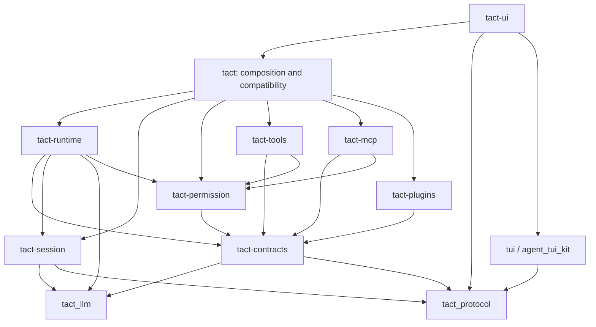

# Tact Runtime Architecture

**Status:** Revised target for a complete architectural rebuild supporting independent subsystem development; implementation is in progress on `tact-architecture`.
**Date:** 2026-10-08
**Branch:** `tact-architecture`
**Plan:** [Implementation plan](../plans/2026-10-08-tact-runtime-architecture.md)

## 1. Scope

Rebuild Tact around independently owned crates so multiple contributors can develop tools, MCP, plugins, storage, permissions and runtime orchestration without editing the same Agent implementation. Internal module extraction is a migration technique, not the final deliverable. Physical separation and removal of reverse dependencies are mandatory completion criteria.

Preserve current external package, Hook, MCP, Skills, CLI, session, provider and UI behavior. Keep existing package names and public compatibility entry points. No new WASM/process ABI, Web client, event-sourcing database or schema migration is required. Extensible capabilities use plugins; lifecycle, permission enforcement and durable state remain kernel responsibilities.

Success means a normal tool addition, MCP transport change, plugin manifest change or storage fix can be implemented and verified inside its owner crate, with composition changes only when registering a new capability. Shared contracts change deliberately and less frequently than implementations.
Existing Codex package support is in scope: `.codex-plugin/plugin.json`, marketplace sources, install/update/uninstall/reload, contributed Hooks/Skills/MCP and existing trust/merge rules. Preserve the subset Tact implements today; do not promise arbitrary upstream features. New dynamic plugin ABIs remain a separate project.

## 2. Source baseline

| Responsibility | Current source |
|---|---|
| Agent/public runtime state | `crates/tact/src/agent/mod.rs` |
| Tool dispatch/scheduling | `crates/tact/src/agent/tool_dispatch.rs`, `tool_schedule.rs` |
| Host protocol | `crates/protocol/src/agent.rs` |
| Response correlation | `crates/tact/src/ui_responder.rs` |
| Hooks/packages | `crates/tact/src/hook/mod.rs`, `plugin/{hooks,install,marketplace,model,store}.rs` |
| Permission precedence | `crates/tact/src/permission/{mod,settings}.rs` |
| Session persistence | `crates/tact/src/store/session_store/{mod,sqlite}.rs` |
| Providers/hosted tools | `crates/tact_llm/src/` |
| Hosts | `crates/tact-ui/src/driver.rs`, `interactive.rs`, `headless.rs` |

## 3. Terminology and state ownership

A **run** is one submitted task including all model calls/tool continuations. A **model turn** is one model request/response. TurnStats continues counting model turns. TurnCoordinator coordinates the whole run; a provider response alone does not complete it.

| State | Single authority during module stage |
|---|---|
| Conversation/provider/compaction/recovery state | Existing AgentRuntime fields |
| Durable transcript/provider baseline/locks | Existing SessionStore transactions |
| Permission rules/counters | Existing PermissionManager |
| Native registrations | Existing ToolRouter |
| MCP connections/OAuth/refresh generation | Existing MCPToolRouter |
| Pending input responses | Existing UiResponder |
| Display indexes/presentation | Existing protocol/projection |
| New run ID/sequence | One runtime publisher per run |
| Read model | Derived view; never a second mutable conversation |

Do not persist new run IDs or session approvals. New SessionState, if introduced, is a read-only lifecycle view. Existing in-memory approvals expire as before.

## 4. Boundaries

```text
Host commands -> driver -> TurnCoordinator
                            | provider port
                            | tool batch -> awaited hooks/policy -> scheduler -> executor
                            | awaited store transactions
                            v
                       ordered publication -> host projection / observers
```

Core defines data vocabulary. Runtime owns sequencing. Compatibility adapters parse package formats and Hook payloads. Outer composition in tact/host bootstrap injects concrete implementations. Hooks that modify/block/allow are awaited control operations, never asynchronous notification subscribers.

Native/MCP unify preparation, scheduling, results and publication, while retaining execution mechanics. Preserve MCP server identity, resources/prompts, per-server serialization, list-change refresh, timeouts, filtering, output limits, OAuth and shutdown. Hosted provider operations are excluded from local execution.

Local shell sandboxes cover processes launched through the runner. Remote MCP servers execute outside that local boundary. Trusted in-process extensions retain process privileges; approval interfaces are not OS isolation.

### Hosted operations

Preserve hosted injection on ordinary Responses requests and exclusion on compact requests. Hosted web_search must coexist with an MCP/function tool of the same name, never become local ToolUse, and retain completed stop reason. Keep real Step events, first-done deduplication by output index, exhaustive status mapping and defensive failure on nonterminal done. Preserve raw replay items and the queries[] parsing shim.

## 5. Complete protocol migration inventory

Retain AgentUpdate and UserCommand throughout the rebuild. Each event either round-trips every field through a new representation or passes through intact. No wildcard dropping of variants is permitted.

| AgentUpdate | Required treatment |
|---|---|
| StepAdded | Retain complete PlanStep, raw arguments and tool ID |
| StepStarted | Retain index, ID, name, summaries and presentation |
| StepFinished | Retain entire StepResult |
| StepFailed | Retain index, ID, summary and error |
| ToolProgress | Ordered stdout/stderr chunks; preserve late/unknown-ID handling |
| TaskComplete | One run completion with summary |
| TaskCancelled | Cancellation without simultaneous completion |
| Error | Preserve classification; diagnostic does not necessarily terminate run |
| TokenUsage | All accounting fields |
| TurnStats | Model-turn count and cap |
| ModelInfo | Complete model-call metadata |
| Info, MdInfo, PopupMarkdown | Distinct presentation/destination passthrough |
| HookContext | Preserve text and provenance |
| HookStatus | Preserve ID and elapsed-time lifecycle |
| RequestSelect, RequestMultiSelect | Preserve ID/options and single-select log_confirm |
| StreamChunk | Ordered assistant delta |
| ThinkingChunk | Started/Delta/Finished lifecycle |
| TasksChanged | Task snapshot and reason |
| ToolMeta | Model/usage/background linkage |
| BackgroundTaskFinished | Keep-live finalization/output after parent run end |
| SubagentFinished | Parent tool/child ID and summary |
| SubagentsChanged | Process-scoped overview snapshot |

Balance, PlanGenerated and NeedApproval are not current enum variants; do not invent handlers for them.

| UserCommand | Owner/behavior |
|---|---|
| SubmitTask | Driver creates existing structured Message and starts run |
| Cancel | Signal active run; next submission resets cancellation |
| Compact | Existing compaction without normal task submission |
| QueryBalance, QueryStats, QueryBackground | Existing query services/presentation |
| SetPermissionMode, SetThinkingBudget, SetReasoningEffort, SetModel | Existing session settings/persistence choices |
| SubagentFinishedNotification, CancelSubagent | Wake-up deduplication/child cancellation |
| McpAuth, McpList, McpPrompts, RunMcpPrompt | Existing live router, OAuth and prompt submission |
| HooksList, HooksTrust, HooksForget | Existing trust/review services |
| UiResponse | Existing response-ID correlation, including late/duplicate responses |

PluginRequest is a separate worker protocol and remains supported. RequestSelect already carries pure data, not a oneshot. Preserve UiResponder withdrawal/shutdown and headless interaction semantics.

## 6. Hook/policy behavior and explicit security correction

### Baseline (capture before moves)

1. Resolve tool identity/resource metadata and initial risk; retain current Step emission timing.
2. Existing sensitive guard denies Credential before Hooks and elevates Secret risk. MCP inputs are not assumed to be local paths.
3. PreToolUse Continue enters policy; Allow currently bypasses policy; Block/error resolves without execution.
4. Delegate to check_with_auto with its exact Read -> Plan -> Auto -> settings deny/allow/ask -> server auto -> high/session rule precedence. Do not replace it with a simplified ladder.
5. Only on Ask invoke PermissionRequest. Allow permits; Block denies; Continue prompts; error reports and falls through. Preserve Notification and all approval choices/rule scopes/denial counters.
6. Prepare batch sequentially, execute conflict waves, assemble provider results in original order.
7. Redact before post-hooks/consumers. Rust PostToolUse dispatch runs with execution status; plugin adapters can filter success. PostToolUseFailure additionally receives execution failure, not a failure invented by a post-hook. Preserve context injection, suppression and errors.

Initial risk currently precedes PreToolUse. Moving classification after mutation is a behavior change.

### Explicit security task, separate from structural refactoring

After either PreToolUse or PermissionRequest changes executable input, validate the final target again and recalculate risk/resources. Credential targets deny even on Hook Allow. Changed PermissionRequest input invalidates approval for the previous input: evaluate final policy once without recursively rerunning the Hook; then allow, deny or prompt. Preserve unchanged-input Hook Allow semantics. A Hook may not change the resolved tool identity; reject that change explicitly.

This correction gets separate tests and a user-visible book issue entry. It is not described as a behavior-preserving move.

## 7. Event delivery and crash boundaries

One publisher assigns monotonically increasing sequence numbers per run. Each migrated producer uses either the bridge or the old direct send, never both. Background/child events retain original linkage and may arrive after parent completion. Preserve existing host queue ordering during this migration.

Optional observers must not block execution or grant approvals. Bounded observer overflow reports a gap requiring a fresh read snapshot. Observer disconnect does not cancel a run. Host shutdown uses the existing driver/responder shutdown path and must release pending requests. Do not introduce an unbounded new observer queue.

Store writes remain awaited runtime operations, not best-effort event subscribers. Preserve current SessionStore, provider baseline transactions, locks, row IDs and raw replay data. No new schema or parallel persistence pipeline is introduced.

External effects cannot be made exactly-once by the event bus. If a tool executes but result persistence fails, report storage failure and stop automatic continuation/retry of that operation. Resume must not automatically rerun an unresolved side-effecting call because its result is missing. Report incomplete work through the recovery path and require a new execution decision. Any baseline deviation discovered here is isolated as an explicit safety correction, not buried in extraction.

## 8. Target crates and collaboration boundaries

Keep existing package names/features/binaries: tact, tact-ui, tact_protocol (protocol directory), tact_llm, tui, agent_tui_kit and tool_refactor_macros. New packages use hyphenated Cargo names and underscored Rust import names. There is no additional generic tact-core or separate plugin ABI crate.

| Owner package | Source destination | Owns | Must not own |
|---|---|---|---|
| tact-contracts | `crates/tact-contracts/src/{tool,hook,host,services}.rs` | Shared capability values and service ports used by independent implementations | Registries, configuration loading, business orchestration, SQLite, a second Message model |
| tact-runtime | `crates/tact-runtime/src/{run,model_turn,tool_batch,hook_flow,approval,context,compact,recovery,events}.rs` | Run transitions, model turns, preflight/wave/result sequencing, compaction and recovery algorithms | Concrete Agent, package install, MCP transport, native tools, terminal rendering |
| tact-session | `crates/tact-session/src/{session,background,subagent,task,team,worktree,sqlite}.rs` | Existing store traits, database implementations, locks and shared database initialization | Conversation-loop decisions, plugin install registry, UI |
| tact-permission | `crates/tact-permission/src/{policy,settings,sensitive,redact,sandbox}.rs` | Rules, decisions, sensitive-target classification, output redaction and existing local sandbox backends | Asking the user, invoking Hooks, parsing the root application configuration |
| tact-tools | `crates/tact-tools/src/` | Native implementations and local registration, including service-backed tools | Constructing Agent or importing concrete MCP/plugin/runtime managers |
| tact-mcp | `crates/tact-mcp/src/{config,client,router,remote,resource,prompt}.rs` | MCP connections, protocol, OAuth, refresh and resolved handles | Reading installed plugin registries or constructing Agent |
| tact-plugins | `crates/tact-plugins/src/{package,marketplace,install,trust,hooks,skills}.rs` | Existing packages, marketplace, contribution loading, trust and external Hook translation | Tool execution policy, live MCP connections or model loops |
| tact | Existing `crates/tact/src/` | Agent facade, root config, composition, legacy callback adapters and process service wiring | A second implementation of runtime sequencing |
| tact-ui | Existing crate | CLI/bootstrap, interactive/headless driver and host services | Tool scheduling or Hook policy algorithms |
| tact_protocol / tact_llm / tui / agent_tui_kit | Existing crates | Existing transport, providers and rendering responsibilities | New facade dependencies |

The session crate includes the existing related stores because they share database setup and transactions. Its name does not imply session-only tables. Process managers remain composition services initially; their tool-facing contracts live in tact-contracts. This is an explicit boundary, not permission to put all remaining logic in Agent.

### 8.1 Allowed dependency direction

Arrows mean Cargo dependency; external libraries are omitted. Direct edges to shared contracts/provider/protocol types are allowed where used.



No new owner crate may depend on tact, tact-ui or a renderer. tact-contracts must not depend on any new implementation crate. Tools, MCP and plugins must not depend on each other. Runtime may use permission evaluation and SessionStore directly; reuse these established interfaces rather than adding redundant policy/repository traits. Session SQLite dependencies remain in tact-session; a feature split is optional and is not a reason to introduce another crate now.

MCP currently imports PluginStore/PluginRoot and permission currently imports tool policy/path helpers. Break these edges before moving modules: composition passes resolved MCP contributions, shared policy metadata belongs in contracts, and sensitive-target extraction belongs with permission classification. Do not add plugin -> MCP -> plugin cycles or permission -> tools cycles.

### 8.2 State and execution ownership

- Conversation, provider baseline, compaction counters and recovery fields have one owner. During migration that remains the existing AgentRuntime. Runtime algorithms receive scoped mutable references to this state; they do not need to own the containing struct.
- Move reusable state types without changing their layouts where practical. Keep the public AgentRuntime facade when its fields mix types from different owners. No copied authoritative context, unsafe aliasing or hidden synchronization between old/new state is permitted.
- PermissionManager owns rules and session grants; the runtime decides when to consult it. Persisted configuration and ephemeral grants remain distinct.
- Each native registry and MCP connection registry has one authority. Tool descriptors and prepared invocations are generation-scoped views, not competing registries.
- The existing UiResponder owns pending replies. Approval requests use this host service; observer events cannot answer them.
- Durable stores own database transactions. Runtime awaits store operations and never substitutes event listeners for persistence.
- Process services own children/background tasks and their shutdown. Run cancellation is not process shutdown; background completion can outlive the parent run.

### 8.3 Ports and compatibility without Agent back-edges

Use contracts only where there is a real cross-crate consumer. Move existing ToolResources, policy metadata and result data instead of creating lossy duplicates. Provider Message/ContentBlock and host AgentUpdate remain their existing types.

| Contract | Inputs and outputs | Authority / lifetime |
|---|---|---|
| Tool backend | Resolved identity, generation, effective input -> prepared executable handle -> existing complete result | Native/MCP owners resolve; handle survives its permitted wave; independent handles execute concurrently |
| Hook invocation | Hook kind, existing serialized payload, provenance, immutable context -> existing control/input/result/context effects | Runtime chooses order; plugins execute package callbacks; facade executes legacy Rust callbacks |
| Approval service | Existing request data/ID -> existing UiResponse or cancellation | UiResponder owns reply correlation; shutdown withdraws requests |
| Subagent service | Existing child request/config -> child ID, status, result/cancel | Composition owns construction; native tool uses service handle |
| Other tool services | Existing skill/task/team/background/worktree/compact operations -> existing results | Concrete managers stay outside tools; separate narrow interfaces, no generic service locator |
| MCP contributions | Resolved source, transport config, merge priority and trust identity -> router configuration | Plugins produce contributions; composition merges; MCP does not scan package stores |

Legacy Hook closures accept &Agent across await. A long-lived mutable borrow of Agent state cannot coexist with that callback. The extracted run and batch engines therefore use resumable boundaries: advance a transition with scoped state references, return an owned request when facade work is needed, release the borrow, await the callback with the intact Agent, then resume with a correlated reply. Engines own sequencing and pending request validation; the facade only dispatches effects. A nested Agent::agent_loop call is not permitted as an implementation shortcut.

Use typed request/reply enums, not untyped JSON for internal control flow. They must cover model, Hook, tool-wave, store and host suspension points actually required by the existing loop. Token/request-kind mismatches and duplicate replies are rejected before applying state. The extraction plan requires a small compileable vertical slice demonstrating legacy callbacks, mutable state and cancellation before migrating the full coordinator. This design is not yet compiler-verified.

Retain existing public fields, constructors, LoopState callbacks, Tool trait and macro paths through facade adapters. New native implementations use narrow services internally; legacy custom Tool implementations are wrapped at registration. Do not claim re-exporting a differently shaped struct preserves compatibility. If a compile fixture proves a public contract cannot be preserved, document that precise incompatibility before changing it; silently accepting a cycle or deleting the contract is not an option.

### 8.4 Keeping the new architecture maintainable

Each owner has its own unit/contract tests and examples of its public API. Normal work should touch an owner crate and its tests; registration may also touch composition. API changes include affected consumers in the same reviewed change. No fixed line-count target replaces responsibility boundaries.

Split the runtime into run state transitions, model-turn handling, tool batches, Hook flow, approval interaction, context/compaction, recovery and publication. Keep these modules private unless another crate actually needs the type. Root lib.rs files expose a curated API; avoid glob re-exports that accidentally make internals contractual.

The facade may own service instances but must not reimplement permission precedence, batch scheduling, compaction or run transitions. New functionality goes to the owner crate, never into a growing compatibility module. Legacy wrappers should delegate to the same implementation as new APIs.

Parallel development becomes safe after contract and dependency gates pass. Suggested ownership lanes are session/storage; permission/sandbox; native tools; MCP; packages/Hooks; runtime; hosts. Shared-contract edits require coordination. This plan describes collaboration boundaries and does not authorize spawning agents.

## 9. Acceptance and rollout

1. Exhaustive command/update handling and separate plugin-worker tests preserve all current variants.
2. Existing package/marketplace/install/reload/trust/resource-merge fixtures remain covered.
3. Hook baseline is unchanged by structural moves; final-input safety corrections are separately asserted.
4. Native/MCP batch ordering, conflicts, dynamic refresh, cancellation and timeouts remain covered.
5. Hosted operations never enter local execution and preserve raw replay/status handling.
6. Interactive/headless completion, prompt shutdown, and background/child card finalization remain covered.
7. Persistence-failure injection and resume tests prevent automatic duplication of unknown side effects without claiming exactly-once execution.
8. Public API compile fixtures cover constructors/fields, Hook callbacks, custom Tool implementations, proc macros and protocol types.
9. Every listed Cargo test gate must select at least one test; zero matches is a failed verification procedure.
10. All seven new owner packages exist, compile independently of tact/tact-ui and contain the production implementations, not empty wrappers around the facade.
11. Dependency checks cover normal, dev and target-specific workspace edges; leaf tests do not import tact through dev-dependencies.
12. A native tool addition, an MCP refresh change and a package-parser fixture each stay inside the owner plus optional composition registration. Runtime-only tests run without native/MCP/plugin implementations.
13. Agent is a compatibility/composition facade; runtime sequencing and policy are not duplicated there. Internal module extraction alone cannot close this project.

The plan supplies concrete source files, interfaces, fixtures and commands. New asynchronous channel tests use bounded waits. Cargo build/check/test/clippy operations run serially. Do not commit/push unless asked.

At push time synchronize ARCHITECTURE.md, state-machine/tool-rendering docs and affected Chinese book chapters for store, compaction, MCP, Hooks, plugins and permissions. Update token_usage_schema only if its contract changes. Security behavior corrections require book/26 entries; pure moves do not.
